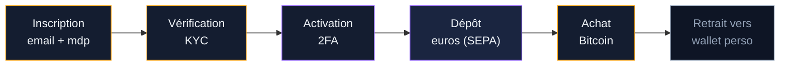
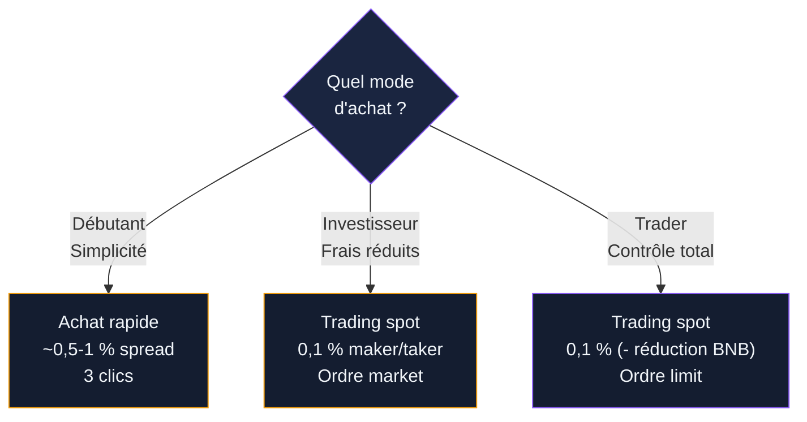
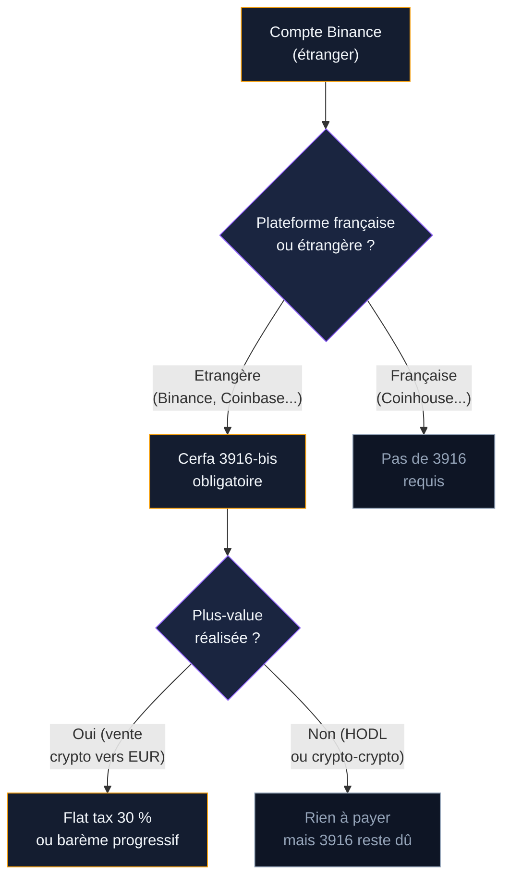

Binance est la plus grande plateforme d'échange crypto au monde par volume de transactions. Plus de 200 milliards de dollars transitent chaque mois sur ses carnets d'ordres. Avec des frais spot de 0,1 % et un dépôt SEPA gratuit, elle affiche les tarifs les plus bas du marché pour acheter du Bitcoin depuis la France.

Mais Binance a aussi un passif réglementaire : amende de l'AMF en 2024, enregistrement PSAN tardif, et obligation de déclarer votre compte au fisc comme plateforme étrangère. Ce guide couvre le processus d'achat complet, les frais réels, la sécurité du compte, les problèmes réglementaires et la fiscalité.

## Binance en bref

Binance a été fondée en 2017 par Changpeng Zhao (dit "CZ"). En moins de deux ans, la plateforme est devenue le premier exchange crypto mondial. Quelques chiffres :

- Plus de 350 cryptomonnaies disponibles
- Volume de trading spot quotidien supérieur à 10 milliards de dollars
- Plus de 190 millions d'utilisateurs dans le monde
- Frais de trading spot parmi les plus bas du secteur (0,1 % maker/taker)
- Enregistrement PSAN en France obtenu en mai 2022

> [!NOTE]
> Binance est enregistrée PSAN auprès de l'AMF depuis mai 2022 via sa filiale Binance France. C'est une condition légale pour opérer en France, mais ce statut n'est pas un agrément : il ne garantit pas la sécurité de vos fonds.

## Créer un compte Binance

L'inscription prend entre 5 et 20 minutes selon la rapidité de la vérification d'identité.

### 1. Inscription

Rendez-vous sur binance.com et cliquez sur "S'inscrire". Renseignez votre adresse email ou votre numéro de téléphone, puis créez un mot de passe d'au moins 8 caractères incluant une majuscule, un chiffre et un caractère spécial. Confirmez votre email via le lien reçu.

### 2. Vérification d'identité (KYC)

La vérification KYC (Know Your Customer) est obligatoire pour déposer des euros et acheter des cryptos. Préparez :

- Une pièce d'identité valide (carte nationale d'identité ou passeport)
- Un selfie en direct pour la reconnaissance faciale
- Un justificatif de domicile de moins de 3 mois (facture d'énergie, relevé bancaire, avis d'imposition)

Le KYC de base (vérification intermédiaire) suffit pour acheter et retirer du Bitcoin. La vérification prend entre 5 minutes et quelques heures. En période de forte affluence, comptez jusqu'à 72 heures.

### 3. Activer la double authentification (2FA)

Avant de déposer un seul euro, activez le 2FA. Binance propose Google Authenticator, une clé de sécurité physique (YubiKey) ou la vérification par SMS. L'application d'authentification est la meilleure option : le SMS est vulnérable aux attaques par SIM swapping.

## Déposer des euros sur Binance

Binance accepte deux méthodes de dépôt pour les utilisateurs français : le virement SEPA et la carte bancaire.

### Virement SEPA - la méthode recommandée

Le virement SEPA est gratuit sur Binance (ou facturé 1 EUR fixe selon les périodes). C'est la méthode la moins chère et la plus adaptée pour les montants supérieurs à 50 EUR.

Pour effectuer un virement :

1. Allez dans "Portefeuille" > "Dépôt" > "Fiat" > "EUR"
2. Sélectionnez "Virement bancaire (SEPA)"
3. Binance affiche un IBAN et une référence unique
4. Saisissez ces informations dans votre application bancaire
5. Le virement arrive sous 1 à 2 jours ouvrables (parfois le jour même)

Le montant minimum de dépôt est de 2 EUR. La référence unique est importante : sans elle, le virement peut être retardé ou rejeté.

### Carte bancaire - achat instantané

Le dépôt par carte (Visa ou Mastercard) est instantané mais coûte 1,8 % de frais. Sur un achat de 500 EUR, cela représente 9 EUR de frais de dépôt seuls. Réservez cette méthode aux situations où vous devez acheter rapidement, par exemple pendant une chute de prix.

> [!TIP]
> Le virement SEPA est gratuit sur Binance. Sur un investissement de 1 000 EUR, vous économisez 18 EUR par rapport au dépôt par carte bancaire. Si vous investissez chaque mois, ça représente plus de 200 EUR d'économies par an.

### Tableau des frais de dépôt

| Méthode | Frais | Délai | Montant minimum |
|---------|-------|-------|-----------------|
| Virement SEPA | Gratuit (ou 1 EUR) | 1-2 jours ouvrables | 2 EUR |
| Carte bancaire (Visa/MC) | 1,8 % | Instantané | 15 EUR |

## Acheter du Bitcoin sur Binance

Une fois vos euros crédités, deux parcours d'achat s'offrent à vous : l'achat rapide et le trading spot. Le choix dépend de votre niveau de confort avec les interfaces de trading.

### Achat rapide ("Acheter des cryptos")

C'est le parcours le plus simple. Depuis le menu, cliquez sur "Acheter des cryptos" > "Achat/Vente". Sélectionnez Bitcoin (BTC), entrez le montant en euros, choisissez votre méthode de paiement (solde EUR ou carte) et validez.

L'achat rapide applique un spread estimé entre 0,5 et 1 % au-dessus du prix spot. C'est un coût caché : Binance n'affiche pas de commission séparée mais vous payez un prix légèrement supérieur au cours du marché. Pour un achat de 500 EUR, ce spread représente 2,50 à 5 EUR en sus.

### Trading spot - le choix le moins cher

Le trading spot est le mode professionnel. Allez dans "Trade" > "Spot", sélectionnez la paire BTC/EUR, et passez votre ordre.

Deux types d'ordres :

- **Ordre market (au marché)** : exécution immédiate au meilleur prix disponible. Frais taker de 0,1 %.
- **Ordre limit** : vous fixez un prix cible. L'ordre s'exécute quand le marché atteint votre prix. Frais maker de 0,1 %. Cet ordre peut ne jamais s'exécuter si le marché n'atteint pas votre prix.

Pour un premier achat, l'ordre market en mode spot est le meilleur compromis : vous payez 0,1 % de frais (soit 0,50 EUR pour 500 EUR investis) et l'exécution est immédiate.

### Réduire les frais avec le BNB

Binance propose une réduction de 25 % sur les frais de trading si vous payez vos commissions en BNB (le jeton natif de Binance). Les frais passent alors de 0,1 % à 0,075 %. Pour activer cette option : "Tableau de bord" > "Préférences de frais" > activer "Utiliser le BNB pour les frais".

Concrètement, achetez quelques euros de BNB (5 à 10 EUR suffisent pour couvrir plusieurs mois de frais si vous investissez des montants modestes). Le gain est modeste en valeur absolue mais il s'accumule si vous tradez régulièrement.

## Frais Binance : le détail complet

Binance affiche les frais les plus bas du marché parmi les exchanges centralisés accessibles en France.

### Grille tarifaire

| Opération | Frais |
|-----------|-------|
| Dépôt SEPA | Gratuit (ou 1 EUR fixe) |
| Dépôt carte bancaire | 1,8 % |
| Trading spot (maker) | 0,1 % |
| Trading spot (taker) | 0,1 % |
| Trading spot avec BNB | 0,075 % (maker et taker) |
| Retrait BTC (réseau Bitcoin) | ~0,0000012 BTC (variable) |
| Retrait BTC (réseau Lightning) | Quasi gratuit |
| Retrait EUR (SEPA) | 1 EUR |
| Conversion crypto-crypto | 0,1 % |

### Coût total d'un achat : exemple chiffré

Pour un achat de 1 000 EUR de Bitcoin via le trading spot après un dépôt SEPA :

- Dépôt SEPA : 0 EUR
- Frais de trading (0,1 %) : 1 EUR
- Retrait BTC vers wallet personnel : ~0,10 EUR (variable)
- **Total : environ 1,10 EUR, soit 0,11 % du montant investi**

Le même achat sur Coinbase (interface simple) coûterait environ 20 EUR de frais. Sur Coinhouse, environ 10 EUR. La différence est significative et elle se multiplie avec le temps si vous investissez chaque mois.

> [!IMPORTANT]
> Sur le trading spot, Binance facture 0,1 % par transaction. Avec la réduction BNB, cela tombe à 0,075 %. Pour un investissement de 500 EUR, vos frais réels sont de 0,50 EUR (ou 0,38 EUR avec BNB). C'est 10 à 20 fois moins cher que la plupart des plateformes concurrentes.

## Retirer ses bitcoins vers un wallet personnel

Une fois l'achat effectué, transférez vos BTC hors de Binance. La plateforme est fiable, mais garder ses cryptos sur un exchange centralisé expose à un risque de contrepartie (piratage, gel des retraits, faillite).

### Procédure de retrait

1. Allez dans "Portefeuille" > "Aperçu" > "Retrait"
2. Sélectionnez Bitcoin (BTC)
3. Choisissez le réseau : Bitcoin (BTC) pour un retrait classique, ou Lightning Network pour un transfert quasi instantané et quasi gratuit
4. Collez l'adresse de votre wallet personnel
5. Entrez le montant
6. Confirmez par email + code 2FA

Le retrait est traité sous 30 minutes en général. Vérifiez l'adresse de destination deux fois avant de confirmer : une erreur d'adresse signifie une perte définitive des fonds.

### Réseau Bitcoin vs Lightning Network

| Critère | Réseau Bitcoin | Lightning Network |
|---------|---------------|-------------------|
| Frais de retrait Binance | ~0,0000012 BTC | Quasi nul |
| Délai de confirmation | 10 à 60 minutes | Quelques secondes |
| Montant minimum | Variable | Variable |
| Compatibilité wallets | Tous les wallets BTC | Wallets Lightning uniquement |

Pour des montants supérieurs à 500 EUR destinés au stockage long terme, le retrait via le réseau Bitcoin classique vers un hardware wallet (Ledger, Trezor) est le choix le plus sûr. Pour des petits montants ou des transferts rapides, le Lightning Network est plus économique.

## Sécuriser son compte Binance

Un compte exchange mal protégé est une cible facile. Binance offre plusieurs couches de sécurité qu'il faut activer manuellement.

### Double authentification (2FA)

Activez Google Authenticator ou une clé physique YubiKey. Le 2FA par SMS est disponible mais moins sûr : les attaques SIM swap permettent à un attaquant de recevoir vos codes par SMS en transférant votre numéro vers sa carte SIM.

### Code anti-phishing

Binance vous permet de définir un code anti-phishing : un mot ou une phrase que vous choisissez et qui apparait dans tous les emails légitimes de Binance. Si vous recevez un email de "Binance" sans ce code, c'est un faux. Activez-le dans "Sécurité" > "Paramètres avancés".

### Whitelist d'adresses de retrait

Activez la whitelist d'adresses. Avec cette option, les retraits ne sont autorisés que vers des adresses que vous avez pré-approuvées. L'ajout d'une nouvelle adresse impose un délai de 24 heures. Même si un pirate accède à votre compte, il ne peut pas envoyer vos fonds vers son propre wallet.

### Gestion des appareils

Consultez régulièrement la liste des appareils connectés à votre compte dans "Sécurité" > "Gestion des appareils". Supprimez tout appareil que vous ne reconnaissez pas.

> [!WARNING]
> Les arnaques par phishing ciblent les utilisateurs Binance avec de faux emails et de faux sites. Activez le code anti-phishing et ne cliquez jamais sur un lien reçu par email. Tapez toujours binance.com directement dans votre navigateur.

## Binance et la réglementation en France

Le parcours réglementaire de Binance en France a été mouvementé. C'est un point à connaitre avant de confier vos euros à la plateforme.

### Chronologie réglementaire

- **2017-2021** : Binance opère en France sans enregistrement PSAN. La plateforme est accessible mais pas officiellement autorisée.
- **Mai 2022** : Binance obtient l'enregistrement PSAN auprès de l'AMF via sa filiale Binance France SAS.
- **2023** : L'AMF et l'ACPR lancent des enquêtes sur les pratiques de Binance en matière de conformité anti-blanchiment durant la période pré-PSAN (2019-2022).
- **2024** : Binance accepte de payer une amende transactionnelle à l'ACPR. La plateforme renforce ses procédures KYC et de surveillance des transactions pour le marché français.

### Ce que cela signifie pour vous

L'enregistrement PSAN est maintenu. Binance peut légalement opérer en France et propose un support client en français. Les procédures de vérification d'identité ont été durcies : comptez parfois des vérifications supplémentaires (source de fonds, justificatif d'origine des capitaux) pour les dépôts importants.

Le statut PSAN est un enregistrement, pas un agrément. L'AMF vérifie les procédures anti-blanchiment et de financement du terrorisme, mais ne garantit pas la solvabilité de la plateforme ni la sécurité de vos fonds.

## Binance comparé aux autres plateformes

Comment Binance se positionne face à la concurrence pour un achat de Bitcoin en France.

| Critère | Binance | Coinbase | Coinhouse | Kraken |
|---------|---------|----------|-----------|--------|
| Frais de trading spot | 0,1 % | 1,49 % (simple) / 0-0,60 % (Advanced) | 0,99 % | 0,16-0,26 % |
| Dépôt SEPA | Gratuit | Gratuit | Gratuit | Gratuit |
| Dépôt carte | 1,8 % | 3,99 % | Non précisé | 3,75 % |
| PSAN France | Oui (2022) | Oui (2023) | Oui (2020) | Oui (2024) |
| Cryptos disponibles | 350+ | 260+ | 60+ | 200+ |
| Support français | Oui | Partiel | Oui (Paris) | Limité |
| Siège social | International | Etats-Unis | France (Paris) | Etats-Unis |
| Interface débutant | Moyenne | Excellente | Bonne | Moyenne |
| Déclaration fiscale | Cerfa 3916 obligatoire | Cerfa 3916 obligatoire | Non requise (FR) | Cerfa 3916 obligatoire |

### Binance vs Coinbase

Binance est 10 à 20 fois moins cher sur les frais de trading (0,1 % contre 1,49 % sur Coinbase Simple). Coinbase compense par une interface plus accessible aux débutants et un historique de sécurité solide (cotée au Nasdaq, jamais piratée). Si les frais sont votre priorité, Binance gagne. Si vous cherchez la simplicité, Coinbase est plus adapté.

### Binance vs Coinhouse

Coinhouse est une société française basée à Paris avec un support client francophone et un enregistrement PSAN obtenu dès 2020. Ses frais (0,99 %) sont plus élevés que Binance mais l'avantage fiscal est réel : pas besoin de déclarer votre compte Coinhouse au formulaire 3916 puisque c'est une plateforme française. Pour un investisseur qui veut éviter la paperasse fiscale, Coinhouse simplifie la vie.

### Binance vs Kraken

Kraken propose des frais compétitifs (0,16-0,26 % en spot) et une réputation de sécurité solide. La plateforme a obtenu son PSAN en 2024. L'interface de trading est comparable à celle de Binance. Le choix entre les deux dépend surtout des habitudes et des cryptos recherchées : Binance offre un catalogue plus large (350+ contre 200+).

## Fiscalité : déclarer son compte Binance

C'est le point que beaucoup d'investisseurs oublient. Binance est une plateforme étrangère. La loi française impose des obligations déclaratives spécifiques.

### Formulaire Cerfa 3916 (ou 3916-bis)

Tout contribuable français détenant un compte sur une plateforme crypto étrangère doit le déclarer chaque année dans sa déclaration de revenus, via le formulaire Cerfa 3916-bis. Cela concerne Binance, Coinbase, Kraken et toute plateforme dont le siège est hors de France.

Vous devez déclarer le compte même si :

- Vous n'avez réalisé aucune plus-value
- Vous n'avez pas vendu de crypto
- Le solde du compte est nul

L'amende pour défaut de déclaration est de 750 EUR par compte et par an (1 500 EUR si la valeur du compte dépasse 50 000 EUR).

### Imposition des plus-values

Si vous vendez du Bitcoin contre des euros (ou utilisez vos BTC pour un achat), la plus-value est soumise à la flat tax de 30 % (12,8 % d'impôt sur le revenu + 17,2 % de prélèvements sociaux). Depuis 2023, vous pouvez opter pour le barème progressif si votre taux marginal est inférieur à 12,8 %.

Les échanges crypto-crypto (BTC vers ETH par exemple) ne déclenchent pas d'imposition.

### Outils pour la déclaration

Binance propose un rapport de transactions téléchargeable depuis "Compte" > "Rapports". Des logiciels comme Waltio ou Koinly se connectent à Binance via API pour calculer automatiquement vos plus-values et préremplir votre déclaration.

> [!CAUTION]
> Binance est une plateforme étrangère. Vous devez déclarer votre compte chaque année sur le formulaire 3916-bis, même sans aucune transaction. L'amende pour oubli peut atteindre 1 500 EUR par compte et par an.

## Avantages et inconvénients de Binance

### Ce qui fonctionne bien

- **Frais parmi les plus bas** : 0,1 % en spot, réductible à 0,075 % avec le BNB. Difficile de trouver moins cher sur un exchange centralisé.
- **Dépôt SEPA gratuit** : pas de frais de dépôt par virement bancaire, contrairement à certaines plateformes.
- **Catalogue large** : plus de 350 cryptomonnaies et de nombreuses paires de trading.
- **Lightning Network** : retraits Bitcoin quasi gratuits et quasi instantanés via le Lightning Network.
- **Outils avancés** : trading spot, futures, staking, P2P, achats récurrents (DCA), Launchpool.
- **Liquidité élevée** : les volumes importants garantissent des spreads serrés et des exécutions rapides.
- **Support français** : service client disponible en français par chat et email.

### Ce qui pose problème

- **Interface chargée** : l'application et le site proposent des dizaines de produits. Pour un débutant, c'est déroutant. Le parcours d'achat rapide simplifie les choses, mais le trading spot demande un temps d'adaptation.
- **Passif réglementaire** : l'enregistrement PSAN tardif (2022) et l'amende de 2024 soulèvent des questions sur la conformité historique de la plateforme.
- **Obligation fiscale** : en tant que plateforme étrangère, votre compte doit être déclaré chaque année au fisc (Cerfa 3916-bis). Ce n'est pas le cas avec Coinhouse (française).
- **Spread sur l'achat rapide** : le mode "Acheter des cryptos" applique un spread caché de 0,5 à 1 %. Passez par le spot pour l'éviter.
- **Changements fréquents** : frais de dépôt SEPA qui passent de gratuit à 1 EUR puis retour, suspension temporaire de certaines méthodes de paiement - les conditions changent souvent.

## FAQ - Acheter du Bitcoin sur Binance

### Binance est-elle autorisée en France ?

Oui. Binance est enregistrée PSAN auprès de l'AMF depuis mai 2022, via sa filiale Binance France SAS. La plateforme peut légalement proposer ses services aux résidents français.

### Quel est le montant minimum pour acheter du Bitcoin sur Binance ?

Le montant minimum est de 10 EUR environ pour un achat rapide, et variable selon la paire de trading en mode spot (souvent autour de 5 EUR). Le dépôt minimum par virement SEPA est de 2 EUR.

### Les frais de Binance sont-ils vraiment de 0,1 % ?

Oui, pour le trading spot. Les frais maker et taker sont de 0,1 % au niveau de base. Avec la réduction BNB (paiement des frais en BNB), ils passent à 0,075 %. L'achat rapide applique un spread supplémentaire de 0,5 à 1 % : passez toujours par le trading spot pour les frais les plus bas.

### Dois-je déclarer mon compte Binance aux impôts ?

Oui, obligatoirement. Binance est une plateforme étrangère. Tout résident fiscal français doit déclarer son compte via le formulaire Cerfa 3916-bis, chaque année, même sans aucune plus-value. L'amende pour défaut de déclaration est de 750 EUR minimum par compte.

### Comment transférer mes bitcoins de Binance vers un Ledger ?

Depuis Binance, allez dans "Portefeuille" > "Retrait", sélectionnez BTC, choisissez le réseau Bitcoin (BTC), puis collez l'adresse de réception de votre Ledger (générée dans l'application Ledger Live). Confirmez par email et code 2FA. Le transfert prend entre 10 et 60 minutes selon la congestion du réseau.

### Binance est-elle sûre pour les Français ?

Binance est enregistrée PSAN et applique les procédures KYC/AML exigées par la réglementation française. La plateforme utilise le cold storage pour la majorité des fonds et propose de multiples options de sécurité (2FA, whitelist, code anti-phishing). Le risque principal reste celui de toute plateforme centralisée : vous ne contrôlez pas vos clés privées tant que vos BTC restent sur Binance. Pour du stockage long terme, transférez vers un wallet personnel.
