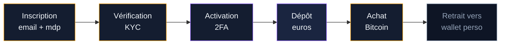
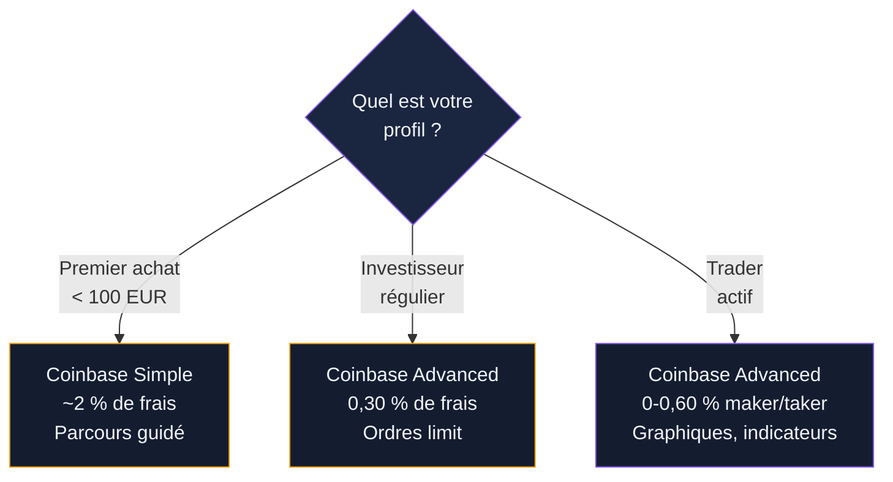

Coinbase est l'une des plateformes les plus utilisées au monde pour acheter du Bitcoin. Fondée en 2012 à San Francisco, elle revendique plus de 110 millions d'utilisateurs vérifiés et un volume de transactions supérieur à 1 000 milliards de dollars. En France, la plateforme est enregistrée PSAN auprès de l'AMF depuis 2023.

Ce guide couvre l'inscription, les méthodes d'achat, les frais réels, la sécurité et les différences entre Coinbase et Coinbase Advanced. Objectif : acheter vos premiers BTC sur Coinbase sans surprises.

## Coinbase en bref : ce qu'il faut savoir

Coinbase se positionne comme la porte d'entrée crypto pour les débutants. L'interface est claire, le parcours d'achat guidé, et le support client disponible en français. La plateforme est cotée au Nasdaq (ticker : COIN) depuis avril 2021, ce qui impose des obligations de transparence financière que n'ont pas les exchanges privés.

Quelques chiffres clés :

- Plus de 260 cryptomonnaies disponibles (BTC, ETH, SOL, ADA, etc.)
- Disponible dans plus de 100 pays
- 98 % des fonds stockés hors ligne (cold storage)
- Application mobile iOS et Android avec note de 4.6/5
- Enregistrement PSAN France obtenu en 2023

> [!NOTE]
> Coinbase est cotée en bourse au Nasdaq. Ses comptes financiers sont audités et publics, ce qui offre un niveau de transparence rare parmi les exchanges crypto.

## Créer un compte Coinbase : les étapes

L'inscription prend entre 5 et 15 minutes. Voici le parcours complet.

### 1. S'inscrire sur le site ou l'application

Rendez-vous sur coinbase.com ou téléchargez l'application mobile. Cliquez sur "Commencer". Renseignez votre prénom, nom, adresse email et créez un mot de passe d'au moins 12 caractères. Confirmez votre email via le lien reçu dans votre boite de réception.

### 2. Vérifier votre identité (KYC)

Coinbase exige une vérification d'identité avant tout achat. Préparez :

- Une pièce d'identité valide (carte nationale d'identité ou passeport)
- Un selfie pris en direct pour la reconnaissance faciale
- Votre numéro de téléphone portable

La vérification automatique prend entre 2 et 10 minutes dans la plupart des cas. En période de forte demande, comptez jusqu'à 48 heures.

### 3. Activer la double authentification (2FA)

Avant de déposer le moindre euro, activez le 2FA. Coinbase propose trois options : SMS, application d'authentification (Google Authenticator, Authy) ou clé de sécurité physique (YubiKey). L'application d'authentification est le meilleur compromis entre sécurité et praticité.

## Déposer des euros sur Coinbase

Coinbase accepte plusieurs méthodes de dépôt pour les utilisateurs français.

### Virement SEPA

Le virement bancaire SEPA est gratuit sur Coinbase. Le délai varie de 1 à 3 jours ouvrables. C'est la méthode la moins chère et celle recommandée pour tout montant supérieur à 100 EUR.

Pour effectuer un virement, allez dans "Portefeuille" > "Déposer" > "Virement bancaire". Coinbase vous donne un IBAN (souvent estonien) et une référence unique. Saisissez ces informations dans votre banque en ligne. Le virement arrive sous 1 à 2 jours ouvrables en général.

### Carte bancaire

Le dépôt par carte bancaire est instantané mais coûte 3,99 % de frais. Sur 500 EUR, ça représente 19,95 EUR de frais - avant même d'avoir acheté quoi que ce soit. Réservez cette méthode aux situations urgentes ou aux très petits montants.

### PayPal

Coinbase accepte PayPal pour les achats directs (pas pour les dépôts en euros). Les frais sont comparables à ceux de la carte bancaire. Option pratique si vous avez un solde PayPal, mais pas la plus économique.

> [!TIP]
> Privilégiez le virement SEPA pour vos dépôts. Sur un investissement de 1 000 EUR, vous économisez 39,90 EUR par rapport à un dépôt par carte bancaire. Le seul inconvénient : attendre 1 à 2 jours.

## Acheter du Bitcoin sur Coinbase

Une fois vos euros déposés, l'achat se fait en quelques clics.

### Achat rapide (interface simple)

Sur la page d'accueil, cliquez sur "Acheter/Vendre". Sélectionnez Bitcoin (BTC), entrez le montant en euros, choisissez votre méthode de paiement (solde EUR, carte ou PayPal) et validez. L'ordre s'exécute au prix du marché. C'est le parcours le plus direct.

### Achat récurrent (DCA automatique)

Coinbase permet de programmer des achats automatiques : quotidiens, hebdomadaires, bimensuels ou mensuels. Pour 100 EUR par mois en achat récurrent, vous lissez votre prix d'entrée sur la durée. Allez dans "Acheter" > "Achat récurrent", choisissez Bitcoin, le montant et la fréquence.

### Ordres avancés sur Coinbase Advanced

Pour les utilisateurs qui veulent plus de contrôle, Coinbase Advanced (anciennement Coinbase Pro) offre des ordres limit, stop-limit et market avec des frais réduits. Vous accédez à Coinbase Advanced directement depuis votre compte Coinbase - pas besoin de créer un second compte.

## Les frais Coinbase : le détail complet

Les frais sont le point faible historique de Coinbase. Voici la grille tarifaire complète pour la France.

### Grille des frais

| Opération | Coinbase (simple) | Coinbase Advanced |
|-----------|-------------------|-------------------|
| Dépôt SEPA | Gratuit | Gratuit |
| Dépôt carte bancaire | 3,99 % | 3,99 % |
| Achat/vente (spread inclus) | ~1,49 % + spread (~0,5 %) | 0 - 0,60 % (maker/taker) |
| Conversion crypto-crypto | ~2 % (spread) | 0 - 0,60 % |
| Retrait SEPA | 0,15 EUR | 0,15 EUR |
| Retrait BTC (réseau) | Frais réseau variable | Frais réseau variable |

### Le vrai coût d'un achat

Un achat de 500 EUR en Bitcoin sur Coinbase (interface simple) coûte environ :

- Spread : ~2,50 EUR (0,5 %)
- Commission : ~7,45 EUR (1,49 %)
- **Total : ~9,95 EUR, soit 2 % du montant investi**

Le même achat sur Coinbase Advanced avec un ordre limit :

- Frais maker : ~1,50 EUR (0,30 %)
- Spread : quasi nul sur un ordre limit
- **Total : ~1,50 EUR, soit 0,30 %**

La différence est nette. Pour tout achat supérieur à 200 EUR, passez par Coinbase Advanced.

> [!WARNING]
> L'interface simple de Coinbase facture environ 2 % par transaction (commission + spread). Basculez sur Coinbase Advanced pour diviser vos frais par 5 ou plus.

## Coinbase vs Coinbase Advanced : quel mode choisir ?

Coinbase propose deux interfaces dans un seul compte. Comprendre la différence évite de payer des frais inutiles.

### Coinbase (interface simple)

- Parcours d'achat en 3 clics
- Achats récurrents automatiques
- Interface épurée, adaptée aux débutants complets
- Frais plus élevés (1,49 % + spread)

### Coinbase Advanced

- Carnet d'ordres complet (limit, market, stop)
- Graphiques avec indicateurs techniques
- Frais réduits (0 à 0,60 % selon le volume mensuel)
- Même compte, même solde, même sécurité

Pour un premier achat de 20 ou 50 EUR, l'interface simple convient. Dès que vous investissez régulièrement ou que vos montants dépassent 200 EUR, Coinbase Advanced devient le choix logique. La bascule se fait en un clic depuis le menu de votre compte.

## La sécurité sur Coinbase

La sécurité est le point fort de Coinbase comparé à beaucoup d'autres exchanges.

### Mesures de protection

- **Cold storage** : 98 % des cryptos clients sont stockées hors ligne dans des coffres géographiquement répartis
- **Assurance** : les dépôts en monnaie fiat (EUR, USD) sont couverts par la FDIC aux Etats-Unis et des assurances équivalentes en Europe
- **Double authentification** : SMS, app d'authentification ou clé physique
- **Whitelist d'adresses** : vous pouvez limiter les retraits à des adresses pré-approuvées (délai de 48h pour ajouter une nouvelle adresse)
- **Vault (coffre-fort)** : fonction de stockage à froid interne avec délai de retrait de 48h et validation par plusieurs emails

### Historique de sécurité

Coinbase n'a jamais subi de piratage de ses systèmes centraux. En 2021, environ 6 000 comptes ont été compromis via des attaques de SIM swapping (pas une faille Coinbase, mais une faille opérateur téléphonique). Coinbase a remboursé les utilisateurs affectés.

La société emploie plus de 200 personnes dans son équipe sécurité et réalise des audits réguliers par des firmes indépendantes.

> [!IMPORTANT]
> Activez la whitelist d'adresses dans vos paramètres de sécurité. Même si quelqu'un accède à votre compte, il ne pourra pas envoyer vos BTC vers une adresse non pré-approuvée.

## Coinbase Wallet : le portefeuille non-custodial

Coinbase propose aussi un wallet séparé appelé Coinbase Wallet. Attention : c'est un produit distinct de votre compte Coinbase.

### Différence entre le compte Coinbase et Coinbase Wallet

| | Compte Coinbase | Coinbase Wallet |
|---|---|---|
| Qui détient les clés ? | Coinbase | Vous |
| Phrase de récupération | Non (Coinbase gère) | Oui (12 mots) |
| Accès DeFi | Non | Oui |
| Perte du mot de passe | Récupération via support | Perte définitive sans seed phrase |
| Idéal pour | Achat/vente, débutants | Stockage long terme, DeFi |

Pour un investissement long terme, transférez vos BTC depuis votre compte Coinbase vers Coinbase Wallet ou un hardware wallet (Ledger, Trezor). Vous gardez le contrôle total de vos clés privées.

## Avantages et inconvénients de Coinbase

### Ce qui fonctionne bien

- **Interface claire** : le parcours d'achat est compréhensible même pour quelqu'un qui n'a jamais touché à la crypto
- **Sécurité solide** : cold storage, assurance, whitelist, vault - difficile de trouver mieux chez un exchange centralisé
- **Enregistrement PSAN** : plateforme conforme à la réglementation française
- **Cotation Nasdaq** : transparence financière obligatoire, comptes audités
- **Coinbase Advanced inclus** : accès au trading avancé avec le même compte
- **Achats récurrents** : DCA automatisé intégré
- **Large choix** : plus de 260 cryptos disponibles

### Ce qui pose problème

- **Frais élevés sur l'interface simple** : 1,49 % + spread (~0,5 %), soit environ 2 % par achat. C'est 10 à 20 fois plus cher que Binance (0,1 %)
- **Spread opaque** : le spread n'est pas affiché clairement, il faut comparer avec le cours réel pour le voir
- **Support client lent** : les retours utilisateurs signalent des délais de réponse de plusieurs jours en cas de problème
- **Vérification parfois longue** : le KYC peut prendre 48h en période de forte demande
- **Frais carte bancaire** : 3,99 % pour un achat par carte, un des taux les plus élevés du marché

## Coinbase comparé aux autres plateformes

Comment Coinbase se positionne face à la concurrence pour un achat de Bitcoin en France.

| Critère | Coinbase | Binance | Kraken | Coinhouse |
|---------|----------|---------|--------|-----------|
| Frais d'achat (simple) | ~2 % | 0,1 % | 0,26 % | 0,99 % |
| Frais d'achat (avancé) | 0-0,60 % | 0,1 % | 0,16 % | N/A |
| Dépôt SEPA | Gratuit | Gratuit | Gratuit | Gratuit |
| Dépôt carte | 3,99 % | 1,8 % | 3,75 % | Non précisé |
| PSAN France | Oui (2023) | Oui (2022) | Oui (2024) | Oui (2020) |
| Cryptos disponibles | 260+ | 350+ | 200+ | 60+ |
| Support français | Partiel | Oui | Limité | Oui (Paris) |
| Interface débutant | Excellente | Correcte | Correcte | Bonne |

Coinbase n'est pas la plateforme la moins chère. Son avantage : la simplicité d'utilisation et le niveau de sécurité. Si les frais sont votre priorité, Binance ou Kraken offrent de meilleurs tarifs. Si vous voulez une société française avec un support à Paris, Coinhouse est le choix logique.

## Coinbase et la fiscalité française

Coinbase est une plateforme basée aux Etats-Unis. A ce titre, vous devez déclarer votre compte Coinbase dans votre déclaration de revenus annuelle (formulaire 3916-bis), même si vous n'avez pas réalisé de plus-value.

Coinbase met à disposition un rapport fiscal téléchargeable depuis les paramètres de votre compte. Ce rapport liste toutes vos transactions de l'année, ce qui simplifie le calcul des plus-values. Plusieurs logiciels de fiscalité crypto (Waltio, CryptoTax) se connectent directement à Coinbase via API pour automatiser ce travail.

> [!CAUTION]
> Ne pas déclarer votre compte Coinbase à l'administration fiscale française expose à une amende de 1 500 EUR par compte et par an. La déclaration est obligatoire même sans plus-value réalisée.

## FAQ - Acheter du Bitcoin sur Coinbase

### Coinbase est-elle une plateforme fiable ?

Oui. Coinbase est cotée au Nasdaq, enregistrée PSAN en France, et stocke 98 % des fonds clients hors ligne. La plateforme n'a jamais été piratée au niveau de ses systèmes centraux.

### Quel est le montant minimum pour acheter du Bitcoin sur Coinbase ?

Le montant minimum est de 2 EUR pour un achat de Bitcoin sur Coinbase. En pratique, en dessous de 25 EUR les frais (en pourcentage) rendent l'opération peu intéressante.

### Peut-on acheter du Bitcoin sur Coinbase avec une carte bancaire ?

Oui. L'achat par carte est instantané mais coûte 3,99 % de frais. Pour un achat de 100 EUR, vous payez 3,99 EUR avant même le spread. Le virement SEPA (gratuit) est plus économique si vous pouvez attendre 1 à 2 jours.

### Comment réduire les frais sur Coinbase ?

Utilisez Coinbase Advanced (accessible depuis le même compte) pour passer des ordres limit. Les frais passent de ~2 % à 0-0,60 % selon votre volume. Déposez par virement SEPA plutôt que par carte.

### Coinbase est-elle disponible en France ?

Oui. Coinbase est enregistrée comme PSAN auprès de l'AMF depuis 2023. L'application et le site sont partiellement traduits en français. Le support client est disponible en français par email et chat.

### Quelle différence entre Coinbase et Coinbase Wallet ?

Le compte Coinbase est custodial : Coinbase détient vos clés privées. Coinbase Wallet est un portefeuille non-custodial séparé : vous gérez vos propres clés avec une phrase de récupération de 12 mots. Les deux produits peuvent se connecter entre eux mais fonctionnent de manière indépendante.
