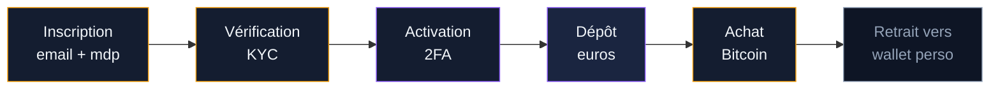
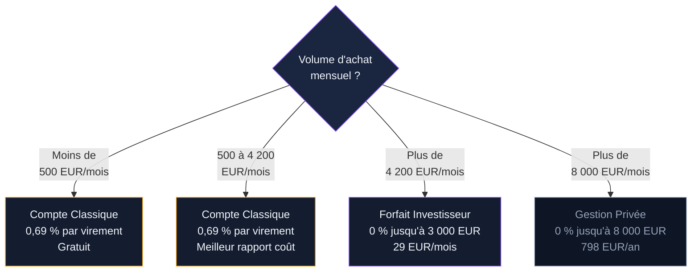
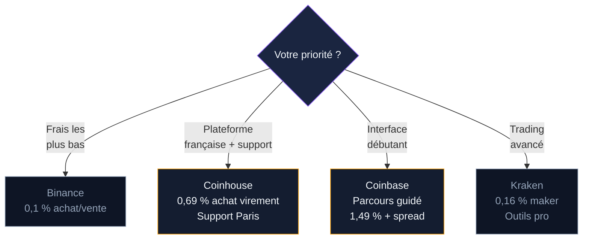

Coinhouse est la première plateforme crypto française à avoir obtenu l'enregistrement PSAN auprès de l'AMF. Fondée en 2014 sous le nom "La Maison du Bitcoin" par Eric Larchevêque et Thomas France, elle compte aujourd'hui plus de 200 000 utilisateurs et un siège social à Paris. Nicolas Louvet dirige l'entreprise depuis 2018.

Ce guide couvre l'inscription, les frais réels, les formules d'abonnement, la sécurité et les alternatives. Objectif : savoir si Coinhouse est le bon choix pour acheter vos premiers BTC.

## Coinhouse en bref : chiffres et positionnement

Coinhouse ne cherche pas à rivaliser avec Binance sur le nombre de cryptos ou le volume d'échange. La plateforme vise un public français qui veut un service régulé, un support client réactif et un cadre réglementaire clair.

Quelques repères :

- Plus de 70 cryptomonnaies disponibles (BTC, ETH, SOL, AVAX, DOT, LINK, AAVE, OP, etc.)
- Enregistrement PSAN numéro E2020-001 - le tout premier délivré en France
- Note Trustpilot de 4,7/5 sur plus de 2 740 avis (janvier 2026)
- Note App Store de 4,5/5 (2 000+ avis) et Google Play de 4,5/5 (1 130+ avis)
- Support client basé à Paris, disponible du lundi au vendredi de 9h30 à 18h
- IBAN français fourni via un partenariat avec Treezor (filiale de la Société Générale)
- Achat minimum : 20 EUR

> [!NOTE]
> Coinhouse a été la toute première plateforme crypto à obtenir l'enregistrement PSAN en France (2020). Ce statut impose des contrôles anti-blanchiment, la vérification d'identité et la ségrégation des fonds clients.

## Créer un compte Coinhouse : les étapes

L'inscription prend entre 10 et 20 minutes. Le processus de vérification peut s'étendre jusqu'à 48 heures en période de forte demande.

### 1. S'inscrire sur le site ou l'application

Rendez-vous sur coinhouse.com ou téléchargez l'application mobile (iOS ou Android). Cliquez sur "Créer un compte". Renseignez votre nom, prénom, adresse email et créez un mot de passe solide. Confirmez votre email via le lien reçu.

### 2. Vérifier votre identité (KYC)

Coinhouse exige une vérification d'identité avant tout achat. Préparez :

- Une pièce d'identité valide (carte nationale d'identité ou passeport)
- Un justificatif de domicile de moins de 3 mois
- Un selfie pris en direct pour la vérification faciale

La vérification automatique prend en général entre 5 et 30 minutes. Coinhouse accepte les achats par virement jusqu'à 10 000 EUR avant la finalisation complète du KYC.

### 3. Activer la double authentification (2FA)

Activez le 2FA dès la création du compte. Coinhouse propose la vérification par SMS et par application d'authentification (Google Authenticator ou Authy). L'application d'authentification est plus sûre que le SMS - elle protège contre les attaques par échange de carte SIM.

### 4. Déposer des euros et acheter du Bitcoin

Une fois le compte vérifié, déposez des euros par virement SEPA (gratuit, 1 à 2 jours) ou par carte bancaire (instantané, frais de 1,49 %). Sélectionnez Bitcoin, entrez le montant en euros et validez l'achat.

## Les frais Coinhouse : grille complète

Les frais de Coinhouse dépendent de votre formule d'abonnement. Trois niveaux existent pour les particuliers.

### Grille tarifaire par formule

| Opération | Classique (gratuit) | Investisseur (29 EUR/mois) | Gestion Privée (798 EUR/an) |
|-----------|--------------------|-----------------------------|------------------------------|
| Achat par virement | 0,69 % | 0 % jusqu'à 3 000 EUR/mois, puis 0,69 % | 0 % jusqu'à 8 000 EUR/mois, puis 0,69 % |
| Achat par carte | 1,49 % | 0 % jusqu'à 3 000 EUR/mois, puis 1,49 % | 0 % jusqu'à 8 000 EUR/mois, puis 1,49 % |
| Vente | 1,09 % | 1,09 % | 1,09 % |
| Conversion crypto-crypto | 0,69 % | 0,69 % | 0,69 % |
| Retrait vers wallet externe | 0,29 % (min 1,49 EUR) + frais réseau | 0,29 % (min 1,49 EUR) + frais réseau | 0,29 % (min 1,49 EUR) + frais réseau |
| Dépôt SEPA | Gratuit | Gratuit | Gratuit |
| Retrait EUR vers banque | 1,49 % | 1,49 % | 1,49 % |

Un frais fixe de 0,12 EUR s'applique à chaque transaction, quel que soit le montant.

### Le vrai coût d'un achat (compte Classique)

Pour un achat de 500 EUR en Bitcoin par virement SEPA sur le compte Classique :

- Commission : 3,45 EUR (0,69 %)
- Frais fixe : 0,12 EUR
- **Total : 3,57 EUR, soit 0,71 % du montant investi**

Le même achat par carte bancaire :

- Commission : 7,45 EUR (1,49 %)
- Frais fixe : 0,12 EUR
- **Total : 7,57 EUR, soit 1,51 %**

Si vous ajoutez un retrait vers un wallet externe (0,29 %, soit 1,49 EUR minimum + frais réseau Bitcoin), le coût total grimpe à environ 5 EUR par virement ou 9 EUR par carte.

> [!TIP]
> Le compte Classique à 0,69 % par virement est compétitif face à Coinbase (1,49 %) et Bitpanda (0,99 %). Pour des achats mensuels supérieurs à 500 EUR, le forfait Investisseur à 29 EUR/mois devient rentable - il se rembourse dès 4 200 EUR d'achats mensuels.

### Quand le forfait Investisseur est-il rentable ?

Le forfait Investisseur coûte 29 EUR/mois et offre 0 % de frais jusqu'à 3 000 EUR d'achats. Calcul rapide :

- Sans forfait : 3 000 EUR x 0,69 % = 20,70 EUR de frais
- Avec forfait : 29 EUR d'abonnement + 0 EUR de frais = 29 EUR

Le forfait devient avantageux à partir de 4 203 EUR d'achats mensuels (29 / 0,0069 = 4 203). En dessous, le compte Classique reste plus économique.

## Les services spécifiques à Coinhouse

Coinhouse se différencie des exchanges classiques par plusieurs services orientés vers l'accompagnement.

### Gestion Privée avec conseiller dédié

L'offre Gestion Privée (798 EUR/an) inclut un gestionnaire de portefeuille personnel basé à Paris. Ce conseiller peut exécuter des ordres pour votre compte, proposer des recommandations d'investissement adaptées à votre profil de risque et produire des rapports de performance. C'est un service rare dans l'univers crypto, plus proche d'une banque privée que d'un exchange.

Trois profils de gestion sont disponibles :

- **Prudent** : allocation centrée sur les stablecoins, Bitcoin et Ethereum
- **Equilibré** : exposition aux altcoins à forte capitalisation, stablecoins réduits
- **Dynamique** : exposition accrue aux actifs à plus petite capitalisation

### Investissement programmé (DCA)

Coinhouse permet de programmer des achats automatiques : hebdomadaires, bimensuels ou mensuels. Le DCA (Dollar Cost Averaging) lisse votre prix d'entrée et réduit l'impact de la volatilité. Les achats récurrents sont facturés 1,49 % par transaction - plus cher que le virement ponctuel à 0,69 %.

Pour 100 EUR par semaine en DCA, vous payez 1,49 EUR de frais à chaque exécution. Sur un an (52 semaines), cela représente 77,48 EUR de frais pour 5 200 EUR investis, soit 1,49 % du total.

### Staking

Coinhouse propose du staking sur plusieurs cryptomonnaies avec des rendements annoncés jusqu'à 13 % selon l'actif et la formule d'abonnement. Le staking est accessible directement depuis la plateforme, sans manipulation technique.

### Compte en euros avec IBAN français

Coinhouse fournit un IBAN français via Treezor (filiale Société Générale). Vos euros restent sur un compte ségrégué. Les virements SEPA entrants sont gratuits et arrivent sous 1 à 2 jours ouvrables.

> [!IMPORTANT]
> Coinhouse est l'une des rares plateformes crypto à proposer un IBAN français. Vos virements SEPA arrivent plus vite et votre banque est moins susceptible de bloquer un virement vers un IBAN domestique qu'un IBAN estonien ou lituanien.

## La sécurité sur Coinhouse

### Mesures de protection

- **Authentification double facteur** : SMS + email, ou application d'authentification (Google Authenticator, Authy)
- **Vérification KYC** : pièce d'identité + selfie + justificatif de domicile
- **Stockage sécurisé** : les fonds crypto sont conservés avec des mesures de custody institutionnelles
- **Maximum 2 cartes bancaires enregistrées** par compte
- **PSAN** : conformité totale avec la réglementation française (anti-blanchiment, contrôle des flux)

### Partenaire bancaire régulé

Le partenariat avec Treezor (Société Générale) pour l'hébergement du compte en euros ajoute une couche de confiance. Les fonds fiat (euros) sont ségrégués des fonds de l'entreprise, comme l'exige la réglementation.

### Limite de la sécurité

Coinhouse est une plateforme custodiale : elle détient vos clés privées. Si vous achetez du Bitcoin pour le long terme, transférez vos BTC vers un portefeuille personnel (Ledger, Trezor, ou wallet logiciel comme BlueWallet). Laissez sur Coinhouse uniquement les fonds que vous comptez échanger prochainement.

## Avantages et limites de Coinhouse

### Ce qui fonctionne bien

- **Plateforme 100 % française** : siège à Paris, support client en français, IBAN français, service de gestion privée
- **Premier PSAN de France** : enregistrement AMF numéro E2020-001, obtenu en 2020
- **Frais d'achat compétitifs** : 0,69 % par virement sur le compte Classique, moins que Coinbase (1,49 %) et Bitpanda (0,99 %)
- **Satisfaction client élevée** : Trustpilot 4,7/5, App Store 4,5/5 - les avis saluent la réactivité du support
- **Accompagnement personnalisé** : gestion privée avec conseiller dédié, webinaires hebdomadaires, analyses de marché
- **DCA intégré** : achats programmés automatiques
- **Simplicité** : interface pensée pour les débutants, parcours d'achat clair

### Ce qui pose problème

- **Catalogue limité** : environ 70 cryptos contre 350+ sur Binance et 260+ sur Coinbase. Si vous cherchez des altcoins de niche, Coinhouse ne les listera pas
- **Frais de vente** : 1,09 %, plus élevé que Binance (0,1 %) ou Kraken (0,26 %). Sur une vente de 5 000 EUR, cela représente 54,50 EUR contre 5 EUR sur Binance
- **DCA à 1,49 %** : les achats récurrents sont facturés au tarif carte, pas au tarif virement. Sur un DCA de 200 EUR/mois pendant un an, ça fait 35,76 EUR de frais
- **Pas d'interface de trading avancée** : pas de carnet d'ordres, pas d'ordres limit ou stop-loss. Coinhouse est un courtier, pas un exchange
- **Abonnements payants** : les meilleurs tarifs passent par des forfaits mensuels ou annuels

## Coinhouse comparé aux autres plateformes

| Critère | Coinhouse | Binance | Coinbase | Kraken |
|---------|-----------|---------|----------|--------|
| Frais achat (virement) | 0,69 % | 0,1 % | 1,49 % | 0,26 % |
| Frais achat (carte) | 1,49 % | 1,8 % | 3,99 % | 3,75 % |
| Frais de vente | 1,09 % | 0,1 % | 1,49 % | 0,26 % |
| Dépôt SEPA | Gratuit | Gratuit | Gratuit | Gratuit |
| Retrait EUR | 1,49 % | 1 EUR fixe | 0,15 EUR | 1 EUR fixe |
| PSAN France | Oui (2020) | Oui (2022) | Oui (2023) | Oui (2024) |
| Cryptos disponibles | 70+ | 350+ | 260+ | 200+ |
| Support français | Oui (Paris) | Oui | Partiel | Limité |
| Trading avancé | Non | Oui | Oui (Advanced) | Oui |
| Gestion privée | Oui | Non | Non | Non |
| DCA automatisé | Oui (1,49 %) | Oui (0,1 %) | Oui (~2 %) | Non intégré |

Coinhouse se positionne entre les gros exchanges internationaux (Binance, Kraken) et les néobanques (Revolut, Trade Republic). Son avantage : le cadre français, l'accompagnement humain et des frais d'achat par virement inférieurs à Coinbase. Son inconvénient principal : des frais de vente et de DCA supérieurs à la concurrence.

> [!WARNING]
> Les frais de vente de 1,09 % chez Coinhouse sont 10 fois plus élevés que chez Binance (0,1 %). Si vous prévoyez de vendre régulièrement, calculez l'impact sur vos gains. Sur 10 000 EUR de vente, la différence est de 99 EUR.

## Coinhouse et la fiscalité française

Coinhouse est une plateforme française. Vous n'avez pas besoin de la déclarer comme compte étranger dans le formulaire 3916-bis, contrairement à Binance, Coinbase ou Kraken.

Les plus-values sur les actifs numériques restent soumises à la flat tax de 30 % (12,8 % d'impôt + 17,2 % de prélèvements sociaux). Cette taxe s'applique quand vous convertissez vos cryptos en euros. Les échanges crypto-crypto ne déclenchent pas d'imposition.

Coinhouse fournit un historique de transactions téléchargeable pour simplifier votre déclaration. L'offre Gestion Privée inclut un rendez-vous avec un avocat fiscaliste pour optimiser votre situation.

## Pour qui Coinhouse est-elle adaptée ?

Coinhouse vise un public précis. Voici les profils pour lesquels la plateforme a du sens.

**Débutants qui veulent un cadre français** : interface simple, support à Paris, IBAN français. Le compte Classique à 0,69 % par virement est un bon point d'entrée.

**Investisseurs long terme avec budget régulier** : le DCA automatisé et les formules d'abonnement conviennent à ceux qui investissent chaque mois. Au-delà de 4 200 EUR mensuels, le forfait Investisseur réduit les frais à zéro.

**Clients qui veulent un accompagnement humain** : la gestion privée avec conseiller dédié est unique dans le paysage crypto français. Si vous investissez des montants importants et voulez un interlocuteur, c'est l'offre à regarder.

**Profils pour lesquels Coinhouse n'est pas le bon choix** : traders actifs (pas de carnet d'ordres), chasseurs d'altcoins (catalogue limité à 70 cryptos), ou investisseurs très sensibles aux frais de vente (1,09 % contre 0,1 % chez Binance).

## FAQ - Acheter du Bitcoin sur Coinhouse

### Coinhouse est-elle une plateforme fiable ?

Oui. Coinhouse est la première plateforme crypto à avoir obtenu l'enregistrement PSAN auprès de l'AMF (numéro E2020-001). La société est basée à Paris, les fonds euros sont hébergés chez Treezor (filiale Société Générale), et la note Trustpilot atteint 4,7/5 sur plus de 2 740 avis.

### Quel est le montant minimum pour acheter du Bitcoin sur Coinhouse ?

Le montant minimum d'achat est de 20 EUR. A ce niveau, les frais fixes (0,12 EUR par transaction) restent négligeables. Pour un investissement régulier, un montant de 50 à 100 EUR par achat offre un meilleur ratio frais/montant.

### Quels sont les frais réels sur Coinhouse ?

Sur le compte Classique (gratuit), l'achat par virement coûte 0,69 % et l'achat par carte 1,49 %. La vente coûte 1,09 %. Un frais fixe de 0,12 EUR s'ajoute à chaque transaction. Le retrait de cryptos vers un wallet externe coûte 0,29 % (minimum 1,49 EUR) plus les frais réseau.

### Coinhouse est-elle moins chère que Coinbase ?

Pour l'achat par virement, oui : 0,69 % chez Coinhouse contre 1,49 % chez Coinbase (interface simple). Coinbase Advanced descend à 0-0,60 % avec des ordres limit, mais cette fonctionnalité est destinée aux utilisateurs avancés. La carte bancaire revient à 1,49 % chez Coinhouse contre 3,99 % chez Coinbase.

### Faut-il déclarer son compte Coinhouse aux impôts ?

Coinhouse est une société française - pas besoin de la déclarer comme compte étranger (formulaire 3916-bis). Vous devez en revanche déclarer vos plus-values crypto lors de la conversion en euros, soumises à la flat tax de 30 %.

### Coinhouse propose-t-elle le DCA automatisé ?

Oui. Vous pouvez programmer des achats hebdomadaires, bimensuels ou mensuels. Les achats récurrents sont facturés à 1,49 % par transaction. Pour un DCA de 100 EUR/semaine, le coût annuel en frais est d'environ 77 EUR.
