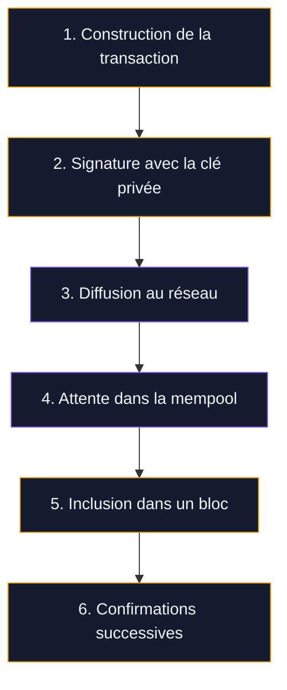
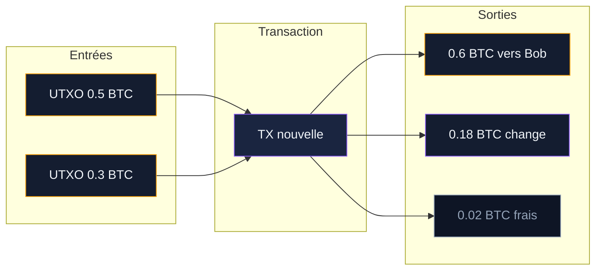
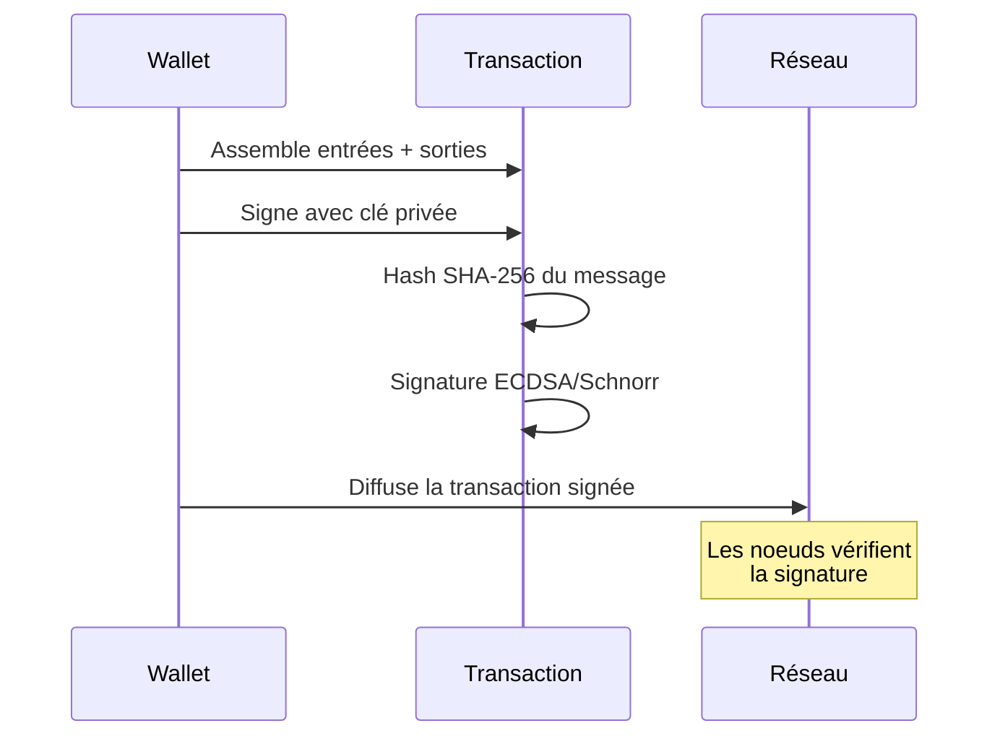
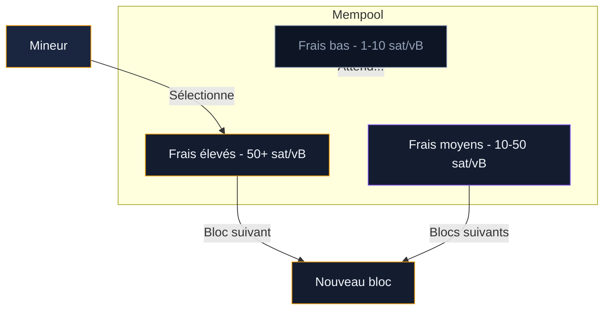
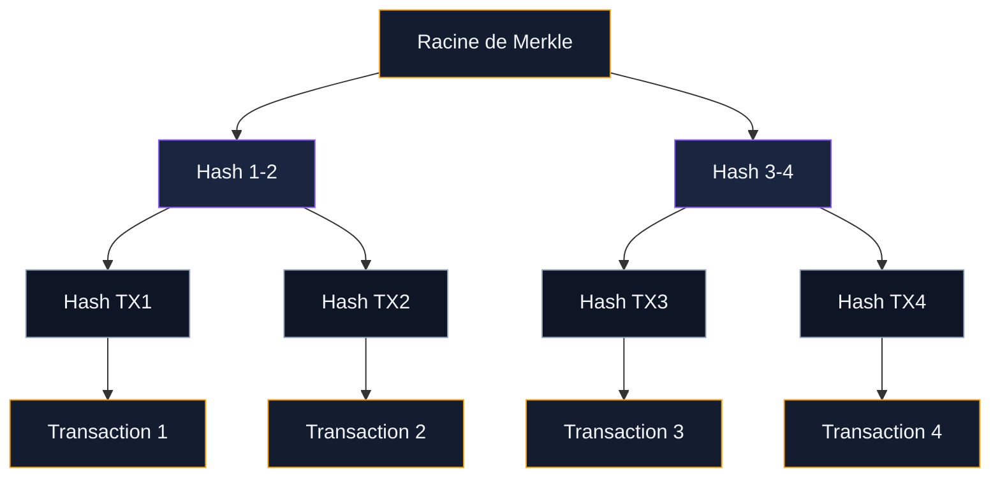

Quand vous appuyez sur "Envoyer" dans votre wallet Bitcoin, que se passe-t-il exactement ? Votre paiement traverse plusieurs étapes avant d'être gravé dans la blockchain. Chaque étape repose sur un mécanisme précis : signature, propagation, sélection par les mineurs et validation par les noeuds.

Ce guide détaille le parcours complet d'une transaction, de la construction du message jusqu'à sa confirmation finale. Avec des schémas pour visualiser chaque étape.

## Vue d'ensemble : le parcours d'une transaction

Avant d'entrer dans le détail, voici le parcours global d'un paiement Bitcoin en six étapes.

Les étapes 1 et 2 se passent dans votre portefeuille. Les étapes 3 à 6 impliquent le réseau entier. Tout le processus prend entre 10 minutes et une heure selon la congestion.

## Le modèle UTXO : la base de tout

Bitcoin ne fonctionne pas avec des "soldes" comme une banque. Il utilise un système d'UTXO - Unspent Transaction Outputs, ou sorties de transaction non dépensées.

Chaque bitcoin que vous "possédez" est en réalité un UTXO : un morceau d'une transaction précédente qui pointe vers votre adresse. Quand vous voulez payer quelqu'un, votre wallet sélectionne un ou plusieurs UTXO comme "entrées" (inputs) et crée de nouvelles "sorties" (outputs).

### Pourquoi le "change" existe

Pensez aux UTXO comme des billets de banque. Si vous avez un billet de 50 euros et que vous achetez un café à 3 euros, vous ne pouvez pas déchirer le billet. Vous payez avec le billet entier et le commerçant vous rend la monnaie.

Bitcoin fonctionne pareil. Si votre wallet contient un UTXO de 0.5 BTC et que vous envoyez 0.3 BTC, la transaction consomme l'UTXO entier (0.5 BTC) et crée deux sorties : 0.3 BTC pour le destinataire, et 0.2 BTC (moins les frais) qui reviennent à votre propre adresse. Cette sortie de "change" devient un nouvel UTXO dans votre portefeuille.

> [!TIP]
> Un portefeuille Bitcoin avec beaucoup de petits UTXO (poussière) coûte plus cher en frais qu'un wallet avec quelques gros UTXO. Certains wallets proposent une option de "consolidation" pour regrouper les petits UTXO en période de frais bas.

### L'anatomie d'un UTXO

Chaque UTXO contient deux informations :

- **Un montant** en satoshis (1 BTC = 100 000 000 satoshis)
- **Un script de verrouillage** (scriptPubKey) qui définit les conditions pour dépenser cet UTXO - en général, fournir une signature correspondant à la clé publique du propriétaire

Pour dépenser un UTXO, la transaction doit fournir un **script de déverrouillage** (scriptSig) qui satisfait les conditions du script de verrouillage. Les noeuds du réseau exécutent les deux scripts ensemble : si le résultat est valide, la transaction passe.

## Étape 1 : construction de la transaction

Votre wallet Bitcoin fait tout le travail en coulisses. Quand vous entrez un montant et une adresse de destination, le logiciel :

1. **Sélectionne les UTXO** nécessaires pour couvrir le montant + les frais
2. **Calcule le change** et crée une sortie vers votre propre adresse
3. **Estime les frais** en fonction du poids de la transaction et de l'état de la mempool
4. **Assemble la transaction brute** avec toutes les entrées et sorties

Le "poids" d'une transaction se mesure en unités de poids virtuelles (vbytes). Une transaction simple avec une entrée et deux sorties pèse environ 140 vbytes. Plus vous avez d'UTXO en entrée, plus la transaction est lourde et plus les frais augmentent.

> [!NOTE]
> Depuis SegWit (2017), les données de signature sont séparées du reste de la transaction. Ça réduit le poids effectif et permet de caser plus de transactions dans chaque bloc. Un transfert SegWit standard coûte environ 30 à 40 % de moins en frais qu'un transfert au format legacy.

## Étape 2 : la signature cryptographique

Une fois la transaction assemblée, votre wallet la signe avec votre clé privée. Cette signature prouve deux choses :

- Vous possédez les UTXO que vous dépensez
- La transaction n'a pas été modifiée après signature

### ECDSA vs Schnorr

Bitcoin utilise deux algorithmes de signature :

**ECDSA** (Elliptic Curve Digital Signature Algorithm) est le format historique, présent depuis 2009. Chaque entrée de la transaction reçoit sa propre signature. Pour une transaction avec 3 entrées, ça fait 3 signatures distinctes.

**Schnorr** est arrivé avec Taproot en novembre 2021. Son avantage : l'agrégation de signatures. Les 3 signatures peuvent être combinées en une seule, ce qui réduit la taille de la transaction et améliore la confidentialité. De l'extérieur, une transaction multi-signature Schnorr ressemble à une transaction simple.

## Étape 3 : diffusion au réseau

Votre wallet envoie la transaction signée aux noeuds Bitcoin auxquels il est connecté. Chaque noeud qui la reçoit fait une première vérification :

- La syntaxe est-elle correcte ?
- Les UTXO référencés existent-ils et sont-ils non dépensés ?
- La signature est-elle valide ?
- Les frais sont-ils suffisants (supérieur au relais minimum) ?

Si la transaction passe ces vérifications, le noeud la stocke dans sa mempool locale et la relaie à ses voisins. En 2 à 3 secondes, la majorité des noeuds du réseau ont reçu votre transaction.

> [!WARNING]
> Une transaction diffusée au réseau ne peut plus être "annulée" au sens classique. Il n'y a pas de bouton retour. La seule option est d'envoyer une transaction concurrente avec des frais plus élevés (Replace-By-Fee ou RBF) tant que la première n'est pas confirmée.

## Étape 4 : la mempool - salle d'attente du réseau

La mempool (memory pool) est l'espace où les transactions non confirmées attendent d'être incluses dans un bloc. Chaque noeud maintient sa propre mempool - il n'y a pas de mempool "officielle" unique.

### Comment les mineurs choisissent les transactions

Les mineurs classent les transactions de la mempool par taux de frais (satoshis par vbyte). Ils remplissent le bloc en prenant d'abord les transactions les plus rentables. Un bloc peut contenir environ 4 Mo de données (en poids SegWit), soit 2 000 à 5 000 transactions selon leur taille.

Quand le réseau est calme (mempool presque vide), même une transaction à 1 sat/vB passe au bloc suivant. En période de congestion - typiquement lors d'un pic de prix ou d'un événement comme un halving - les frais peuvent monter à 200+ sat/vB. Suivre l'état de la mempool en temps réel (via mempool.space) aide à calibrer ses frais.

### Replace-By-Fee (RBF)

Si votre transaction reste bloquée dans la mempool parce que vous avez mis des frais trop bas, le protocole RBF (BIP 125) vous permet d'envoyer une version mise à jour avec des frais plus élevés. La nouvelle transaction remplace l'ancienne dans la mempool des noeuds qui supportent RBF. La plupart des wallets modernes activent RBF par défaut.

### Durée de vie dans la mempool

Les noeuds gardent les transactions non confirmées environ 14 jours. Si une transaction n'est toujours pas incluse dans un bloc après ce délai, les noeuds la retirent de leur mempool. Les UTXO en entrée redeviennent disponibles dans votre portefeuille.

## Étape 5 : inclusion dans un bloc

Un mineur rassemble un lot de transactions de sa mempool et construit un bloc candidat. Ce bloc contient :

- **L'en-tête** : référence au bloc précédent, horodatage, racine de Merkle et nonce
- **La coinbase** : transaction spéciale qui crée les nouveaux BTC (3,125 BTC depuis avril 2024) et collecte les frais de toutes les transactions du bloc
- **Les transactions** : entre 2 000 et 5 000 selon la taille

### L'arbre de Merkle

Les transactions du bloc sont organisées en arbre de Merkle - une structure où chaque paire de transactions est hachée ensemble, puis les hachages sont combinés à nouveau, jusqu'à obtenir une racine unique.

L'intérêt de cette structure : pour prouver qu'une transaction est dans un bloc, il suffit de fournir quelques hachages intermédiaires (le "chemin de Merkle") au lieu de télécharger tout le bloc. C'est ce qui permet aux wallets légers (SPV) de vérifier des transactions sans stocker toute la blockchain.

### La preuve de travail

Le mineur doit trouver un nonce (un nombre) tel que le hash de l'en-tête du bloc commence par un certain nombre de zéros. C'est un travail de force brute : le mineur essaie des milliards de valeurs par seconde. Le premier mineur qui trouve une solution valide diffuse son bloc au réseau, empoche la récompense et les frais.

## Étape 6 : confirmations et finalité

Quand votre transaction est incluse dans un bloc, elle a une confirmation. Chaque nouveau bloc ajouté après le vôtre augmente le nombre de confirmations.

| Confirmations | Temps | Niveau de sécurité | Usage type |
|---|---|---|---|
| 0 | Instant | Aucun - transaction non confirmée | Micro-paiements avec RBF désactivé |
| 1 | ~10 min | Faible - réorganisation possible | Petit achat (café, abonnement) |
| 3 | ~30 min | Moyen | Achat en ligne standard |
| 6 | ~60 min | Très élevé (standard industrie) | Virement important, échanges entre plateformes |

> [!IMPORTANT]
> Le seuil de 6 confirmations n'est pas arbitraire. Après 6 blocs, la probabilité qu'un attaquant puisse réorganiser la chaîne et annuler votre transaction tombe à 0,0002 %. C'est le seuil utilisé par la quasi-totalité des plateformes d'échange.

### Pourquoi les confirmations rendent la transaction irréversible

Pour annuler une transaction avec N confirmations, un attaquant devrait miner une chaîne alternative plus longue que la chaîne actuelle - ce qui demande de contrôler plus de 50 % du hashrate mondial. Avec un réseau à 800+ EH/s, le coût est astronomique (estimé à plus de 6 milliards de dollars en matériel seul). Plus le nombre de confirmations augmente, plus l'attaque devient irréaliste.

## Les différents types de transactions

Toutes les transactions Bitcoin ne se ressemblent pas. Le format influence la taille, les frais et la confidentialité.

### P2PKH - Pay to Public Key Hash (legacy)

Le format original de Bitcoin. L'adresse commence par "1". La sortie est verrouillée par le hash de la clé publique. Pour dépenser, il faut fournir la clé publique complète et une signature. C'est le format le plus lourd en frais.

### P2SH - Pay to Script Hash

Introduit en 2012. L'adresse commence par "3". Permet des conditions de dépense complexes : multi-signature (2 sur 3 clés), timelocks, etc. Le script de verrouillage est un hash du script complet, qui n'est révélé qu'au moment de dépenser.

### P2WPKH - Pay to Witness Public Key Hash (SegWit natif)

Adresses commençant par "bc1q". Les données de signature sont déplacées dans la "zone témoin" (witness), hors du calcul de la taille classique du bloc. Résultat : des frais environ 30 à 40 % inférieurs au format legacy.

### P2TR - Pay to Taproot

Adresses commençant par "bc1p". Le format le plus récent (2021). Utilise les signatures Schnorr et les arbres MAST. Les transactions multi-signatures et les conditions complexes deviennent indiscernables des transactions simples. Meilleure confidentialité et frais réduits.

> [!TIP]
> Pour payer le moins de frais possible, utilisez un wallet qui supporte les adresses Taproot (bc1p). Les wallets les plus connus qui le supportent : Sparrow, Blue Wallet et Electrum depuis la version 4.4.

## Les frais en détail

Les frais de transaction ne sont pas fixes. Ils dépendent de deux variables :

**Le poids de la transaction** en vbytes (virtual bytes). Une transaction avec 1 entrée et 2 sorties SegWit pèse environ 140 vbytes. Ajoutez des entrées, le poids augmente.

**Le taux de frais du marché** en sat/vB. Ce taux fluctue selon la demande. En mai 2024, lors du halving et de l'engouement pour les Runes, les frais ont brièvement atteint 1 000+ sat/vB. En période calme, 2-5 sat/vB suffisent.

Le calcul est simple : poids (vB) x taux (sat/vB) = frais totaux (sats). Exemple : 140 vB x 20 sat/vB = 2 800 sats, soit environ 2,80 $ à 100 000 $/BTC.

### Frais et priorité

Les mineurs classent les transactions par rentabilité (sat/vB). Si vous mettez 5 sat/vB quand la mempool déborde à 50 sat/vB, votre transaction attendra. À l'inverse, en période calme, 1 sat/vB (le minimum de relais) suffit pour passer au bloc suivant.

Des outils comme mempool.space affichent l'état de la mempool en temps réel et suggèrent un taux de frais optimal selon l'urgence de votre transfert.

## Accélérer une transaction lente

Trois méthodes existent si votre transaction est bloquée dans la mempool :

**Replace-By-Fee (RBF)** : si votre transaction a été envoyée avec le flag RBF (la plupart des wallets l'activent par défaut), vous pouvez renvoyer une version avec des frais plus élevés. L'ancienne version est remplacée dans la mempool.

**Child Pays for Parent (CPFP)** : si vous êtes le destinataire, vous pouvez créer une nouvelle transaction qui dépense la sortie non confirmée en y attachant des frais élevés. Le mineur inclura les deux transactions ensemble car le package total est rentable.

**Attendre** : si les frais restent hauts et que votre transaction n'est pas urgente, attendez. Les frais baissent souvent le week-end ou la nuit (heure américaine). Après 14 jours sans confirmation, la transaction disparaît et vos fonds sont à nouveau disponibles.

## Vérifier une transaction soi-même

Vous n'avez pas besoin de faire confiance à votre wallet pour savoir si un paiement est arrivé. Plusieurs méthodes permettent de vérifier directement.

**Explorateurs de blockchain** : collez l'adresse du destinataire ou le TXID (identifiant de transaction) sur mempool.space, blockstream.info ou blockchain.com. Vous verrez le statut, les frais payés, le nombre de confirmations et le contenu exact de la transaction.

**Noeud complet** : si vous faites tourner votre propre noeud Bitcoin (via Bitcoin Core, Umbrel ou RaspiBlitz), vous vérifiez les transactions sans passer par un tiers. C'est la méthode la plus souveraine.

**Wallet SPV** : les wallets légers (Electrum, Blue Wallet) utilisent la vérification SPV (Simplified Payment Verification). Ils demandent un chemin de Merkle à un noeud pour prouver qu'une transaction est bien dans un bloc, sans télécharger la blockchain entière.

> [!NOTE]
> SPV est pratique pour un usage quotidien, mais il fait confiance au noeud auquel le wallet se connecte. Pour des montants importants, un noeud complet reste la référence en matière de vérification.

## Ce que le réseau empêche

Le protocole Bitcoin inclut des règles strictes qui rendent certaines fraudes impossibles au niveau du réseau :

- **Double dépense** : impossible de dépenser le même UTXO deux fois. Les noeuds rejettent toute transaction qui référence un UTXO déjà consommé.
- **Création de BTC** : seule la transaction coinbase d'un bloc crée des bitcoins, et le montant est plafonné (3,125 BTC + frais depuis avril 2024). Un mineur qui triche se fait rejeter par les autres noeuds.
- **Modification rétroactive** : changer une transaction dans un ancien bloc obligerait à recalculer la preuve de travail de ce bloc et de tous les blocs suivants. Le coût en énergie rend ça irréalisable.
- **Transactions non signées** : sans la clé privée correspondant à l'UTXO, la signature est invalide. Les noeuds la rejettent en quelques millisecondes.

Ces règles sont appliquées par chaque noeud du réseau de façon indépendante. Aucune autorité n'a besoin d'intervenir.
