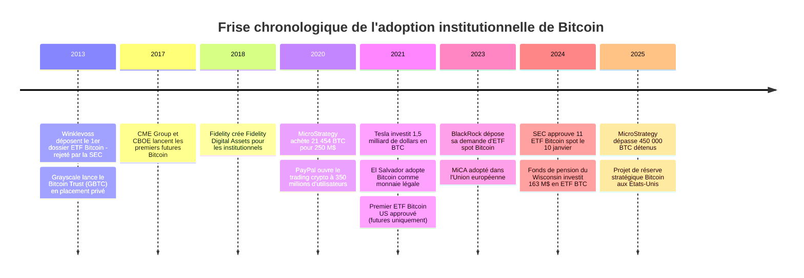

Pendant ses dix premières années, Bitcoin restait un actif de geeks, de libertariens et de spéculateurs individuels. Les institutions financières le regardaient de loin, entre mépris et curiosité. Puis, entre 2020 et 2025, tout a basculé. Des trésoriers d'entreprise, des gestionnaires de fonds souverains et des régulateurs ont commencé à prendre Bitcoin au sérieux. Cette page retrace comment un protocole né sur un forum de cryptographie est devenu un actif de réserve pour des sociétés cotées au Nasdaq.

## Les premiers signaux (2013-2019) : quand Wall Street commence à regarder

L'intérêt institutionnel pour Bitcoin ne démarre pas en 2020. Les premiers signes remontent à 2013, quand les frères Winklevoss déposent la première demande d'ETF Bitcoin auprès de la SEC. Le dossier sera rejeté. Puis rejeté à nouveau. Et encore. Pendant six ans, la SEC refuse systématiquement tout ETF lié à Bitcoin, invoquant les risques de manipulation de marché.

En 2014, la faillite de Mt. Gox refroidit les ambitions. Mais le secteur se structure. Coinbase obtient ses premières licences régulatoires aux États-Unis. Circle, fondée par Jeremy Allaire, lève 26 millions de dollars auprès de Goldman Sachs en 2015 pour construire une infrastructure crypto réglementée.

Grayscale lance le Bitcoin Trust (GBTC) en 2013, d'abord en placement privé. C'est le premier véhicule d'investissement Bitcoin accessible aux institutionnels américains via un compte-titres classique. En 2015, GBTC est coté sur les marchés OTC. Le produit est imparfait : il se négocie souvent avec une prime de 20 à 40% par rapport au prix réel du BTC. Mais il ouvre une porte.

En décembre 2017, le CME Group et le CBOE lancent des contrats à terme (futures) sur Bitcoin. C'est la première fois que Bitcoin intègre les marchés financiers traditionnels via des produits dérivés. Les volumes restent modestes, mais le signal est clair : Wall Street commence à construire des ponts.

> [!NOTE]
> Le CME Group est la plus grande bourse de produits dérivés au monde. Son lancement de futures Bitcoin en décembre 2017 a donné aux hedge funds et aux trading desks un moyen réglementé de s'exposer au BTC sans détenir directement l'actif.

Fidelity Investments, géant de la gestion d'actifs avec 4 500 milliards de dollars sous gestion, annonce en octobre 2018 la création de Fidelity Digital Assets. Ce service propose de la conservation (custody) et de l'exécution d'ordres sur Bitcoin pour les clients institutionnels. Abigail Johnson, PDG de Fidelity, déclarait déjà en 2017 : "I'm a believer". À l'époque, rares sont les dirigeants de cette taille à afficher un soutien aussi direct.

En 2019, Bakkt, soutenue par l'Intercontinental Exchange (la maison mère du NYSE), lance ses propres contrats futures Bitcoin réglés en BTC physique, pas en dollars. La différence est importante : cela signifie que des bitcoins réels circulent dans le système financier traditionnel. La même année, la Suisse approuve le premier ETP Bitcoin au monde sur la bourse SIX.

## 2020 : l'année où les entreprises passent à l'acte

L'année 2020 change tout. La pandémie COVID-19 déclenche une réponse monétaire sans précédent. La Réserve fédérale américaine imprime 3 000 milliards de dollars en quelques mois. Le bilan de la Fed passe de 4 200 milliards à 7 200 milliards entre mars et décembre. Cette expansion monétaire pousse les trésoriers d'entreprise à chercher des alternatives au cash.

Le 11 août 2020, MicroStrategy annonce l'achat de 21 454 BTC pour 250 millions de dollars. Michael Saylor, PDG de cette société de logiciels de taille moyenne, explique que l'inflation grignote les réserves de trésorerie en dollars. Bitcoin, avec son offre plafonnée à 21 millions d'unités, devient pour lui un "actif de réserve supérieur".

Ce premier achat en appelle d'autres. En septembre 2020, MicroStrategy achète 16 796 BTC supplémentaires pour 175 millions. En décembre, l'entreprise émet des obligations convertibles pour acheter encore plus de BTC. La stratégie est agressive et sans précédent pour une société cotée.

> [!IMPORTANT]
> MicroStrategy (renommée Strategy en 2025) détient à elle seule plus de 450 000 BTC en février 2025, soit environ 2,1% de l'offre totale de Bitcoin. L'action MSTR est devenue un proxy boursier pour le prix du BTC, avec une corrélation quasi parfaite.

En octobre 2020, Square (rebaptisée Block en 2021), la société de paiement de Jack Dorsey, investit 50 millions de dollars en Bitcoin. Puis 170 millions supplémentaires en février 2021. Dorsey ne cache pas ses convictions : "Bitcoin est la monnaie native d'internet."

PayPal ouvre le trading crypto à ses 350 millions d'utilisateurs en novembre 2020. En quelques semaines, les volumes explosent. PayPal achète tellement de BTC pour couvrir la demande de ses clients qu'il absorbe temporairement une part significative des bitcoins nouvellement minés. Venmo, filiale de PayPal, suit en 2021.

## 2021 : Tesla, El Salvador et l'entrée dans le grand public

Le 8 février 2021, Tesla révèle dans un dépôt SEC l'achat de 1,5 milliard de dollars en Bitcoin. Le cours bondit de 10% en quelques heures. Elon Musk ajoute #Bitcoin à sa bio Twitter. L'annonce est symbolique : la société la plus médiatisée au monde mise sur BTC.

Tesla accepte brièvement les paiements en Bitcoin pour ses véhicules avant de suspendre cette option en mai, invoquant l'empreinte carbone du minage. L'entreprise vend environ 75% de ses BTC au deuxième trimestre 2022 pour des besoins de liquidité, mais conserve une position résiduelle.

Les fonds d'investissement suivent. Ruffer Investment Company, un fonds britannique gérant 27 milliards de dollars, révèle avoir alloué 2,5% de son portefeuille à Bitcoin fin 2020. Brevan Howard, un des plus gros hedge funds au monde, ouvre un desk crypto dédié en 2021. Paul Tudor Jones, légendaire gérant macro, alloue 2% de son portefeuille à Bitcoin qu'il compare à "l'or des années 1970".

Les banques d'investissement commencent à couvrir l'actif. Goldman Sachs relance son desk de trading crypto en mars 2021. Morgan Stanley devient la première grande banque américaine à offrir des fonds Bitcoin à ses clients fortunés. JPMorgan, dont le PDG Jamie Dimon qualifiait Bitcoin de "fraude" en 2017, lance des produits structurés liés au BTC.

> [!TIP]
> Le retournement de JPMorgan illustre un pattern classique de l'adoption institutionnelle : les dirigeants critiquent publiquement Bitcoin pendant que leurs équipes construisent des produits en interne. Quand le marché est prêt, la banque est déjà positionnée.

## La course aux ETF spot (2021-2024)

Un ETF spot Bitcoin permet d'acheter du BTC réel (pas des contrats à terme) via un courtier classique, dans un compte-titres ordinaire. C'est le Graal de l'adoption institutionnelle, car il supprime toutes les barrières techniques : pas de wallet, pas de clés privées, pas d'exchange crypto.

En octobre 2021, la SEC approuve le premier ETF Bitcoin américain, mais basé sur des futures (contrats à terme), pas sur du spot. Le ProShares Bitcoin Strategy ETF (BITO) attire 1 milliard de dollars en deux jours, un record pour un lancement d'ETF. Mais les ETF futures ont un défaut structurel : le coût de roulement des contrats érode les rendements de 5 à 10% par an.

La bataille pour un ETF spot dure encore deux ans. La SEC de Gary Gensler rejette systématiquement les demandes. Grayscale attaque la SEC en justice en 2022 pour obtenir la conversion de son GBTC en ETF spot. En août 2023, un tribunal donne raison à Grayscale. La porte s'ouvre.

Le 15 juin 2023, BlackRock dépose sa demande d'ETF spot Bitcoin (iShares Bitcoin Trust, ticker IBIT). C'est un séisme. BlackRock gère 10 000 milliards de dollars d'actifs. Son taux d'approbation historique par la SEC est de 575 sur 576. Le marché comprend que l'approbation n'est plus une question de "si" mais de "quand".

Le 10 janvier 2024, la SEC approuve simultanément 11 ETF Bitcoin spot. BlackRock (IBIT), Fidelity (FBTC), Invesco, Franklin Templeton, WisdomTree, VanEck et d'autres lancent leurs produits le même jour. La compétition est féroce. BlackRock et Fidelity dominent rapidement.

Les chiffres dépassent toutes les prévisions. IBIT de BlackRock atteint 10 milliards de dollars d'actifs en 7 semaines, le rythme le plus rapide de l'histoire des ETF. En un an, les ETF spot Bitcoin américains dépassent collectivement 100 milliards de dollars d'actifs sous gestion. À titre de comparaison, les ETF or ont mis 20 ans pour atteindre ce niveau.

## Fonds de pension et allocations stratégiques

L'approbation des ETF ouvre une nouvelle phase : l'entrée des fonds de pension. Ces géants gèrent l'épargne retraite de centaines de millions de personnes. Leurs décisions d'allocation se mesurent en milliards.

Le State of Wisconsin Investment Board (SWIB) révèle en mai 2024 une position de 163 millions de dollars en ETF Bitcoin (IBIT et GBTC). C'est le premier grand fonds de pension américain à confirmer publiquement une allocation BTC. Le fonds de pension de l'État du Michigan suit en juillet 2024 avec 6,6 millions en IBIT.

En Australie, AMP, un des plus grands gestionnaires de fonds de retraite, autorise une allocation crypto allant jusqu'à 5% dans certains portefeuilles. Au Canada, le Ontario Teachers' Pension Plan avait déjà investi dans FTX (perdant 95 millions lors de la faillite), mais revient sur le marché via les ETF en 2024.

Les conseillers financiers américains commencent à recommander une exposition de 1 à 5% en Bitcoin. Les études de Fidelity et de BlackRock montrent qu'un portefeuille 60/40 classique (actions/obligations) avec 2% de Bitcoin offre un meilleur ratio risque/rendement sur les périodes 2014-2024.

> [!WARNING]
> L'allocation des fonds de pension en Bitcoin reste minuscule par rapport à leurs actifs totaux. Le SWIB gère 156 milliards de dollars : ses 163 millions en Bitcoin représentent 0,1%. Une correction de 50% du BTC n'impacterait pas les retraites. Mais le signal politique est significatif.

## Les banques traditionnelles entrent dans le jeu

Entre 2023 et 2025, les grandes banques passent du scepticisme au déploiement de services crypto. Ce n'est plus une question de conviction idéologique : leurs clients demandent ces produits, et la concurrence pousse à agir.

BNY Mellon, la plus ancienne banque américaine (fondée en 1784 par Alexander Hamilton), lance des services de conservation Bitcoin en octobre 2022. Deutsche Bank obtient une licence de conservation crypto en Allemagne en 2023. Standard Chartered ouvre un desk de trading spot Bitcoin à Londres en 2024.

En France, Société Générale via sa filiale Forge émet son premier produit financier tokenisé sur blockchain publique en 2023. BNP Paribas explore la conservation d'actifs numériques. CACEIS, filiale de Crédit Agricole, obtient un enregistrement PSAN (Prestataire de Services sur Actifs Numériques) en 2024.

Les banques proposent désormais trois types de services : la conservation sécurisée (custody), l'exécution d'ordres (trading) et les produits structurés (dérivés, notes indexées sur le BTC). Le marché des dérivés crypto institutionnel explose. Le CME Group rapporte des volumes records sur ses futures Bitcoin en 2024 et 2025. Jennifer Ilkiw, présidente d'ICE Futures U.S., annonce en 2026 le lancement de contrats à terme sur les taux liés au stablecoin USDC, prévu pour avril. Les produits dérivés sont désormais considérés comme le vecteur principal pour canaliser les milliers de milliards de dollars d'investissements institutionnels.

## Régulation : le cadre qui rassure les institutions

L'adoption institutionnelle et la régulation avancent en parallèle. Les institutions ne peuvent pas investir dans un actif qui opère dans un flou juridique. Chaque avancée réglementaire débloque une nouvelle vague de capitaux.

L'Union européenne adopte MiCA (Markets in Crypto-Assets) en 2023, avec une mise en application progressive en 2024-2025. Ce cadre harmonise les règles pour les 27 pays membres. Les prestataires crypto doivent obtenir un agrément, les stablecoins sont encadrés, et les mesures anti-blanchiment renforcées.

Aux États-Unis, l'élection de Donald Trump en novembre 2024 change la donne. La nouvelle administration remplace les régulateurs hostiles et adopte une posture favorable à l'innovation crypto. La SEC abandonne plusieurs poursuites contre des acteurs du secteur. Le Congrès travaille sur un cadre législatif dédié.

Le Salvador, après avoir adopté Bitcoin comme monnaie légale en 2021, fait évoluer son cadre en août 2025. Une nouvelle loi autorise les institutions financières réglementées à demander des licences pour offrir des services crypto. Les banques d'investissement doivent disposer d'un capital minimum de 50 millions de dollars et ne peuvent servir que des investisseurs disposant de plus de 250 000 dollars en actifs liquides.

Singapour, Dubaï et Hong Kong rivalisent pour attirer les entreprises crypto via des cadres réglementaires clairs. La tendance mondiale est à la régulation pragmatique : ni interdiction, ni laissez-faire. Les autorités veulent protéger les investisseurs tout en laissant l'innovation se développer.

## Les chiffres de l'adoption en 2025-2026

Quelques données pour mesurer l'ampleur du changement :

- **ETF Bitcoin spot US** : plus de 100 milliards de dollars d'actifs sous gestion en moins d'un an
- **MicroStrategy** : 450 000+ BTC détenus, soit environ 2,1% de l'offre totale
- **CME Group** : volumes records sur les futures BTC, avec des contrats ouverts dépassant régulièrement 10 milliards de dollars
- **Nombre de sociétés cotées détenant du BTC** : plus de 70 dans le monde (données Bitcoin Treasuries)
- **Capitalisation Bitcoin** : dépassement régulier de 2 000 milliards de dollars, comparable à Apple ou Microsoft

Les stratégies d'allocation institutionnelle varient. L'allocation directe en Bitcoin et Ethereum reste la plus courante pour les acteurs ayant la capacité technique. Les ETF dominent pour les fonds de pension et les conseillers financiers. Les produits dérivés (futures, options) servent aux hedge funds et aux trading desks. Et les produits structurés (obligations convertibles, notes indexées) permettent aux banques d'offrir une exposition taillée sur mesure à leurs clients.

## Ce qui reste à venir

L'adoption institutionnelle de Bitcoin n'est pas terminée. Plusieurs catalyseurs potentiels restent devant nous :

**Réserves stratégiques nationales.** En mars 2025, les États-Unis annoncent un projet de réserve stratégique Bitcoin. D'autres pays (Émirats Arabes Unis, Singapour) étudient des plans similaires. Si une poignée d'États commencent à accumuler du BTC comme ils accumulent de l'or, la dynamique d'offre et de demande change radicalement.

**Intégration bancaire complète.** Aujourd'hui, la plupart des banques traditionnelles offrent des services crypto limités. À terme, acheter du Bitcoin pourrait devenir aussi simple que d'acheter des actions, directement depuis votre application bancaire, avec la même protection réglementaire.

**Tokenisation des actifs traditionnels.** BlackRock, Franklin Templeton et JPMorgan expérimentent la tokenisation d'obligations et de fonds monétaires sur blockchain. Cette convergence entre finance traditionnelle et infrastructure crypto brouille les frontières et normalise la technologie.

**Dérivés de nouvelle génération.** Le lancement de nouveaux produits dérivés - options, swaps, produits à revenu fixe indexés sur le BTC - va permettre aux institutionnels de construire des stratégies plus complexes. Les volumes potentiels se chiffrent en milliers de milliards.

> [!CAUTION]
> L'adoption institutionnelle ne signifie pas que le risque disparaît. Bitcoin reste un actif volatil : des corrections de 30 à 50% sont possibles même dans un marché dominé par les institutions. Les fonds de pension n'allouent que 0,1 à 1% pour cette raison. Une position trop concentrée en BTC dans un portefeuille personnel reste risquée.

L'histoire de l'adoption institutionnelle de Bitcoin suit le même schéma que toute innovation financière. D'abord le rejet, puis la curiosité, ensuite l'expérimentation, et pour finir l'intégration. En 2026, Bitcoin est fermement ancré dans la phase d'intégration. Les banques, les fonds de pension, les régulateurs et les gouvernements ne débattent plus de la légitimité de Bitcoin. Ils débattent de la taille de leur allocation.
