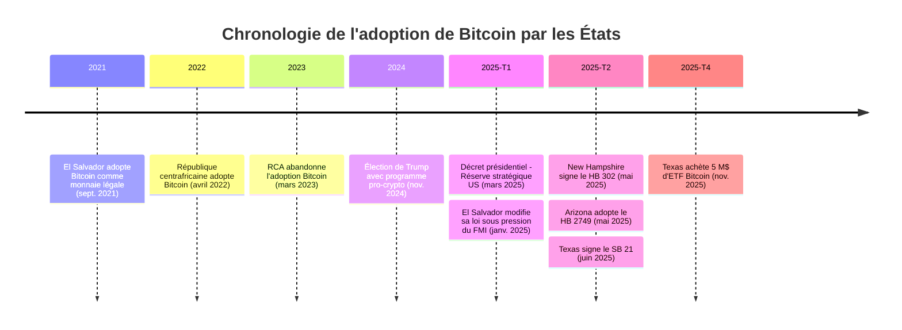
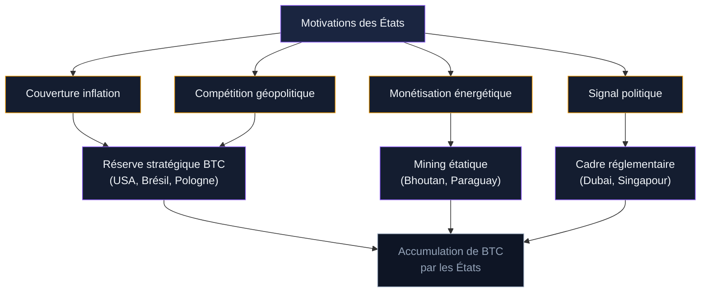

En septembre 2021, El Salvador est devenu le premier pays au monde à adopter Bitcoin comme monnaie à cours légal. Quatre ans plus tard, en mars 2025, les États-Unis ont créé une réserve stratégique nationale en BTC par décret présidentiel. Entre ces deux dates, une dizaine de pays et plusieurs dizaines d'États américains ont lancé des initiatives liées à Bitcoin. Ce guide retrace la chronologie complète de l'adoption étatique du BTC, avec les dates, les chiffres et les motivations de chaque acteur.

## El Salvador : le premier pays à adopter Bitcoin (2021)

Le 9 juin 2021, l'Assemblée législative du Salvador vote la "Ley Bitcoin" proposée par le président Nayib Bukele. Le texte est adopté avec 62 voix sur 84. Bitcoin devient monnaie à cours légal le 7 septembre 2021, 90 jours après la publication au journal officiel.

La loi impose à toutes les entreprises du pays d'accepter le BTC comme moyen de paiement. Le gouvernement lance le wallet Chivo et distribue 30 dollars en bitcoin à chaque citoyen qui s'inscrit. Un fonds de conversion de 150 millions de dollars est mis en place pour permettre les échanges instantanés BTC/dollar.

L'adoption citoyenne démarre fort puis décline. En 2021, 25,7% des Salvadoriens déclarent utiliser Bitcoin pour des transactions. Ce chiffre tombe à 21% en 2022, 12% en 2023, puis 8,1% en 2024. Les raisons : la volatilité du BTC, le manque de culture numérique dans les zones rurales et la préférence pour le dollar cash.

Le trésor public salvadorien accumule du BTC de manière régulière. En février 2026, le pays détient 6 313 BTC, soit plus de 700 millions de dollars au cours actuel. Bukele achète souvent à des moments symboliques : 21 BTC pour le quatrième anniversaire de la loi, 1 BTC par jour pendant plusieurs mois en 2024.

> [!NOTE]
> En janvier 2025, le Salvador a modifié sa loi Bitcoin sous pression du FMI, en échange d'un prêt de 1,4 milliard de dollars. Les entreprises ne sont plus obligées d'accepter le BTC. Il reste "monnaie légale" sur le papier, mais son statut s'apparente désormais à celui d'un actif optionnel.

### Bilan d'El Salvador après quatre ans

Les critiques pointent l'échec de l'adoption populaire et les pertes latentes sur les achats réalisés pendant le bear market de 2022. Les partisans rappellent que le portefeuille public affiche un profit net en 2025 grâce à la remontée du BTC, et que le pays a attiré des investissements tech et du tourisme crypto.

Le FMI a obtenu trois concessions en décembre 2024 : suppression de l'obligation d'acceptation pour les commerçants, paiement des taxes uniquement en dollars, et réduction de l'implication du secteur public dans le wallet Chivo. Le Salvador reste un laboratoire de l'adoption étatique, mais son modèle a évolué d'une obligation vers une option.

## République centrafricaine : l'adoption avortée (2022-2023)

Le 27 avril 2022, la République centrafricaine (RCA) devient le deuxième pays au monde à adopter Bitcoin comme monnaie légale. Le président Faustin-Archange Touadéra signe la loi malgré l'opposition de la Banque des États de l'Afrique Centrale (BEAC) et de la Communauté économique et monétaire de l'Afrique Centrale (CEMAC).

La décision paraît étrange pour un pays où moins de 15% de la population a accès à internet. Les motivations restent opaques. Certains observateurs évoquent la volonté de contourner les sanctions internationales.

En mars 2023, la RCA fait marche arrière. L'adoption est abandonnée pour des raisons d'infrastructure et sous pression de la BEAC. Le pays lance un projet de tokenisation de ses ressources naturelles (le "Sango Coin"), qui ne décolle pas. L'épisode illustre qu'adopter Bitcoin sans infrastructure numérique et sans soutien des institutions régionales est voué à l'échec.

## Bhoutan : le mineur discret (2019-2025)

Le Bhoutan n'a pas fait de déclaration fracassante. Depuis 2019, le fonds souverain Druk Holding & Investments utilise l'énergie hydroélectrique abondante du pays pour miner du Bitcoin. L'électricité coûte moins de 0,04 dollar par kWh au Bhoutan, contre 0,10 à 0,15 dollar aux États-Unis.

Les réserves publiques de BTC sont estimées à environ 6 000 BTC en 2025. Le pays utilise les profits générés pour financer une partie des salaires de fonctionnaires et des projets d'infrastructure. En décembre 2025, le Bhoutan a lancé un token adossé à l'or (TER) comme extension de sa stratégie numérique.

> [!TIP]
> Le modèle bhoutanais est unique : pas de loi Bitcoin, pas d'obligation pour les citoyens, mais un État qui mine du BTC avec ses ressources naturelles et en conserve les profits. C'est une stratégie de monétisation énergétique plutôt que de politique monétaire.

## Les États-Unis : de l'hostilité à la réserve stratégique (2023-2025)

L'histoire de Bitcoin aux États-Unis a basculé entre novembre 2024 et mars 2025. Pendant les années Biden, la SEC de Gary Gensler menait une politique d'opposition active contre l'industrie crypto. L'élection de Donald Trump le 5 novembre 2024 a changé la donne. Son programme incluait la promesse de faire des USA "la capitale mondiale du Bitcoin".

### Le décret présidentiel du 6 mars 2025

Le 6 mars 2025, Trump signe un décret ("executive order") créant deux entités distinctes :

**La Réserve stratégique Bitcoin (Strategic Bitcoin Reserve).** Gérée par le Département du Trésor, elle est alimentée par les BTC saisis dans le cadre de procédures pénales et civiles. Le gouvernement américain détenait déjà environ 207 000 BTC à cette date, soit près de 17 milliards de dollars. Le décret ordonne que ces bitcoins ne soient pas vendus et soient conservés comme actifs de réserve.

**Le Stock d'actifs numériques (Digital Asset Stockpile).** Un dépôt séparé pour les crypto-actifs autres que Bitcoin (ETH, XRP, SOL, ADA) saisis par les agences fédérales.

Le décret précise que le Trésor et le Département du Commerce doivent développer des stratégies d'acquisition supplémentaires, à condition qu'elles soient "budget-neutral" - sans coût additionnel pour les contribuables.

> [!IMPORTANT]
> Le décret de Trump crée une réserve, mais ne prévoit pas d'achats massifs avec de l'argent public. Les 207 000 BTC proviennent de saisies (Silk Road, Bitfinex hack, etc.). Pour aller plus loin, il faudrait une loi du Congrès.

### Le BITCOIN Act de Cynthia Lummis

La sénatrice républicaine Cynthia Lummis a déposé le BITCOIN Act en juillet 2024, puis l'a réintroduit en mars 2025 avec un soutien bipartisan. Le projet de loi prévoit :

- L'achat de 1 million de BTC sur cinq ans par le Trésor américain
- Un stockage en cold storage sous contrôle du Trésor
- Une conservation obligatoire de 20 ans minimum
- Un financement par les remises de la Réserve fédérale et la réévaluation des certificats or, sans impôt supplémentaire

Le texte a reçu le soutien des sénateurs Jim Justice, Tommy Tuberville, Roger Marshall et Marsha Blackburn. Le représentant Nick Begich a introduit une version miroir à la Chambre. En février 2026, le projet n'a pas encore été voté.

Si adopté, 1 million de BTC représenterait environ 4,8% de l'offre totale de Bitcoin. À 100 000 dollars le BTC, cela équivaut à 100 milliards de dollars, soit une fraction des 8 133 tonnes d'or (environ 700 milliards de dollars) déjà détenues par les États-Unis.

## Les États américains : la course aux réserves locales

Avant même le décret fédéral, plusieurs États américains ont légiféré pour créer leurs propres réserves Bitcoin. Le mouvement s'est accéléré en 2025.

### New Hampshire : premier État à signer une loi

Le 6 mai 2025, la gouverneure Kelly Ayotte a signé le HB 302, autorisant le trésorier de l'État à investir jusqu'à 5% des fonds publics dans des actifs numériques dont la capitalisation dépasse 500 milliards de dollars. En pratique, seul Bitcoin remplit ce critère. New Hampshire est devenu le premier État américain à disposer d'un cadre légal pour une réserve BTC.

### Arizona : la voie des actifs non réclamés

En mai 2025, l'Arizona a adopté le HB 2749 qui crée le "Bitcoin and Digital Assets Reserve Fund". La loi met à jour les règles sur les actifs non réclamés : les crypto saisies ou non réclamées peuvent être conservées en BTC au lieu d'être liquidées. L'approche est prudente - pas d'achat direct avec l'argent des impôts.

### Texas : l'approche la plus offensive

En juin 2025, le gouverneur Greg Abbott a signé le Senate Bill 21 et le House Bill 4488, créant la Réserve stratégique Bitcoin du Texas. La loi inclut des protections juridiques pour empêcher les législatures futures de démanteler la réserve.

En novembre 2025, le bureau du contrôleur du Texas a réalisé son premier achat : environ 5 millions de dollars en ETF Bitcoin iShares (IBIT) de BlackRock, au prix de 91 336 dollars le BTC. Le Texas combine une approche législative solide avec des achats concrets.

### Autres États en mouvement

En 2025, plus de 20 États ont déposé des projets de loi liés aux réserves Bitcoin. Le Kentucky (HB 376) propose d'allouer 10% des excédents budgétaires vers des actifs numériques. L'Ohio, le Massachusetts, l'Oklahoma et le Wyoming ont tous introduit des propositions similaires. Tous n'aboutiront pas, mais la dynamique politique est lancée.

## Autres pays : entre projets concrets et déclarations d'intention

Au-delà des cas détaillés ci-dessus, une série de pays explorent activement des réserves Bitcoin ou des cadres favorables.

**Émirats arabes unis.** Abu Dhabi, via son fonds souverain Mubadala, a investi dans des ETF Bitcoin en 2024-2025. L'approche est celle de l'investisseur institutionnel plutôt que de la réserve nationale. Dubai attire les entreprises crypto avec un cadre réglementaire clair via la VARA (Virtual Assets Regulatory Authority).

**Brésil.** Un projet de loi déposé en 2024 propose la création d'une réserve souveraine en Bitcoin. Le texte prévoit d'allouer jusqu'à 5% des réserves internationales du pays au BTC. En février 2026, le projet est toujours en discussion au Congrès brésilien.

**Japon.** Le Premier ministre Shigeru Ishiba a été interrogé au Parlement en décembre 2024 sur la possibilité d'une réserve BTC. La réponse officielle reste prudente, mais le débat est ouvert. Le Japon détient déjà un cadre réglementaire avancé pour les crypto-actifs depuis 2017.

**Pologne.** Le candidat présidentiel Slawomir Mentzen a proposé en 2024 de créer une réserve stratégique Bitcoin. Le sujet est entré dans le débat électoral sans déboucher sur une législation.

**Suisse.** Une initiative populaire fédérale a été lancée pour inscrire Bitcoin dans les réserves de la Banque nationale suisse (BNS). Cette initiative pourrait atteindre le stade du référendum si elle récolte assez de signatures.

> [!WARNING]
> La plupart des annonces de "réserve Bitcoin nationale" restent au stade de projet de loi, de déclaration politique ou de ballon d'essai électoral. Entre un tweet d'un président et une réserve opérationnelle, le chemin est long. Seuls les États-Unis, El Salvador et le Bhoutan ont des BTC dans leurs comptes publics en 2026.

## Pourquoi les États s'intéressent à Bitcoin

Les motivations varient selon les pays, mais plusieurs logiques reviennent.

**Couverture contre l'inflation monétaire.** Les États-Unis ont imprimé 3 000 milliards de dollars en 2020. Bitcoin, avec son offre limitée à 21 millions d'unités, est perçu comme un actif résistant à la dévaluation. Le raisonnement est le même que pour l'or, avec l'avantage de la portabilité numérique.

**Compétition géopolitique.** Si les États-Unis constituent une réserve BTC, les autres puissances sont incitées à faire de même pour ne pas être en retard. Le BITCOIN Act de Lummis cite explicitement la compétition avec la Chine comme motivation.

**Monétisation de ressources naturelles.** Le Bhoutan mine du Bitcoin avec son hydroélectricité. Le Paraguay, le Laos et l'Éthiopie explorent des approches comparables. Les pays riches en énergie renouvelable bon marché peuvent générer des revenus en BTC sans investissement lourd.

**Signal politique et attraction d'investissements.** El Salvador a attiré des entreprises tech, des conférences et du tourisme crypto grâce à sa loi Bitcoin. Dubai utilise la même logique avec la VARA. Le signal politique compte autant que la réserve elle-même.

## Les risques de l'adoption étatique

L'enthousiasme autour des réserves Bitcoin ne doit pas masquer les risques.

**Volatilité.** Bitcoin peut perdre 50% de sa valeur en quelques mois. Un État qui achète au sommet d'un cycle et subit un bear market de deux ans s'expose à des critiques politiques violentes. El Salvador a vécu cette situation en 2022.

**Centralisation du pouvoir.** Quand un État accumule du BTC, il concentre du pouvoir économique. Si les États-Unis détiennent 1 million de BTC (4,8% de l'offre), leurs décisions d'achat ou de vente influencent directement le marché mondial. C'est l'opposé de la décentralisation promue par le protocole Bitcoin.

**Risque de saisie et de revente politique.** Les gouvernements changent. Un président pro-Bitcoin peut être remplacé par un opposant qui décide de liquider la réserve. Le BITCOIN Act prévoit un blocage de 20 ans pour éviter ce scénario, mais un décret présidentiel peut être annulé par le suivant.

**Infrastructure et sécurité.** Stocker des milliards de dollars en BTC demande une infrastructure de custody de niveau militaire. La gestion des clés privées pour un État est un défi technique sans précédent. Un hack ou une mauvaise gestion des clés entraîne des pertes irréversibles.

> [!CAUTION]
> Les saisies fédérales américaines (Silk Road, Bitfinex) représentent une grande partie des 207 000 BTC de la réserve US. Ce stock est fini. Sans le BITCOIN Act ou un programme d'achat, la réserve ne grandira qu'au rythme des saisies judiciaires - un flux imprévisible et probablement décroissant.

## Tableau comparatif des adoptions étatiques

| Pays / État | Année | Type d'adoption | BTC détenus (est.) | Statut en 2026 |
|---|---|---|---|---|
| El Salvador | 2021 | Cours légal (modifié en 2025) | ~6 300 BTC | Actif, optionnel |
| République centrafricaine | 2022 | Cours légal | 0 | Abandonné en 2023 |
| Bhoutan | 2019+ | Mining étatique | ~6 000 BTC | Actif, discret |
| États-Unis (fédéral) | 2025 | Réserve stratégique (décret) | ~207 000 BTC | Actif, saisies uniquement |
| New Hampshire | 2025 | Loi d'investissement (5% fonds) | Non divulgué | Cadre légal en place |
| Arizona | 2025 | Fonds d'actifs non réclamés | Non divulgué | Cadre légal en place |
| Texas | 2025 | Réserve stratégique + achats | ~55 BTC (ETF) | Premiers achats réalisés |
| Brésil | 2024+ | Projet de loi | 0 | En discussion |
| Suisse | 2025+ | Initiative populaire | 0 | Collecte de signatures |

## Ce que ça change pour Bitcoin

L'entrée des États dans Bitcoin modifie la dynamique du marché de plusieurs façons.

Du côté de l'offre, les BTC détenus par des États sortent de la circulation. Les 207 000 BTC du gouvernement américain, les 6 300 d'El Salvador et les 6 000 du Bhoutan représentent plus de 219 000 BTC retirés du marché. Si le BITCOIN Act passe, 1 million de BTC supplémentaires seraient achetés sur cinq ans, créant une pression haussière durable.

Du côté de la légitimité, un État qui achète Bitcoin envoie un signal aux autres. L'effet est comparable à l'approbation des ETF spot en janvier 2024 : une validation institutionnelle qui abaisse la barrière psychologique pour les investisseurs.

Du côté des risques, la "financiarisation étatique" de Bitcoin soulève des questions. Si les gouvernements deviennent des acteurs dominants du réseau, le pouvoir de décision migre des individus vers les institutions. Un paradoxe pour un protocole créé en réponse à la crise financière de 2008 et à la politique monétaire des banques centrales.

L'histoire de l'adoption étatique de Bitcoin ne fait que commencer. En 2021, un seul pays avait osé le pas. En 2026, les deux premières puissances économiques (États-Unis et Chine, via Hong Kong) ont des positions directes ou indirectes en BTC. La prochaine étape sera de voir si les réserves restent symboliques ou si elles atteignent une taille qui influence le cours mondial du bitcoin.
