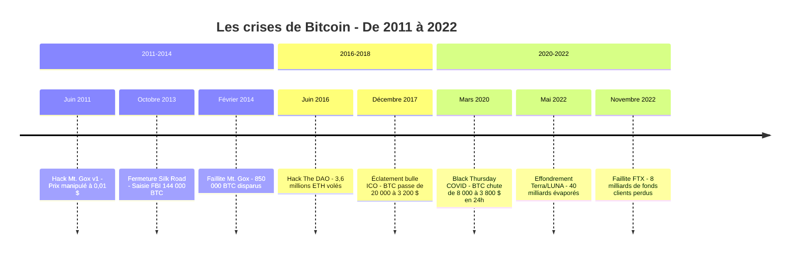

Bitcoin a traversé au moins sept crises qui auraient pu le tuer. Aucune n'y est parvenue. Chaque effondrement a provoqué des faillites en cascade, des pertes de milliards de dollars et un exode massif d'investisseurs. Chaque fois, le protocole a continué de fonctionner, bloc après bloc, et le prix a fini par dépasser son ancien sommet. Cette page retrace ces crises en détail : dates, noms, montants et conséquences concrètes.

## Mt. Gox (2011-2014) : la chute du plus grand exchange

Mt. Gox a été le premier exchange Bitcoin d'envergure mondiale. Créé en 2010 par Jed McCaleb, puis racheté par le Français Mark Karpelès en mars 2011, la plateforme traitait plus de 70% du volume mondial de transactions Bitcoin à son pic.

Les problèmes commencent le 19 juin 2011. Un pirate accède au compte d'un auditeur de Mt. Gox et crée des ordres de vente massifs, faisant chuter le prix du BTC à 0,01 $ sur la plateforme. Mt. Gox suspend les échanges pendant sept jours. La confiance est ébranlée, mais le site reprend ses opérations. Le prix de Bitcoin, qui avait atteint 31 $ en juin, s'effondre à 2 $ en novembre 2011.

Ce que personne ne sait encore : des bitcoins disparaissent des portefeuilles chauds de Mt. Gox depuis 2011. Un vol progressif, non détecté, siphonne les réserves de la plateforme pendant trois ans.

Le 7 février 2014, Mt. Gox suspend tous les retraits Bitcoin. Le 24 février, le site affiche une page blanche. Un document interne fuite : Mt. Gox est insolvable. 744 408 BTC appartenant aux clients et 100 000 BTC des fonds propres ont disparu. Au total, 850 000 BTC, soit environ 7% de tous les bitcoins en circulation à l'époque. Au cours de février 2014, cela représente environ 480 millions de dollars.

Le 28 février, Mt. Gox dépose le bilan au Japon. Mark Karpelès est arrêté en août 2015 au Japon pour manipulation de données financières. Il sera condamné en 2019 à une peine de prison avec sursis.

> [!CAUTION]
> Sur les 850 000 BTC disparus de Mt. Gox, environ 200 000 ont été retrouvés dans un ancien portefeuille. Les remboursements aux créanciers n'ont commencé qu'en juillet 2024, dix ans après la faillite. Les créanciers qui ont patienté ont reçu des BTC valant 90 fois plus qu'au moment de la perte.

Six autres exchanges publient un communiqué conjoint pour se distancer de Mt. Gox. Bitcoin passe de 600 $ à moins de 200 $ en quelques mois. Le bear market qui suit dure presque deux ans.

## Silk Road (2011-2013) : Bitcoin associé au crime

Silk Road n'est pas une crise technique, mais une crise de réputation. Ce marché noir hébergé sur le dark web, lancé en février 2011 par Ross Ulbricht (alias "Dread Pirate Roberts"), utilise Bitcoin comme seul moyen de paiement. Drogues, faux documents, médicaments sans ordonnance : le site devient la vitrine de tout ce que les gouvernements reprochent aux cryptomonnaies.

En juin 2011, un article de Gawker attire l'attention du grand public sur Silk Road. Le sénateur américain Chuck Schumer demande publiquement la fermeture du site. Bitcoin gagne une réputation de "monnaie du crime" que les médias vont exploiter pendant des années.

Le 2 octobre 2013, le FBI arrête Ulbricht dans une bibliothèque publique de San Francisco. Les agents saisissent son ordinateur portable ouvert, connecté au panneau d'administration de Silk Road. Le FBI ferme le site et confisque environ 144 000 BTC.

Ulbricht est condamné à la prison à perpétuité sans possibilité de libération conditionnelle en mai 2015. Le prix du BTC chute brièvement après la fermeture de Silk Road, mais se rétablit vite. En réalité, le marché avait déjà intégré le risque. Et les données montreront plus tard que les transactions liées à des activités illicites représentaient moins de 1% du volume total de Bitcoin dès 2014.

> [!NOTE]
> Les BTC saisis par le FBI lors de la fermeture de Silk Road ont été vendus aux enchères par le U.S. Marshals Service en 2014-2015. Le capital-risqueur Tim Draper a remporté la quasi-totalité d'un lot de 30 000 BTC. À l'époque, il les a payés environ 19 millions de dollars. Aujourd'hui, ils valent plus de 2 milliards.

## The DAO hack (2016) : une crise Ethereum qui frappe tout le marché

En juin 2016, la plus grosse crise de l'écosystème crypto ne concerne pas directement Bitcoin, mais ses répercussions touchent tout le marché. The DAO (Decentralized Autonomous Organization) est un fonds d'investissement décentralisé construit sur Ethereum. Il lève 150 millions de dollars en ETH lors de la plus grande campagne de financement participatif de l'histoire à ce moment-là.

Le 17 juin 2016, un attaquant exploite une faille dans le smart contract de The DAO et siphonne 3,6 millions d'ETH, soit environ 50 millions de dollars. La communauté Ethereum se déchire. Faut-il annuler la transaction en modifiant la blockchain ? C'est la question qui divise le camp crypto.

Le 20 juillet 2016, Ethereum effectue un hard fork pour récupérer les fonds. La blockchain originale continue sous le nom d'Ethereum Classic (ETC). Cette décision crée un précédent : une blockchain peut être modifiée si la communauté le décide. Les maximalistes Bitcoin y voient la preuve que l'immutabilité d'Ethereum est un mythe.

Bitcoin n'est pas épargné. Le prix chute de 780 $ à 560 $ dans les semaines suivant le hack. La peur de failles similaires se propage à l'ensemble du marché crypto.

## Le bear market de 2018 : l'éclatement de la bulle ICO

Décembre 2017 reste gravé dans la mémoire collective crypto. Bitcoin touche 20 089 $ le 17 décembre. Les recherches Google pour "buy bitcoin" explosent. Coinbase devient l'application la plus téléchargée aux États-Unis. Tout le monde veut sa part du gâteau.

Puis le marché se retourne. Janvier 2018, Bitcoin perd 30% en deux semaines. Février, il passe sous les 7 000 $. Le rebond de mars est un piège : le prix replonge en avril, puis en mai. Chaque rebond est suivi d'un nouveau creux.

La cause profonde : la bulle des ICO. En 2017, des centaines de projets ont levé des milliards via des tokens créés sur Ethereum. La grande majorité n'avait aucun produit, aucun revenu, aucune équipe crédible. Quand le marché se retourne, ces projets vendent massivement leurs ETH et BTC pour couvrir leurs dépenses. La pression vendeuse est constante.

Bitconnect, un schéma de Ponzi déguisé en plateforme de prêt crypto, s'effondre en janvier 2018. Les investisseurs perdent environ 2,5 milliards de dollars. OneCoin, un autre Ponzi, sera démantelé plus tard. Sa fondatrice Ruja Ignatova, surnommée la "Cryptoqueen", disparaît en 2017 et reste introuvable à ce jour.

En novembre 2018, la "guerre des hash" entre Bitcoin Cash ABC et Bitcoin Cash SV provoque une chute supplémentaire. Bitcoin passe sous les 4 000 $. En décembre, il touche 3 200 $. Depuis le sommet de décembre 2017, la perte atteint 84%.

> [!WARNING]
> Le bear market de 2018 a duré environ 12 mois et a éliminé plus de 90% des projets ICO. Sur les 1 500+ tokens créés en 2017-2018, moins de 50 existent encore aujourd'hui. La sélection naturelle du marché est brutale.

L'hiver crypto ne prend fin qu'en avril 2019, quand Bitcoin repasse au-dessus des 5 000 $. Le bear market aura duré 15 mois complets.

## Black Thursday - mars 2020 : Bitcoin face au COVID

Le 12 mars 2020, la pandémie de COVID-19 déclenche un effondrement simultané de tous les marchés mondiaux. Bitcoin n'est pas épargné. En 24 heures, le prix chute de 7 900 $ à 3 800 $, soit une baisse de plus de 50%. C'est le "Black Thursday" crypto.

La panique est totale. Les appels de marge se multiplient. BitMEX, la plateforme de dérivés la plus utilisée à l'époque, liquide pour plus d'un milliard de dollars de positions longues en une seule journée. Les volumes battent des records. Certains exchanges connaissent des pannes techniques sous la charge.

La particularité de cette crise : elle n'est pas spécifique au marché crypto. Le S&P 500 perd 12% en une seule séance (le 16 mars). L'or chute de 12% en une semaine. Tout est vendu pour du cash. Bitcoin se comporte comme un actif à risque, pas comme une valeur refuge.

Mais la récupération est rapide. Les banques centrales, la Fed en tête, inondent les marchés de liquidités. Les taux d'intérêt tombent à zéro. Les gouvernements lancent des plans de relance de plusieurs milliers de milliards. Dans ce contexte d'impression monétaire massive, Bitcoin commence à attirer l'attention des investisseurs institutionnels comme couverture contre l'inflation. En décembre 2020, le prix dépasse les 20 000 $ pour la première fois depuis 2017.

## Terra/LUNA (mai 2022) : 40 milliards partis en fumée

L'effondrement de Terra est probablement la crise la plus spectaculaire de l'histoire crypto par la vitesse de destruction de valeur. Le stablecoin algorithmique UST et son token associé LUNA formaient un écosystème de plus de 40 milliards de dollars de capitalisation en avril 2022.

Le mécanisme : UST était supposé rester ancré à 1 $ via un système d'arbitrage avec LUNA. Quand UST perd son ancrage, les détenteurs vendent. Pour chaque UST brûlé, du LUNA est créé. Plus UST chute, plus LUNA est dilué. La spirale devient incontrôlable.

Le 7 mai 2022, UST commence à perdre son peg. Le 9 mai, il tombe à 0,69 $. Le 10 mai, Do Kwon, le fondateur de Terra, déploie des milliards de réserves en Bitcoin pour tenter de défendre l'ancrage. La Luna Foundation Guard vend environ 80 000 BTC sur le marché ouvert. Cette vente contribue directement à la chute du prix de Bitcoin.

Le 12 mai, UST ne vaut plus que 0,17 $. LUNA, qui se négociait à 80 $ en avril, tombe à une fraction de centime. En cinq jours, plus de 40 milliards de dollars de capitalisation ont disparu. Des milliers de personnes perdent leurs économies. Des cas de suicides sont rapportés en Corée du Sud.

Bitcoin passe de 40 000 $ à 26 000 $ pendant l'effondrement de Terra. L'onde de choc se propage : Celsius Network, un prêteur crypto qui gérait 12 milliards de dollars de dépôts, suspend les retraits le 12 juin. Three Arrows Capital (3AC), un hedge fund crypto qui gérait 10 milliards, fait faillite fin juin. Voyager Digital et BlockFi suivent.

Do Kwon est arrêté au Monténégro en mars 2023 avec un faux passeport. Il est extradé vers les États-Unis en décembre 2024.

## FTX (novembre 2022) : la plus grande fraude crypto

Si Terra/LUNA est la chute la plus rapide, FTX est la fraude la plus spectaculaire. Deuxième plateforme d'échange mondiale par le volume, valorisée à 32 milliards de dollars en janvier 2022, FTX s'effondre en moins de 72 heures.

Le 2 novembre 2022, CoinDesk publie un article révélant que le bilan d'Alameda Research, le fonds de trading de Sam Bankman-Fried (aussi fondateur de FTX), repose en grande partie sur du FTT, le token émis par FTX. Alameda détient 5,82 milliards de dollars en FTT sur un total de 14,6 milliards d'actifs. Un château de cartes.

Le 6 novembre, Changpeng Zhao (CZ), le PDG de Binance, annonce sur Twitter qu'il va vendre les 529 millions de dollars de FTT détenus par Binance. La panique commence. Les retraits sur FTX atteignent 6 milliards de dollars en 72 heures.

Le 8 novembre, Binance annonce un accord préliminaire pour racheter FTX. Le 9 novembre, Binance se retire après avoir examiné les comptes. Le 11 novembre, FTX dépose le bilan. Sam Bankman-Fried démissionne. John J. Ray III, le liquidateur qui avait géré la faillite d'Enron, déclare n'avoir "jamais vu un tel fiasco" de gouvernance d'entreprise.

Le constat : 8 milliards de dollars de fonds clients ont été transférés à Alameda Research pour couvrir ses pertes de trading. Aucune séparation des comptes. Aucun audit indépendant. Sam Bankman-Fried est arrêté aux Bahamas le 12 décembre 2022, extradé vers les États-Unis, jugé en octobre 2023 et condamné à 25 ans de prison en mars 2024.

> [!IMPORTANT]
> Après la chute de FTX, la SEC, la CFTC et le Département de la Justice américain ont lancé des dizaines de poursuites contre des acteurs crypto. Le scandale a accéléré les projets de réglementation dans le monde entier. En Europe, le règlement MiCA (Markets in Crypto-Assets) est entré en vigueur en 2024 en partie à cause de l'affaire FTX.

Bitcoin touche 15 500 $ en novembre 2022. C'est le point bas du cycle. La chute depuis le sommet de 69 000 $ de novembre 2021 atteint 78%.

## Le pattern de récupération : chaque crise renforce Bitcoin

Le tableau ci-dessous résume les grandes crises et la durée de récupération du prix :

| Crise | Date | Chute depuis le sommet | Prix au plus bas | Temps pour un nouveau ATH |
|-------|------|----------------------|-----------------|--------------------------|
| Hack Mt. Gox v1 | Juin 2011 | -94% | 2 $ | 22 mois |
| Faillite Mt. Gox | Fév. 2014 | -87% | 150 $ | 32 mois |
| Bulle ICO | Déc. 2017 - Déc. 2018 | -84% | 3 200 $ | 36 mois |
| Black Thursday COVID | Mars 2020 | -64% | 3 800 $ | 9 mois |
| Terra + FTX | Mai - Nov. 2022 | -78% | 15 500 $ | 24 mois |

Deux observations ressortent. D'abord, Bitcoin perd entre 64% et 94% de sa valeur à chaque crise. Les corrections de 80%+ sont la norme, pas l'exception. Les investisseurs qui entrent sur un sommet doivent accepter cette réalité.

Ensuite, le temps de récupération a tendance à se raccourcir. Le crash COVID de mars 2020 a été effacé en 9 mois. Le cycle 2022 a mis 24 mois pour revenir au sommet, contre 36 mois après le bear market de 2018. Le marché gagne en liquidité et en maturité à chaque cycle.

## Ce que les crises ont changé dans l'écosystème

Chaque désastre a produit des améliorations concrètes.

Après Mt. Gox, les exchanges ont adopté des systèmes de preuve de réserves (proof of reserves), le stockage à froid (cold storage) pour la majorité des fonds, et des audits indépendants. Les régulateurs japonais ont créé un cadre réglementaire strict pour les plateformes de change.

Après Silk Road, l'industrie a investi massivement dans les outils d'analyse blockchain (Chainalysis, Elliptic). Les autorités disposent aujourd'hui de moyens de traçabilité plus performants sur Bitcoin que sur le système bancaire traditionnel.

Après le bear market de 2018, les projets qui ont survécu avaient des modèles économiques viables. L'ère des ICO sans produit est révolue. Les levées de fonds crypto exigent désormais des preuves de traction réelle.

Après Terra/LUNA, les stablecoins algorithmiques sans collatéral ont perdu toute crédibilité. Les régulateurs du monde entier ont accéléré leurs travaux sur la réglementation des stablecoins. L'USDC et l'USDT ont renforcé leurs rapports de réserves.

Après FTX, le mouvement "not your keys, not your coins" a repris de la vigueur. Les ventes de hardware wallets (Ledger, Trezor) ont bondi de 300% dans les semaines suivant la faillite. La séparation des fonds clients est devenue un sujet de conformité réglementaire central.

> [!TIP]
> La leçon la plus constante de seize ans de crises Bitcoin : le protocole n'a jamais été en cause. Chaque effondrement vient d'acteurs centralisés (exchanges, fonds, stablecoins) construits autour de Bitcoin. La blockchain elle-même tourne sans interruption depuis le 3 janvier 2009.

Le point commun de toutes ces crises : elles éliminent la confiance aveugle et forcent l'écosystème à devenir plus robuste. Après chaque crise, il y a moins de contreparties opaques, plus de transparence, et un prix plancher plus élevé que le cycle précédent. Mt. Gox a crashé Bitcoin à 150 $. FTX l'a crashé à 15 500 $. Le plancher monte, parce que l'adoption de fond progresse, crise après crise.
