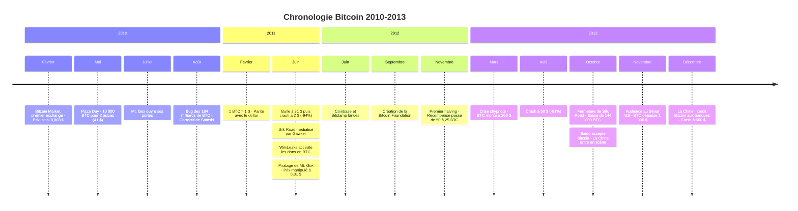

Début 2010, Bitcoin est un logiciel confidentiel utilisé par quelques dizaines de développeurs. Fin 2013, il vaut plus de 1 000 $ et fait la une des journaux du monde entier. Entre ces deux moments, quatre années d'expérimentations, de scandales et de premières fois ont transformé un projet de cryptographes en un phénomène mondial.

## 2010 : Bitcoin obtient un prix

Pendant les premiers mois de 2010, Bitcoin n'a pas de prix de marché. Quelques passionnés s'échangent des BTC sur le forum bitcointalk.org, créé par Satoshi Nakamoto fin 2009. Les transactions se négocient au cas par cas. Un utilisateur propose 10 000 BTC contre 50 $ en PayPal. Personne ne répond.

Le 6 février 2010, un développeur nommé dwdollar lance Bitcoin Market, la toute première plateforme d'échange. Les utilisateurs peuvent acheter et vendre des BTC contre des dollars via PayPal. Le prix initial tourne autour de 0,003 $ par bitcoin. Un dollar permet d'acheter plus de 300 BTC.

Les volumes restent dérisoires. Quelques dizaines de dollars par jour. Mais pour la première fois, Bitcoin possède un prix fixé par l'offre et la demande sur un marché ouvert. Ce prix, aussi bas soit-il, donne une valeur tangible aux bitcoins que les mineurs accumulent depuis un an.

### 22 mai 2010 : le Bitcoin Pizza Day

Le 22 mai 2010, un programmeur de Jacksonville, en Floride, publie un message sur bitcointalk.org. Laszlo Hanyecz propose de payer 10 000 BTC pour deux grandes pizzas. "I'll pay 10,000 bitcoins for a couple of pizzas... like maybe 2 large ones so I have some left over for the next day", écrit-il.

Un autre utilisateur du forum, Jeremy Sturdivant (alias "jercos"), accepte le deal. Il commande deux pizzas Papa John's pour environ 41 $, livrées chez Hanyecz. La transaction est confirmée sur la blockchain.

Au cours de janvier 2025, ces 10 000 BTC valent plus de 900 millions de dollars. C'est la transaction commerciale la plus célèbre de l'histoire crypto. Chaque 22 mai, la communauté Bitcoin célèbre le "Pizza Day" en référence à cet échange.

> [!NOTE]
> Laszlo Hanyecz ne regrette pas sa transaction. Dans une interview à CBS News en 2019, il explique que son achat a contribué à prouver que Bitcoin pouvait servir de moyen de paiement. "Quelqu'un devait bien le faire", dit-il. Il a d'ailleurs continué à acheter des pizzas en BTC pendant plusieurs semaines.

### Mt. Gox ouvre ses portes

En juillet 2010, un développeur français nommé Jed McCaleb lance mt.gox.com. Le nom vient de "Magic: The Gathering Online eXchange" - McCaleb avait initialement créé le site pour échanger des cartes du jeu. Il le reconvertit en plateforme d'échange Bitcoin.

Mt. Gox offre une interface plus simple que Bitcoin Market et accepte les virements bancaires. La plateforme attire rapidement des utilisateurs du monde entier. En quelques mois, elle traite plus de 70% du volume global d'échange Bitcoin.

En mars 2011, McCaleb vend Mt. Gox à Mark Karpelès, un développeur français installé à Tokyo. Cette décision va avoir des conséquences durables sur toute l'industrie crypto. Karpelès gère la plateforme avec une équipe réduite et des pratiques de sécurité fragiles.

Le 19 juin 2011, Mt. Gox subit son premier piratage. Un attaquant accède à un compte administrateur et manipule le prix du bitcoin, le faisant chuter artificiellement de 17 $ à 0,01 $. Il achète des milliers de BTC à ce prix avant que la plateforme ne suspende les échanges. Mt. Gox annule les transactions frauduleuses, mais sa réputation est écornée.

> [!WARNING]
> Le piratage de Mt. Gox en 2011 est un avertissement ignoré. La plateforme continue d'opérer pendant trois ans malgré des failles de sécurité connues. Quand elle s'effondre en 2014, 850 000 BTC disparaissent. Les utilisateurs qui ont ignoré les signaux d'alerte perdent tout.

### Le bug des 184 milliards de BTC

Le 15 août 2010, un bug critique est découvert dans le code Bitcoin. Une transaction génère 184 milliards de BTC à partir de rien. L'offre totale devait être limitée à 21 millions. En quelques heures, Satoshi Nakamoto publie un correctif (Bitcoin v0.3.10) qui annule la transaction et corrige la vulnérabilité.

Cet incident montre la fragilité du système à ses débuts. Un seul développeur, Satoshi, identifie le problème, écrit le correctif et le déploie en urgence. La communauté est trop petite pour une gouvernance décentralisée. Si un bug similaire avait été exploité sans détection rapide, Bitcoin aurait pu mourir à cet instant.

## 2011 : première bulle, premier crash

Le 9 février 2011, Bitcoin atteint la parité avec le dollar américain : 1 BTC = 1 $. Cette barre symbolique attire l'attention de médias spécialisés. Le Slashdot effect - un afflux massif de visiteurs après un article sur le site tech Slashdot - provoque des pics de trafic sur les forums Bitcoin.

En avril 2011, le magazine TIME publie l'un des premiers articles grand public sur Bitcoin. Forbes et Wired suivent. La couverture médiatique alimente la curiosité et l'achat. Le prix grimpe.

### Le rallye de juin et le crash qui suit

Du 1er au 8 juin 2011, Bitcoin passe de 10 $ à 31,91 $. C'est la première bulle spéculative. Les nouveaux venus achètent sans comprendre le protocole. Les forums s'enflamment. Certains prédisent que Bitcoin atteindra 100 $ avant la fin de l'année.

Le retournement est brutal. En trois jours, le prix chute de 31 $ à 10 $. Puis la descente continue pendant des mois. En novembre 2011, Bitcoin touche 2 $. Une chute de 94% depuis le sommet. Les médias déclarent Bitcoin mort pour la première fois. Ce ne sera pas la dernière.

### Silk Road et la réputation du dark web

En janvier 2011, Ross Ulbricht lance Silk Road sur le réseau Tor. Ce marché en ligne fonctionne exclusivement avec Bitcoin. On y trouve principalement des drogues, mais aussi des faux papiers et d'autres produits illégaux. L'anonymat de Bitcoin et l'accès via Tor créent un marché noir numérique d'une ampleur nouvelle.

En juin 2011, le site Gawker publie un article intitulé "The Underground Website Where You Can Buy Any Drug Imaginable". L'article décrit Silk Road et explique comment utiliser Bitcoin pour acheter de la drogue en ligne. Le trafic sur Silk Road explose. Le prix de Bitcoin aussi, en partie grâce à cette demande.

Le sénateur américain Chuck Schumer tient une conférence de presse pour réclamer la fermeture de Silk Road. C'est la première fois qu'un élu américain de premier plan mentionne Bitcoin. L'association entre Bitcoin et activités illégales s'installe dans l'opinion publique. Elle va persister pendant des années.

> [!IMPORTANT]
> Silk Road a paradoxalement aidé Bitcoin à se développer. Le marché noir a créé une demande réelle et constante pour les BTC, prouvant que la cryptomonnaie fonctionnait comme moyen d'échange. Mais cette association au trafic de drogue a aussi ralenti l'adoption par le grand public et les institutions financières.

### WikiLeaks adopte Bitcoin

Le 14 juin 2011, WikiLeaks annonce sur Twitter qu'il accepte les dons en bitcoins. L'organisation de Julian Assange est alors sous blocus financier : Visa, Mastercard et PayPal ont tous bloqué les paiements vers WikiLeaks sous pression du gouvernement américain.

Bitcoin offre une solution de contournement. Aucune banque, aucun processeur de paiement ne peut bloquer une transaction Bitcoin. Ce cas d'usage concret - résister à la censure financière - donne à Bitcoin une légitimité nouvelle auprès des défenseurs des libertés civiques.

Satoshi Nakamoto, encore actif sur le forum à ce moment-là, réagit négativement. Dans l'un de ses derniers messages publics, il écrit que WikiLeaks attire une attention prématurée sur Bitcoin, à un stade où le réseau est encore fragile. Quelques semaines plus tard, Satoshi disparaît définitivement.

## 2012 : consolidation et premier halving

Après le crash de 2011, Bitcoin entre dans une phase de reconstruction. Le prix oscille entre 4 $ et 13 $ pendant la plus grande partie de l'année. Le volume d'échange reste faible. Les médias se désintéressent.

Mais le développement technique accélère. Gavin Andresen, à qui Satoshi a confié la maintenance du code, coordonne les améliorations. Le protocole BIP (Bitcoin Improvement Proposal) est formalisé. Les mises à jour suivent un processus de revue par les pairs.

La communauté grandit. La Bitcoin Foundation est créée en septembre 2012 pour promouvoir l'adoption. Parmi ses membres fondateurs : Gavin Andresen, Charlie Shrem (fondateur de l'exchange BitInstant) et Roger Ver (surnommé "Bitcoin Jesus" pour son prosélytisme).

De nouvelles plateformes d'échange apparaissent. Coinbase est fondée en juin 2012 par Brian Armstrong et Fred Ehrsam. Bitstamp ouvre la même année en Slovénie. Ces plateformes offrent des interfaces plus professionnelles et des mesures de sécurité supérieures à Mt. Gox.

### Le premier halving : 28 novembre 2012

Le 28 novembre 2012, au bloc 210 000, la récompense de minage passe de 50 BTC à 25 BTC par bloc. C'est le premier halving de l'histoire de Bitcoin. L'événement a lieu exactement comme Satoshi l'a programmé dans le code original.

Le jour du halving, Bitcoin se négocie autour de 12 $. La communauté surveille l'événement avec curiosité. Personne ne sait encore quel sera l'impact sur le prix. Le concept de "cycle de halving" - une hausse du prix suivant chaque réduction de la récompense - n'existe pas encore.

Mais la logique économique est simple. L'offre quotidienne de nouveaux BTC est divisée par deux (de 7 200 BTC à 3 600 BTC par jour). Si la demande reste stable ou augmente, le prix doit monter. C'est exactement ce qui va se passer dans les mois suivants.

> [!TIP]
> Le premier halving de 2012 a initié un pattern qui se répète depuis. Dans les 12 à 18 mois après chaque halving (2012, 2016, 2020, 2024), Bitcoin a connu des hausses significatives. Ce cycle de quatre ans reste l'un des indicateurs les plus suivis par les investisseurs en cryptomonnaie.

## 2013 : l'année de toutes les premières

L'année 2013 marque un tournant pour Bitcoin. Le prix démarre à 13 $ en janvier. Il terminera l'année au-dessus de 700 $, après avoir brièvement dépassé 1 000 $. C'est la première année où Bitcoin attire une attention mondiale soutenue.

### La crise chypriote : Bitcoin comme refuge

En mars 2013, Chypre traverse une crise bancaire. L'Union européenne impose un plan de sauvetage qui prévoit une taxe directe sur les dépôts bancaires. Les Chypriotes risquent de perdre jusqu'à 47,5% de leurs économies au-delà de 100 000 euros.

La nouvelle provoque un afflux vers Bitcoin. Le prix passe de 40 $ à 266 $ en quelques semaines. Pour la première fois, Bitcoin est perçu comme une valeur refuge face aux décisions arbitraires des gouvernements et des banques centrales. La thèse du "hedge contre le risque souverain" est née.

### Le premier crash à 266 $ et la récupération

Le 10 avril 2013, Bitcoin atteint 266 $. Mt. Gox, qui traite la grande majorité du volume, ne supporte pas l'afflux d'ordres. La plateforme sature. Les ordres de vente s'accumulent. En quelques heures, le prix s'effondre à 50 $.

Ce crash de 81% refroidit les ardeurs. Le prix met plusieurs mois à se stabiliser autour de 100-120 $. Les médias reprennent leur refrain : Bitcoin est une bulle, une arnaque, un mirage technologique.

Mais la dynamique du halving continue son travail en arrière-plan. L'offre réduite, combinée à une demande croissante grâce à la couverture médiatique, pousse le prix vers le haut. À l'automne 2013, Bitcoin repart en flèche.

### La Chine entre en scène

En octobre 2013, Baidu (le Google chinois) annonce qu'il accepte Bitcoin pour certains services. BTC China devient la première plateforme d'échange au monde en volume, dépassant Mt. Gox. Les investisseurs chinois affluent vers Bitcoin.

La demande chinoise fait exploser le prix. Bitcoin passe de 150 $ début octobre à 1 000 $ le 27 novembre. Ce rallye est alimenté par des spéculateurs chinois qui voient en Bitcoin un moyen de contourner les contrôles de capitaux imposés par le gouvernement.

### 18 novembre 2013 : l'audience au Sénat américain

Le 18 novembre 2013, le Comité sénatorial américain sur la sécurité intérieure tient une audience sur les monnaies virtuelles. Les témoignages sont étonnamment positifs. La directrice adjointe du FinCEN (Financial Crimes Enforcement Network) déclare que les monnaies virtuelles sont "une innovation technologique légitime". Le directeur du FBI reconnaît que Bitcoin a des "usages légitimes".

Le même jour, Bitcoin franchit les 700 $ pour la première fois. En une semaine, il dépasse 1 000 $. L'audience sénatoriale envoie un signal clair : le gouvernement américain ne va pas interdire Bitcoin. Cette légitimation institutionnelle déclenche une vague d'achats.

### Fermeture de Silk Road

Le 1er octobre 2013, le FBI arrête Ross Ulbricht dans une bibliothèque publique de San Francisco. Il est identifié comme "Dread Pirate Roberts", le créateur et administrateur de Silk Road. Les agents saisissent environ 144 000 BTC, valorisés à l'époque à 28,5 millions de dollars.

La fermeture de Silk Road fait chuter le prix brièvement, de 140 $ à 110 $. Mais la récupération est rapide. Le marché montre que la valeur de Bitcoin ne dépend pas du dark web. D'autres marchés noirs apparaissent (Silk Road 2.0, Agora), mais Bitcoin a dépassé le stade où un seul cas d'usage définit sa raison d'être.

Ulbricht est condamné à la prison à perpétuité en 2015, sans possibilité de libération conditionnelle. Sa peine, jugée disproportionnée par de nombreux observateurs, alimente un débat sur la régulation des technologies décentralisées. En janvier 2025, le président Trump lui accorde une grâce présidentielle complète, mettant fin à onze ans de détention.

### Décembre 2013 : la Chine dit non

Le 5 décembre 2013, la Banque populaire de Chine interdit aux institutions financières de traiter des transactions Bitcoin. Les banques chinoises ne peuvent plus fournir de services aux plateformes d'échange. C'est le premier coup de massue réglementaire contre Bitcoin.

Le prix s'effondre de 1 150 $ à 600 $ en quelques jours. BTC China suspend temporairement les dépôts en yuan. La panique se propage sur tous les exchanges mondiaux. C'est le début d'un bear market qui va durer plus d'un an.

## Le bilan des premières années

```mermaid
graph LR
    A["0,003 $<br>Fév. 2010<br>Premier prix"] --> B["0,0025 $<br>Mai 2010<br>Pizza Day"]
    B --> C["1 $<br>Fév. 2011<br>Parité dollar"]
    C --> D["31 $<br>Juin 2011<br>Première bulle"]
    D --> E["2 $<br>Nov. 2011<br>Crash -94%"]
    E --> F["12 $<br>Nov. 2012<br>Premier halving"]
    F --> G["266 $<br>Avril 2013<br>Crise chypriote"]
    G --> H["50 $<br>Avril 2013<br>Crash Mt. Gox"]
    H --> I["1 150 $<br>Nov. 2013<br>Sénat US + Chine"]
    I --> J["600 $<br>Déc. 2013<br>Interdiction Chine"]

    style A fill:#141D30,stroke:#F59E0B,color:#F1F5F9
    style B fill:#141D30,stroke:#F59E0B,color:#F1F5F9
    style C fill:#141D30,stroke:#8B5CF6,color:#F1F5F9
    style D fill:#1A2540,stroke:#8B5CF6,color:#F1F5F9
    style E fill:#0E1525,stroke:#94A3B8,color:#94A3B8
    style F fill:#141D30,stroke:#F59E0B,color:#F1F5F9
    style G fill:#1A2540,stroke:#8B5CF6,color:#F1F5F9
    style H fill:#0E1525,stroke:#94A3B8,color:#94A3B8
    style I fill:#141D30,stroke:#F59E0B,color:#F1F5F9
    style J fill:#0E1525,stroke:#94A3B8,color:#94A3B8
```

Entre 2010 et 2013, Bitcoin passe d'une expérience de laboratoire à un actif financier suivi par les médias du monde entier. Quelques chiffres résument cette transformation :

| Indicateur | Début 2010 | Fin 2013 |
|---|---|---|
| Prix | 0 $ | ~750 $ |
| Plus haut atteint | - | 1 150 $ |
| Volume quotidien | quelques dollars | dizaines de millions $ |
| Exchanges actifs | 0 | plus de 50 |
| Hashrate | CPU domestiques | ASICs spécialisés |
| Couverture médiatique | aucune | mondiale |

Ces quatre années établissent les dynamiques qui vont gouverner Bitcoin pendant la décennie suivante. Les cycles bulle-crash se répètent. L'adoption progresse par vagues. Les crises externes (piratages, interdictions) renforcent le réseau à long terme. Et chaque bear market est suivi d'un nouveau sommet historique.

Les premières années posent aussi les bases de l'écosystème. Les exchanges, les wallets, le minage industriel, la couverture médiatique spécialisée, les tentatives de régulation : tout commence entre 2010 et 2013. Bitcoin entre en 2014 avec un prix en chute libre après la bulle, mais avec une infrastructure, une communauté et une notoriété qui lui permettront de survivre à la catastrophe Mt. Gox et à l'hiver crypto qui s'annonce.

> [!CAUTION]
> L'histoire de 2010-2013 rappelle que chaque cycle Bitcoin produit des gagnants et des perdants. Ceux qui ont acheté à 1 000 $ en novembre 2013 ont attendu trois ans avant de retrouver leur mise. Acheter un actif en pleine euphorie médiatique reste l'erreur la plus coûteuse en crypto.
