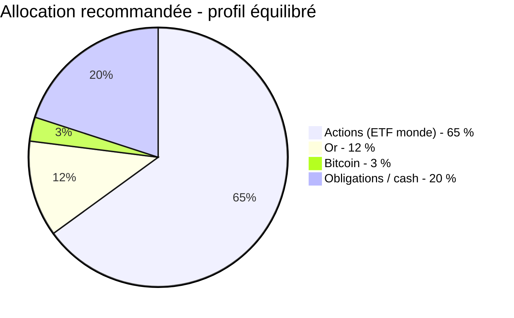

L'or a gagné 64 % en 2025. Le bitcoin a perdu 6 %. Un écart de 70 points en une seule année entre les deux actifs que le marché présente souvent comme des cousins. "Or numérique" - c'est l'étiquette que le bitcoin porte depuis 2013, quand les premiers investisseurs ont commencé à le comparer au métal jaune. Mais cette comparaison tient-elle encore après 2025 ?

La réponse courte : les deux actifs protègent contre des risques différents. L'or absorbe les chocs géopolitiques et monétaires. Le bitcoin offre un potentiel de croissance asymétrique dans un monde qui se numérise. Les mettre en compétition directe, c'est comparer un coffre-fort et un réacteur - les deux ont leur utilité, mais pas la même.

Cette page compare bitcoin et or sur les critères qui comptent : rendement historique, volatilité, comportement en crise, liquidité, et place dans un portefeuille. Avec des chiffres à jour de février 2026.

## Performance sur 10 ans : le bitcoin écrase l'or

Sur la période 2015-2025, le bitcoin affiche un rendement cumulé d'environ 26 000 %. L'or : +115 %. Le S&P 500 : +185 %. En rendement annualisé (CAGR), ça donne 68 % pour le bitcoin contre 8 % pour l'or.

| Métrique | Bitcoin | Or |
|---|---|---|
| CAGR 2015-2025 | ~68 % | ~8 % |
| Rendement cumulé | +26 000 % | +115 % |
| Volatilité annualisée | 60-80 % | 15-20 % |
| Drawdown max | -77 % (2022) | -33 % (2013) |
| Ratio de Sharpe (5 ans) | >2 | ~1 |

Le ratio de Sharpe du bitcoin dépasse 2 sur des périodes de 5 ans et plus. Ça signifie que malgré sa volatilité extrême, le rendement ajusté au risque reste supérieur à celui de l'or. Mais ce chiffre masque une réalité : les drawdowns de 50 à 80 % sont fréquents sur le bitcoin. L'or n'a jamais perdu plus d'un tiers de sa valeur sur un cycle moderne.

> [!IMPORTANT]
> Sur 10 ans, le bitcoin a multiplié sa valeur par 260 quand l'or l'a doublée. Mais le bitcoin a aussi connu quatre chutes de plus de 50 %. Ce rendement se paye cash en stress et en patience.

## 2025 : l'année où le "or numérique" a vacillé

L'année 2025 a mis la thèse du "or numérique" à rude épreuve. Voici les chiffres bruts :

- **Or** : +64 % sur l'année, record à 4 481 $ l'once en décembre
- **Bitcoin** : -6 % sur l'année, pic à 126 272 $ en octobre puis chute
- **Or en février 2026** : autour de 5 020-5 050 $/oz, encore +15 % depuis le 1er janvier
- **Bitcoin en février 2026** : environ 68 850 $, en baisse de 45 % depuis son sommet

Pour mettre ça en perspective : 10 000 $ placés en or début 2025 valent aujourd'hui environ 18 000 $. Les mêmes 10 000 $ en bitcoin valent 9 400 $.

Pourquoi une telle divergence ? Trois facteurs principaux.

### Les banques centrales achètent massivement de l'or

De 2022 à 2024, les banques centrales du monde entier ont acheté plus de 1 000 tonnes d'or par an. La Chine, la Pologne, l'Inde, le Kazakhstan, le Brésil - tous renforcent leurs réserves en or pour réduire leur dépendance au dollar américain. Les avoirs chinois en bons du Trésor américain ont baissé de 57 milliards de dollars en 2024.

En 2025, les banques centrales détenaient collectivement plus d'or que de bons du Trésor américain pour la première fois depuis des décennies. Le bitcoin ? Aucune banque centrale ne le détient en réserves officielles. Deutsche Bank estime que ça pourrait changer d'ici 2030, mais pour l'instant, l'écart de légitimité institutionnelle reste immense.

> [!NOTE]
> Les banques centrales achètent de l'or "quand c'est cher" - un comportement irrationnel pour un investisseur classique, mais logique pour un acteur qui constitue des réserves stratégiques sur plusieurs décennies.

### Le bitcoin se comporte comme un actif risqué

Pendant les épisodes de stress de 2025 - tensions commerciales, volatilité sur les taux - le bitcoin a chuté avec les actions technologiques. L'or a monté. C'est le schéma inverse de ce que le narratif "or numérique" promet.

L'explication est structurelle. Beaucoup de desks institutionnels regroupent le bitcoin avec le Nasdaq dans leurs portefeuilles d'actifs volatils. Quand le Nasdaq baisse, ils vendent aussi du bitcoin pour couvrir des appels de marge. Le résultat : une corrélation persistante entre bitcoin et tech. Et une décorrélation entre bitcoin et or quand ça compte le plus.

### L'or profite du contexte monétaire

Le déficit budgétaire américain a atteint 1 800 milliards de dollars en 2025. La dette nationale dépasse 38 500 milliards. Quand les investisseurs anticipent une création monétaire accrue pour gérer cette dette, ils achètent de l'or. Ça fonctionne depuis 5 000 ans. Le bitcoin devrait théoriquement profiter du même mécanisme - offre fixe contre impression monétaire - mais en pratique, le marché ne lui accorde pas encore ce statut de refuge.

## Corrélation : une relation instable

De novembre 2022 à novembre 2024, l'or et le bitcoin ont évolué dans une corrélation relativement étroite. L'or a gagné 67 %, le bitcoin 400 %. Les analystes pensaient que cette relation allait durer. Elle a cassé début 2025.

La corrélation mensuelle entre bitcoin et or tourne autour de 0,08 sur la durée - proche de zéro. Ça signifie que les deux actifs bougent de manière indépendante la plupart du temps. Mais cette moyenne cache des périodes de corrélation forte (2020-2021, quand les deux montaient grâce aux politiques monétaires expansionnistes) et des périodes de divergence nette (2025, quand l'or montait et le bitcoin baissait).

La corrélation bitcoin-Nasdaq, elle, reste bien plus stable. Le bitcoin continue de se comporter comme un actif technologique à forte volatilité, pas comme une réserve de valeur traditionnelle.

Pour un investisseur qui cherche à diversifier, c'est une bonne nouvelle sur le papier : détenir les deux réduit le risque global du portefeuille. Mais il faut accepter que le bitcoin n'est pas un substitut de l'or - c'est un complément avec un profil de risque radicalement différent.

## Cinq différences structurelles

Au-delà de la performance, bitcoin et or diffèrent sur des critères qui influencent directement votre choix d'investissement.

### 1. L'ancienneté et la confiance

L'or est utilisé comme réserve de valeur depuis l'Egypte antique, vers 4 000 avant J.-C. Le bitcoin existe depuis 2009. L'or a survécu à des empires, des guerres mondiales, des hyperinflations. Le bitcoin n'a jamais traversé de véritable crise systémique mondiale - la crise de 2020 était trop brève pour servir de test complet.

Cette différence compte pour les allocateurs institutionnels. Un fonds souverain peut placer 10 % de ses réserves en or sans expliquer pourquoi. Placer 1 % en bitcoin nécessite un rapport de 50 pages et l'approbation de trois comités.

### 2. La volatilité

La volatilité annualisée du bitcoin oscille entre 60 et 80 %. Celle de l'or : 15 à 20 %. En pratique, le bitcoin peut perdre 25 % en une semaine. L'or bouge rarement de plus de 3 % sur la même période.

Pour un professeur de Duke University spécialisé dans l'analyse de ces deux actifs, la différence de liquidité explique une partie de l'écart. Vendre 100 000 BTC (environ 11,8 milliards de dollars) représenterait 25 % du volume quotidien moyen du bitcoin et pourrait faire chuter le prix de 25 %. La même somme en or équivaudrait à 5 % du volume quotidien et causerait un impact de prix d'environ 2 %.

### 3. La portabilité et la divisibilité

Le bitcoin se transfère partout dans le monde en quelques minutes, sans intermédiaire, pour des frais de quelques dollars (ou centimes via le Lightning Network). Il se divise en 100 millions de satoshis. Vous pouvez envoyer l'équivalent de 10 centimes ou de 10 millions d'euros avec le même protocole.

L'or physique est lourd, coûteux à stocker, difficile à diviser et à transporter. L'or "papier" (ETF, certificats) résout ces problèmes mais ajoute un risque de contrepartie.

> [!TIP]
> Si vous vivez dans un pays instable avec des restrictions bancaires, le bitcoin offre quelque chose que l'or ne peut pas : un transfert transfrontalier instantané sans passer par une institution financière.

### 4. Le coût de détention

L'or physique coûte entre 0,5 et 1 % par an en stockage sécurisé. Les ETF or facturent environ 0,25 % de frais de gestion. Le bitcoin ne coûte rien à détenir si vous gérez vos propres clés. Sur un ETF Bitcoin, les frais tournent autour de 0,20 à 0,25 %, comparables à l'or papier.

### 5. Le cadre réglementaire

L'or est un actif reconnu par toutes les juridictions. Le bitcoin fait face à des réglementations qui varient d'un pays à l'autre et changent souvent. En Europe, MiCA impose un cadre depuis 2024. Aux Etats-Unis, la SEC a approuvé les ETF Bitcoin spot début 2024, mais l'environnement réglementaire reste flou sur d'autres aspects.

```mermaid
graph TD
    A["Bitcoin vs Or : comparaison structurelle"] --> B["Ancienneté"]
    A --> C["Volatilité"]
    A --> D["Portabilité"]
    A --> E["Divisibilité"]
    A --> F["Coût de détention"]
    A --> G["Cadre réglementaire"]

    B --> B1["Or : 5 000 ans d'historique"]
    B --> B2["Bitcoin : 17 ans d'existence"]

    C --> C1["Or : 15-20 % annualisée"]
    C --> C2["Bitcoin : 60-80 % annualisée"]

    D --> D1["Or : lourd, stockage coûteux"]
    D --> D2["Bitcoin : transfert mondial en minutes"]

    E --> E1["Or : lingots, pièces, difficilement fractionnable"]
    E --> E2["Bitcoin : divisible en 100 millions de satoshis"]

    F --> F1["Or : 0,25-1 % par an"]
    F --> F2["Bitcoin : 0 % en self-custody"]

    G --> G1["Or : reconnu partout"]
    G --> G2["Bitcoin : réglementation variable"]

    style A fill:#1A2540,stroke:#8B5CF6,color:#F1F5F9
    style B fill:#141D30,stroke:#F59E0B,color:#F1F5F9
    style C fill:#141D30,stroke:#F59E0B,color:#F1F5F9
    style D fill:#141D30,stroke:#F59E0B,color:#F1F5F9
    style E fill:#141D30,stroke:#F59E0B,color:#F1F5F9
    style F fill:#141D30,stroke:#F59E0B,color:#F1F5F9
    style G fill:#141D30,stroke:#F59E0B,color:#F1F5F9
    style B1 fill:#141D30,stroke:#8B5CF6,color:#F1F5F9
    style B2 fill:#141D30,stroke:#8B5CF6,color:#F1F5F9
    style C1 fill:#141D30,stroke:#8B5CF6,color:#F1F5F9
    style C2 fill:#141D30,stroke:#8B5CF6,color:#F1F5F9
    style D1 fill:#141D30,stroke:#8B5CF6,color:#F1F5F9
    style D2 fill:#141D30,stroke:#8B5CF6,color:#F1F5F9
    style E1 fill:#0E1525,stroke:#94A3B8,color:#94A3B8
    style E2 fill:#0E1525,stroke:#94A3B8,color:#94A3B8
    style F1 fill:#0E1525,stroke:#94A3B8,color:#94A3B8
    style F2 fill:#0E1525,stroke:#94A3B8,color:#94A3B8
    style G1 fill:#0E1525,stroke:#94A3B8,color:#94A3B8
    style G2 fill:#0E1525,stroke:#94A3B8,color:#94A3B8
```

## Le narratif "or numérique" est-il mort ?

Non. Mais il doit évoluer.

Le bitcoin partage avec l'or deux propriétés : la rareté (21 millions d'unités vs un stock fini d'or) et l'indépendance vis-à-vis des banques centrales. Sur le long terme, ces deux propriétés soutiennent la thèse d'une réserve de valeur.

Ce que 2025 a montré, c'est que le marché ne traite pas encore le bitcoin comme il traite l'or dans les périodes de stress. Le bitcoin se comporte davantage comme un actif à forte croissance et haute volatilité - une sorte d'action tech décentralisée. L'or, lui, est l'assurance : il performe quand tout le reste souffre.

Deutsche Bank projette que le bitcoin pourrait rejoindre l'or sur les bilans des banques centrales d'ici 2030. Si ça se produit, la thèse "or numérique" reprendra de la vigueur. Mais d'ici là, le bitcoin reste dans une zone intermédiaire : trop volatile pour être un refuge pur, trop décorrélé des actions pour être un simple actif risqué.

> [!WARNING]
> Ne construisez pas votre portefeuille autour du narratif "or numérique". Traitez le bitcoin pour ce qu'il est aujourd'hui - un actif de croissance volatile - et l'or pour ce qu'il a toujours été - une assurance contre le chaos.

## Bitcoin et or dans un portefeuille : comment les combiner

Plutôt que de choisir entre bitcoin et or, la question plus utile est : quelle proportion de chaque actif optimise votre portefeuille ?

### L'approche "ancre + moteur"

L'or joue le rôle d'ancre : il stabilise le portefeuille pendant les crises, amortit les baisses, et protège le pouvoir d'achat sur le long terme. Le bitcoin joue le rôle de moteur : il ajoute du rendement asymétrique, avec la possibilité de gains très élevés, au prix d'une volatilité importante.

Une allocation type pour un profil équilibré :

| Actif | Allocation | Rôle |
|---|---|---|
| Actions (ETF monde) | 60-70 % | Croissance long terme |
| Or | 10-15 % | Protection, stabilité |
| Bitcoin | 2-5 % | Croissance asymétrique |
| Obligations / cash | 15-25 % | Liquidité, sécurité |

### Le rééquilibrage : la clé de la combinaison

Quand le bitcoin monte de 100 % en un an, sa part dans le portefeuille double. Quand il chute de 50 %, elle se divise par deux. Le rééquilibrage périodique - vendre ce qui a trop monté, acheter ce qui a trop baissé - capture mécaniquement les cycles de chacun.

Avec un bitcoin à 68 000 $ et un or à 5 000 $ en février 2026, le ratio or/bitcoin a cassé à la hausse pour la première fois depuis 2022. Pour ceux qui rééquilibrent, c'est un signal : le bitcoin est devenu relativement moins cher par rapport à l'or. Ça ne veut pas dire qu'il va remonter demain, mais la dynamique de rééquilibrage favorise un renforcement de la position bitcoin à ces niveaux.

### Ce que disent les institutions

Cathie Wood (ARK Invest) et BlackRock maintiennent des prévisions de prix au-dessus de 150 000 $ pour le bitcoin. L'or pourrait consolider après une année 2025 spectaculaire. Les deux actifs restent des couvertures complémentaires contre l'inflation et le risque géopolitique, selon Deutsche Bank, grâce à leur rareté et leur faible corrélation aux autres classes d'actifs.

## À qui convient chaque actif

Votre choix dépend de votre profil, de votre horizon et de votre tolérance au risque.

**L'or convient mieux si vous :**
- Cherchez de la stabilité avant tout
- Voulez protéger votre patrimoine contre l'inflation et les crises
- Avez un horizon de 5 à 20 ans sans besoin de rendement élevé
- Préférez un actif reconnu par toutes les institutions et juridictions

**Le bitcoin convient mieux si vous :**
- Acceptez des baisses de 50 % ou plus sans paniquer
- Croyez dans la numérisation progressive de la finance
- Avez un horizon de 5 ans minimum et un capital que vous pouvez immobiliser
- Voulez une exposition à un actif décorrélé des marchés traditionnels sur le long terme

**Les deux ensemble** : c'est l'option qui fait le plus de sens pour la plupart des investisseurs. L'or stabilise. Le bitcoin dynamise. Le rééquilibrage périodique capture la volatilité au lieu de la subir.

> [!CAUTION]
> N'allouez jamais au bitcoin un montant dont la perte vous empêche de dormir. L'or a survécu à 5 000 ans de crises. Le bitcoin n'a que 17 ans d'historique et zéro garantie de suivre le même chemin.

## Ce qui pourrait changer la donne

Quelques événements à surveiller qui pourraient redistribuer les cartes entre bitcoin et or :

- **Adoption par une banque centrale** : si un État intègre le bitcoin dans ses réserves officielles, le narratif "or numérique" serait renforcé sur-le-champ. El Salvador l'a fait en 2021, mais c'est une économie trop petite pour faire bouger les lignes.
- **Baisse prolongée de l'or** : si l'or corrige après son année 2025 record, les capitaux pourraient pivoter vers le bitcoin comme alternative de diversification.
- **Régulation favorable aux crypto** : un cadre réglementaire clair et stable dans les principales juridictions rendrait le bitcoin plus attractif pour les allocateurs institutionnels.
- **Nouvelle crise systémique** : un véritable test "or numérique" pour le bitcoin serait une récession mondiale où le bitcoin monterait pendant que les actions chutent. Ça ne s'est pas encore produit.

Le duel bitcoin-or n'est pas près de se résoudre. Et c'est probablement le signe qu'il ne faut pas choisir un camp, mais allouer intelligemment entre les deux.
