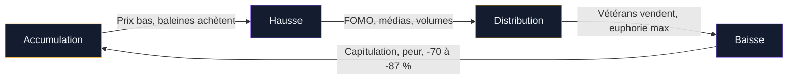
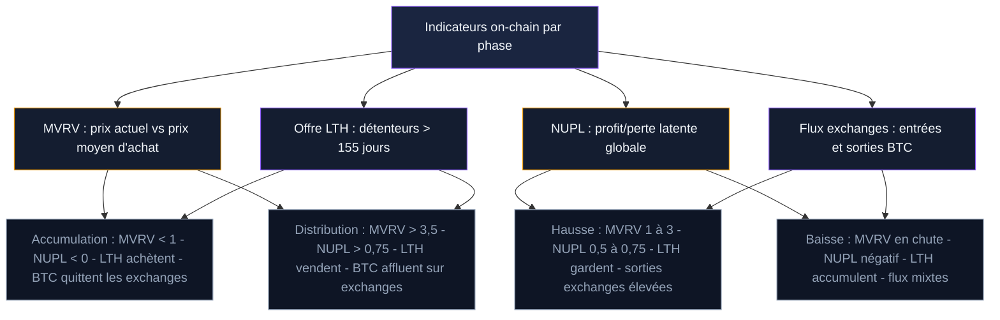

Bitcoin ne monte pas en ligne droite. Depuis 2010, son prix suit des cycles de quatre phases qui se répètent avec une régularité frappante. Chaque cycle dure environ quatre ans - un timing lié au halving, mais pas seulement. La psychologie collective, la liquidité mondiale, les événements macro et l'adoption par de nouveaux acteurs jouent un rôle tout aussi important.

Comprendre ces cycles, c'est comprendre quand le marché accumule en silence, quand il s'emballe, quand les gros vendeurs prennent leurs profits, et quand la panique s'installe. Pas pour prédire le prix au jour le jour, mais pour garder la tête froide quand tout le monde la perd.

## Les quatre phases d'un cycle Bitcoin

Chaque cycle suit un schéma en quatre temps. Les noms varient selon les sources, mais la dynamique reste la même.

### Phase 1 : l'accumulation

Le marché vient de traverser une longue baisse. Le prix stagne pendant des mois, parfois plus d'un an. Les médias ne parlent plus de Bitcoin. Les volumes d'échange sont faibles. L'indice Fear & Greed reste coincé sous 25 - zone de peur.

C'est la phase où les investisseurs expérimentés achètent. Les baleines (portefeuilles détenant plus de 1 000 BTC) augmentent leurs positions. Les mineurs qui ont survécu au bear market continuent de miner et de stocker. Le grand public, lui, a tourné la page.

Historiquement, cette phase dure 12 à 15 mois. Elle se produit souvent dans les 6 à 12 mois qui précèdent un halving. Le prix oscille dans une fourchette étroite, avec des variations inférieures à 20 %. C'est la zone la plus ennuyeuse du cycle - et la plus rentable pour ceux qui achètent.

> [!TIP]
> Les meilleures opportunités d'achat se trouvent dans la phase d'accumulation, quand personne n'en parle. Si vous lisez un article sur les "cycles Bitcoin" dans un journal grand public, cette phase est probablement déjà terminée.

### Phase 2 : la hausse (bull market)

Le prix commence à grimper. D'abord lentement, presque sans bruit. Puis les médias reprennent le sujet, de nouveaux investisseurs arrivent, et le mouvement s'accélère. Les volumes explosent. Le Fear & Greed passe au-dessus de 60, puis 80.

Cette phase se caractérise par des hausses paraboliques entrecoupées de corrections brutales de 20 à 30 %. Ces corrections effraient les débutants mais font partie du mouvement normal. En 2017, Bitcoin a corrigé de 30 % à six reprises avant d'atteindre son sommet à 20 000 dollars.

La hausse dure en moyenne 12 à 18 mois. Le prix peut être multiplié par 3, 5, 10 ou plus selon la maturité du marché. Plus le marché grossit, plus les multiplicateurs diminuent.

### Phase 3 : la distribution

Le prix atteint un sommet. Les investisseurs de la première heure et les baleines commencent à vendre. Le prix ne monte plus aussi vite, il forme un plateau. Les volumes restent élevés, mais la direction change. Les acheteurs sont des retardataires attirés par les gros titres. Les vendeurs sont les vétérans qui prennent leurs profits.

Cette phase est la plus trompeuse. Le prix peut rester proche de son sommet pendant plusieurs semaines, donnant l'impression que la hausse va reprendre. Les réseaux sociaux débordent d'optimisme. Les prédictions de prix délirants se multiplient ("Bitcoin à 1 million"). L'euphorie masque les signaux de retournement.

La distribution dure de 2 à 6 semaines en moyenne. C'est la fenêtre la plus courte du cycle, et la plus difficile à identifier en temps réel.

### Phase 4 : la baisse (bear market)

Le prix lâche. La première chute de 20 à 30 % est souvent perçue comme "une correction normale". Puis vient une deuxième baisse, une troisième. Le prix perd 50 %, 60 %, parfois 80 % depuis son sommet. Les médias parlent de la "mort de Bitcoin" - c'est arrivé plus de 400 fois depuis 2010.

Le bear market dure 12 à 18 mois. Il se termine quand les vendeurs sont épuisés et que le prix ne descend plus malgré les mauvaises nouvelles. On appelle ça la capitulation : le moment où les derniers investisseurs résilients vendent à perte. C'est aussi le signal que la phase d'accumulation commence.

> [!WARNING]
> Un bear market peut durer bien plus longtemps que prévu. Entre novembre 2021 et novembre 2022, Bitcoin a perdu 77 % de sa valeur. Les investisseurs qui pensaient que "ça allait remonter vite" ont attendu 14 mois avant de revoir une tendance haussière claire.

## Historique des cycles Bitcoin

Bitcoin a traversé quatre grands cycles depuis sa création. Chacun a suivi le même schéma, avec des durées et des amplitudes différentes.

### Cycle 1 : 2011-2013

Premier vrai cycle identifiable. Bitcoin passe de 2 dollars (été 2011) à 1 150 dollars (novembre 2013). La hausse est alimentée par la curiosité des premiers adopteurs, l'émergence de Mt. Gox comme plateforme dominante, et la crise bancaire chypriote de mars 2013 qui met le bitcoin sous les projecteurs comme alternative aux banques.

La correction est violente : -87 % entre le sommet de novembre 2013 et le creux de janvier 2015 (autour de 150 dollars). La phase d'accumulation dure ensuite toute l'année 2015.

### Cycle 2 : 2015-2017

Bitcoin repart de 200 dollars début 2015 et atteint 20 000 dollars le 17 décembre 2017. La hausse est portée par l'explosion des ICO (Initial Coin Offerings), l'arrivée du grand public via Coinbase, et une couverture médiatique massive.

La phase de distribution est brève : environ trois semaines en décembre 2017. La chute qui suit emmène le prix à 3 200 dollars fin 2018, soit une baisse de -84 %. L'année 2019 est une longue phase d'accumulation.

### Cycle 3 : 2019-2021

La montée débute au printemps 2019, subit un choc brutal en mars 2020 (crash COVID, bitcoin à 3 800 dollars), puis repart de plus belle. Le sommet arrive le 10 novembre 2021 à 69 000 dollars. Ce cycle est marqué par l'entrée de MicroStrategy, Tesla et PayPal. L'adoption institutionnelle change la nature du marché.

Le bear market de 2022 est aggravé par l'effondrement de Terra/LUNA en mai et la faillite de FTX en novembre. Bitcoin touche 15 500 dollars le 21 novembre 2022 : -77 % depuis le sommet.

### Cycle 4 : 2023-2026 (en cours)

L'accumulation commence début 2023. Le halving d'avril 2024 et le lancement des ETF Bitcoin spot en janvier 2024 alimentent la hausse. Bitcoin atteint 125 000 dollars en septembre 2025, un sommet historique. La correction qui suit ramène le prix sous 70 000 dollars début 2026.

Ce cycle est différent des précédents sur un point : la demande institutionnelle via les ETF crée un flux d'achat continu qui n'existait pas avant. Les ETF américains ont absorbé plus de 500 000 BTC en moins de deux ans.

## Pourquoi les cycles durent quatre ans

Le halving est souvent cité comme la cause unique des cycles de quatre ans. En réalité, plusieurs mécanismes se combinent.

### Le halving : le choc d'offre

Tous les 210 000 blocs (environ quatre ans), la récompense des mineurs est divisée par deux. Moins de nouveaux BTC entrent en circulation. Si la demande reste stable ou augmente, le prix monte. Ce mécanisme a fonctionné après chaque halving : 2012, 2016, 2020, 2024.

Mais le halving seul n'explique pas tout. La réduction d'offre en 2024 (de 900 BTC/jour à 450 BTC/jour) représente environ 30 millions de dollars par jour au cours actuel. Les ETF achètent parfois 200 millions de dollars de BTC par jour. Le halving crée un narratif et un point focal, mais la demande pèse plus que l'offre dans la dynamique de prix.

> [!NOTE]
> Le halving n'est pas le seul moteur des cycles. Les cycles de liquidité mondiale (expansion et contraction du crédit par les banques centrales) ont une corrélation au moins aussi forte avec les bull et bear markets crypto.

### Les cycles de liquidité mondiale

Les banques centrales alternent entre phases d'expansion (taux bas, injection de liquidité) et de contraction (taux hauts, resserrement). Bitcoin est très sensible à ces mouvements. La hausse de 2020-2021 coïncide avec des injections massives de liquidité post-COVID. Le bear market de 2022 correspond au resserrement monétaire le plus agressif depuis 40 ans.

Cette corrélation n'est pas parfaite, mais elle aide à comprendre pourquoi les cycles crypto ressemblent souvent aux cycles du Nasdaq et des actifs risqués en général.

### La psychologie humaine

Les cycles se répètent parce que la psychologie des foules se répète. L'avidité pendant les hausses, la peur pendant les baisses, le FOMO quand ça monte, la capitulation quand ça descend. Ces émotions créent des boucles de rétroaction : plus le prix monte, plus les gens achètent (ce qui fait monter le prix), jusqu'à ce que les acheteurs s'épuisent. Le même mécanisme fonctionne à la baisse.

## Indicateurs pour identifier la phase du cycle

Aucun indicateur ne fonctionne seul. Mais en croisant plusieurs signaux, on peut estimer dans quelle phase se trouve le marché.

### Le ratio MVRV (Market Value to Realized Value)

Ce ratio compare le prix actuel du bitcoin à son prix moyen d'acquisition (le prix auquel chaque BTC a été acheté pour la dernière fois). Un MVRV supérieur à 3,5 signale un sommet de cycle historique. Sous 1, c'est une zone d'accumulation. En février 2026, le MVRV est autour de 2,5 - zone neutre.

### Le NUPL (Net Unrealized Profit/Loss)

Le NUPL mesure le profit ou la perte latente de tous les détenteurs de BTC. Au-dessus de 0,75, le marché est en euphorie - les sommets sont proches. Sous 0, c'est la capitulation - les creux sont proches. Entre 0,5 et 0,6, le marché est en hausse mature sans surchauffe.

### L'offre des détenteurs long terme

Les "Long-Term Holders" (LTH) sont les adresses qui détiennent du BTC depuis plus de 155 jours. Quand ces détenteurs commencent à vendre en masse, c'est un signal de distribution. Quand ils accumulent, c'est un signal d'accumulation. Ce métrique est disponible sur Glassnode et CryptoQuant.

### Les flux sur les exchanges

Quand du BTC afflue en masse vers les plateformes d'échange, ça signale une intention de vendre. Quand du BTC quitte les exchanges vers des portefeuilles privés, ça signale une accumulation. Depuis fin 2024, les réserves de BTC sur les exchanges ont atteint leurs plus bas niveaux en 5 ans - un signal haussier à long terme.

> [!IMPORTANT]
> Aucun indicateur ne prédit l'avenir. Les meilleurs outils on-chain sont des thermomètres, pas des boules de cristal. Ils mesurent l'état actuel du marché, pas sa direction future.

## Le cycle de 4 ans est-il encore valide ?

La question divise les analystes. Trois arguments s'affrontent.

### "Le cycle de 4 ans est mort"

Avec l'arrivée des ETF et des institutions, le marché Bitcoin ne fonctionne plus comme un marché de niche dominé par le retail. Les flux institutionnels lissent les cycles. La demande structurelle des ETF (qui achètent que le prix monte ou baisse) réduit l'amplitude des bear markets. Le bitcoin pourrait suivre un schéma plus proche des marchés traditionnels : des tendances longues avec des corrections de 20 à 30 % au lieu de crashs de 80 %.

### "Le cycle évolue mais persiste"

Les quatre derniers cycles ont tous suivi le même schéma de base, malgré des contextes très différents. Le halving continue de réduire l'offre. La psychologie humaine ne change pas. Mais les rendements diminuent à chaque cycle (de +9 000 % à +700 % à +200 %), et les bear markets deviennent moins profonds (-87 %, -84 %, -77 %). Le cycle s'aplatit progressivement.

### "C'est trop tôt pour conclure"

Quatre cycles, c'est un échantillon minuscule en statistique. Tirer des conclusions définitives sur la base de 15 ans de données reste hasardeux. Le prochain cycle (2027-2030) sera le vrai test : si le pattern se répète une cinquième fois, la théorie sera renforcée. S'il casse, il faudra revoir le modèle.

La réalité est probablement un mélange des trois. Le cycle de 4 ans comme on l'a connu - avec des hausses de 1 000 % et des chutes de 80 % - est terminé. Mais une structure cyclique liée aux halvings, à la liquidité mondiale et à la psychologie collective persistera, avec des amplitudes réduites.

## Comment adapter sa stratégie à chaque phase

Identifier la phase du cycle ne sert à rien si vous ne savez pas quoi faire de cette information.

### En phase d'accumulation : acheter

C'est la période où le DCA (achats réguliers) est le plus efficace. Le prix est bas, le sentiment est négatif, et chaque achat vous positionne pour la hausse à venir. Les investisseurs qui ont accumulé pendant les bear markets de 2015, 2018 et 2022 ont obtenu les meilleurs rendements du cycle suivant.

Le piège : attendre "le fond" pour commencer. Personne ne sait quand le prix touche son point le plus bas. Mieux vaut acheter régulièrement pendant toute la phase d'accumulation que d'essayer de timer le creux exact.

### En phase de hausse : tenir et planifier sa sortie

Le plus dur n'est pas d'acheter pendant les baisses. C'est de ne pas vendre trop tôt pendant les hausses. En 2021, beaucoup d'investisseurs ont vendu à 40 000 dollars, ratant la montée à 69 000 dollars. Définissez vos paliers de prise de profit avant la hausse, quand vous êtes calme.

Un plan simple : vendre 10 à 20 % de votre position tous les doublements de prix. Par exemple : premier palier à 100 000 $, deuxième à 200 000 $. Vous sécurisez des gains tout en gardant une exposition.

### En phase de distribution : prendre des profits

Les signes à surveiller : le MVRV dépasse 3, le Fear & Greed reste au-dessus de 80 pendant plusieurs semaines, les médias grand public titrent sur le bitcoin quotidiennement, et votre coiffeur vous demande s'il doit acheter du crypto. Ce sont des signaux de surchauffe, pas de certitude.

Prendre des profits ne veut pas dire tout vendre. Vendre 30 à 50 % de votre position au sommet estimé, garder le reste pour le cas où la hausse continue.

### En phase de baisse : encaisser et ne pas racheter trop vite

La tentation pendant un bear market est de "moyenner à la baisse" trop agressivement. Le prix baisse de 30 %, vous rachetez. Il baisse encore de 30 %, vous rachetez. Il baisse encore. Votre capital est épuisé avant le vrai creux.

Mieux vaut garder du cash pendant les premiers mois de la baisse et recommencer un DCA progressif quand les indicateurs signalent l'accumulation (MVRV sous 1,5, Fear & Greed sous 25, LTH en accumulation nette).

## Les catalyseurs externes qui cassent les cycles

Les cycles ne se déroulent pas dans le vide. Des événements externes peuvent accélérer, retarder ou amplifier chaque phase.

### Les décisions des banques centrales

Le resserrement monétaire de la Fed en 2022 (hausse des taux de 0 % à 5,5 % en 18 mois) a transformé une correction normale en bear market prolongé. À l'inverse, les baisses de taux créent un environnement favorable aux actifs risqués. Le pivot de la Fed en 2024 a coïncidé avec le début du bull market actuel.

### Les faillites dans l'écosystème

Terra/LUNA (mai 2022), Three Arrows Capital (juin 2022), FTX (novembre 2022) : ces événements ont prolongé et approfondi le bear market de 2022. Chaque faillite a provoqué une vague de liquidations en chaîne, entraînant le prix vers de nouveaux creux.

### L'adoption réglementaire et institutionnelle

L'approbation des ETF Bitcoin spot en janvier 2024 a agi comme un catalyseur de hausse. L'arrivée de BlackRock et Fidelity a modifié la perception du risque pour les investisseurs traditionnels. Un événement équivalent dans le futur (réserve stratégique nationale, adoption par une grande banque centrale) pourrait déclencher une hausse hors du schéma cyclique habituel.

> [!CAUTION]
> Les catalyseurs externes sont imprévisibles par nature. Aucun modèle cyclique n'aurait pu anticiper l'effondrement de FTX ou l'approbation soudaine des ETF. Gardez toujours une marge de sécurité dans votre stratégie.

## Ce qu'il faut retenir des cycles

Les cycles Bitcoin ne sont pas une formule magique. Ce sont des schémas historiques répétés quatre fois, avec des contextes chaque fois différents. La structure - accumulation, hausse, distribution, baisse - reste stable. Les durées, les amplitudes et les catalyseurs varient.

Pour l'investisseur, les cycles offrent un cadre de réflexion, pas un calendrier précis. Le DCA reste la stratégie la plus robuste pour traverser les cycles sans se brûler : vous achetez régulièrement, vous ne cherchez pas à timer les phases, et vous laissez le temps travailler.

Les quatre leçons des 15 dernières années : le prix finit toujours par dépasser son précédent sommet (jusqu'ici). Les bear markets durent moins longtemps que les bull markets. Les rendements diminuent à chaque cycle mais restent supérieurs à la plupart des actifs traditionnels. La patience bat le timing, cycle après cycle.
