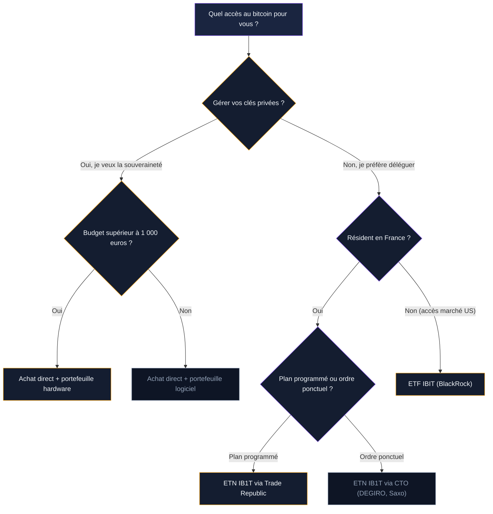

Acheter du bitcoin sans ouvrir de compte sur un exchange crypto, sans gérer de clé privée, sans installer de portefeuille : c'est ce que permettent les ETF et ETN Bitcoin. Depuis janvier 2024 aux Etats-Unis, et mars 2025 en Europe avec l'arrivée de BlackRock, ces produits cotés en bourse ont changé la donne. Plus de 56 milliards de dollars de flux nets ont afflué vers les ETF Bitcoin spot américains en moins de deux ans.

Mais un ETF Bitcoin n'est pas du bitcoin. Vous détenez des parts d'un fonds, pas des BTC. Les frais grignotent votre rendement. Et vous confiez la garde de vos actifs à un tiers. Ce guide couvre le fonctionnement, les produits disponibles, les frais, les risques, et la question centrale - ETF ou achat direct ?

## Qu'est-ce qu'un ETF Bitcoin spot

Un ETF (Exchange-Traded Fund) Bitcoin spot est un fonds qui achète et détient du bitcoin réel. Le gestionnaire - BlackRock, Fidelity, ARK Invest - acquiert des BTC et les stocke chez un dépositaire (Coinbase Custody dans la plupart des cas). Il émet des parts que les investisseurs achètent et vendent en bourse, comme une action.

Le prix de chaque part suit le cours du bitcoin. Si le BTC monte de 5 %, votre part ETF monte d'environ 5 %, moins les frais de gestion. La mécanique est celle d'un ETF or physique : le fonds détient l'actif sous-jacent, et la valeur des parts reflète son prix.

### Spot vs futures : la différence qui compte

Avant janvier 2024, seuls des ETF Bitcoin à terme (futures) existaient aux Etats-Unis. Ces fonds prenaient des positions sur des contrats à terme - des paris sur le prix futur du BTC. Le renouvellement de ces contrats coûtait cher (effet de "contango"), et la performance s'écartait du cours réel sur la durée.

Les ETF spot ont éliminé ce problème. Ils détiennent du bitcoin physique. Le tracking error reste minime, autour de 0,1 % par an pour les meilleurs fonds.

> [!TIP]
> Privilégiez toujours un ETF ou ETN "spot" (physique). Les produits à terme (futures) coûtent plus cher et s'écartent du cours réel du bitcoin sur le long terme.

## Les ETF Bitcoin spot aux Etats-Unis

La SEC (Securities and Exchange Commission) a approuvé les premiers ETF Bitcoin spot le 10 janvier 2024. Une dizaine de fonds ont été lancés dans les jours suivants. La concurrence a immédiatement fait baisser les frais.

### Les principaux fonds

| ETF | Ticker | Gestionnaire | Frais annuels | Encours (fév. 2026) |
|-----|--------|-------------|---------------|---------------------|
| iShares Bitcoin Trust | IBIT | BlackRock | 0,25 % | ~69 milliards $ |
| Fidelity Wise Origin Bitcoin | FBTC | Fidelity | 0,25 % | ~18 milliards $ |
| ARK 21Shares Bitcoin | ARKB | ARK / 21Shares | 0,21 % | ~4 milliards $ |
| Grayscale Bitcoin Mini Trust | BTC | Grayscale | 0,15 % | ~3 milliards $ |
| Franklin Bitcoin | EZBC | Franklin Templeton | 0,19 % | ~1 milliard $ |
| Grayscale Bitcoin Trust | GBTC | Grayscale | 1,50 % | ~16 milliards $ |

IBIT domine le marché. Avec près de 69 milliards de dollars d'actifs sous gestion, c'est le plus gros ETF Bitcoin au monde. Il offre aussi la meilleure liquidité : des volumes d'échange quotidiens qui dépassent régulièrement plusieurs milliards de dollars. Le 6 février 2026, IBIT a enregistré 10 milliards de dollars de volume en une seule journée.

FBTC de Fidelity arrive en deuxième position. Mêmes frais qu'IBIT (0,25 %), performance quasi identique. La différence se joue sur la liquidité et les volumes : IBIT gagne sur ce terrain.

### Performance depuis le lancement

Du lancement en janvier 2024 à novembre 2025, IBIT et FBTC ont affiché un rendement total d'environ 134 %. Un investissement de 10 000 dollars au lancement valait plus de 23 500 dollars fin 2025. Depuis, la correction du marché a ramené les performances en territoire négatif sur le début 2026 : environ -16 % depuis le 1er janvier 2026, en ligne avec la baisse du bitcoin lui-même.

> [!NOTE]
> Les ETF Bitcoin spot américains ne sont pas accessibles directement aux investisseurs européens résidant en France. La réglementation PRIIPs (Packaged Retail Investment and Insurance Products) bloque l'achat de fonds américains qui ne fournissent pas de document KID en français.

## Les ETN Bitcoin en Europe

En Europe, la réglementation UCITS interdit les ETF composés d'un seul actif. L'ESMA (Autorité européenne des marchés financiers) a réaffirmé cette position en juin 2025. Pas d'ETF Bitcoin spot en Europe, donc. A la place, les investisseurs européens ont accès à des ETN (Exchange-Traded Notes).

### ETN vs ETF : la différence de structure

Un ETN est un titre de dette émis par une institution financière. Il réplique la performance du bitcoin, mais il ne s'agit pas d'un fonds qui détient des BTC dans un compartiment séparé. Si l'émetteur de l'ETN fait faillite, vous devenez créancier - pas propriétaire des bitcoins sous-jacents.

En pratique, les grands ETN Bitcoin sont adossés physiquement : l'émetteur détient des BTC en réserve, stockés chez un dépositaire. La protection n'est pas aussi forte qu'un ETF américain (où les actifs du fonds sont légalement séparés), mais elle reste solide pour les émetteurs de qualité.

### Les principaux ETN Bitcoin en Europe

| ETN | Ticker | Emetteur | Frais annuels | Bourse |
|-----|--------|---------|---------------|--------|
| iShares Bitcoin ETP | IB1T | BlackRock | 0,25 % | Xetra, Euronext, SIX |
| 21Shares Bitcoin ETP | ABTC | 21Shares | 1,49 % | Xetra, SIX |
| CoinShares Physical Bitcoin | BITC | CoinShares | 0,35 % | Xetra, Euronext |
| WisdomTree Physical Bitcoin | BTCW | WisdomTree | 0,35 % | Xetra, Borsa Italiana |
| ETC Group Physical Bitcoin | BTCE | ETC Group | 2,00 % | Xetra |

L'arrivée de BlackRock en Europe en mars 2025 avec IB1T a secoué le marché. Les frais de 0,25 % (0,15 % pendant la période promotionnelle en 2025) sont très inférieurs aux concurrents historiques comme 21Shares (1,49 %) ou ETC Group (2 %). IB1T a déjà accumulé plus de 617 millions d'euros d'encours en moins d'un an.

Amundi, le plus gros gestionnaire d'actifs européen (2 300 milliards d'euros sous gestion), prépare le lancement de ses premiers ETN Bitcoin pour 2026. Son entrée devrait encore renforcer la concurrence et faire baisser les frais.

> [!IMPORTANT]
> Vérifiez si votre ETN est adossé physiquement (backed by real BTC) ou synthétique. Un ETN synthétique vous expose au risque de contrepartie de l'émetteur en plus du risque bitcoin.

## Où acheter un ETN Bitcoin en France

Les ETN Bitcoin européens sont accessibles via les courtiers en ligne classiques. Pas besoin d'ouvrir un compte sur un exchange crypto.

### Les courtiers compatibles

**Trade Republic** et **Scalable Capital** sont les plus adaptés : plans d'investissement programmés gratuits (0 euro de frais de courtage sur les achats récurrents), accès aux ETN sur Xetra, interfaces simples.

**DEGIRO** facture 1 euro par ordre, avec un catalogue large (Xetra, Euronext). Plus adapté aux ordres ponctuels qu'aux plans programmés.

**Boursorama** et **Saxo Banque** donnent accès aux ETN via un CTO. Les frais de courtage sont plus élevés (5 à 10 euros par ordre), mais l'intégration avec votre banque est complète.

### PEA : non éligible

Les ETN Bitcoin ne sont pas éligibles au PEA (Plan d'Epargne en Actions). Le PEA est réservé aux actions européennes et aux fonds composés à 75 % d'actions européennes. Pour investir dans un ETN Bitcoin, il faut passer par un compte-titres ordinaire (CTO). La fiscalité applicable est donc le PFU de 30 % sur les plus-values.

## Frais : ce que vous payez vraiment

Les frais d'un ETF ou ETN Bitcoin se décomposent en plusieurs couches. Les comprendre, c'est éviter de perdre des centaines d'euros sur le long terme.

### Frais de gestion (TER)

C'est le pourcentage annuel prélevé par le gestionnaire du fonds. Il couvre la garde des bitcoins, l'administration du fonds, et la marge du gestionnaire. Sur les ETF américains, le TER va de 0,15 % (Grayscale Mini Trust) à 1,50 % (GBTC). En Europe, de 0,25 % (IB1T) à 2,00 % (BTCE).

### Frais de courtage

C'est ce que votre courtier prélève à chaque achat ou vente. Sur Trade Republic ou Scalable Capital, c'est 0 euro pour les plans programmés et 1 euro par ordre ponctuel. Sur DEGIRO, 1 euro par ordre. Sur les banques traditionnelles, 5 à 15 euros par ordre.

### Spread bid-ask

C'est la différence entre le prix d'achat et le prix de vente à un instant donné. Plus le fonds est liquide, plus le spread est serré. IBIT a un spread moyen de 0,01 %. Un petit ETN européen avec peu de volume peut avoir un spread de 0,3 à 0,5 %. Sur une année, ça s'additionne.

### Simulation de coût sur 5 ans

Pour 10 000 euros investis sur 5 ans, voici l'impact des frais selon le produit :

| Produit | TER | Frais sur 5 ans | Capital après frais |
|---------|-----|-----------------|---------------------|
| IBIT (0,25 %) | 0,25 % | ~125 € | 9 875 € |
| IB1T (0,25 %) | 0,25 % | ~125 € | 9 875 € |
| 21Shares ABTC (1,49 %) | 1,49 % | ~722 € | 9 278 € |
| GBTC (1,50 %) | 1,50 % | ~727 € | 9 273 € |

L'écart entre un fonds à 0,25 % et un fonds à 1,50 % représente environ 600 euros sur 5 ans pour 10 000 euros investis. Et ces calculs sont faits sur un capital stable - si le bitcoin monte, l'écart en euros augmente proportionnellement.

> [!WARNING]
> GBTC de Grayscale facture 1,50 % par an - six fois plus qu'IBIT. Cet écart de frais est irrécupérable. Pour un investissement long terme, choisissez les fonds les moins chers.

## ETF Bitcoin vs achat direct : le vrai débat

La question n'est pas "est-ce que les ETF sont bien ?" mais "est-ce qu'ils sont mieux que l'achat direct pour votre situation ?". Les deux approches ont des avantages et des limites concrets.

### Quand l'ETF/ETN est le bon choix

**Vous ne voulez pas gérer la sécurité.** Seed phrase, portefeuille hardware, sauvegardes - une erreur et vos fonds sont perdus. Avec un ETF, le dépositaire s'en charge.

**Vous investissez via un CTO existant.** Ajouter un ETN Bitcoin à votre compte Trade Republic ou Scalable prend 2 minutes. Pas de nouveau compte, pas de KYC supplémentaire.

**Vous voulez une fiscalité simplifiée.** Votre courtier génère un IFU en fin d'année. Les plus-values sont pré-calculées. Plus simple que de gérer les exports CSV d'un exchange crypto.

**Vous êtes un investisseur institutionnel.** Fonds de pension, family offices et gestionnaires de patrimoine ne peuvent pas acheter du bitcoin en direct. Les ETF leur ouvrent la porte.

### Quand l'achat direct est préférable

**Vous voulez la souveraineté sur vos actifs.** "Not your keys, not your coins" : sans clé privée, les bitcoins ne vous appartiennent pas vraiment. Un ETF peut être gelé ou saisi. Vos BTC sur un portefeuille hardware, non.

**Vous voulez utiliser le bitcoin.** Payer en BTC, envoyer à quelqu'un, utiliser le Lightning Network - impossible avec un ETF.

**Vous visez le très long terme (10 ans+).** Sur 10 ans, un TER de 0,25 % coûte environ 2,5 % de votre capital. A l'achat direct, une fois les frais payés (0,1 à 1 %), il n'y a plus de frais récurrents.

**Vous ne faites pas confiance aux intermédiaires.** Mt. Gox, FTX, Celsius : l'histoire de la crypto est jalonnée de faillites. Les ETF américains sont bien protégés, mais le risque n'est jamais nul.

## Les risques spécifiques aux ETF Bitcoin

Les ETF simplifient l'investissement, mais ils introduisent des risques propres que l'achat direct n'a pas.

### Risque de contrepartie

En Europe, les ETN sont des titres de dette. Si l'émetteur fait faillite, vos parts peuvent perdre tout ou partie de leur valeur, même si le bitcoin sous-jacent existe toujours. Ce risque est faible pour les grands émetteurs (BlackRock, WisdomTree), mais il est réel pour les plus petits acteurs.

### Concentration du dépositaire

La quasi-totalité des ETF Bitcoin spot américains utilisent Coinbase Custody comme dépositaire. Si Coinbase subit une faille de sécurité ou des problèmes opérationnels, la majorité des ETF Bitcoin sont touchés en même temps.

### Impossibilité de retrait en BTC

Vous ne pouvez pas convertir vos parts d'ETF en bitcoins. Pour passer de l'ETF à la détention directe, vous devez vendre vos parts (déclenchant l'imposition), puis racheter du bitcoin sur un exchange. C'est un aller-retour coûteux en frais et en impôts.

### Tracking error en période de stress

Pendant les crises de liquidité ou les mouvements extrêmes, le prix de l'ETF peut s'écarter du cours du BTC pendant quelques heures. Ce risque est réduit pour IBIT ou FBTC, mais plus marqué pour les petits ETN européens.

### Risque réglementaire

Un changement de politique fiscale, une interdiction ou une restriction d'accès aux ETF crypto peut impacter votre investissement. En Europe, MiCA continue d'évoluer et pourrait modifier le cadre des ETN.

## Les flux institutionnels : ce que disent les chiffres

En 2024, les ETF Bitcoin spot américains ont attiré 35 milliards de dollars de flux nets. Fin 2024, l'ensemble des fonds détenait 1,12 million de BTC - 5,6 % de l'offre totale en circulation. C'était le lancement d'ETF le plus réussi de l'histoire financière américaine.

En 2025, les flux se sont maintenus autour de 22 milliards de dollars supplémentaires, portant le total cumulé à environ 57 milliards. L'encours total a dépassé 158 milliards de dollars en octobre 2025, avant de redescendre avec la correction du cours.

La demande institutionnelle est structurelle. Fonds de pension, family offices, conseillers financiers intègrent le bitcoin via ces produits. Mais les institutions vendent aussi : lors de la correction de janvier 2026, les ETF Bitcoin ont enregistré 269 millions de dollars de sorties nettes en une seule journée. Les flux amplifient les mouvements du marché dans les deux sens.

## FAQ - Questions fréquentes sur les ETF Bitcoin

**Peut-on acheter un ETF Bitcoin sur un PEA ?**
Non. Les ETN/ETP Bitcoin ne sont pas éligibles au PEA. Il faut utiliser un compte-titres ordinaire (CTO). La fiscalité applicable est le PFU de 30 % sur les plus-values.

**Un ETF Bitcoin est-il plus sûr que l'achat direct ?**
C'est différent. L'ETF élimine le risque de perte de clé privée, mais ajoute un risque de contrepartie et de dépôt. L'achat direct donne la souveraineté, mais impose de gérer la sécurité soi-même. Aucun des deux n'est "sûr" au sens absolu.

**Les ETF Bitcoin versent-ils des dividendes ?**
Non. Le bitcoin ne génère pas de rendement. Les ETF Bitcoin spot ne versent pas de dividendes. Votre seul gain provient de l'appréciation du cours du BTC.

**Quelle est la différence entre un ETF et un ETN Bitcoin ?**
L'ETF est un fonds réglementé avec des actifs légalement séparés. L'ETN est un titre de dette émis par une institution financière. En cas de faillite de l'émetteur, les détenteurs d'ETN sont des créanciers, pas des propriétaires des bitcoins sous-jacents. En Europe, seuls les ETN sont disponibles pour les investisseurs particuliers.

**Les frais de gestion sont-ils déduits automatiquement ?**
Oui. Le TER est prélevé quotidiennement sur la valeur nette du fonds (en fractions minuscules). Vous ne voyez pas de prélèvement sur votre compte - c'est intégré dans le prix de la part. Un TER de 0,25 % signifie que le fonds sous-performe le bitcoin de 0,25 % par an, toutes choses égales.

## Quel produit choisir selon votre profil

Le bon produit dépend de votre situation, pas d'une réponse universelle.

**Investisseur débutant en France** : ouvrez un CTO chez Trade Republic ou Scalable Capital. Achetez l'ETN IB1T en plan programmé mensuel. Frais de 0,25 %, zéro frais de courtage. C'est l'option la plus simple en Europe.

**Investisseur qui veut la souveraineté** : achetez du bitcoin sur un exchange (Kraken, Coinhouse), puis transférez sur un portefeuille hardware (Ledger, Trezor).

**Accès aux marchés US** : IBIT de BlackRock par défaut. FBTC de Fidelity en alternative équivalente.

**Gros capital (100 000 euros+)** : combinez ETN et achat direct. Une partie pour la simplicité, une partie pour la souveraineté.

> [!CAUTION]
> Ne mettez pas 100 % de votre exposition bitcoin dans un seul produit ou sur une seule plateforme. Répartissez entre au moins deux supports différents pour limiter le risque de contrepartie.

## Ce qui va changer dans les prochaines années

Le marché des ETF Bitcoin est encore jeune. Plusieurs évolutions sont en cours.

La révision des règles UCITS, sous l'impulsion de MiCA et de la pression concurrentielle américaine, pourrait ouvrir la voie à de vrais ETF Bitcoin spot en Europe. L'arrivée d'Amundi et d'autres gros gestionnaires en 2026 va intensifier la compétition sur les frais - on pourrait voir des TER descendre sous 0,15 % en Europe.

Depuis fin 2024, des options sur IBIT sont disponibles aux Etats-Unis. Fidelity propose déjà l'exposition Bitcoin dans ses plans 401(k). En Europe, des discussions sont en cours pour intégrer les ETN crypto dans les enveloppes d'épargne retraite.

Le paysage change vite. Commencez avec le meilleur produit du moment, et ajustez quand de meilleures options apparaissent.
