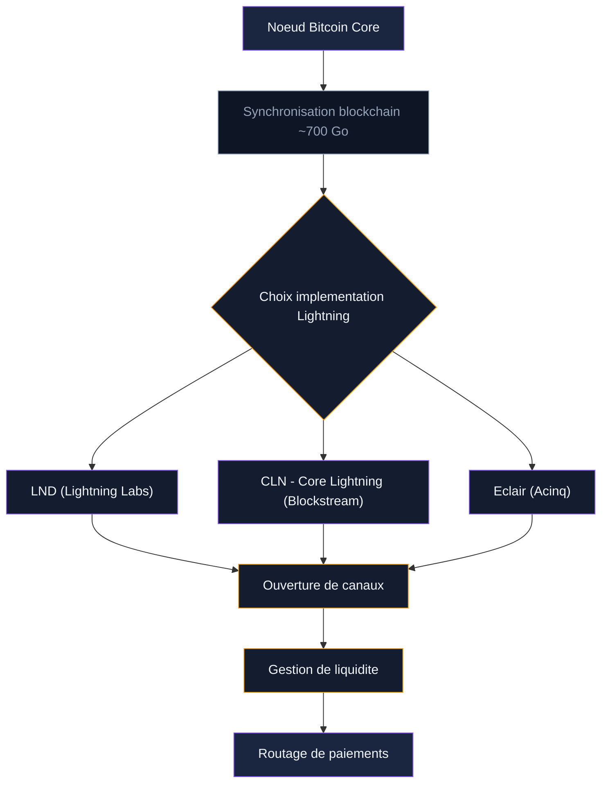
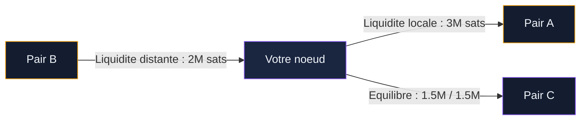

Opérer un noeud Lightning, c'est participer directement à l'infrastructure du réseau Bitcoin. Votre noeud route des paiements entre utilisateurs, ouvre des canaux avec d'autres noeuds et gagne des frais de routage sur chaque transaction qui passe par lui. Environ 14 900 noeuds publics assurent ce rôle en 2025, et chacun contribue à la fiabilité du réseau.

Ce guide couvre toute la chaîne : le matériel, le choix du logiciel Lightning, l'installation, la gestion des canaux et de la liquidité, et la réalité financière du routing. Si vous n'avez pas encore de wallet Lightning, commencez par notre [guide de configuration d'un wallet Lightning](/bitcoin/lightning-network-bitcoin/configurer-wallet-lightning) avant de vous lancer dans l'opération d'un noeud.

## Pourquoi opérer son propre noeud Lightning

Trois raisons motivent les opérateurs de noeuds.

**Souveraineté.** Votre noeud vérifie chaque transaction lui-même, sans dépendre d'un service tiers. Vous ne faites confiance à personne pour valider vos paiements. C'est la philosophie "don't trust, verify" appliquée au Lightning Network.

**Confidentialité.** Quand vous utilisez un wallet comme Phoenix ou Breez, vos paiements transitent par leur LSP (Lightning Service Provider). Ce LSP voit vos transactions. Avec votre propre noeud, vous contrôlez le routage et limitez les informations partagées avec des tiers.

**Revenus de routage.** Chaque paiement qui traverse l'un de vos canaux génère un frais de routage. Ce frais est configurable : vous fixez un taux de base (base fee) et un taux proportionnel (fee rate) pour chaque canal. Les revenus dépendent du volume de paiements routés et de la position de votre noeud dans le réseau.

> [!NOTE]
> Un noeud Lightning requiert un noeud Bitcoin complet (full node) actif en permanence. Prévoyez environ 700 Go d'espace disque pour la blockchain Bitcoin et une connexion internet stable.

## Le matériel pour un noeud Lightning

Un noeud Lightning tourne 24h/24. Le hardware doit être fiable, silencieux et économe en énergie. Deux approches existent.

### Solution clé en main

Plusieurs fabricants proposent des boîtiers prêts à l'emploi :

- **Umbrel** : logiciel gratuit à installer sur Raspberry Pi 4/5 ou mini-PC. Interface web intuitive, marketplace d'applications (LND, CLN, BTCPay Server, mempool). C'est la solution la plus populaire pour débuter.
- **Start9** : système d'exploitation pour noeuds Bitcoin et Lightning. Plus orienté vie privée qu'Umbrel, avec un système de packaging propre.
- **RaspiBlitz** : projet open source pour Raspberry Pi avec écran LCD. Documentation très détaillée, forte communauté.
- **MyNode** : alternative à Umbrel avec une version premium payante qui ajoute des fonctionnalités de monitoring.

Le budget pour un kit Raspberry Pi complet (carte, boîtier, alimentation, SSD 1 To) tourne autour de 250 a 350 euros. Un mini-PC type Intel NUC ou Beelink offre de meilleures performances pour 300 a 500 euros.

### Assemblage sur mesure

Pour un noeud de routage sérieux, un mini-PC avec 8 Go de RAM, un SSD NVMe de 1 To et un processeur Intel/AMD récent offre des performances largement suffisantes. La consommation électrique reste sous les 20 watts, soit environ 35 euros par an en électricité.

## Choisir son implémentation Lightning

Trois logiciels Lightning dominent le marché. Chacun a sa philosophie, ses forces et son écosystème.

### LND (Lightning Network Daemon)

Développé par Lightning Labs, LND est l'implémentation la plus utilisée. Environ 90 % des noeuds publics tournent sous LND. L'API est riche, la documentation abondante, et l'écosystème d'outils tiers est le plus large : Ride The Lightning, ThunderHub, Balance of Satoshis, LNDg.

LND est écrit en Go. L'installation se fait via les binaires officiels ou via un système comme Umbrel qui l'empaquette. Le wallet intégré gère les clés et les canaux. LND supporte les Taproot channels, les paiements multi-chemins (MPP) et le protocole Wumbo pour les gros canaux.

**Points forts** : communauté massive, outils tiers nombreux, updates régulières.
**Limites** : consommation mémoire plus élevée que CLN, certains choix d'architecture critiqués par les puristes.

### Core Lightning (CLN)

Développé par Blockstream, Core Lightning (anciennement c-lightning) est l'implémentation la plus modulaire. Le coeur est minimaliste : chaque fonctionnalité supplémentaire se greffe via un système de plugins. Vous pouvez écrire des plugins en Python, Go, Rust ou JavaScript.

CLN est le premier à avoir intégré BOLT12 (les factures réutilisables). Il consomme moins de ressources que LND et offre une base de données plus légère. Le logiciel est écrit en C, ce qui le rend rapide et économe.

**Points forts** : léger, modulaire, premier sur BOLT12, politique de routage flexible via plugins.
**Limites** : écosystème d'outils tiers plus réduit, interface de gestion moins polies.

### Eclair

Développé par Acinq (l'équipe derrière Phoenix Wallet), Eclair est l'implémentation écrite en Scala/Java. Elle est utilisée principalement par Acinq pour leurs propres noeuds de routage et par quelques opérateurs qui apprécient la stabilité du code.

Eclair a été la première implémentation à supporter le splicing (redimensionnement de canaux sans fermeture). Son architecture est orientée entreprise, avec une API REST propre et un modèle de données fiable.

**Points forts** : splicing natif, stabilité éprouvée, API REST claire.
**Limites** : communauté plus petite, nécessite la JVM (Java Virtual Machine), moins de documentation communautaire.

> [!TIP]
> Pour un premier noeud, LND avec Umbrel est le chemin le plus direct. L'interface graphique de ThunderHub ou Ride The Lightning simplifie la gestion au quotidien. Si vous êtes développeur et aimez la modularité, CLN avec ses plugins est un terrain de jeu plus ouvert.

## Installer un noeud Lightning pas a pas

Voici les grandes étapes pour un noeud LND sur Umbrel (la configuration la plus courante).

**1. Préparer le matériel.** Installez Umbrel sur un Raspberry Pi 5 ou un mini-PC. Branchez un SSD de 1 To minimum. Connectez le tout à votre routeur via un câble Ethernet (le Wi-Fi est déconseillé pour la stabilité).

**2. Synchroniser Bitcoin Core.** Umbrel installe Bitcoin Core automatiquement. La synchronisation initiale de la blockchain (IBD - Initial Block Download) prend entre 2 et 7 jours selon votre connexion et votre hardware. Pendant ce temps, le logiciel télécharge et vérifie les 700+ Go de la blockchain Bitcoin.

**3. Installer LND.** Une fois Bitcoin Core synchronisé, installez LND depuis la marketplace Umbrel. Le logiciel crée un wallet, génère votre phrase de récupération de 24 mots et se connecte automatiquement à Bitcoin Core.

**4. Sauvegarder vos données.** Notez votre phrase de récupération sur papier. Activez les backups automatiques des canaux (Static Channel Backups). Sans ces sauvegardes, une panne du disque signifie la perte de vos fonds.

**5. Installer un outil de gestion.** ThunderHub ou Ride The Lightning s'installent depuis la marketplace Umbrel. Ces interfaces web affichent l'état de vos canaux, votre solde, les paiements routés et vous permettent d'ouvrir/fermer des canaux en quelques clics.

> [!WARNING]
> La synchronisation initiale de Bitcoin Core peut prendre plusieurs jours. Ne coupez pas l'alimentation pendant ce processus. Un SSD est obligatoire - un disque dur classique (HDD) rendra le noeud inutilisable.

## Ouvrir et gérer des canaux

Un noeud sans canaux est un noeud inutile. L'ouverture de canaux est l'étape la plus stratégique de l'opération d'un noeud Lightning.

### Choisir ses pairs

La qualité de vos canaux dépend des noeuds avec lesquels vous les ouvrez. Voici les critères à évaluer :

- **Uptime** : un noeud qui tombe régulièrement en panne fermera vos canaux de force, ce qui vous coûte des frais on-chain.
- **Capacité de routage** : un noeud bien connecté offre plus de routes potentielles pour les paiements qui traversent le vôtre.
- **Politique de frais** : des frais trop élevés chez un pair rendent votre canal moins attractif pour le routage.
- **Complémentarité** : ouvrir des canaux vers des noeuds dans des zones géographiques ou des écosystèmes différents améliore votre position dans le graphe du réseau.

Des outils comme Amboss, 1ML et LNnodeInsight aident à identifier de bons pairs. Le site Terminal Web de Lightning Labs fournit un score de fiabilité pour chaque noeud public.

### Taille des canaux

La taille minimale d'un canal est de 20 000 satoshis, mais pour du routage, visez entre 2 et 10 millions de satoshis par canal (entre 0,02 et 0,1 BTC). Des canaux trop petits ne routent pas de paiements significatifs. Les canaux Wumbo permettent de dépasser l'ancienne limite de 0,1677 BTC.

Le nombre de canaux dépend de votre budget. Entre 5 et 15 canaux bien choisis suffisent pour commencer. Les gros noeuds de routage opèrent avec plusieurs centaines de canaux.

### Gestion de la liquidité

C'est le défi principal du routing. Chaque canal a deux côtés : votre liquidité locale (ce que vous pouvez envoyer) et la liquidité distante (ce que vous pouvez recevoir). Un canal entièrement de votre côté ne peut rien recevoir. Un canal entièrement de l'autre côté ne peut rien envoyer.

L'objectif est de garder vos canaux équilibrés, avec de la liquidité des deux côtés. Plusieurs techniques existent :

- **Circular rebalancing** : envoyer un paiement de votre noeud à vous-même via un chemin circulaire pour déplacer la liquidité d'un canal à un autre. L'outil Balance of Satoshis automatise cette opération.
- **Loop In / Loop Out** : services de Lightning Labs qui convertissent de la liquidité on-chain en liquidité Lightning (et inversement). Loop Out déplace des sats de vos canaux vers une adresse Bitcoin on-chain, libérant de la capacité entrante.
- **Magma / Pool** : marketplaces de liquidité où vous pouvez acheter ou vendre de la capacité de canal. Un autre opérateur ouvre un canal vers vous en échange d'un paiement.

> [!IMPORTANT]
> La liquidité entrante est le goulet d'étranglement des nouveaux noeuds. Quand vous ouvrez un canal, tous les fonds sont de votre côté. Pour recevoir des paiements ou router efficacement, vous devez acquérir de la liquidité distante via des swaps, des services comme Magma, ou en dépensant des sats via vos canaux.

## Configurer vos frais de routage

Vos frais de routage déterminent si les paiements empruntent vos canaux. Deux paramètres entrent en jeu :

- **Base fee** : frais fixes prélevés sur chaque paiement routé, exprimés en millisatoshis. La valeur par défaut dans LND est 1 000 msat (1 satoshi).
- **Fee rate** : frais proportionnels au montant routé, exprimés en parties par million (ppm). 100 ppm signifie 0,01 % du montant. 1 000 ppm = 0,1 %.

La stratégie de frais dépend de vos objectifs. Des frais bas attirent plus de volume mais rapportent moins par transaction. Des frais élevés rapportent plus par paiement mais font fuir le trafic vers des routes moins chères. La plupart des opérateurs débutent avec une base fee de 0 ou 1 sat et un fee rate entre 50 et 500 ppm, puis ajustent en fonction du volume observé.

Des outils comme **charge-lnd** automatisent l'ajustement des frais en fonction de l'équilibre de chaque canal. Un canal qui se vide rapidement d'un côté voit ses frais augmenter automatiquement de ce côté, ce qui incite le trafic à équilibrer le flux.

## Rentabilité du routing : les chiffres réels

Parlons argent. Le routing Lightning est-il rentable ?

Pour un noeud avec 0,5 BTC de capacité répartis sur 10-15 canaux bien connectés, les revenus de routage tournent entre 500 et 5 000 satoshis par jour en 2025. Au cours actuel, cela représente quelques centimes à quelques dizaines de centimes d'euro par jour. Les noeuds les plus performants du réseau, avec 5 à 20 BTC de capacité et des centaines de canaux, génèrent entre 50 000 et 200 000 satoshis par jour.

Le rendement annuel en BTC se situe généralement entre 1 % et 5 % du capital engagé, pour un noeud activement géré. C'est modeste comparé à la DeFi sur d'autres blockchains, mais ces revenus sont libellés en Bitcoin et ne dépendent d'aucun protocole tiers.

Les coûts à prendre en compte :

- **Frais on-chain** pour l'ouverture et la fermeture de canaux (variables selon la congestion du réseau)
- **Rebalancing** : les opérations de rééquilibrage coûtent des frais de routage
- **Hardware** : l'amortissement du matériel (250-500 euros)
- **Électricité** : environ 35 euros par an pour un mini-PC
- **Temps** : la gestion d'un noeud demande entre 30 minutes et 2 heures par semaine selon votre niveau d'automatisation

La plupart des opérateurs de noeuds ne le font pas pour le profit immédiat. L'accumulation de satoshis, l'apprentissage technique et la contribution au réseau sont les motivations principales.

## Monitoring et maintenance

Un noeud Lightning non surveillé est un noeud qui perd de l'argent. Les fermetures forcées, les canaux déséquilibrés et les pannes matérielles érodent votre capital si vous ne réagissez pas.

### Outils de monitoring

- **ThunderHub / Ride The Lightning** : interfaces web qui affichent l'état de vos canaux en temps réel.
- **LNDg** : dashboard spécialisé pour LND avec des graphiques de rentabilité, un historique de routage et des suggestions de rebalancing.
- **Balance of Satoshis (BOS)** : outil en ligne de commande puissant pour le rebalancing automatique, les rapports de performance et la gestion avancée des canaux.
- **Amboss** : plateforme web qui analyse votre noeud et le compare aux autres noeuds du réseau.

### Sauvegardes régulières

Les Static Channel Backups (SCB) de LND sauvegardent l'état de vos canaux. En cas de panne, ces backups permettent de fermer proprement vos canaux et de récupérer vos fonds. Umbrel automatise ces sauvegardes, mais vérifiez régulièrement qu'elles fonctionnent. Gardez une copie hors du noeud (clé USB, NAS, cloud chiffré).

### Mises a jour

Les implémentations Lightning publient des mises à jour régulières qui corrigent des bugs, améliorent les performances et ajoutent des fonctionnalités. Restez à jour, surtout pour les patchs de sécurité. Sur Umbrel, une notification apparaît quand une mise à jour est disponible. Lisez les notes de version avant de mettre à jour - certaines mises à jour nécessitent une migration de base de données.

## Erreurs courantes à éviter

**Ouvrir trop de petits canaux.** Dix canaux de 100 000 satoshis chacun routent moins qu'un seul canal de 5 millions. Les petits canaux se déséquilibrent vite et ne peuvent pas router de paiements significatifs.

**Ignorer la liquidité entrante.** Un noeud tout neuf avec 10 canaux sortants et 0 liquidité entrante ne routera rien. Dépensez via vos canaux, utilisez Loop Out, ou achetez de la liquidité entrante sur Magma.

**Ne pas sauvegarder.** Une panne de disque sans backup SCB peut entraîner la perte de tous vos fonds dans les canaux ouverts. La phrase de récupération seule ne suffit pas pour les canaux Lightning.

**Laisser le noeud hors ligne.** Si votre noeud reste hors ligne trop longtemps, vos pairs peuvent fermer vos canaux de force. Les timelock des transactions de fermeture durent entre 144 et 2 016 blocs (1 à 14 jours). Pendant ce délai, vos fonds sont bloqués et vous payez des frais on-chain.

> [!CAUTION]
> Ne stockez jamais plus de Bitcoin dans vos canaux Lightning que ce que vous êtes prêt à perdre. Les bugs logiciels, les pannes matérielles et les fermetures frauduleuses sont rares mais possibles. Commencez petit et augmentez progressivement votre capacité.

## Pour aller plus loin

Opérer un noeud Lightning est un engagement technique continu. Le réseau évolue vite : BOLT12, Taproot channels, splicing et Taproot Assets modifient la donne chaque année. Les opérateurs qui automatisent la gestion de leur liquidité et surveillent activement leurs canaux tirent le meilleur parti de leur infrastructure.

Pour compléter ce guide, consultez nos autres articles sur le Lightning Network :

- [Configurer un wallet Lightning](/bitcoin/lightning-network-bitcoin/configurer-wallet-lightning) pour commencer avec une solution plus simple
- [Payer en Bitcoin avec Lightning](/bitcoin/lightning-network-bitcoin/payer-lightning) pour comprendre les mécanismes de paiement côté utilisateur
