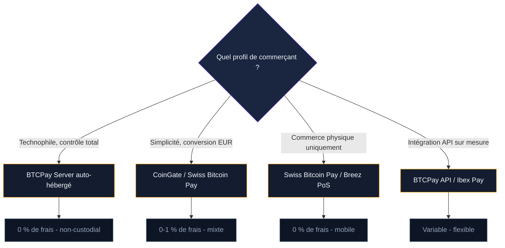

Accepter Bitcoin en boutique, ça ressemble encore à de la science-fiction pour beaucoup de commerçants. Les frais on-chain, la volatilité, la complexité technique : les objections ne manquent pas. Le Lightning Network change cette équation. Avec des frais inférieurs à un centime, un règlement en 2 secondes et des outils open source comme BTCPay Server, un commerçant peut recevoir du Bitcoin aussi simplement qu'un paiement par carte - sans intermédiaire bancaire et sans commission de 1,5 à 2,5 %.

Ce guide couvre l'intégration complète : du choix du processeur de paiement à la comptabilité, en passant par les avantages concrets face aux terminaux de paiement classiques.

## Pourquoi un commerçant devrait s'intéresser à Lightning

Le modèle de paiement par carte bancaire repose sur une chaîne d'intermédiaires. Le commerçant paie une commission à chaque transaction : entre 0,5 % et 2,5 % selon le type de carte, le réseau (Visa, Mastercard, Amex) et le terminal utilisé. Sur un chiffre d'affaires de 200 000 euros par an, ça représente entre 1 000 et 5 000 euros de commissions reversées aux processeurs de paiement.

Lightning supprime ces intermédiaires. Le paiement va directement du client au commerçant, sans passer par une banque ou un réseau de cartes. Les frais de routage Lightning sont de l'ordre de quelques satoshis - souvent moins de 0,01 euro par transaction, quel que soit le montant.

> [!TIP]
> Un commerçant qui traite 500 transactions par mois à 30 euros en moyenne économise entre 2 250 et 4 500 euros par an en passant de la CB à Lightning. Les frais tombent de 1,5-2,5 % à quasiment zéro.

Autres avantages concrets :

- **Règlement instantané.** Pas de délai de 2 à 5 jours ouvrables comme avec un terminal CB. Les fonds arrivent en 1 à 3 secondes sur le wallet du commerçant.
- **Pas de chargebacks.** Les paiements Lightning sont définitifs. Impossible pour un client de contester le paiement après coup auprès de sa banque. Pour les commerçants victimes de fraude aux chargebacks, c'est un soulagement direct.
- **Pas de montant minimum.** Vous pouvez accepter un paiement de 0,50 euro sans que les frais absorbent la marge. Les micropaiements deviennent viables.
- **Aucun contrat bancaire.** Pas de frais de location de terminal, pas d'engagement, pas de commission fixe mensuelle. Le commerçant installe un logiciel et commence à recevoir des paiements.

## BTCPay Server : la solution open source de référence

BTCPay Server est un processeur de paiement Bitcoin auto-hébergé et gratuit. Créé en 2017 par Nicolas Dorier, c'est un logiciel open source qui permet à n'importe quel commerçant de recevoir des paiements Bitcoin (on-chain et Lightning) sans dépendre d'un service tiers. Aucune inscription, aucun KYC, aucune commission prélevée par le logiciel.

### Comment ça fonctionne

BTCPay Server génère une page de paiement pour chaque commande. Le client scanne un QR code avec son wallet Lightning, le paiement arrive en quelques secondes, et la commande est marquée comme payée. Tout se passe entre le wallet du client et le noeud Lightning du commerçant.

### Installer BTCPay Server

Trois options d'hébergement existent selon votre profil technique.

**Option 1 : VPS auto-hébergé.** C'est l'approche recommandée. Vous louez un serveur (Lunanode, Hetzner, OVH) pour 10 à 20 euros par mois et installez BTCPay avec le script Docker officiel. En une commande, le script déploie Bitcoin Core, un noeud Lightning (LND ou CLN), BTCPay Server et une base de données PostgreSQL. Comptez 4 à 12 heures pour la synchronisation initiale de la blockchain.

**Option 2 : hébergement partagé.** Des fournisseurs comme Voltage ou LunaNode proposent des instances BTCPay préconfigurées. Vous n'avez pas à gérer le serveur, mais vous dépendez d'un hébergeur tiers. Le coût tourne autour de 8 à 30 dollars par mois.

**Option 3 : noeud physique à domicile.** Si vous opérez déjà un noeud Lightning (via Umbrel, Start9 ou RaspiBlitz), BTCPay Server est disponible comme application à installer en un clic depuis leur marketplace. Pas de frais d'hébergement supplémentaires - juste votre noeud qui tourne en permanence.

> [!NOTE]
> BTCPay Server ne prélève aucune commission. Le logiciel est 100 % gratuit et open source. Les seuls coûts sont l'hébergement du serveur (10-20 euros/mois en VPS) et les frais de routage Lightning (négligeables).

### Intégration e-commerce

BTCPay Server se connecte aux principales plateformes de vente en ligne via des plugins officiels :

- **WooCommerce** (WordPress) : plugin officiel, installation en 5 minutes. Configuration automatique via une clé d'appairage.
- **Shopify** : intégration via l'application BTCPay Connector. Fonctionne aussi avec le checkout Shopify.
- **PrestaShop** : module communautaire disponible, configuration manuelle de l'API.
- **Magento** : plugin officiel maintenu par la communauté BTCPay.

Pour les boutiques physiques, BTCPay inclut un mode Point de Vente (PoS). Vous affichez un catalogue de produits sur une tablette ou un téléphone, le client sélectionne ce qu'il achète, et un QR code de paiement Lightning s'affiche. L'expérience est comparable à un terminal de paiement classique.

BTCPay génère aussi des boutons de paiement HTML intégrables sur n'importe quel site, un panier simplifié pour les petites boutiques, et une API REST complète pour les intégrations sur mesure.

## Les processeurs de paiement alternatifs

BTCPay Server n'est pas la seule option. Plusieurs services proposés offrent une intégration plus rapide, avec un compromis : vous dépendez d'un tiers.

### CoinGate

Processeur de paiement basé en Lituanie, actif depuis 2014. CoinGate gère la conversion automatique en euros et verse les fonds sur votre compte bancaire. Les frais sont de 1 % par transaction - moins cher que la CB, mais plus que BTCPay (qui est gratuit). CoinGate rapporte que Lightning représente plus de 16 % de toutes les commandes Bitcoin traitées sur sa plateforme en 2025, contre 6,5 % deux ans plus tôt.

**Points forts** : conversion automatique en fiat, plugins pour WooCommerce/Shopify/PrestaShop, support client.
**Limite** : custodial - CoinGate reçoit les paiements avant de vous les reverser.

### Swiss Bitcoin Pay

Solution suisse spécialisée dans le commerce physique. L'application mobile génère un QR code Lightning pour chaque vente. Le commerçant reçoit les BTC directement sur son wallet, sans custody intermédiaire. Pas de frais de transaction - le modèle économique repose sur des services premium optionnels.

**Points forts** : non-custodial, zéro frais, application mobile dédiée, fort écosystème en Suisse et en France.
**Limite** : pas de conversion automatique en euros.

### Ibex Pay

Processeur qui cible les marchés d'Amérique latine et d'Amérique du Nord. Ibex gère la conversion en monnaie locale et propose une API pour les intégrations sur mesure. Utilisé par des commerces au Guatemala, au Salvador et aux États-Unis.

## Lightning vs carte bancaire : comparaison détaillée

Le tableau suivant compare les deux systèmes du point de vue du commerçant.

| Critère | Carte bancaire | Lightning Network |
|---|---|---|
| **Frais par transaction** | 0,5 à 2,5 % + fixe | < 0,01 euro (routage) |
| **Délai de règlement** | 2 à 5 jours ouvrables | 1 à 3 secondes |
| **Chargebacks** | Oui (risque fraude) | Non (paiement définitif) |
| **Montant minimum viable** | ~2 euros (frais fixe) | Aucun (micropaiements ok) |
| **Coût d'installation** | Terminal 20-50 euros/mois | BTCPay gratuit ou VPS ~15 euros/mois |
| **Contrat bancaire** | Obligatoire | Aucun |
| **Disponibilité** | Dépendante du réseau CB | 24h/24, 7j/7 |
| **Couverture client** | Quasi universelle | Limitée aux détenteurs BTC |

Le point faible de Lightning reste clair : la base d'utilisateurs. En France, quelques centaines de milliers de personnes détiennent du Bitcoin, et une fraction seulement utilise Lightning. La carte bancaire touche tout le monde. Pour un commerçant, Lightning est un canal de paiement supplémentaire, pas un remplacement de la CB à court terme.

> [!IMPORTANT]
> Lightning ne remplace pas la carte bancaire - il la complète. Le cas d'usage le plus réaliste pour un commerçant français : proposer Lightning en option pour attirer une clientèle tech et Bitcoin, tout en gardant la CB comme moyen de paiement principal.

## La question de la volatilité

Le Bitcoin fluctue. Un paiement de 50 euros reçu en BTC peut valoir 45 ou 55 euros le lendemain. Pour un commerçant avec des marges serrées, cette volatilité est un risque réel.

Trois stratégies existent pour la gérer.

**Conversion immédiate en euros.** Des processeurs comme CoinGate ou Ibex convertissent les BTC reçus en euros à l'instant du paiement et virent les fonds sur votre compte bancaire. Vous ne portez aucun risque de change. Le commerçant reçoit exactement le montant en euros affiché à la caisse.

**Conservation partielle.** Certains commerçants gardent une partie des BTC reçus (10 à 30 %) comme trésorerie en Bitcoin et convertissent le reste. C'est une stratégie d'accumulation progressive qui expose à la volatilité, mais qui peut s'avérer profitable sur le long terme.

**Conservation intégrale.** Le commerçant garde 100 % des BTC reçus. Stratégie risquée à court terme, mais choisie par les commerçants convaincus par la thèse long terme du Bitcoin. BTCPay Server fonctionne par défaut dans ce mode : les sats arrivent dans votre wallet, point final.

## Comptabilité et fiscalité en France

Accepter des paiements en Bitcoin en France est légal. Le traitement comptable et fiscal suit des règles précises.

### Enregistrement des ventes

Chaque paiement en BTC doit être enregistré en euros au cours du jour de la transaction. Le montant en euros est celui que le client a payé (le prix affiché du produit), pas la valeur du BTC au moment du règlement. BTCPay Server génère des factures avec le montant en euros et son équivalent en BTC au taux de conversion utilisé - ces factures servent de pièce comptable.

### TVA

La TVA s'applique normalement. Un produit vendu 100 euros TTC reste soumis à 20 % de TVA, que le client paie en euros ou en BTC. Le mode de paiement ne change rien au régime fiscal. Le commerçant déclare et reverse la TVA comme pour toute autre vente.

### Plus-values sur les BTC conservés

Si le commerçant conserve les BTC reçus et les revend plus tard à un prix supérieur, la différence constitue une plus-value imposable. En France, les plus-values sur actifs numériques sont soumises au prélèvement forfaitaire unique (PFU) de 30 % (12,8 % d'impôt sur le revenu + 17,2 % de prélèvements sociaux).

> [!WARNING]
> Conservez un historique détaillé de chaque paiement BTC reçu : date, montant en euros, montant en BTC, cours utilisé. En cas de contrôle fiscal, ces justificatifs sont obligatoires. BTCPay Server et CoinGate génèrent des exports CSV compatibles avec les logiciels de comptabilité.

### Logiciel de caisse

Depuis 2018, les commerçants français doivent utiliser un logiciel de caisse certifié NF525 ou attesté conforme. BTCPay Server n'est pas certifié NF525. En pratique, les commerçants qui acceptent Bitcoin utilisent leur logiciel de caisse certifié habituel pour enregistrer la vente, et BTCPay Server comme terminal de paiement complémentaire. Le paiement BTC est enregistré dans la caisse comme un règlement "autre moyen de paiement", à l'image d'un chèque ou d'un virement.

## Cas concrets : des commerçants qui acceptent Lightning

**Réseau Bitcoin Jungle (Costa Rica).** À Uvita, une communauté côtière, plusieurs dizaines de commerces acceptent Bitcoin via Lightning. L'application Bitcoin Jungle gère les paiements et la conversion locale. C'est un écosystème circulaire où les commerçants dépensent à leur tour les BTC reçus chez d'autres commerçants.

**Commerces en Suisse.** Plus de 1 000 commerçants suisses acceptent Bitcoin, selon les données de BTC Map. Swiss Bitcoin Pay équipe une partie d'entre eux. La ville de Lugano a signé un partenariat avec Tether pour intégrer Bitcoin et Lightning dans le commerce local.

**France.** Le réseau reste plus modeste. Quelques dizaines de commerces (bars, restaurants, boutiques tech) acceptent Lightning, principalement à Paris, Lyon et Bordeaux. L'association Le Cercle du Coin recense les points d'acceptation. Un frein spécifique à la France : les obligations de caisse certifiée ajoutent une couche de complexité.

## Guide pas à pas : accepter Lightning dans votre boutique

Voici le chemin le plus rapide pour un commerçant qui veut commencer.

**1. Choisir sa stratégie.** Voulez-vous garder les BTC ou les convertir en euros ? Ce choix détermine l'outil à utiliser. Conversion automatique : CoinGate. Conservation des BTC : BTCPay Server ou Swiss Bitcoin Pay.

**2. Installer le processeur de paiement.**
- *BTCPay Server* : déployez sur un VPS avec le script Docker (`bash -c "$(curl -fsSL https://raw.githubusercontent.com/btcpayserver/btcpayserver-docker/master/btcpay-setup.sh)"`) ou installez via Umbrel/Start9.
- *CoinGate* : créez un compte, suivez la vérification d'identité, installez le plugin sur votre CMS.
- *Swiss Bitcoin Pay* : téléchargez l'application mobile, configurez votre wallet de réception.

**3. Connecter à votre boutique en ligne (si applicable).** Installez le plugin WooCommerce, Shopify ou PrestaShop. Configurez la clé d'appairage BTCPay ou la clé API CoinGate. Testez avec un paiement de 1 000 satoshis.

**4. Configurer l'affichage en boutique physique.** Placez un sticker "Bitcoin accepted here" visible. Configurez le mode Point de Vente de BTCPay sur une tablette ou utilisez Swiss Bitcoin Pay sur votre téléphone. Formez votre personnel à la procédure : afficher le QR code, attendre la confirmation (2 secondes), valider la vente.

**5. Comptabilité.** Configurez l'export automatique des transactions. Intégrez les données dans votre logiciel de comptabilité. Enregistrez chaque paiement BTC dans votre caisse certifiée comme "autre moyen de paiement".

## Les limites à connaître

Lightning résout beaucoup de problèmes, mais pas tous.

**Base d'utilisateurs restreinte.** En France, les paiements Lightning restent une niche. Ne comptez pas sur Lightning pour représenter plus de 1 à 5 % de votre chiffre d'affaires à court terme.

**Liquidité entrante.** Pour recevoir des paiements Lightning, votre noeud a besoin de liquidité entrante dans ses canaux. Les wallets et processeurs gérés (CoinGate, Swiss Bitcoin Pay) résolvent ce problème. Avec BTCPay Server auto-hébergé, vous devez gérer cette liquidité vous-même ou passer par un LSP.

**Cadre réglementaire en évolution.** La réglementation européenne MiCA (Markets in Crypto-Assets), entrée en vigueur en 2024, impose de nouvelles obligations aux prestataires de services sur actifs numériques. Pour un commerçant qui se contente de recevoir des paiements, l'impact direct est limité. Pour un processeur comme CoinGate, les obligations de conformité sont plus lourdes.

**Formation du personnel.** Même avec des outils simples, accepter un nouveau moyen de paiement demande un temps d'adaptation. Prévoyez une courte session de formation et un guide interne pour votre équipe.

Lightning pour le commerce, c'est un choix qui se justifie par les économies de frais, l'absence de chargebacks et la rapidité de règlement. L'écosystème d'outils est mature. La limite principale reste l'adoption côté clients. Pour les commerçants qui veulent se positionner tôt sur ce canal, le coût d'entrée est bas et le risque mesurable.
