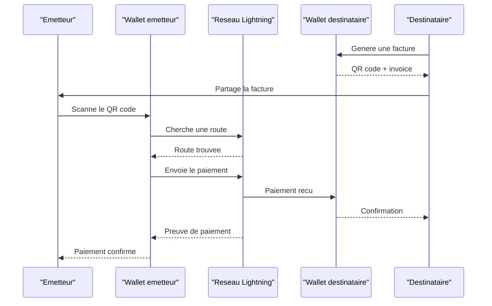
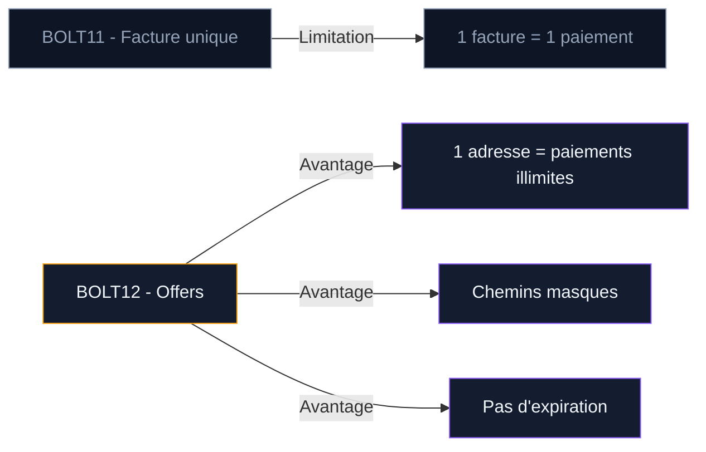

Payer en Bitcoin avec le Lightning Network prend moins de 5 secondes. Vous scannez un QR code, vous confirmez le montant, le paiement arrive. Pas de validation bancaire, pas de plafond journalier, pas de délai de traitement. Les frais ? Quelques satoshis, souvent moins d'un centime d'euro.

Ce guide détaille chaque étape d'un paiement Lightning : générer une facture, scanner un QR code, utiliser les formats LNURL et Lightning Address, recevoir des sats, et régler les problèmes courants. Si vous n'avez pas encore de wallet Lightning, consultez d'abord notre [guide de configuration d'un wallet Lightning](/bitcoin/lightning-network-bitcoin/configurer-wallet-lightning).

## Anatomie d'un paiement Lightning

Un paiement Lightning suit un parcours précis, du scan de la facture jusqu'à la confirmation. Voici le flux complet en quelques secondes.

Le protocole repose sur un système de factures (invoices). Le destinataire génère une facture avec un montant et un hash cryptographique. L'émetteur paie cette facture, et le réseau achemine le paiement de noeud en noeud jusqu'au destinataire. Chaque intermédiaire ne connait que le noeud précédent et le noeud suivant - c'est le routage en oignon, qui protège la confidentialité.

La preuve de paiement est cryptographique : une fois le paiement arrivé, l'émetteur reçoit un "preimage" (un secret révélé par le destinataire) qui prouve que le paiement a bien été reçu. Impossible de contester.

## Envoyer un paiement Lightning : les 3 méthodes

### Méthode 1 : scanner une facture BOLT11

C'est la méthode la plus courante. Le destinataire génère une facture (aussi appelée "invoice") dans son wallet. Cette facture prend la forme d'une longue chaîne de caractères qui commence par `lnbc` (pour le réseau principal Bitcoin) ou d'un QR code.

**Étapes concrètes avec Phoenix Wallet :**

1. Ouvrez Phoenix et appuyez sur "Envoyer"
2. Scannez le QR code ou collez l'invoice (`lnbc1...`)
3. Phoenix affiche le montant, la description du paiement et les frais de routage estimés
4. Vérifiez le montant et appuyez sur "Payer"
5. Le paiement arrive en 1 à 3 secondes

La facture BOLT11 contient plusieurs informations encodées : le montant en satoshis, une description, un hash de paiement, un délai d'expiration et la clé publique du noeud destinataire. Votre wallet décode tout ça automatiquement.

> [!WARNING]
> Les factures BOLT11 expirent. Par défaut, une invoice est valide 1 heure. Passé ce délai, le paiement échoue. Demandez une nouvelle facture si la première a expiré.

### Méthode 2 : payer via LNURL

LNURL est un protocole complémentaire qui simplifie l'interaction. Au lieu de coller une facture, vous scannez un QR code LNURL et votre wallet communique avec le serveur du destinataire pour générer automatiquement la facture.

**Deux variantes existent :**

- **LNURL-pay** : vous scannez, choisissez le montant (parfois dans une fourchette définie), et payez. Le serveur du destinataire crée la facture en temps réel.
- **LNURL-withdraw** : le destinataire vous envoie un lien pour retirer des fonds. Vous scannez et les sats arrivent dans votre wallet. C'est le format utilisé par les robinets (faucets) et certaines promotions.

L'avantage de LNURL : pas besoin de copier-coller des chaînes de 200 caractères. Le QR code suffit, et le processus est interactif.

### Méthode 3 : utiliser une Lightning Address

La Lightning Address ressemble à une adresse email : `votrepseudo@votreservice.com`. Elle fonctionne grâce à LNURL-pay en arrière-plan, mais offre une expérience encore plus simple.

Vous entrez l'adresse Lightning du destinataire dans votre wallet, vous choisissez le montant, et vous payez. Pas de QR code à scanner, pas de facture à copier.

**Exemples de Lightning Address :**
- Phoenix : activée automatiquement via le service payto.me d'Acinq
- Wallet of Satoshi : `pseudo@walletofsatoshi.com`
- Alby : `pseudo@getalby.com`
- Stacker News : `pseudo@stacker.news`

> [!TIP]
> La Lightning Address est le format le plus pratique pour recevoir des paiements réguliers. Publiez-la sur votre profil en ligne comme vous afficheriez un lien PayPal.

La Lightning Address a une limite : elle dépend d'un serveur tiers pour fonctionner. Si le serveur de votre fournisseur tombe en panne, votre adresse ne fonctionne plus. Pour les wallets non-custodial comme Phoenix, Acinq assure le relais via leur service, mais le risque de dépendance existe.

## Recevoir un paiement Lightning

Recevoir des sats est aussi simple qu'en envoyer. Vous générez une facture dans votre wallet, et l'émetteur la paie.

### Générer une facture

1. Ouvrez votre wallet Lightning (Phoenix, Breez, Wallet of Satoshi...)
2. Appuyez sur "Recevoir"
3. Entrez le montant que vous attendez (ou laissez le champ vide pour une facture ouverte)
4. Ajoutez une description si vous le souhaitez (ex : "Pizza du vendredi")
5. Partagez le QR code ou l'invoice texte avec l'émetteur

La facture ouverte (sans montant) permet au payeur de choisir combien il envoie. C'est pratique pour les pourboires ou les dons. Tous les wallets ne supportent pas cette option.

### La question de la liquidité entrante

Pour recevoir un paiement Lightning, votre canal doit avoir de la capacité entrante. Si vous venez d'ouvrir un canal avec 100 000 sats et que vous n'avez rien dépensé, toute la capacité est de votre côté (sortante). Vous ne pouvez pas recevoir.

En pratique, les wallets modernes comme Phoenix ou Breez gèrent ça pour vous. Quand quelqu'un vous envoie des sats et que vous n'avez pas de capacité entrante, le LSP (Lightning Service Provider) ouvre ou ajuste un canal automatiquement. Il facture des frais pour ce service (souvent autour de 1 % du montant reçu, avec un minimum).

> [!NOTE]
> La liquidité entrante est le concept le plus contre-intuitif de Lightning. Retenez ceci : les wallets modernes gèrent la plomberie automatiquement. Vous recevez vos sats sans y penser.

## Payer des achats en ligne et en magasin

### E-commerce et services en ligne

Plusieurs processeurs de paiement permettent aux commerçants d'accepter Lightning. Quand vous achetez sur un site compatible, le processus est le même qu'un scan de facture.

**BTCPay Server** est la solution la plus populaire. Open source et auto-hébergée, elle génère des factures Lightning (et on-chain) sans intermédiaire. Le commerçant contrôle ses fonds. Plusieurs centaines de boutiques en ligne utilisent BTCPay, du café artisanal au service SaaS.

**CoinGate** est un processeur de paiement européen qui traite les paiements Lightning pour des milliers de commerçants. Selon leurs données, Lightning représente plus de 16 % de toutes les commandes Bitcoin sur leur plateforme - contre 6,5 % deux ans plus tôt. La tendance est claire : les acheteurs préfèrent Lightning quand l'option existe.

**Bitrefill** est un service de cartes cadeaux qui accepte Lightning. Vous achetez des cartes Amazon, Steam, Uber, Netflix et bien d'autres avec vos sats. C'est un moyen indirect mais efficace de dépenser du Bitcoin chez des commerçants qui ne l'acceptent pas directement.

### Payer en magasin

Le paiement en magasin passe par un QR code affiché sur un terminal ou un téléphone. Le commerçant génère une facture via son application (BTCPay, Breez POS, Swiss Bitcoin Pay), affiche le QR, et vous le scannez avec votre wallet.

**Le déroulé type :**

1. Le commerçant entre le montant en euros sur son terminal
2. L'application convertit en satoshis au taux actuel
3. Un QR code s'affiche sur l'écran du terminal
4. Vous scannez avec Phoenix, Breez ou un autre wallet
5. Le paiement arrive en 2-3 secondes
6. Le terminal affiche une confirmation

L'expérience est comparable au paiement par carte sans contact. Le temps de traitement est du même ordre.

En France, quelques commerçants acceptent déjà Lightning : des bars à Paris, des restaurants dans le Sud, des boutiques tech. Le nombre reste modeste comparé au Salvador ou au Costa Rica, mais il progresse. La communauté Bitcoin France maintient un annuaire des commerçants sur btcmap.org.

## BOLT12 et l'avenir des paiements Lightning

Le format de facture actuel (BOLT11) a un défaut : chaque facture est à usage unique. Pour des paiements récurrents ou des dons, c'est contraignant. BOLT12, aussi appelé "Offers", résout ce problème.

Avec BOLT12, le destinataire publie une "Offer" permanente. N'importe qui peut payer cette Offer autant de fois qu'il le souhaite. Le protocole génère une facture fraîche à chaque paiement de façon transparente. BOLT12 ajoute aussi les "blinded paths" (chemins masqués) qui cachent l'identité du noeud destinataire dans le réseau.

Core Lightning a déjà intégré BOLT12. L'adoption côté wallets grand public arrive progressivement. C'est la prochaine étape pour rendre les paiements Lightning aussi simples qu'un virement SEPA récurrent.

## Les zaps sur Nostr : payer des créateurs en sats

Nostr est un réseau social décentralisé où Lightning est intégré nativement. Les "zaps" sont des micro-paiements envoyés à d'autres utilisateurs directement depuis le fil d'actualité.

**Comment envoyer un zap :**

1. Connectez votre wallet Lightning à votre client Nostr (Damus sur iOS, Amethyst sur Android, Primal sur le web)
2. Trouvez un post que vous voulez récompenser
3. Appuyez sur l'icône éclair
4. Choisissez un montant : 21 sats, 100 sats, 1 000 sats ou un montant personnalisé
5. Confirmez dans votre wallet

Le paiement part via Lightning et arrive en quelques secondes. Le créateur voit le zap s'afficher publiquement sous son post. Les zaps servent aussi de signal de qualité : un post avec beaucoup de zaps remonte dans certains algorithmes de tri.

Depuis le lancement de la fonctionnalité, les utilisateurs Nostr ont envoyé plus de 2,6 milliards de satoshis en zaps. C'est un modèle de rémunération directe, sans plateforme intermédiaire, sans commission de 30 %, sans délai de versement.

Les wallets compatibles avec les zaps : Phoenix (via NWC - Nostr Wallet Connect), Wallet of Satoshi, Alby, Mutiny. La configuration prend 2 minutes dans les paramètres du client Nostr.

## Frais Lightning : combien ça coûte

Les frais de paiement sur Lightning se composent de deux éléments.

**Les frais de routage** : chaque noeud intermédiaire prélève une petite commission pour acheminer votre paiement. Le montant dépend du nombre de sauts et de la politique de frais de chaque noeud. En pratique, pour un paiement de 10 000 sats (environ 5 euros), les frais de routage sont de 1 à 10 sats - bien en dessous d'un centime.

**Les frais de service du wallet** : les wallets qui utilisent un LSP (Phoenix, Breez) facturent des frais pour la gestion automatique des canaux. Sur Phoenix, c'est environ 0,4 % sur les paiements entrants avec un minimum de 3 000 sats. Les paiements sortants n'ont pas de frais de service supplémentaires au-delà du routage.

**Comparaison avec d'autres moyens de paiement :**

| Méthode | Frais pour 5 euros | Délai |
|---------|-------------------|-------|
| Lightning Network | < 0,01 euro | 1-3 secondes |
| Virement SEPA | Gratuit (souvent) | 1 jour ouvré |
| Carte bancaire | 0,15 - 0,20 euro (commerçant) | Instantané |
| PayPal | 0,35 + 2,9 % | Instantané |
| Western Union | 3 - 8 euros | Minutes à jours |

Pour les micro-paiements (pourboires, dons de quelques centimes), Lightning est le seul réseau de paiement où les frais ne dépassent pas le montant envoyé. Envoyer 10 centimes via PayPal coûte plus cher que le paiement lui-même.

## Résoudre les problèmes courants

### "Payment failed" - le paiement a échoué

Cause la plus fréquente : pas de route disponible entre votre wallet et le destinataire. Cela arrive quand la liquidité est insuffisante sur le chemin trouvé par le routage. Votre wallet essaie plusieurs routes, mais parfois aucune ne fonctionne pour le montant demandé.

**Solutions :**
- Réessayez quelques secondes plus tard (la liquidité des canaux change en temps réel)
- Réduisez le montant si possible - les petits paiements trouvent plus facilement une route
- Vérifiez que votre wallet a assez de solde pour couvrir le montant + les frais de routage

### "Invoice expired" - la facture a expiré

Les factures BOLT11 ont un délai d'expiration (par défaut 1 heure, parfois 10 minutes sur les plateformes de commerce). Si vous attendez trop longtemps, la facture expire et le paiement est rejeté.

**Solution :** demandez une nouvelle facture au destinataire. C'est gratuit et instantané.

### "No inbound liquidity" - pas de liquidité entrante

Vous ne pouvez pas recevoir de paiements parce que votre canal n'a pas de capacité entrante. Ce problème se pose surtout si vous utilisez un noeud personnel sans LSP.

**Solutions :**
- Avec Phoenix ou Breez : le LSP gère automatiquement la capacité entrante
- Avec un noeud personnel : dépensez d'abord des sats via Lightning pour libérer de la capacité entrante, ou demandez à un pair d'ouvrir un canal vers votre noeud

> [!CAUTION]
> Ne fermez jamais un canal Lightning pendant une période de frais on-chain élevés. La transaction de fermeture paie les frais du réseau Bitcoin, et une fermeture à 30 euros de frais réduit votre solde récupérable.

### Paiement bloqué "in-flight"

Rare mais possible : votre paiement est parti mais n'a pas été confirmé. Le montant est bloqué dans un HTLC (Hash Time-Locked Contract) en transit. Les fonds ne sont pas perdus - le HTLC expire après un délai (quelques heures à quelques jours) et les sats reviennent dans votre wallet.

**Action :** patientez. Le wallet finira par récupérer les fonds automatiquement. Ne tentez pas de renvoyer le même paiement avant d'avoir confirmation que le premier a bien échoué.

## Bonnes pratiques pour les paiements Lightning

**Gardez un solde raisonnable sur votre wallet Lightning.** Lightning est conçu pour les paiements du quotidien, pas pour le stockage long terme. Conservez sur votre wallet Lightning ce que vous garderiez dans votre portefeuille physique : de quoi couvrir quelques jours de dépenses. Le reste appartient à un wallet Bitcoin on-chain ou à un hardware wallet.

**Vérifiez le montant avant de confirmer.** Un paiement Lightning est irréversible. Il n'existe pas de bouton "annuler" ni de système de chargeback. Prenez une seconde pour vérifier que le montant et le destinataire sont corrects.

**Sauvegardez votre phrase de récupération.** Si vous perdez votre téléphone, c'est la seule façon de restaurer vos fonds. Écrivez les 12 mots sur papier, rangez-les dans un endroit sûr, et ne les stockez jamais en photo ou dans un fichier texte sur votre téléphone.

**Testez avec de petits montants.** Votre premier paiement Lightning devrait être de 100 ou 1 000 sats, pas de 100 000. Familiarisez-vous avec le processus avant de monter en montant.

**Gardez votre wallet à jour.** Les mises à jour corrigent des bugs, améliorent le routage et intègrent de nouveaux protocoles. Un wallet obsolète peut avoir des taux d'échec de paiement plus élevés.

## FAQ - Payer en Bitcoin avec Lightning

**Peut-on payer en Lightning sur n'importe quel site qui accepte Bitcoin ?**
Non. Le commerçant doit avoir activé Lightning sur son processeur de paiement. BTCPay Server et CoinGate proposent l'option, mais ce n'est pas automatique. Si vous ne voyez qu'une adresse Bitcoin classique (commençant par `bc1` ou `3`), c'est un paiement on-chain, pas Lightning.

**Les paiements Lightning sont-ils anonymes ?**
Pas totalement, mais plus confidentiels que les paiements on-chain. Le routage en oignon masque l'émetteur et le destinataire pour les noeuds intermédiaires. Les transactions Lightning ne sont pas inscrites sur la blockchain publique. En revanche, votre fournisseur de wallet (si custodial) ou votre LSP connaît votre activité.

**Quel est le montant maximum d'un paiement Lightning ?**
Il n'y a pas de limite théorique stricte, mais en pratique les paiements au-delà de 0,04 BTC (environ 4 millions de sats) peuvent échouer si la liquidité des canaux est insuffisante. Les paiements multi-chemins (MPP) augmentent la limite effective en découpant le paiement en plusieurs morceaux. Pour les gros montants, Bitcoin on-chain reste le choix le plus fiable.

**Que se passe-t-il si le destinataire est hors ligne ?**
Le paiement échoue et les fonds restent dans votre wallet. Lightning requiert que le destinataire (ou son noeud, ou son LSP) soit en ligne pour recevoir le paiement. C'est une différence avec Bitcoin on-chain, où vous pouvez envoyer à une adresse même si le destinataire ne consulte pas son wallet.

**Faut-il déclarer ses paiements Lightning aux impôts ?**
En France, les cessions de Bitcoin (y compris via Lightning) sont soumises au régime fiscal des plus-values sur actifs numériques. Si vous payez un bien ou un service en BTC via Lightning, c'est une cession imposable si vous réalisez une plus-value. La flat tax de 30 % s'applique (ou le barème progressif sur option). Les micro-transactions du quotidien posent un vrai casse-tête comptable - gardez un historique de vos paiements pour simplifier votre déclaration.
