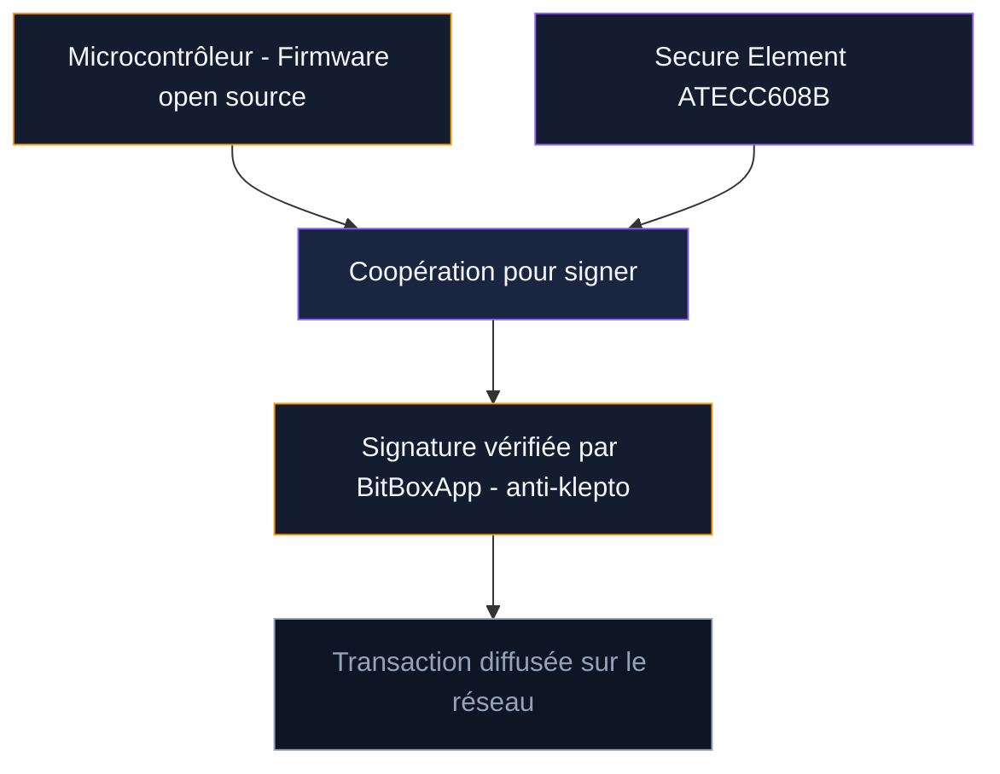
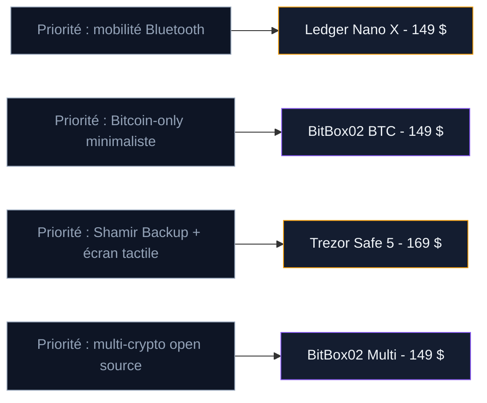

Le BitBox02 est un hardware wallet concu et fabriqué en Suisse par Shift Crypto, une entreprise basée à Zurich. Lancé en 2019, mis à jour avec le BitBox02 Nova en 2024, il combine firmware 100% open source, puce Secure Element et backup sur carte micro SD dans un boitier de 12 grammes.

À 149 dollars pour l'édition Bitcoin-only, il se place au même prix que le Ledger Nano X. Son approche est différente : là où Ledger mise sur le Bluetooth et Trezor sur l'écran tactile, le BitBox02 mise sur la simplicité et la réduction de la surface d'attaque.

## Fiche technique du BitBox02

| Caractéristique | Détail |
|-----------------|--------|
| Prix | 149 $ (Bitcoin-only) / 149 $ (Multi) |
| Dimensions | 54,5 x 25,4 x 9,6 mm |
| Poids | 12 grammes |
| Écran | OLED monochrome 128 x 64 pixels |
| Connectivité | USB-C |
| Puce sécurisée | Secure Element ATECC608B (Microchip) |
| Bluetooth | Non |
| Batterie | Non |
| Backup | Carte micro SD + seed phrase 24 mots |
| Cryptos (Bitcoin-only) | Bitcoin uniquement |
| Cryptos (Multi) | Bitcoin, Ethereum, Litecoin, Cardano, tokens ERC-20 |
| Code PIN | Configurable via gestes tactiles |
| Firmware | 100% open source (GitHub) |
| Fabricant | Shift Crypto AG (Zurich, Suisse) |

Le boitier est en polycarbonate noir avec un ruban de silicone invisible qui sert de zone tactile. Le packaging contient l'appareil, un câble USB-C vers USB-A, un adaptateur USB-C, une carte micro SD de 8 Go et un guide de démarrage.

## Édition Bitcoin-only vs Multi : que choisir

Le BitBox02 existe en deux versions. Le hardware est identique. La différence est logicielle.

**L'édition Bitcoin-only** ne gère que le bitcoin. Le firmware est réduit au strict minimum : pas de code pour Ethereum, pas de tokens, pas de smart contracts. Moins de code signifie moins de surface d'attaque potentielle. Les puristes Bitcoin choisissent cette version.

**L'édition Multi** supporte Bitcoin, Ethereum, Litecoin, Cardano et les tokens ERC-20. Le firmware est plus volumineux, mais reste open source et auditable. Si vous détenez plusieurs cryptos, c'est la version adaptée.

Les deux éditions coûtent le même prix. Le choix se résume à une question simple : détenez-vous uniquement du bitcoin, ou aussi d'autres cryptos ?

> [!TIP]
> L'édition Bitcoin-only embarque un firmware réduit qui ne contient que le code lié à Bitcoin. Moins de code, c'est moins de failles potentielles. Si vous ne détenez que du BTC, c'est la version à privilégier.

## Prise en main et design

Le BitBox02 est minuscule - 54 mm de long, 12 grammes. C'est le plus petit hardware wallet du marché. Il tient entre deux doigts et disparait dans une poche de jean.

Le boitier en polycarbonate noir est sobre, sans logo visible à l'avant. L'écran OLED monochrome est petit mais lisible : texte blanc sur fond noir, contraste correct même en plein jour.

La navigation se fait via des gestes tactiles sur les bords de l'appareil. Vous touchez le côté gauche ou droit pour naviguer dans les menus, et glissez le doigt le long du ruban pour confirmer. C'est déroutant les premières minutes, mais après une journée les gestes deviennent naturels.

Le connecteur USB-C est intégré au boitier. La connexion est stable et l'appareil est reconnu immédiatement sur macOS, Windows et Linux.

## Configuration initiale avec BitBoxApp

La configuration prend entre 5 et 10 minutes. C'est plus rapide que Ledger et Trezor, principalement grâce au backup micro SD.

**Étape 1 : Télécharger BitBoxApp.** Rendez-vous sur bitbox.swiss et téléchargez l'application pour Windows, macOS ou Linux. Une version Android existe aussi. Vérifiez l'URL - comme pour tous les wallets, des sites de phishing imitent le site officiel.

**Étape 2 : Brancher le BitBox02.** Connectez l'appareil via USB-C. BitBoxApp détecte le wallet et vérifie l'authenticité du firmware. Si une mise à jour existe, l'application la propose.

**Étape 3 : Définir un mot de passe sur l'appareil.** Vous créez un mot de passe via les gestes tactiles sur l'écran du BitBox02. Le mot de passe est stocké sur l'appareil, pas sur l'ordinateur.

**Étape 4 : Créer le backup sur carte micro SD.** C'est ici que le BitBox02 se distingue. L'appareil sauvegarde automatiquement la seed chiffrée sur la carte micro SD fournie. En quelques secondes, votre backup est créé. Pas de risque de mal recopier un mot.

**Étape 5 : Optionnel - noter la seed phrase.** Vous pouvez afficher les 24 mots de votre seed pour les noter sur papier ou métal. C'est recommandé comme backup secondaire.

**Étape 6 : Faire un transfert test.** Envoyez une petite somme pour vérifier que tout fonctionne.

> [!NOTE]
> Le backup micro SD sauvegarde votre seed chiffrée en quelques secondes. Vous n'avez pas à recopier 24 mots à la main. Gardez la carte dans un lieu sûr (coffre-fort, domicile séparé) et faites un backup papier ou métal en complément.

## Sécurité : architecture à double puce

Le BitBox02 combine open source et Secure Element dans une architecture à double puce. Le principe ressemble à celui du Trezor Safe 5, mais l'implémentation diffère.

### Le firmware open source

Tout le code est publié sur GitHub. Shift Crypto propose un processus de "build reproduisible" : vous compilez le firmware chez vous et vérifiez qu'il est identique bit par bit à la version officielle. C'est un niveau de transparence que Ledger ne peut pas offrir à cause des NDA sur sa puce, et un avantage sur Trezor en matière de vérification.

### Le Secure Element ATECC608B

La puce Microchip ATECC608B stocke une partie du secret cryptographique. Les deux puces (microcontrôleur + Secure Element) doivent coopérer pour reconstituer la clé privée. Si un attaquant extrait le contenu d'une seule puce, il ne peut pas accéder à vos fonds.

L'ATECC608B n'a pas de certification CC EAL comme les puces Ledger (EAL5+) ou Trezor Safe 5 (EAL6+), mais l'architecture à double puce compense ce point en rendant l'extraction physique plus difficile.

### Anti-klepto : protection contre les fuites

Le BitBox02 implémente le protocole anti-klepto, qui empêche le wallet de faire fuiter votre clé privée via les signatures de transactions. BitBoxApp vérifie chaque signature pour détecter toute tentative d'exfiltration. Peu de wallets offrent cette protection.

## BitBoxApp au quotidien

BitBoxApp est disponible sur desktop (Windows, macOS, Linux) et Android. Pas de version iOS - Apple ne permet pas les connexions USB aux wallets tiers dans les mêmes conditions.

L'interface est épurée. BitBoxApp fait trois choses : recevoir, envoyer et vérifier vos soldes.

**Recevoir du bitcoin** : l'application génère une adresse. Le BitBox02 l'affiche sur son écran. Vous vérifiez que les adresses correspondent et partagez l'adresse au destinataire.

**Envoyer du bitcoin** : vous saisissez l'adresse et le montant. Le BitBox02 affiche les détails de la transaction sur son écran. Vous confirmez en glissant le doigt sur le capteur tactile.

**Fonctionnalités avancées** : BitBoxApp supporte la connexion à votre propre full node Bitcoin (via Electrum Personal Server ou un noeud Tor). Le coin control est intégré : vous choisissez quels UTXOs utiliser pour chaque transaction. La connexion Tor est disponible en un clic.

**Les limites** : pas de staking, pas de swap, pas d'achat par carte bancaire. Si vous cherchez une application tout-en-un comme Ledger Live, BitBoxApp vous semblera austère. Mais si vous cherchez un outil centré sur Bitcoin avec des options de confidentialité, c'est un bon choix.

> [!IMPORTANT]
> BitBoxApp permet la connexion à votre propre noeud Bitcoin via Tor. Vos transactions ne passent pas par les serveurs de Shift Crypto. C'est le niveau de confidentialité le plus élevé parmi les applications de hardware wallets.

## Le backup micro SD : avantage ou risque ?

La seed chiffrée est sauvegardée sur la carte micro SD en quelques secondes. La restauration est instantanée : insérez la carte dans un nouveau BitBox02, entrez votre mot de passe, et vos fonds réapparaissent. Mais ce système a des contreparties.

**Avantages :**
- Zéro risque de mal recopier un mot de la seed phrase
- Restauration en moins d'une minute (contre 10-15 minutes pour taper 24 mots)
- Possibilité de créer plusieurs copies sur différentes cartes micro SD
- Seed chiffrée sur la carte - un voleur qui trouve la carte seule ne peut rien en faire

**Risques à connaitre :**
- Les cartes micro SD sont fragiles (eau, chaleur, champs magnétiques)
- La durée de vie d'une carte SD est estimée entre 5 et 10 ans sans utilisation
- Si vous perdez la carte ET que vous n'avez pas noté les 24 mots, vos fonds sont perdus
- Le backup micro SD n'est compatible qu'avec les appareils BitBox02

La bonne pratique : utilisez la carte micro SD comme backup principal pour la rapidité, et notez les 24 mots sur une plaque en acier comme backup secondaire. Deux méthodes, deux supports, deux lieux différents.

## Les défauts constatés

**Écran petit et monochrome.** L'écran OLED de 128 x 64 pixels fait le travail, mais la vérification des adresses Bitcoin longues demande de faire défiler le texte. Le Trezor Safe 5 avec son écran tactile couleur est plus confortable pour cette opération.

**Pas de Bluetooth.** Comme le Trezor Safe 5, le BitBox02 nécessite un câble USB pour chaque opération. Pas de gestion mobile sans fil. Si vous voulez envoyer du bitcoin depuis votre smartphone dans un café, le Ledger Nano X est mieux adapté.

**Écosystème plus restreint.** BitBoxApp ne propose ni staking, ni swap, ni achat par carte bancaire. Le catalogue de cryptos de l'édition Multi est limité à quelques blockchains. Face aux 5 500 cryptos du Ledger et aux 8 000 du Trezor, c'est un choix qui peut freiner les détenteurs de portefeuilles diversifiés.

**Navigation tactile déroutante au début.** Les gestes sur les bords du boitier ne sont pas intuitifs. Les premières minutes sont frustrantes, surtout pour saisir le mot de passe caractère par caractère. On s'y habitue, mais la courbe d'apprentissage est réelle.

**Pas de Shamir Backup.** Le BitBox02 ne supporte pas le standard SLIP39 de Trezor qui permet de diviser la seed en plusieurs parts. Pour une protection similaire, il faut passer par un setup multisig.

> [!WARNING]
> Si vous comptez uniquement sur le backup micro SD, testez la restauration et faites une copie papier ou métal des 24 mots. Les cartes SD ont une durée de vie limitée et sont sensibles à l'eau et aux champs magnétiques.

## BitBox02 vs Ledger Nano X vs Trezor Safe 5

| Critère | BitBox02 BTC | Ledger Nano X | Trezor Safe 5 |
|---------|--------------|---------------|----------------|
| Prix | 149 $ | 149 $ | 169 $ |
| Écran | OLED monochrome | OLED monochrome | Tactile couleur 1,54" |
| Secure Element | ATECC608B | ST33 (EAL5+) | EAL6+ |
| Open source | 100% + build reproduisible | Partiel | 100% |
| Bluetooth | Non | Oui | Non |
| Batterie | Non | Oui (5-7 ans) | Non |
| Backup micro SD | Oui | Non | Non |
| Shamir Backup | Non | Non | Oui (SLIP39) |
| Anti-klepto | Oui | Non | Non |
| Cryptos (BTC edition) | Bitcoin uniquement | 5 500+ | 8 000+ |
| Poids | 12 g | 34 g | 23 g |
| Connexion noeud propre | Oui (Tor) | Non natif | Oui |
| Fabrication | Suisse | France | République tchèque |

### Face au Ledger Nano X

Le Nano X a le Bluetooth et supporte 5 500 cryptos. Le BitBox02 BTC ne gère que le bitcoin et nécessite un câble. Si vous détenez un portefeuille diversifié et voulez gérer vos cryptos depuis un smartphone, le Nano X est plus adapté.

Le BitBox02 reprend l'avantage sur la transparence (firmware 100% open source avec build reproduisible), le protocole anti-klepto, le backup micro SD et la connexion à un noeud Bitcoin via Tor. Il n'a pas de batterie qui se dégrade avec le temps.

### Face au Trezor Safe 5

Les deux partagent le même principe : firmware open source combiné à un Secure Element. Le Safe 5 a un meilleur écran (tactile couleur), une puce certifiée EAL6+ et le Shamir Backup.

Le BitBox02 a le backup micro SD (plus rapide que noter 20 mots par part), le protocole anti-klepto et un format plus compact. Le choix entre les deux dépend de vos priorités : écran et Shamir (Safe 5) ou backup SD et minimalisme (BitBox02).

## À qui s'adresse le BitBox02

**Bon choix si vous :**
- Ne détenez que du bitcoin et voulez un wallet dédié avec firmware minimaliste
- Tenez à la transparence totale du code (open source + build reproduisible)
- Voulez un backup rapide et sans erreur via carte micro SD
- Cherchez la confidentialité maximale (connexion à votre noeud via Tor)
- Préférez un appareil compact et discret (12 grammes, format clé USB)
- Valorisez la fabrication suisse et une entreprise spécialisée en sécurité

**Mauvais choix si vous :**
- Détenez un portefeuille diversifié (Ethereum, Solana, tokens) - le catalogue Multi est limité
- Voulez gérer vos cryptos depuis un smartphone sans câble (pas de Bluetooth)
- Cherchez une application tout-en-un avec staking, swap et achat par carte
- Débutez avec moins de 500 EUR en crypto (un hot wallet gratuit suffit pour commencer)
- Voulez diviser votre seed en plusieurs parts (pas de Shamir Backup)

## Conseils de sécurité spécifiques au BitBox02

**Achetez sur bitbox.swiss uniquement.** Ne commandez jamais sur Amazon ou un revendeur tiers. Un appareil d'occasion peut contenir un firmware modifié.

**Créez un backup papier ou métal en plus de la micro SD.** Notez les 24 mots sur une plaque en acier (Cryptosteel, Billfodl) et stockez-la dans un lieu séparé de la carte SD.

**Testez la restauration avant de stocker des montants importants.** Insérez la carte micro SD dans un second BitBox02 (ou réinitialisez le vôtre) et vérifiez que vos fonds réapparaissent.

**Activez la passphrase optionnelle pour les gros montants.** La passphrase crée un wallet caché. Même si quelqu'un obtient votre carte micro SD et votre mot de passe, il ne verra pas les fonds protégés.

**Mettez à jour le firmware régulièrement.** BitBoxApp vous notifie quand une mise à jour est disponible. Le processus prend moins de deux minutes.

> [!CAUTION]
> Ne stockez pas la carte micro SD de backup au même endroit que le BitBox02. Si votre domicile est cambriolé ou victime d'un incendie, les deux supports seront perdus. Gardez la carte SD dans un coffre-fort ou chez un proche de confiance.

## Notre verdict

Le BitBox02 est le hardware wallet le plus cohérent pour les détenteurs de bitcoin qui veulent transparence et simplicité. Le firmware open source avec build reproduisible, l'architecture à double puce et le backup micro SD forment un ensemble solide.

L'édition Bitcoin-only réduit la surface d'attaque à son minimum. C'est une approche qui parle aux maximalistes Bitcoin, mais aussi à quiconque préfère un outil qui fait une seule chose et la fait bien. BitBoxApp est sobre, avec des fonctionnalités de confidentialité (connexion Tor, coin control) que Ledger Live ne propose pas nativement.

Les limites sont claires : pas de Bluetooth, un écran modeste, pas de Shamir Backup, et un écosystème crypto restreint.

**On recommande le BitBox02 si** vous détenez principalement du bitcoin et valorisez la transparence du code, le backup micro SD et la confidentialité. **On recommande le Nano X** pour la mobilité Bluetooth, ou **le Safe 5** pour le Shamir Backup et l'écran tactile.
