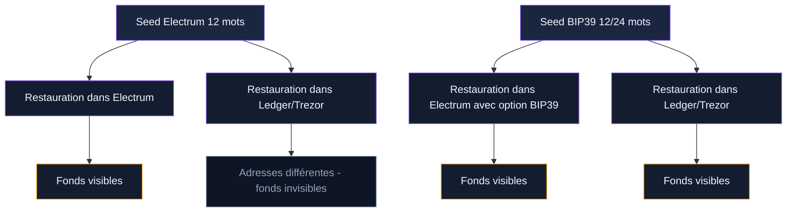
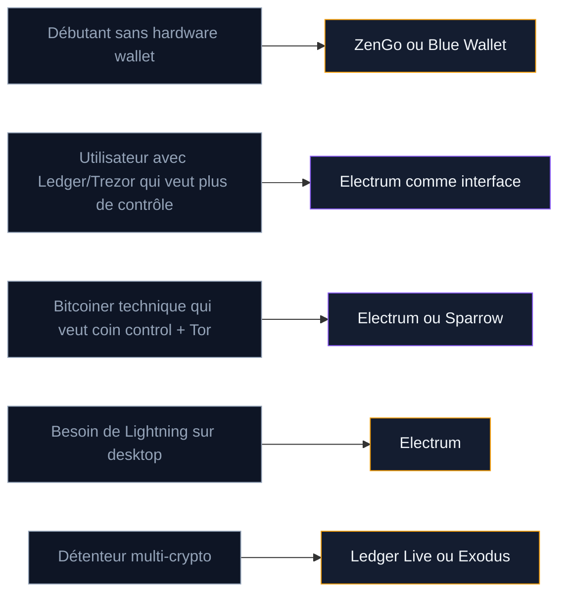

Electrum existe depuis 2011. C'est l'un des plus anciens portefeuilles Bitcoin encore actifs, et probablement le logiciel desktop le plus utilisé par les détenteurs de BTC dans le monde. Son code source est ouvert, son architecture légère, et il ne gère qu'une seule crypto : le bitcoin.

A une époque où les wallets multi-chaînes se multiplient avec des interfaces colorées, Electrum fait le choix inverse. Pas d'app mobile officielle, pas de graphiques de portfolio, pas de staking. Un logiciel concentré sur une seule mission : stocker, envoyer et recevoir du bitcoin avec un maximum de contrôle.

Nous avons utilisé Electrum sur Windows, macOS et Linux pendant plusieurs semaines. Voici notre avis complet.

## Qu'est-ce qu'Electrum

Electrum est un portefeuille logiciel (hot wallet) créé par Thomas Voegtlin, un ingénieur français basé à Berlin. Le projet est né en novembre 2011, soit trois ans après la création de Bitcoin. Le code est publié sous licence MIT sur GitHub - n'importe qui peut le lire, le compiler et le vérifier.

Le logiciel pèse moins de 50 Mo. Il ne télécharge pas toute la blockchain Bitcoin (plus de 600 Go début 2025). A la place, il se connecte à des serveurs Electrum (appelés "ElectrumX") qui indexent la blockchain pour lui. C'est le principe du SPV (Simplified Payment Verification) : votre wallet vérifie les preuves cryptographiques des transactions sans télécharger chaque bloc.

| Caractéristique | Détail |
|-----------------|--------|
| Prix | Gratuit, open source (licence MIT) |
| Année de création | 2011 |
| Créateur | Thomas Voegtlin |
| Plateformes | Windows, macOS, Linux, Android (tiers) |
| Cryptos supportées | Bitcoin uniquement |
| Type | Hot wallet (logiciel desktop) |
| Seed phrase | 12 mots (format Electrum natif) |
| Multisig | Oui (M-sur-N configurable) |
| Lightning Network | Oui (intégré depuis la version 4.0) |
| Hardware wallets | Ledger, Trezor, BitBox02, Coldcard |
| Connexion Tor | Oui (intégrée) |
| Coin control | Oui |

> [!NOTE]
> Electrum utilise son propre format de seed phrase, différent du standard BIP39 utilisé par Ledger, Trezor et la plupart des autres wallets. Si vous importez une seed BIP39 dans Electrum, c'est possible, mais le logiciel ne générera pas de seed BIP39 par défaut.

## Installation et première configuration

L'installation prend moins de cinq minutes sur n'importe quel système.

**Étape 1 : Télécharger depuis le site officiel.** Rendez-vous sur electrum.org et téléchargez la version correspondant à votre système d'exploitation. Vérifiez l'URL dans la barre d'adresse - des sites de phishing imitent la page officielle. En 2018, une attaque de phishing massive a touché des utilisateurs Electrum via de fausses mises à jour. Ne téléchargez jamais Electrum depuis un lien reçu par email ou un résultat sponsorisé sur un moteur de recherche.

**Étape 2 : Vérifier la signature GPG.** C'est une étape que la plupart des wallets ne proposent pas. Electrum fournit une signature GPG pour chaque téléchargement. En vérifiant cette signature, vous confirmez que le fichier n'a pas été modifié entre le serveur et votre ordinateur. La documentation officielle explique la procédure.

**Étape 3 : Créer un nouveau portefeuille.** Au premier lancement, Electrum propose quatre options : Standard Wallet, Two-Factor Authentication, Multi-signature Wallet et Import. Choisissez Standard Wallet pour débuter.

**Étape 4 : Noter la seed phrase.** Electrum génère 12 mots. Écrivez-les sur papier, dans l'ordre exact. Ne prenez pas de photo. Ne copiez pas la seed dans un fichier. Un seul mot mal noté et la restauration échoue.

**Étape 5 : Confirmer la seed.** Le logiciel vous demande de re-saisir les 12 mots. C'est une vérification que vous les avez bien notés.

**Étape 6 : Définir un mot de passe.** Ce mot de passe chiffre le fichier wallet sur votre disque dur. Si quelqu'un accède à votre ordinateur, il ne pourra pas ouvrir le portefeuille sans ce mot de passe. Choisissez un mot de passe long et unique.

> [!WARNING]
> Le mot de passe protège le fichier wallet sur votre disque, mais pas vos fonds. Quiconque possède votre seed phrase de 12 mots peut restaurer le portefeuille sur un autre ordinateur, sans mot de passe. Protégez la seed en priorité.

## Le format de seed Electrum vs BIP39

C'est le point qui crée le plus de confusion. La quasi-totalité des wallets Bitcoin (Ledger, Trezor, BitBox, Sparrow, Blue Wallet) utilise le standard BIP39 pour générer les seed phrases. Electrum utilise son propre format, appelé "Electrum seed version system".

La différence technique : BIP39 tire les mots d'une liste fixe de 2 048 termes et encode la seed avec un checksum intégré. Electrum ajoute un numéro de version dans la seed, ce qui permet au logiciel de savoir quel type de wallet (standard, segwit, multisig) la seed représente, sans stocker cette information séparément.

En pratique, ça signifie deux choses :

1. **Une seed créée dans Electrum ne fonctionne pas directement dans Ledger Live ou Trezor Suite.** Si vous restaurez une seed Electrum dans un wallet BIP39, les adresses générées seront différentes et vos fonds n'apparaîtront pas.

2. **Vous pouvez importer une seed BIP39 dans Electrum.** Au moment de la création du wallet, choisissez "I already have a seed", cochez "BIP39" dans les options, et entrez vos mots. Electrum reconnaîtra la seed et affichera vos fonds.

Thomas Voegtlin a justifié ce choix par la flexibilité : le système de versioning permet d'ajouter de nouveaux types de wallets sans casser la compatibilité avec les anciens. Mais en 2025, BIP39 reste le standard dominant, et cette incompatibilité est le principal reproche fait à Electrum.

## Fonctionnalités qui distinguent Electrum

Electrum est un logiciel technique. Il n'essaie pas de séduire les débutants avec une interface épurée. A la place, il offre des outils que la plupart des wallets grand public ne proposent pas.

### Coin control

Le coin control permet de choisir quels UTXOs (fragments de bitcoin reçus lors de transactions précédentes) utiliser pour construire une transaction. Par défaut, un wallet sélectionne automatiquement les UTXOs. Avec le coin control, vous décidez lesquels dépenser.

Pourquoi c'est utile : si vous avez reçu du BTC depuis plusieurs sources (un exchange, un ami, un paiement), ces UTXOs sont des morceaux distincts dans votre portefeuille. En les combinant dans une seule transaction, un observateur de la blockchain peut déduire que toutes ces sources vous appartiennent. Le coin control protège votre vie privée en vous laissant isoler les UTXOs.

### Connexion via Tor

Electrum peut se connecter au réseau Bitcoin via Tor. Dans les paramètres réseau, activez le proxy SOCKS5 vers le port 9050 (Tor) ou 9150 (Tor Browser). Votre adresse IP ne sera plus visible par les serveurs Electrum. Vous pouvez aussi connecter votre propre serveur ElectrumX pour éliminer toute dépendance envers des tiers.

### Replace-By-Fee (RBF)

Si une transaction met trop de temps à se confirmer (frais trop bas), Electrum permet de la "remplacer" en augmentant les frais. C'est la fonctionnalité Replace-By-Fee. Au lieu d'attendre des heures, vous payez quelques satoshis de plus et la transaction passe au bloc suivant.

### Lightning Network

Depuis la version 4.0 (sortie en 2020), Electrum intègre le Lightning Network. Vous pouvez ouvrir des canaux de paiement et envoyer ou recevoir des micro-transactions quasi instantanées avec des frais de quelques centimes. L'implémentation est fonctionnelle mais plus brute que des wallets Lightning dédiés comme Phoenix ou Breez.

### Multisig natif

Electrum permet de créer des portefeuilles multisig (multi-signatures) directement dans le logiciel. Vous choisissez le nombre total de clés et le seuil requis pour signer. Par exemple, un wallet 2-sur-3 exige deux signatures sur trois clés distinctes. Chaque co-signataire installe Electrum de son côté, et le logiciel génère un fichier PSBT (Partially Signed Bitcoin Transaction) qui circule entre les participants.

## Utiliser Electrum avec un hardware wallet

Electrum n'est pas qu'un hot wallet autonome. Il sert aussi d'interface logicielle pour piloter un hardware wallet. C'est d'ailleurs l'un de ses usages les plus courants chez les utilisateurs avancés.

Les appareils compatibles : Ledger Nano S/X, Trezor (tous modèles), BitBox02, Coldcard, Jade et KeepKey. La connexion se fait par USB. Electrum détecte l'appareil et crée un wallet "hardware" dont les clés privées restent sur l'appareil physique.

L'avantage par rapport à Ledger Live ou Trezor Suite : Electrum offre le coin control, la connexion Tor, le RBF et le choix granulaire des frais de transaction. Les applications officielles des fabricants sont plus simples à utiliser, mais moins configurables.

Le scénario typique : vous achetez un Ledger Nano X pour la sécurité du Secure Element, mais vous l'utilisez avec Electrum plutôt qu'avec Ledger Live pour gagner en contrôle et en confidentialité. Les deux logiciels fonctionnent avec le même appareil. Vos fonds ne bougent pas.

> [!TIP]
> Pour un maximum de contrôle, combinez un hardware wallet (Ledger, Trezor ou BitBox02) avec Electrum comme interface logicielle. Vous profitez de la sécurité physique de l'appareil et des outils avancés d'Electrum (coin control, Tor, RBF, choix des frais).

## L'interface : puissante mais datée

Soyons directs : l'interface d'Electrum date d'une autre époque. Les onglets, les menus déroulants et les fenêtres de dialogue rappellent les logiciels Windows des années 2000. Pas de dark mode natif, pas d'animations, pas de tableaux de bord visuels. C'est du Qt brut.

Pour un utilisateur technique qui connaît Bitcoin, cette interface est fonctionnelle. Chaque information est accessible en quelques clics. L'onglet "Addresses" liste toutes les adresses du wallet avec leur solde. L'onglet "Coins" montre les UTXOs individuels. L'onglet "Channels" affiche les canaux Lightning.

Pour un débutant, c'est un mur. Pas de tutoriel intégré, pas de tooltips explicatifs. Si vous ne savez pas ce qu'est un UTXO ou un canal Lightning, Electrum ne vous l'expliquera pas. Le logiciel suppose que vous comprenez Bitcoin.

Sparrow Wallet offre des fonctionnalités similaires (coin control, Tor, multisig) avec une interface moderne et un mode sombre natif. Sparrow est sorti en 2020, et ça se voit.

## Sécurité : forces et limites d'un hot wallet

Electrum est un hot wallet. Vos clés privées sont stockées sur votre ordinateur, chiffrées par votre mot de passe. C'est la différence centrale avec un hardware wallet : si votre machine est compromise par un malware, vos fonds sont en danger.

### Ce qu'Electrum fait bien

Le code est open source depuis 2011. Des milliers de développeurs l'ont lu et audité. Les bugs de sécurité découverts sont corrigés rapidement. Le logiciel vérifie les transactions via SPV, ce qui signifie qu'il ne fait pas confiance aveuglément aux serveurs auxquels il se connecte.

Le chiffrement du fichier wallet utilise AES-256-CBC. Sans votre mot de passe, un attaquant qui copie le fichier ne peut pas accéder aux clés. Electrum supporte aussi les passphrases (un mot supplémentaire ajouté à la seed) pour créer des wallets cachés.

### Les risques réels

**L'attaque de phishing de 2018.** Un attaquant a exploité le système de messages serveur d'Electrum pour afficher de fausses alertes de mise à jour. Les utilisateurs qui ont téléchargé cette fausse mise à jour ont installé un malware qui a vidé leurs portefeuilles. Environ 250 BTC ont été volés. Electrum a corrigé la faille et supprimé le système de messages.

**Les malwares ciblent les hot wallets.** Un keylogger ou un clipboard hijacker peut capturer votre mot de passe ou remplacer les adresses Bitcoin copiées. C'est un risque commun à tous les hot wallets, pas spécifique à Electrum.

**Le fichier wallet est un fichier.** Si vous le sauvegardez dans le cloud (Dropbox, Google Drive), vous exposez vos fonds. Le fichier wallet doit rester sur votre machine locale, protégé par un mot de passe fort.

> [!CAUTION]
> Ne stockez jamais le fichier wallet Electrum dans un dossier synchronisé avec le cloud (Dropbox, iCloud, Google Drive). Un attaquant qui accède à votre compte cloud pourrait copier le fichier et tenter de craquer le mot de passe hors ligne.

## Electrum vs Sparrow vs Ledger Live

Trois logiciels, trois philosophies. Voici comment ils se comparent pour gérer du bitcoin.

| Critère | Electrum | Sparrow | Ledger Live |
|---------|----------|---------|-------------|
| Prix | Gratuit | Gratuit | Gratuit (avec Ledger) |
| Open source | Oui (MIT) | Oui (Apache 2.0) | Partiel |
| Cryptos | Bitcoin uniquement | Bitcoin uniquement | 5 500+ |
| Coin control | Oui | Oui (visualisation graphique) | Non |
| Connexion Tor | Oui | Oui | Non |
| Lightning | Oui | Non | Non |
| Multisig | Oui | Oui | Non |
| Hardware wallets | Oui | Oui | Ledger uniquement |
| Interface | Datée (Qt) | Moderne (dark mode) | Grand public |
| Débutant friendly | Non | Moyen | Oui |
| Serveur personnel | Oui (ElectrumX) | Oui (Bitcoin Core) | Non |
| Mobile | Android (tiers) | Non | iOS + Android |

**Si vous débutez** et possédez un Ledger, commencez par Ledger Live. L'interface est claire, les étapes sont guidées. Vous pourrez migrer vers Electrum ou Sparrow plus tard.

**Si vous cherchez la confidentialité et le contrôle**, Electrum et Sparrow sont au coude-à-coude. Sparrow a l'avantage de l'interface et de la visualisation des UTXOs. Electrum a l'avantage du Lightning Network intégré et d'une communauté plus ancienne.

**Si vous gérez uniquement du bitcoin et voulez tout en un** (on-chain + Lightning + multisig + hardware wallet), Electrum est le seul logiciel qui réunit toutes ces fonctionnalités dans un même package.

## Les défauts qui comptent

**L'interface n'a pas évolué.** En 14 ans d'existence, l'apparence d'Electrum n'a presque pas changé. Le framework Qt donne un aspect vieillot. Des utilisateurs habitués aux applications modernes abandonnent le logiciel pour Sparrow, qui offre des fonctionnalités comparables dans un emballage plus agréable.

**Le format de seed propriétaire.** Comme détaillé plus haut, la seed Electrum n'est pas compatible BIP39. Si vous changez de wallet un jour, vous devrez envoyer vos fonds vers une nouvelle adresse plutôt que de simplement restaurer votre seed. C'est un frein à la portabilité.

**Pas d'application mobile officielle.** Il existe une version Android maintenue par un développeur tiers, mais elle n'est pas au niveau de la version desktop. Pas de version iOS. Si la gestion mobile est importante pour vous, Electrum n'est pas le bon choix.

**Le Lightning Network reste basique.** L'intégration Lightning fonctionne, mais elle demande de gérer manuellement les canaux de paiement, la liquidité et les sauvegardes. Des wallets dédiés comme Phoenix ou Breez proposent du Lightning automatisé, sans configuration manuelle.

**Dépendance aux serveurs ElectrumX.** Par défaut, Electrum se connecte à des serveurs tiers. Ces serveurs connaissent vos adresses Bitcoin et votre IP (sauf si vous utilisez Tor). Pour une confidentialité maximale, il faut héberger son propre serveur - ce qui demande un minimum de compétences techniques.

## A qui s'adresse Electrum

Electrum est un logiciel pour utilisateurs informés. Il ne tient pas la main, mais il ne cache rien. Voici les profils pour lesquels il fait sens.

**Détenteurs de bitcoin qui veulent le contrôle total.** Si vous tenez à choisir vos frais au satoshi près, sélectionner vos UTXOs, vous connecter via Tor et vérifier chaque détail d'une transaction, Electrum est fait pour vous.

**Utilisateurs de hardware wallets qui veulent dépasser Ledger Live.** Electrum transforme un Ledger ou un Trezor en outil avancé. Coin control, RBF, connexion à son propre noeud - absents de Ledger Live et Trezor Suite.

**Utilisateurs qui veulent du multisig sans service tiers.** Electrum permet de configurer un wallet multisig entre plusieurs participants, sans passer par un service payant.

**On déconseille Electrum si** :
- Vous débutez en bitcoin et cherchez une interface guidée
- Vous gérez plusieurs cryptomonnaies (Electrum ne supporte que le bitcoin)
- Vous voulez une application mobile
- Vous n'êtes pas à l'aise avec l'anglais (l'interface et la documentation sont principalement en anglais)

## Notre verdict

Electrum n'est pas le wallet le plus beau. Il n'est pas le plus simple. Mais après 14 ans d'existence, il reste l'un des logiciels Bitcoin les plus fiables et les plus complets disponibles.

Son code ouvert a été scruté par des milliers de développeurs. Sa compatibilité avec les hardware wallets en fait un excellent complément à un Ledger ou un Trezor. Ses outils avancés (coin control, Tor, RBF, Lightning, multisig) couvrent 95% des besoins d'un utilisateur Bitcoin.

Les deux vrais reproches : le format de seed non-BIP39 qui complique la portabilité, et l'interface qui n'a pas suivi l'évolution du marché. Sparrow propose une alternative moderne pour la plupart des usages on-chain.

Pour un détenteur de bitcoin qui cherche un wallet desktop gratuit, open source et Bitcoin-only, Electrum reste une référence. Il faut accepter son interface austère et apprendre ses subtilités.

> [!IMPORTANT]
> Pour des montants supérieurs à quelques centaines d'euros, utilisez Electrum comme interface avec un hardware wallet (Ledger, Trezor ou BitBox02). Cela combine la sécurité physique de l'appareil avec les outils avancés d'Electrum. Ne stockez pas de sommes importantes sur un hot wallet seul.
