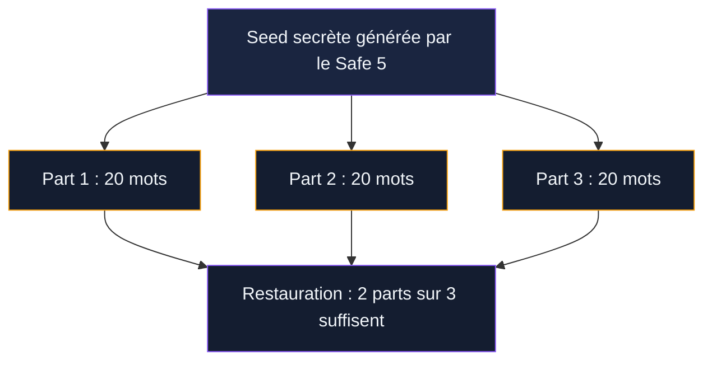
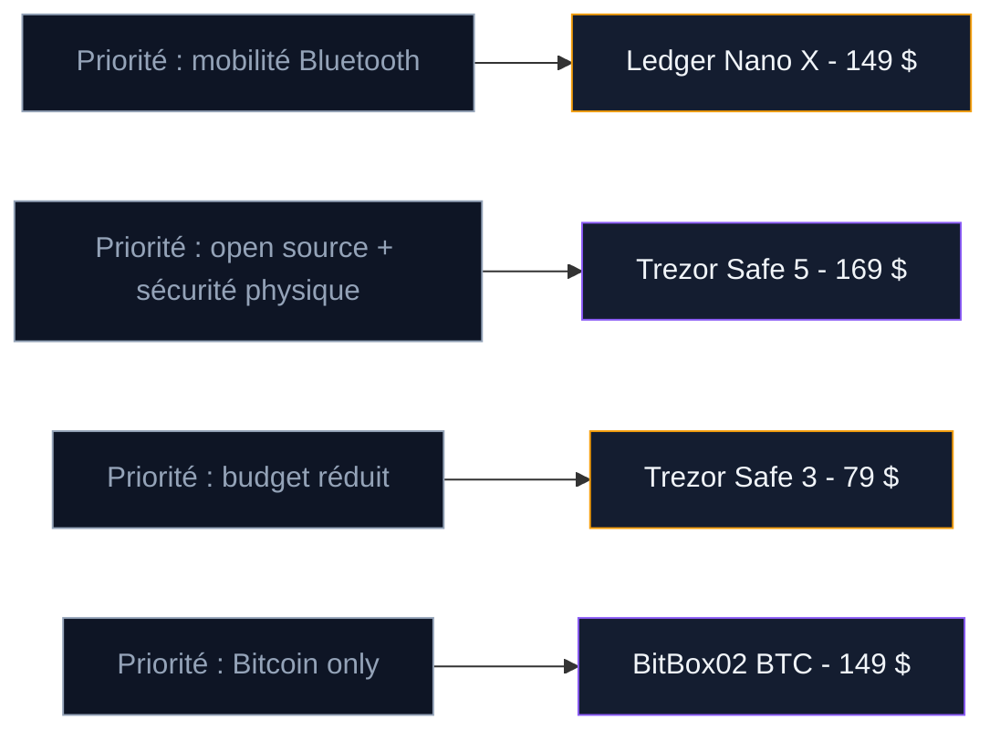

Le Trezor Safe 5 est le produit phare de SatoshiLabs, la société tchèque qui fabrique des hardware wallets depuis 2014. Lancé en 2024, il remplace le Trezor Model T avec un argument fort : un firmware 100% open source combiné à une puce Secure Element certifiée EAL6+. Jusqu'ici, il fallait choisir entre transparence du code et protection matérielle. Le Safe 5 promet les deux.

À 169 dollars (environ 155 EUR), il se positionne 20 dollars au-dessus du Ledger Nano X. L'écran tactile couleur, le retour haptique et le Shamir Backup justifient-ils cet écart ?

Nous avons testé le Trezor Safe 5 au quotidien pendant plusieurs semaines. Voici notre analyse.

## Fiche technique du Trezor Safe 5

| Caractéristique | Détail |
|-----------------|--------|
| Prix | 169 $ (environ 155 EUR) |
| Dimensions | 65,9 x 40 x 8 mm |
| Poids | 23 grammes |
| Écran | Tactile couleur 1,54 pouces, 240 x 240 pixels |
| Protection écran | Gorilla Glass 3 |
| Processeur | ARM Cortex-M33, 160 MHz |
| Connectivité | USB-C |
| Puce sécurisée | Secure Element certifié EAL6+ |
| Bluetooth | Non |
| Batterie | Non |
| Cryptos supportées | 8 000+ coins et tokens |
| Backup | 12, 20 ou 24 mots (BIP39 et SLIP39) |
| Code PIN | Jusqu'à 50 chiffres |
| Firmware | 100% open source |
| Fabriquant | SatoshiLabs (Prague, République tchèque) |

Le boîtier est en plastique PC-ABS avec une plaque arrière en aluminium anodisé. Trois coloris : Black Graphite, Violet Ore et Green Beryl. Le packaging contient l'appareil, un câble USB-C, deux cartes de sauvegarde de 20 mots et un guide de démarrage.

## Prise en main et design

Le Safe 5 est compact - plus petit qu'une carte de crédit et à peine plus épais qu'une clé USB. Ses 23 grammes le rendent facile à glisser dans une poche. La plaque en aluminium à l'arrière donne une impression de solidité que le Model T n'avait pas.

L'écran tactile couleur de 1,54 pouces est un vrai progrès par rapport aux boutons du Safe 3 et à l'écran résistif du Model T. Les couleurs sont vives, le texte est lisible, et le retour haptique (vibration) confirme chaque action. Quand vous tapez votre PIN ou validez une transaction, l'appareil vibre légèrement sous vos doigts. Ce détail change l'expérience : vous savez que votre action a été enregistrée sans regarder l'écran en permanence.

Le Gorilla Glass 3 protège l'écran contre les rayures. Après plusieurs semaines dans une poche avec des clés et de la monnaie, notre unité ne montrait aucune marque visible.

> [!TIP]
> Le Safe 5 est livré avec un film protecteur sur l'écran. Retirez-le avant utilisation pour profiter du retour haptique et de la réactivité tactile.

## Configuration initiale avec Trezor Suite

La configuration prend entre 10 et 15 minutes. Tout se passe via Trezor Suite, l'application officielle pour Windows, macOS et Linux (pas de version mobile autonome - le Safe 5 n'a pas de Bluetooth).

**Étape 1 : Télécharger Trezor Suite.** Rendez-vous sur trezor.io/trezor-suite. Vérifiez l'URL - des sites de phishing imitent la page officielle.

**Étape 2 : Brancher le Safe 5.** Utilisez le câble USB-C fourni. Trezor Suite détecte le wallet et propose la mise à jour du firmware si une version plus récente existe.

**Étape 3 : Choisir le type de backup.** Deux options :
- **Single-share** : une seed phrase classique de 12 ou 24 mots (compatible BIP39)
- **Multi-share (Shamir Backup)** : la seed est divisée en plusieurs parts de 20 mots chacune. Vous définissez le nombre total de parts et le seuil de restauration (par exemple, 3 parts sur 5)

**Étape 4 : Noter la seed phrase.** L'appareil affiche les mots un par un sur son écran. Écrivez-les sur les cartes fournies. Le Safe 5 utilise par défaut le standard SLIP39 avec des mots tirés d'une liste de 1 024 termes, choisis pour être faciles à distinguer les uns des autres.

**Étape 5 : Vérifier la seed.** L'appareil vous demande de confirmer certains mots en les sélectionnant sur l'écran tactile.

**Étape 6 : Définir le PIN.** Le Safe 5 accepte un code PIN allant jusqu'à 50 chiffres. Les chiffres apparaissent dans un ordre aléatoire à chaque saisie, ce qui empêche un observateur de deviner votre code. Après 16 tentatives erronées, l'appareil se réinitialise.

## Sécurité : open source et Secure Element réunis

Le Safe 5 est le premier wallet Trezor à combiner un firmware open source avec une puce Secure Element. C'est un tournant pour la marque.

### Le Secure Element EAL6+

La puce du Safe 5 porte la certification EAL6+, un niveau supérieur au EAL5+ des puces Ledger. Cette certification est délivrée par des laboratoires indépendants selon les Critères Communs (ISO/IEC 15408). Elle garantit que la puce résiste aux attaques physiques : analyse de courant, injection de fautes par laser, sondage électromagnétique.

Si quelqu'un vole votre Safe 5, il ne pourra pas extraire votre clé privée de la puce, même avec du matériel de laboratoire. Le Model T n'avait pas de Secure Element - des chercheurs avaient démontré qu'avec un accès physique et du matériel spécialisé, l'extraction de la seed était possible. Ce problème est corrigé sur le Safe 5.

### Le firmware open source

Tout le code du Safe 5 est publié sur GitHub. N'importe qui peut lire le firmware, le compiler et vérifier que l'appareil fait ce qu'il prétend. Les audits communautaires sont continus.

C'est la différence avec Ledger : la puce Secure Element de Ledger est couverte par des NDA avec STMicroelectronics. Ledger ne peut pas publier tout le code qui tourne sur cette puce. Avec le Safe 5, la puce stocke les secrets, mais le firmware qui orchestre le tout reste vérifiable.

> [!IMPORTANT]
> Le Trezor Safe 5 est le premier hardware wallet à combiner firmware 100% open source et puce Secure Element EAL6+. Vous pouvez vérifier le code sur GitHub et bénéficier d'une protection physique contre l'extraction de clé.

## Le Shamir Backup : une sauvegarde divisée

Le Shamir Backup (standard SLIP39) est une fonctionnalité que seuls les Trezor proposent. Au lieu d'une seule seed phrase de 24 mots, votre secret est divisé en plusieurs parts (appelées "recovery shares").

Vous choisissez deux paramètres : le nombre total de parts (jusqu'à 16) et le seuil de restauration. Exemple courant : 3 parts au total, 2 nécessaires pour restaurer. Vous notez chaque part de 20 mots sur un support séparé. Vous stockez une part chez vous, une dans un coffre bancaire, une chez un proche de confiance.

- **Contre le vol** : un voleur qui trouve une seule part ne peut rien en faire
- **Contre la perte** : si vous perdez une part (incendie, déménagement), les deux restantes suffisent
- **Pour la succession** : vous distribuez les parts entre plusieurs personnes de confiance, sans qu'aucune ne puisse accéder seule aux fonds

La restauration peut se faire en plusieurs sessions. Vous entrez la première part chez vous, puis la seconde à la banque un autre jour.

> [!NOTE]
> Le Shamir Backup n'est pas compatible avec le standard BIP39 utilisé par Ledger, BitBox ou Electrum. Si vous restaurez sur un wallet non-Trezor, vous devrez utiliser l'outil de conversion SLIP39 open source. Gardez ce point en tête avant de choisir ce format.

## Trezor Suite au quotidien

Trezor Suite est l'application desktop qui accompagne le Safe 5. Elle gère vos comptes, affiche vos soldes, construit les transactions et offre des fonctions avancées : staking intégré (Ethereum, Solana, Cardano), achat/vente de crypto par carte bancaire, swap entre cryptos, WalletConnect pour les DApps, coin control pour les UTXOs Bitcoin et connexion via Tor.

**Recevoir du bitcoin** : Suite génère une adresse de réception. Le Safe 5 l'affiche sur son écran tactile. Vous vérifiez les premiers et derniers caractères, puis partagez l'adresse.

**Envoyer du bitcoin** : vous entrez l'adresse et le montant dans Suite. Sur l'écran tactile, vous voyez l'adresse, le montant et les frais. Vous glissez le doigt pour valider. Le retour haptique confirme l'envoi.

**Passphrase avancée** : le Safe 5 permet d'ajouter un "25e mot" personnalisé à votre seed. Cette passphrase crée un wallet caché, invisible même si quelqu'un possède vos mots de backup. La saisie se fait sur l'écran du wallet, pas sur l'ordinateur - ce qui la protège des keyloggers.

Les limites de Suite : pas d'application mobile autonome (pas de Bluetooth), synchronisation parfois lente sur les comptes avec beaucoup de transactions, et frais de 2 à 5% sur les achats par carte et les swaps (comparable à Ledger Live).

## Les défauts constatés

**Pas de Bluetooth.** C'est le point le plus limitant. Il faut brancher l'appareil à un ordinateur avec un câble pour chaque opération. Le Ledger Nano X permet de tout faire depuis un smartphone.

**Écran tactile parfois trop sensible.** Sur la saisie du PIN, il arrive de toucher un mauvais chiffre avec des doigts mouillés ou les mains froides. Le retour haptique ne compense pas toujours le manque de précision.

**Compatibilité DeFi incomplète.** Certains tokens ou blockchains récentes ne sont pas supportés par Trezor Suite. Il faut alors passer par MetaMask ou MyEtherWallet.

> [!WARNING]
> Le Safe 5 n'a pas de Bluetooth. Toutes les opérations nécessitent un câble USB-C et un ordinateur. Si la gestion mobile compte pour vous, le Ledger Nano X reste plus adapté.

## Trezor Safe 5 vs Ledger Nano X vs Trezor Model T

| Critère | Trezor Safe 5 | Ledger Nano X | Trezor Model T |
|---------|---------------|---------------|----------------|
| Prix | 169 $ | 149 $ | Discontinué |
| Écran | Tactile couleur 1,54" | Monochrome 128x64 px | Tactile couleur 1,54" |
| Retour haptique | Oui | Non | Non |
| Secure Element | EAL6+ | EAL5+ (ST33) | Non |
| Open source | 100% | Partiel | 100% |
| Bluetooth | Non | Oui | Non |
| Batterie | Oui (5-7 ans) | Non | Non |
| Cryptos supportées | 8 000+ | 5 500+ | 8 000+ |
| Shamir Backup | Oui (SLIP39) | Non | Oui (SLIP39) |
| Poids | 23 g | 34 g | 22 g |
| Application | Trezor Suite | Ledger Live | Trezor Suite |

### Face au Ledger Nano X

Le Safe 5 coûte 20 dollars de plus et n'a pas de Bluetooth. Le Nano X a l'avantage de la mobilité : vous gérez vos cryptos depuis un smartphone, sans câble.

Le Safe 5 reprend l'avantage sur trois points : firmware open source vérifiable, puce Secure Element de niveau supérieur (EAL6+ contre EAL5+), et Shamir Backup. Le Nano X a aussi une batterie qui se dégrade après 5-7 ans et n'est pas remplaçable.

Si la transparence du code compte pour vous, le Safe 5 est le meilleur choix. Si la mobilité Bluetooth compte plus, prenez le Nano X.

### Face au Trezor Model T

Le Model T est le prédécesseur direct du Safe 5. Les deux ont un écran tactile et supportent Shamir Backup. La différence qui compte : le Safe 5 a un Secure Element, le Model T n'en a pas. Des chercheurs ont démontré des attaques physiques sur le Model T. Ce risque n'existe plus avec le Safe 5.

Le Safe 5 ajoute le retour haptique, le Gorilla Glass 3 et un processeur plus récent (Cortex-M33 vs Cortex-M4). Le Model T est en voie de discontinuation.

## À qui s'adresse le Trezor Safe 5

**Bon choix si vous :**
- Stockez plus de 1 000 EUR en crypto et voulez un wallet sécurisé et vérifiable
- Tenez à la transparence du code (firmware auditable, pas de boîte noire)
- Voulez diviser votre sauvegarde entre plusieurs lieux via Shamir Backup
- Gérez un portefeuille multi-crypto (Bitcoin, Ethereum, Solana, Cardano, tokens ERC-20)
- Utilisez principalement un ordinateur pour gérer vos cryptos

**Mauvais choix si vous :**
- Voulez gérer vos cryptos depuis un smartphone (pas de Bluetooth)
- Avez un budget serré (le Trezor Safe 3 à 79 dollars offre la même puce Secure Element)
- Ne détenez que du Bitcoin (le BitBox02 Bitcoin-only est plus minimaliste)
- Débutez avec moins de 500 EUR en crypto (un hot wallet gratuit suffit pour commencer)

## Conseils de sécurité

**Achetez sur trezor.io uniquement.** Ne commandez jamais sur Amazon, eBay ou un revendeur tiers. Des vendeurs malveillants pré-génèrent la seed, réarment l'appareil et volent vos fonds après dépôt.

**Vérifiez le sceau anti-effraction.** Le boîtier du Safe 5 a un système de fermeture ultrasonique - s'il a été ouvert, des traces sont visibles. Trezor Suite vérifie aussi l'authenticité du firmware au premier démarrage.

**Stockez votre seed sur métal.** Le papier brûle, se mouille et se dégrade. Les plaques en acier (Cryptosteel Capsule, Billfodl) coûtent entre 30 et 80 EUR et résistent au feu et à l'eau.

**Activez la passphrase pour les montants importants.** La passphrase crée un wallet caché qui n'est pas accessible avec la seed seule. Même si quelqu'un obtient vos mots de backup, il ne verra pas vos fonds sans la passphrase.

> [!CAUTION]
> Si vous utilisez une passphrase, notez-la sur un support physique séparé de votre seed. Si vous oubliez la passphrase, vos fonds dans le wallet caché sont perdus de façon permanente. Aucun support technique ne peut la récupérer.

## Notre verdict

Le Trezor Safe 5 représente la meilleure combinaison actuelle entre transparence et sécurité physique dans un hardware wallet. Le firmware open source permet à la communauté de vérifier ce que fait l'appareil. La puce Secure Element EAL6+ protège vos clés contre l'extraction physique. Le Shamir Backup offre une flexibilité de sauvegarde qu'aucun concurrent ne propose.

L'écran tactile couleur avec retour haptique rend l'utilisation agréable. La configuration via Trezor Suite est fluide. Le support de plus de 8 000 cryptos couvre la grande majorité des besoins.

Le point faible reste l'absence de Bluetooth. Pour un appareil à 169 dollars en 2025, devoir brancher un câble USB à chaque utilisation est une contrainte réelle, surtout face au Nano X qui fonctionne sans fil depuis 2019.

**On recommande le Safe 5 si** la transparence du code et le Shamir Backup comptent pour vous. **On recommande le Nano X** si la gestion mobile par Bluetooth est votre priorité. Les deux sont des wallets solides - le choix dépend de ce que vous valorisez le plus.
