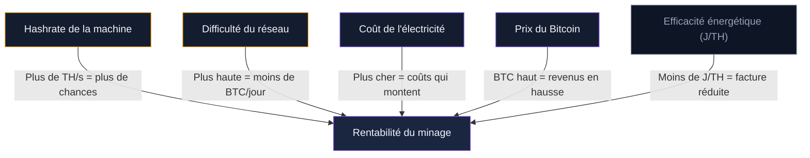
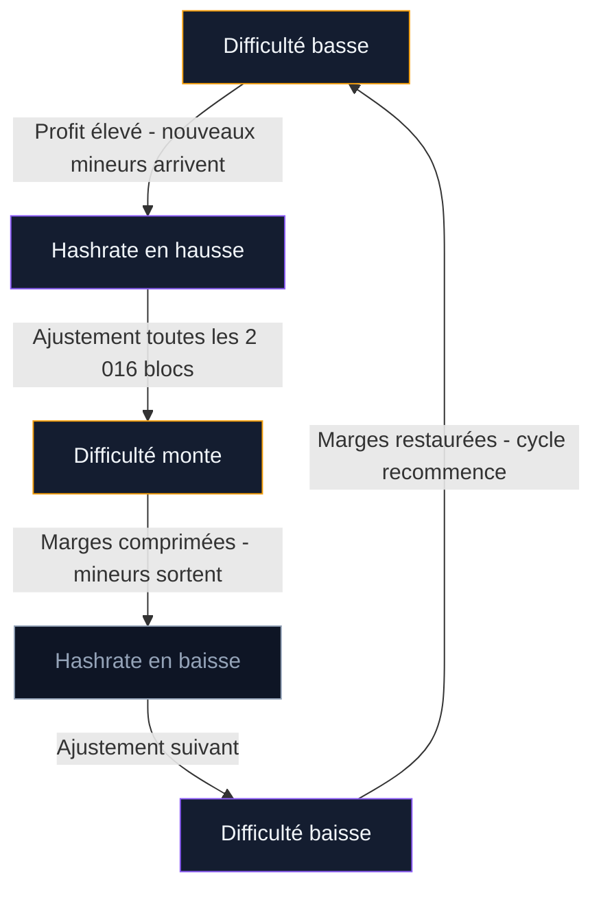

Avant de brancher un ASIC, la première question à trancher : est-ce que ça rapporte ? Le minage Bitcoin n'est rentable que si vos revenus en BTC dépassent vos coûts d'électricité, d'amortissement du matériel et de maintenance. Ce calcul dépend de cinq variables qui bougent en permanence. Mal les estimer, c'est perdre de l'argent chaque jour où la machine tourne.

Ce guide pose les formules, détaille chaque variable, applique le calcul à des cas réels avec les données de début 2026, et présente les simulateurs en ligne qui automatisent le travail.

## Les cinq variables du calcul de rentabilité

Cinq paramètres déterminent si votre machine va générer un profit ou creuser un déficit. Chacun interagit avec les autres - un seul changement peut faire basculer le résultat.

### 1. Le hashrate de votre machine

Le hashrate mesure la puissance de calcul de votre ASIC, en terahashes par seconde (TH/s). Un Antminer S21+ affiche 216 TH/s. Un S21 XP Hydro monte à 473 TH/s. Plus ce chiffre est élevé, plus votre machine produit de tentatives de résolution par seconde, et plus votre part du gâteau augmente.

Le hashrate détermine directement la quantité de BTC que vous pouvez espérer miner chaque jour. C'est le numérateur de l'équation.

### 2. La difficulté du réseau

La difficulté s'ajuste toutes les 2 016 blocs (environ 14 jours). Elle reflète la compétition globale entre mineurs. Début 2026, elle oscille autour de 125 800 milliards après un pic à 155 900 milliards en novembre 2025.

Quand la difficulté monte, votre machine mine moins de BTC par jour à hashrate égal. C'est le dénominateur de l'équation. Une hausse de 10 % de la difficulté réduit vos revenus de 10 %, toutes choses égales par ailleurs.

### 3. Le coût de l'électricité

C'est le premier poste de dépense. Un ASIC tourne 24 heures sur 24, 7 jours sur 7. La consommation se chiffre en kilowattheures (kWh). Au tarif français de 0,25 EUR/kWh, un Antminer S21+ (3 564 W) coûte 21,38 EUR/jour en électricité. Au tarif texan de 0,05 USD/kWh, le même appareil coûte 4,28 USD/jour.

L'écart entre ces deux chiffres fait la différence entre profit et perte.

### 4. Le prix du Bitcoin

La récompense de bloc est fixée en BTC (3,125 BTC depuis le halving d'avril 2024). Mais vos coûts sont en euros ou en dollars. Si le BTC vaut 85 000 EUR, vos revenus quotidiens exprimés en monnaie locale sont cinq fois plus élevés que si le BTC vaut 17 000 EUR.

Le prix du bitcoin agit comme un multiplicateur sur l'ensemble du calcul.

### 5. L'efficacité énergétique (J/TH)

Le ratio joules par terahash (J/TH) mesure la consommation électrique par unité de puissance de calcul. Un Antminer S21 XP Hydro affiche 12 J/TH. Un ancien S19 tourne à 30 J/TH. À hashrate égal, la machine la plus efficace consomme moins et laisse une marge plus large.

> [!TIP]
> L'efficacité énergétique (J/TH) est le critère le plus important à l'achat d'un ASIC. Un appareil à 12 J/TH consomme 2,5 fois moins qu'un modèle à 30 J/TH pour chaque terahash calculé.

## La formule de base du profit quotidien

Le calcul de rentabilité tient en une formule. Voici sa décomposition en deux étapes : revenu, puis profit.

### Étape 1 : estimer le revenu quotidien en BTC

La formule standard utilisée par les calculateurs en ligne :

**BTC/jour = (hashrate de la machine / hashrate total du réseau) x récompense de bloc x blocs par jour**

Les blocs par jour : 144 (un bloc toutes les 10 minutes en moyenne). La récompense de bloc : 3,125 BTC. Le hashrate total du réseau début 2026 tourne autour de 886 EH/s (886 000 000 TH/s), d'après Hashrate Index.

Application pour un Antminer S21+ à 216 TH/s :

- Part du réseau : 216 / 886 000 000 000 = 0,0000000244 %
- BTC/jour : 0,0000000244 x 3,125 x 144 = environ 0,0000110 BTC/jour

En pratique, les pools de minage ajoutent les frais de transaction à la récompense de bloc. Le revenu réel est légèrement supérieur, entre 5 et 15 % de plus selon la congestion du réseau.

### Étape 2 : calculer le profit quotidien

**Profit/jour = (BTC/jour x prix BTC en EUR) - (consommation en kW x 24 x coût du kWh)**

Prenons un BTC à 80 000 EUR et un S21+ :

- Revenu : 0,0000110 BTC x 80 000 EUR = 0,88 EUR/jour
- Coût électrique : 3,564 kW x 24h x 0,25 EUR = 21,38 EUR/jour
- **Profit : 0,88 - 21,38 = -20,50 EUR/jour**

Résultat : une perte sèche de 20,50 EUR par jour au tarif français.

> [!WARNING]
> Au tarif électrique français (0,25 EUR/kWh), aucun ASIC du marché ne génère un profit positif en minage de Bitcoin. Le seuil de rentabilité se situe sous 0,08 EUR/kWh pour les modèles actuels.

### Le seuil de rentabilité électrique

On peut aussi renverser la formule pour trouver le coût électrique maximum tolérable :

**Coût max/kWh = (BTC/jour x prix BTC) / (consommation en kW x 24)**

Pour le S21+ avec un BTC à 80 000 EUR :

- Coût max = 0,88 EUR / (3,564 x 24) = 0,0103 EUR/kWh

À 80 000 EUR le BTC, il faut une électricité à 0,01 EUR/kWh pour atteindre l'équilibre avec un S21+. C'est un tarif que seules les installations branchées directement sur des surplus hydroélectriques ou nucléaires peuvent obtenir.

Avec un BTC à 100 000 EUR, le seuil remonte à environ 0,013 EUR/kWh pour le S21+ et autour de 0,06 EUR/kWh pour le S21 XP Hydro (473 TH/s, 5 676 W, 12 J/TH), dont l'efficacité supérieure change la donne.

## Trois scénarios chiffrés : début 2026

Voici trois cas concrets pour visualiser la rentabilité selon le contexte.

### Scénario 1 : mineur en France, tarif résidentiel

| Paramètre | Valeur |
|-----------|--------|
| Machine | Antminer S21+ (216 TH/s, 3 564 W) |
| Électricité | 0,25 EUR/kWh |
| Difficulté | 125 800 milliards |
| Hashrate réseau | 886 EH/s |
| Prix BTC | 80 000 EUR |
| Revenu/jour | ~0,88 EUR |
| Coût électrique/jour | 21,38 EUR |
| **Profit/jour** | **-20,50 EUR** |
| **Perte/mois** | **-615 EUR** |

### Scénario 2 : ferme au Texas, tarif industriel

| Paramètre | Valeur |
|-----------|--------|
| Machine | Antminer S21 XP Hydro (473 TH/s, 5 676 W) |
| Électricité | 0,05 USD/kWh (~0,047 EUR/kWh) |
| Difficulté | 125 800 milliards |
| Hashrate réseau | 886 EH/s |
| Prix BTC | 85 000 USD |
| Revenu/jour | ~4,10 USD (avec frais tx) |
| Coût électrique/jour | 6,81 USD |
| **Profit/jour** | **-2,71 USD** |
| **Perte/mois** | **-81 USD** |

Même au Texas, la marge est négative début 2026 à ces niveaux de difficulté et de prix. Hashrate Index rapporte un hashprice qui a touché des plus bas sur plusieurs mois. Les fermes industrielles survivent grâce à des contrats électriques encore plus avantageux (0,03-0,04 $/kWh) et à des flottes de centaines de machines qui réduisent les coûts fixes par unité.

### Scénario 3 : ferme avec surplus hydroélectrique (Paraguay)

| Paramètre | Valeur |
|-----------|--------|
| Machine | Antminer S21 XP Hydro (473 TH/s, 5 676 W) |
| Électricité | 0,02 USD/kWh |
| Difficulté | 125 800 milliards |
| Hashrate réseau | 886 EH/s |
| Prix BTC | 85 000 USD |
| Revenu/jour | ~4,10 USD |
| Coût électrique/jour | 2,72 USD |
| **Profit/jour** | **+1,38 USD** |
| **Profit/mois** | **+41 USD** |

À 0,02 USD/kWh, le minage redevient positif. Mais le profit reste mince : 41 dollars par mois pour une machine qui coûte entre 10 000 et 15 000 USD. Le retour sur investissement se compte en années, pas en mois.

> [!NOTE]
> Le hashprice - le revenu par petahash par jour - est l'indicateur synthétique que les mineurs professionnels surveillent en priorité. Début 2026, il oscille entre 45 et 55 USD/PH/jour selon Hashrate Index, un niveau historiquement bas.

## Les variables cachées que les calculateurs oublient

Les simulateurs en ligne donnent un résultat brut. Plusieurs coûts supplémentaires réduisent la rentabilité réelle.

### L'amortissement du matériel

Un ASIC a une durée de vie de 3 à 5 ans avant d'être dépassé par des modèles plus efficaces. Si vous achetez un S21 XP Hydro à 12 000 USD et l'amortissez sur 3 ans, ça ajoute 11 USD/jour à vos coûts. Ce chiffre transforme un profit marginal en déficit.

### La baisse de la valeur de revente

Le prix du matériel chute vite. Un ASIC qui valait 80 $/TH en 2022 s'échange à 16 $/TH en 2025. Si la difficulté continue de monter, votre machine perd de la valeur chaque mois. Bitmain a brûlé les prix fin 2025 en vendant des lots de S19 XP+ Hydro à 4 $/TH.

### Les frais du pool de minage

Les pools prélèvent entre 0 et 4 % sur vos récompenses. Un pool FPPS à 2 % réduit votre revenu d'autant. Sur des marges déjà faibles, ça compte.

### Le refroidissement et la maintenance

En climat chaud, le refroidissement consomme de l'électricité supplémentaire (10 à 20 % au-dessus de la consommation de l'ASIC). Le remplacement de ventilateurs, les reboots, les pannes matérielles - tout ça a un coût en temps et en argent.

### La fiscalité

En France, les revenus du minage sont imposés en BNC (Bénéfices Non-Commerciaux). Selon votre régime (micro-BNC avec abattement de 34 % ou régime réel), l'impôt grignote entre un quart et la moitié de vos gains nets. Un profit brut de 50 EUR/mois peut se transformer en 30 EUR après impôts.

## Comment la difficulté écrase les projections

La difficulté est la variable la plus traître. Les calculateurs en ligne supposent souvent une difficulté constante. En réalité, elle s'ajuste toutes les deux semaines. Depuis 2020, la tendance est à la hausse quasi permanente.

Ce cycle d'équilibre est permanent. Quand le minage devient très rentable, de nouvelles machines sont branchées, la difficulté monte, et les marges se compressent. Quand les marges deviennent négatives, les mineurs les moins efficaces débranchent, la difficulté redescend, et la rentabilité remonte pour les survivants.

En 2025, la difficulté a grimpé de 75 000 milliards à 155 900 milliards en moins de 12 mois - une hausse de plus de 100 %. Un mineur qui aurait projeté sa rentabilité sur la difficulté de janvier 2025 aurait surestimé ses revenus de moitié pour le reste de l'année.

> [!IMPORTANT]
> Les calculateurs de rentabilité affichent un résultat instantané, pas une prévision. La difficulté peut doubler en un an. Toute projection au-delà de 30 jours est spéculative.

## Les meilleurs simulateurs en ligne

Quatre outils gratuits permettent d'estimer la rentabilité avec vos propres paramètres.

### CoinWarz Bitcoin Mining Calculator

**URL** : coinwarz.com/mining/bitcoin/calculator

Le plus complet. Il pré-charge la difficulté actuelle, le hashrate réseau et le prix du BTC. Vous entrez votre hashrate, votre consommation électrique et votre tarif kWh. Le résultat affiche le revenu et le profit sur 24 heures, 7 jours, 30 jours et 1 an.

Point fort : les projections tiennent compte des frais de pool et de la récompense de bloc exacte. Point faible : la difficulté est supposée constante.

### Hashrate Index Calculator

**URL** : hashrateindex.com/tools/calculator

Orienté vers les professionnels. Affiche le hashprice (revenu par PH/jour), la difficulté projetée et le prix BTC en temps réel. Le calculateur donne une vision synthétique de la marge par unité de puissance.

Données disponibles début 2026 : hashprice autour de 48 USD/PH/jour, difficulté projetée à 141,67 T, hashrate réseau à 886,93 EH/s, temps de bloc moyen à 11 minutes 37 secondes.

### ASIC Miner Value

**URL** : asicminervalue.com

Un comparateur qui classe les ASIC par profit quotidien. Chaque modèle affiche son hashrate, sa consommation, son efficacité et son profit estimé à un tarif électrique donné (par défaut 0,12 USD/kWh). Pratique pour comparer rapidement 50 modèles et identifier ceux qui restent rentables à votre tarif.

Début 2026, le Bitmain Antminer S21e XP Hyd 3U (860 TH/s, 11 180 W) affiche un profit d'environ 2,96 USD/jour à 0,12 USD/kWh - le seul modèle grand public encore en territoire positif à ce tarif.

### WhatToMine

**URL** : whattomine.com

Le calculateur multi-algorithme de référence. Pour le minage Bitcoin spécifiquement, entrez votre modèle d'ASIC et le simulateur calcule le revenu en tenant compte de la difficulté et des frais de pool. L'outil propose aussi un comparatif avec d'autres cryptomonnaies minables.

## Optimiser la rentabilité : les leviers qui restent

Si le calcul brut est négatif, quelques stratégies permettent d'améliorer la situation.

**Négocier le tarif électrique.** Les fermes industrielles obtiennent des contrats entre 0,03 et 0,05 USD/kWh. En France, les professionnels peuvent négocier des tarifs hors taxes avec des fournisseurs alternatifs, même si rester sous 0,10 EUR/kWh reste difficile sans accès direct à une source de production.

**Choisir le bon moment pour acheter le matériel.** Les prix des ASIC suivent le cours du BTC avec un décalage. En bear market, le matériel se vend à prix cassé. Acheter un ASIC pendant un creux du marché réduit le capital à amortir.

**Récupérer la chaleur.** En hiver, la chaleur d'un ASIC peut remplacer un radiateur électrique. L'électricité sert deux fois : chauffer et miner. Le coût net du minage devient nul si vous auriez de toute façon chauffé à l'électrique. Plusieurs entreprises (WiseMining, Heatbit) vendent des radiateurs intégrant des puces ASIC.

**Arbitrer entre FPPS et PPLNS.** Le mode de paiement du pool affecte vos revenus. Le FPPS offre un revenu stable en incluant une estimation des frais de transaction. Le PPLNS est plus variable mais peut rapporter davantage sur de longues périodes. Testez les deux et comparez sur 30 jours.

> [!TIP]
> Avant d'investir, simulez la rentabilité sur CoinWarz ou ASIC Miner Value avec votre tarif électrique réel. Ajoutez 15 % au coût électrique pour couvrir le refroidissement et la maintenance, et testez avec une difficulté en hausse de 5 % par mois.

## Le calcul de retour sur investissement (ROI)

Le profit quotidien ne suffit pas. Il faut aussi calculer le temps nécessaire pour rembourser l'achat de la machine.

**ROI en jours = prix d'achat de l'ASIC / profit net quotidien**

Exemple avec un scénario favorable : un S21 XP Hydro acheté 12 000 USD, profit net de 1,38 USD/jour (scénario Paraguay ci-dessus).

- ROI = 12 000 / 1,38 = 8 695 jours, soit environ 24 ans.

Ce chiffre montre la réalité du minage en 2026 pour un petit opérateur. Le ROI ne tient même pas compte de la dépréciation du matériel, qui sera dépassé bien avant d'être amorti.

Les fermes industrielles atteignent des ROI de 12 à 24 mois grâce à des coûts électriques sous 0,04 USD/kWh, des achats groupés de matériel à prix négocié et des économies d'échelle sur la maintenance. C'est un business de volume et de marges fines, pas un investissement pour un particulier cherchant un retour rapide.

## Quand le minage redevient-il rentable ?

Deux événements peuvent renverser la situation :

**Une hausse du prix du Bitcoin.** Si le BTC passe de 85 000 à 150 000 USD, les revenus quotidiens augmentent de 76 %. À ce niveau, même les mineurs avec une électricité à 0,08 USD/kWh retrouvent des marges positives sur les derniers modèles d'ASIC.

**Une baisse de la difficulté.** Quand des mineurs débranchent en masse (électricité trop chère, prix BTC en baisse), la difficulté s'ajuste à la baisse. Les survivants récupèrent une part plus grande du gâteau. C'est ce mécanisme d'auto-régulation qui empêche le minage de disparaître complètement, même dans les pires conditions de marché.

Le halving prévu pour 2028 réduira la récompense à 1,5625 BTC par bloc. Sauf hausse proportionnelle du prix du BTC ou baisse de la difficulté, ce prochain halving comprimera encore les marges. Les mineurs qui survivront sont ceux qui auront sécurisé l'électricité la moins chère et le matériel le plus efficace.

Le calcul de rentabilité n'est jamais définitif. C'est un exercice à refaire chaque mois avec les données actualisées. Les outils existent, les formules sont simples - ce qui change, c'est le marché.
