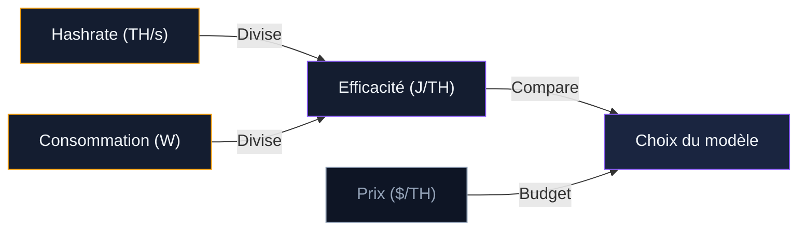
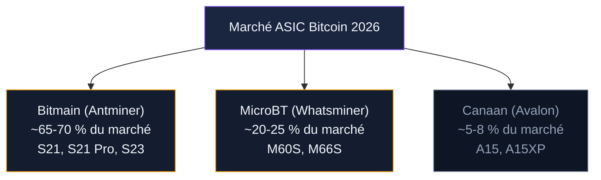

Un ASIC (Application-Specific Integrated Circuit) est une puce conçue pour une seule tâche : calculer des hashs SHA-256. Rien d'autre. Pas de jeux vidéo, pas de tableur, pas de navigateur web. Cette spécialisation donne aux ASIC une avance de plusieurs ordres de grandeur sur n'importe quel processeur généraliste ou carte graphique pour le minage de Bitcoin.

En 2026, trois fabricants dominent le marché : Bitmain (gamme Antminer), MicroBT (gamme Whatsminer) et Canaan (gamme Avalon). Leurs machines ont beaucoup évolué en cinq ans. L'efficacité est passée de 30+ J/TH à moins de 10 J/TH sur les modèles les plus récents. Les prix ont aussi chuté : le coût au terahash est tombé de 80 $ en 2022 à environ 16 $ début 2026.

Ce guide passe en revue les modèles actuels, compare leurs performances, détaille les critères de choix et liste les canaux d'achat fiables.

## Ce qu'il faut comprendre avant de choisir un ASIC

Quatre chiffres définissent un mineur ASIC. Si vous ne retenez que ça, retenez ces quatre métriques.

**Le hashrate (TH/s)** mesure la puissance de calcul. Un Antminer S21+ affiche 216 TH/s - il teste 216 000 milliards de combinaisons par seconde. Plus le hashrate est élevé, plus votre part du réseau augmente et plus vous minez de BTC par jour.

**La consommation (watts)** détermine votre facture d'électricité. Un ASIC tourne 24h/24, 7j/7. Chaque watt compte. Un appareil de 3 500 W consomme 84 kWh par jour, soit 21 EUR/jour au tarif français (0,25 EUR/kWh) ou 4,20 USD/jour au tarif texan (0,05 USD/kWh).

**L'efficacité (J/TH)** est le ratio entre consommation et hashrate. C'est la métrique la plus importante pour comparer des ASIC entre eux. Un appareil à 15 J/TH dépense 15 joules pour chaque terahash calculé. Plus ce chiffre est bas, mieux c'est. Sous 20 J/TH, on parle de matériel compétitif en 2026. Sous 12 J/TH, c'est le haut de gamme.

**Le prix** s'exprime souvent en dollars par terahash ($/TH). Ce ratio permet de comparer des machines de puissances différentes. En 2026, comptez 14-20 $/TH pour du matériel neuf de dernière génération, et 4-8 $/TH pour des modèles reconditionnés.

> [!TIP]
> L'efficacité en J/TH est le meilleur indicateur pour comparer deux ASIC. Entre un modèle à 16 J/TH et un autre à 20 J/TH, le premier consomme 20 % d'électricité en moins pour la même puissance de calcul.

## Comparatif des ASIC Bitcoin en 2026

### Modèles air-cooled (refroidissement par air)

Le refroidissement par air est le standard. L'appareil aspire l'air ambiant, le fait passer sur les puces, et l'expulse chaud de l'autre côté. Simple, pas de maintenance particulière, mais bruyant (70-80 dB).

| Modèle | Hashrate | Consommation | Efficacité | Prix estimé | $/TH |
|--------|----------|-------------|------------|-------------|------|
| Bitmain Antminer S21+ | 216 TH/s | 3 564 W | 16,5 J/TH | ~3 450 $ | ~16 $ |
| Bitmain Antminer S21 Pro | 234 TH/s | 3 510 W | 15 J/TH | ~3 750 $ | ~16 $ |
| Bitmain Antminer S23 | ~260 TH/s | 2 470 W | 9,5 J/TH | ~5 200 $ | ~20 $ |
| MicroBT Whatsminer M60S | 186 TH/s | 3 441 W | 18,5 J/TH | ~2 600 $ | ~14 $ |
| MicroBT Whatsminer M66S | 298 TH/s | 5 513 W | 18,5 J/TH | ~4 200 $ | ~14 $ |
| Canaan Avalon A15XP | 206 TH/s | 3 367 W | 16,3 J/TH | ~3 100 $ | ~15 $ |

### Modèles hydro et immersion (refroidissement liquide)

Le refroidissement liquide permet de pousser les puces plus fort, d'obtenir un meilleur hashrate et de réduire le bruit. En contrepartie, l'installation est plus complexe et le coût initial plus élevé. Ces modèles sont destinés aux opérations semi-professionnelles ou professionnelles.

| Modèle | Hashrate | Consommation | Efficacité | Refroidissement |
|--------|----------|-------------|------------|-----------------|
| Bitmain Antminer S21 XP Hydro | 473 TH/s | 5 676 W | 12 J/TH | Hydro |
| Bitmain Antminer S21 XP Immersion | 270 TH/s | 4 050 W | 15 J/TH | Immersion |
| MicroBT Whatsminer M63S Hydro | 390 TH/s | 7 215 W | 18,5 J/TH | Hydro |

> [!NOTE]
> Les modèles hydro nécessitent un circuit d'eau fermé avec échangeur de chaleur. L'installation coûte 500 à 2 000 $ de plus que l'air-cooling, mais le bruit tombe sous 50 dB et l'efficacité s'améliore de 10 à 15 %.

### Bitmain Antminer S23 : la nouvelle référence

Bitmain a annoncé l'Antminer S23 fin 2025, avec une efficacité de 9,5 J/TH. C'est le premier ASIC air-cooled grand public à passer sous la barre des 10 J/TH. La puce 5 nm de nouvelle génération consomme moins pour un hashrate supérieur. Les premières livraisons ont démarré début 2026. A ce niveau d'efficacité, le seuil de rentabilité se situe bien plus haut en termes de prix d'électricité, ce qui ouvre le minage à davantage de géographies.

## Les trois fabricants : forces et faiblesses

### Bitmain (Antminer)

Le leader historique. Bitmain contrôle environ 65-70 % du marché des ASIC Bitcoin. La gamme Antminer couvre tous les segments : du S19 (entrée de gamme reconditionné) au S21 XP Hydro (haut de gamme). Points forts : fiabilité éprouvée, firmware mature, large réseau de revendeurs et pièces de rechange disponibles. Point faible : prix plus élevés que la concurrence, et des promotions agressives de fin de série qui font chuter la valeur de revente des anciens modèles.

### MicroBT (Whatsminer)

Le challenger numéro deux. MicroBT propose des machines souvent moins chères au terahash que Bitmain, avec une fiabilité comparable. La gamme M60/M66 offre un bon rapport puissance/prix. Le firmware est moins personnalisable, et le réseau de SAV est plus restreint hors d'Asie.

### Canaan (Avalon)

Troisième acteur, plus discret. Les Avalon A15 sont compétitifs en efficacité (16,3 J/TH pour le A15XP), à un prix souvent inférieur aux Antminer. Canaan est coté en bourse (Nasdaq : CAN), ce qui apporte de la transparence financière. Le support technique est moins réactif et les modèles sortent avec du retard par rapport à Bitmain.

## Où acheter un ASIC : canaux fiables et arnaques à éviter

### Canaux d'achat recommandés

**Directement chez le fabricant.** Bitmain (shop.bitmain.com), MicroBT et Canaan vendent en direct. C'est la source la plus sûre pour du matériel neuf avec garantie constructeur (6 à 12 mois selon le modèle). Les délais de livraison varient de 2 à 8 semaines. Les paiements se font souvent en virement bancaire, crypto ou carte.

**Revendeurs agréés.** Des distributeurs comme Kaboomracks (USA), Coin Mining Central (UK) ou D-Central (Canada) sont des revendeurs officiels. Ils proposent du stock immédiat, du reconditionné et parfois du SAV local. Vérifiez que le revendeur figure sur la liste officielle du fabricant.

**Marché de l'occasion.** Les ASIC d'occasion se trouvent sur des plateformes spécialisées (Kaboomracks, eBay avec vendeurs vérifiés, forums comme Bitcointalk). Le prix est 30 à 60 % inférieur au neuf. Le risque : matériel usé, hashrate dégradé, pas de garantie.

**Amazon.** On y trouve des ASIC neufs et reconditionnés. Les prix sont souvent gonflés par rapport à l'achat direct. Vérifiez le vendeur, lisez les avis, et méfiez-vous des listings à prix trop bas.

### Les arnaques courantes

Le marché des ASIC attire les escrocs. Voici les schémas les plus fréquents.

**Sites web frauduleux.** Des copies de shop.bitmain.com avec une URL légèrement modifiée (bitmain-shop.com, bitmainstore.net...). Ils encaissent le paiement et ne livrent jamais. Vérifiez toujours l'URL exacte avant de payer.

**Matériel trafiqué.** Des ASIC avec un firmware modifié qui affiche un hashrate gonflé pendant les tests, puis revient à sa vraie puissance. Testez la machine au moins 24h avant de valider un achat d'occasion.

**Préventes fictives.** Des "lots promotionnels" de machines pas encore sorties, à prix cassé, avec livraison dans 3 mois. Le vendeur disparaît avec l'argent. Ne payez jamais l'intégralité d'une commande sur un produit non disponible chez un revendeur inconnu.

**Cloud mining déguisé.** Certains vendeurs proposent d'acheter un ASIC qu'ils "hébergent pour vous" dans leur ferme. Vous ne voyez jamais la machine, les relevés de minage sont invérifiables, et les retraits deviennent impossibles après quelques mois.

> [!CAUTION]
> Ne commandez jamais sur un site dont l'URL ressemble à celle du fabricant sans être exactement la bonne. Bitmain vend uniquement via shop.bitmain.com. Tout autre domaine est suspect. En cas de doute, contactez le support officiel du fabricant pour confirmer.

## Installation et prérequis techniques

### Alimentation électrique

Un ASIC de 3 500 W nécessite une prise dédiée en 220-240V avec un disjoncteur de 20A minimum. En France, une prise standard supporte 2 300 W (10A) ou 3 680 W (16A). Pour les modèles les plus gourmands (5 000 W+), un raccordement en triphasé ou un circuit dédié avec disjoncteur 32A est nécessaire. Faites vérifier votre installation par un électricien avant de brancher quoi que ce soit.

La plupart des ASIC sont livrés avec une alimentation intégrée (PSU). Certains modèles plus anciens (série S9, S17) nécessitent une alimentation externe de type APW. Vérifiez ce point avant l'achat.

### Ventilation et bruit

Un ASIC air-cooled produit entre 70 et 80 dB. C'est le niveau d'un aspirateur industriel en continu. L'installer dans un salon ou une chambre est inenvisageable. Les options réalistes : un garage isolé, un local technique, un conteneur (mining pod) insonorisé, ou un sous-sol ventilé.

La chaleur dégagée est proportionnelle à la consommation. Un appareil de 3 500 W produit 3 500 W de chaleur - autant qu'un gros radiateur. Il faut extraire cet air chaud et le remplacer par de l'air frais. En été, la température ambiante au-dessus de 35°C dégrade les performances et peut déclencher l'arrêt automatique de la machine.

### Connexion réseau

Un câble Ethernet suffit. L'ASIC consomme très peu de bande passante (quelques Mo par jour). La latence compte davantage que le débit : une connexion stable avec un ping inférieur à 100 ms vers le serveur du pool est suffisante. Le Wi-Fi fonctionne sur certains modèles récents (Bitaxe, NerdMiner), mais le filaire reste plus fiable pour une machine qui tourne en permanence.

### Configuration logicielle

La configuration passe par l'interface web de l'ASIC. Vous accédez à l'adresse IP locale de la machine depuis un navigateur, puis vous saisissez :

- L'URL du pool de minage (ex: stratum+tcp://pool.example.com:3333)
- Votre identifiant worker (souvent votre adresse Bitcoin ou un nom personnalisé)
- Le mot de passe worker (souvent "x" ou vide)

Les firmwares tiers comme Braiins OS+ (compatible Antminer) offrent de l'autotuning : la machine ajuste dynamiquement sa fréquence et sa tension pour optimiser l'efficacité. Braiins revendique 10 à 20 % de gains d'efficacité sur les S19 et S21.

> [!IMPORTANT]
> Avant de brancher un ASIC, faites vérifier votre installation électrique. Un appareil de 3 500 W sur un circuit sous-dimensionné peut provoquer une surchauffe du câblage ou un déclenchement du disjoncteur principal.

## Neuf vs reconditionné : quel choix selon votre budget

Le marché du reconditionné s'est structuré depuis 2024. Après chaque génération de machines, les fermes professionnelles revendent leur flotte pour passer au modèle suivant. Les prix du reconditionné sont attractifs.

**Antminer S19 XP (140 TH/s, 21,5 J/TH)** : disponible autour de 800-1 200 $ reconditionné. C'était le haut de gamme en 2023. Son efficacité (21,5 J/TH) le rend borderline en rentabilité à 0,07 $/kWh, mais viable à 0,04-0,05 $/kWh.

**Antminer S19 XP+ Hydro** : Bitmain a liquidé des stocks fin 2025 autour de 4 $/TH, soit environ 1 000-1 500 $ l'unité. Avec un système hydro déjà en place, c'est une bonne affaire.

**Whatsminer M50/M50S** : des machines fiables de la génération 2023, autour de 600-900 $ en reconditionné. Efficacité de 22-26 J/TH - rentable uniquement avec une électricité très bon marché.

Le matériel reconditionné a un risque : durée de vie réduite (les ventilateurs et hashboards s'usent), pas de garantie constructeur, et un hashrate parfois 5 à 10 % sous les specs. Achetez auprès de revendeurs qui testent et garantissent les machines 30 à 90 jours.

## Rentabilité estimée par modèle

Les chiffres ci-dessous utilisent les paramètres de février 2026 : difficulté ~125 800 milliards, BTC ~95 000 USD, récompense 3,125 BTC/bloc.

| Modèle | Profit/jour (0,05 $/kWh) | Profit/jour (0,07 $/kWh) | Profit/jour (0,10 $/kWh) |
|--------|--------------------------|--------------------------|--------------------------|
| Antminer S21+ (216 TH/s) | ~12,50 $ | ~10,80 $ | ~8,20 $ |
| Antminer S21 Pro (234 TH/s) | ~14,30 $ | ~12,30 $ | ~9,50 $ |
| Antminer S23 (~260 TH/s) | ~17,80 $ | ~16,60 $ | ~14,80 $ |
| Whatsminer M66S (298 TH/s) | ~14,00 $ | ~11,40 $ | ~7,20 $ |
| S21 XP Hydro (473 TH/s) | ~25,50 $ | ~22,10 $ | ~16,80 $ |
| S19 XP recond. (140 TH/s) | ~4,20 $ | ~2,10 $ | -1,20 $ |

A 0,10 $/kWh, les modèles anciens (S19 XP) passent en perte. A 0,25 EUR/kWh (tarif résidentiel français), toutes les machines sont déficitaires. Le minage en France ne tient qu'avec un tarif industriel ou un surplus d'énergie renouvelable.

> [!WARNING]
> Ces profits ne comptent pas l'amortissement du matériel. Un ASIC à 3 500 $ qui rapporte 10 $/jour met 350 jours à se rembourser - si la difficulté et le prix du BTC restent stables, ce qui n'arrive jamais.

## Checklist avant achat

Avant de commander un ASIC, vérifiez ces points :

1. **Calculez la rentabilité** avec votre tarif d'électricité réel. Utilisez WhatToMine ou Hashrate Index.
2. **Vérifiez votre installation électrique** : capacité du disjoncteur, tension disponible (220V ou 110V).
3. **Préparez le local** : extraction d'air chaud, isolation phonique si nécessaire, température ambiante contrôlée.
4. **Choisissez votre pool** avant de recevoir la machine. Créez votre compte et récupérez les infos de connexion.
5. **Prévoyez le bruit** : 75 dB en continu, c'est incompatible avec un espace de vie.
6. **Vérifiez le vendeur** : URL officielle du fabricant ou revendeur agréé listé sur le site du constructeur.
7. **Anticipez la revente** : les ASIC perdent de la valeur vite. Chaque nouvelle génération rend la précédente moins compétitive.

Le matériel ASIC est un investissement qui se déprécie. Contrairement au Bitcoin lui-même, un mineur perd de la valeur chaque mois à mesure que des machines plus efficaces arrivent sur le marché. Le retour sur investissement se joue sur 8 à 18 mois dans les bonnes conditions. Au-delà, la machine est souvent revendue ou reconvertie en chauffage.
