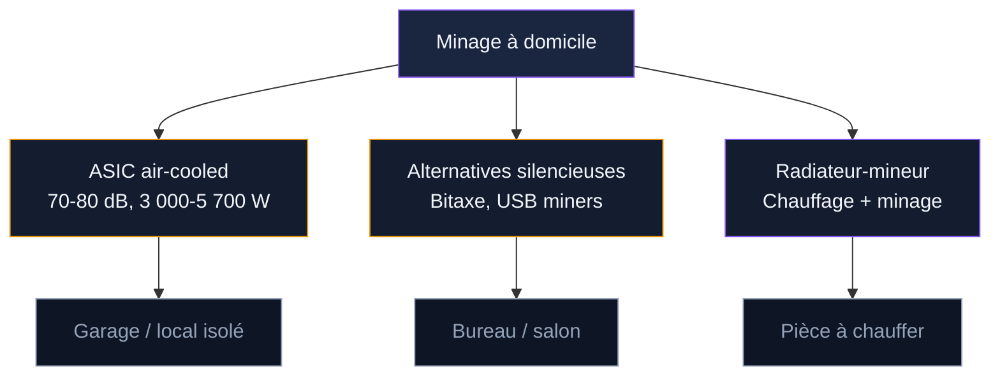
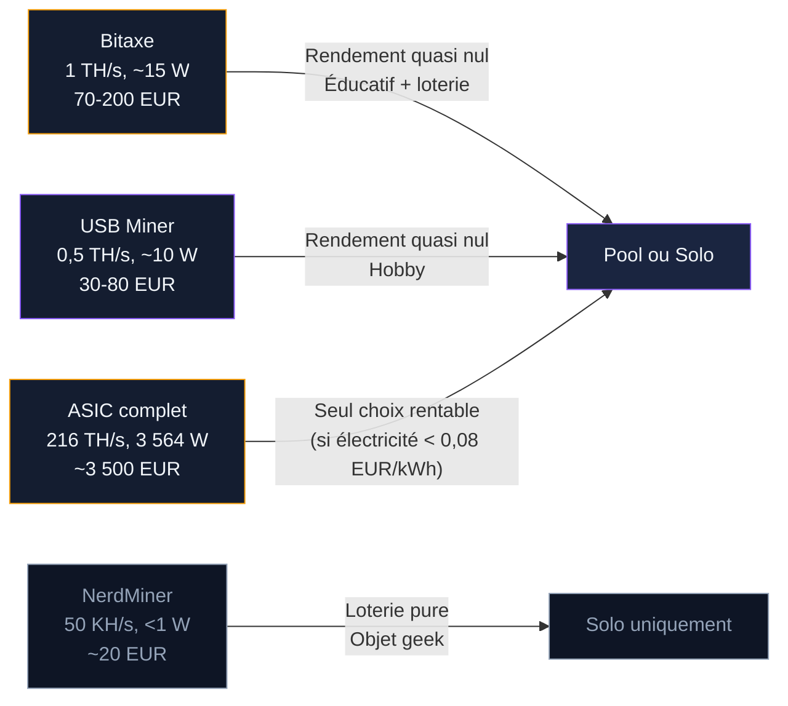

Miner du Bitcoin depuis son appartement ou sa maison, c'est techniquement possible. Brancher un ASIC, le connecter à un pool, laisser tourner. Mais entre "possible" et "viable", il y a un gouffre. En France, le tarif électrique résidentiel à 0,25 EUR/kWh rend le minage classique déficitaire. Un ASIC de 3 500 W qui tourne 24h/24 génère plus de bruit qu'un aspirateur industriel. Et la chaleur dégagée transforme la pièce en sauna.

Ce guide couvre tout ce qu'il faut savoir avant de brancher quoi que ce soit chez soi : installation électrique, gestion du bruit et de la chaleur, cadre légal et fiscal en France, calcul de rentabilité au tarif français, et les alternatives qui rendent le minage domestique un peu plus raisonnable en 2026.

## Ce que "miner chez soi" signifie en 2026

Le minage de Bitcoin à domicile n'a plus rien à voir avec ce qu'il était en 2011, quand un PC de bureau suffisait. Aujourd'hui, la difficulté du réseau dépasse 125 000 milliards. Le hashrate global oscille autour de 900 millions de TH/s. Un ordinateur classique - même avec une carte graphique puissante - ne produit pas assez de hashs pour couvrir sa consommation électrique.

Miner du BTC à domicile, ça signifie installer un ASIC (Application-Specific Integrated Circuit) dans son logement. Une machine dédiée, bruyante, gourmande en électricité, qui calcule des hashs SHA-256 en continu. Les modèles courants consomment entre 3 000 et 5 700 watts et produisent entre 70 et 80 décibels de bruit.

Trois approches coexistent : le minage classique avec un ASIC pleine puissance (bruyant, chaud, potentiellement rentable uniquement avec une électricité bon marché), les mini-mineurs type Bitaxe ou NerdMiner (silencieux, peu coûteux, presque zéro rendement financier), et les radiateurs-mineurs qui transforment la chaleur en chauffage domestique.

## L'installation électrique : prérequis en France

Un ASIC n'est pas un grille-pain. Un Antminer S21+ consomme 3 564 W en continu - plus qu'un four électrique à pleine puissance. Brancher ça sur une prise standard de 10A (2 300 W max) est dangereux.

**Tension et prise.** Le réseau domestique français fournit du 230V monophasé. Un ASIC de 3 500 W nécessite une prise dédiée sur un circuit en 2,5 mm² protégé par un disjoncteur de 20A (4 600 W max). Pour les modèles plus gourmands comme le Whatsminer M66S (5 513 W), il faut un circuit en 6 mm² avec disjoncteur 32A, ou un raccordement triphasé.

**Disjoncteur dédié.** L'ASIC doit avoir son propre circuit. Partagez le circuit avec d'autres appareils et vous risquez des déclenchements intempestifs, voire une surchauffe du câblage.

**Compteur Linky et puissance souscrite.** Un ASIC de 3 500 W qui tourne 24h/24 ajoute environ 2 520 kWh par mois à votre consommation - l'équivalent d'un foyer français moyen. Vérifiez que votre abonnement supporte la charge : un contrat de 6 kVA ne tiendra pas. Prévoyez 9 ou 12 kVA minimum, ce qui augmente l'abonnement mensuel d'une vingtaine d'euros.

> [!WARNING]
> Ne branchez jamais un ASIC sur une rallonge ou une multiprise. Un appareil de 3 500 W nécessite une prise murale dédiée avec disjoncteur 20A minimum. Faites vérifier l'installation par un électricien agréé.

## Bruit et chaleur : les deux ennemis du minage domestique

### Le bruit : 75 dB en continu

Un ASIC air-cooled de type Antminer S21 produit entre 72 et 80 dB - entre un aspirateur et une perceuse, mais sans jamais s'arrêter.

**En appartement**, c'est incompatible. Le bruit traverse les murs et les plafonds. Les troubles de voisinage sont sanctionnés par la loi (article R1336-5 du Code de la santé publique). **En maison**, les options existent : garage détaché, abri de jardin isolé, sous-sol ventilé. Prévoyez des panneaux de mousse acoustique et une distance d'au moins 10 mètres des pièces de vie.

Le **mining pod** (conteneur insonorisé, à partir de 500 EUR) réduit le bruit de 20 à 30 dB mais retient la chaleur - il faut coupler avec un système d'extraction. L'**underclocking** via un firmware comme Braiins OS+ est une autre option : un S21+ ramené à 150 TH/s descend à 60-65 dB et consomme 30 % d'électricité en moins.

### La chaleur : 3 500 W de dégagement thermique

Un ASIC convertit 100 % de l'électricité en chaleur. Un appareil de 3 500 W dégage autant qu'un gros radiateur. Sans extraction, la pièce dépasse 40°C en quelques heures et la machine s'arrête (protection thermique à 85-90°C). La solution minimale : une gaine de 150 ou 200 mm connectée à un extracteur type VMC.

Les ASIC fonctionnent entre 5 et 40°C. Les étés caniculaires français posent un vrai problème - au-delà de 35°C ambiant, les performances se dégradent.

> [!TIP]
> En hiver, redirigez la chaleur de l'ASIC vers les pièces à chauffer avec une gaine d'extraction. En été, évacuez-la dehors. Ce basculement saisonnier optimise la facture énergétique.

## Rentabilité au tarif français : le calcul qui fait mal

Le tarif réglementé d'EDF en 2025-2026 tourne autour de 0,2516 EUR/kWh TTC (tarif bleu option base). C'est trois à cinq fois plus cher que dans les pays où le minage est rentable.

Prenons l'Antminer S21+ (216 TH/s, 3 564 W, 16,5 J/TH) :

| Poste | Valeur |
|-------|--------|
| Consommation journalière | 85,5 kWh |
| Coût électrique par jour (0,25 EUR/kWh) | 21,38 EUR |
| Revenu estimé par jour (pool FPPS, BTC ~95 000 USD) | ~9,50 EUR |
| **Résultat net par jour** | **-11,88 EUR** |
| **Perte mensuelle** | **-356 EUR** |
| **Perte annuelle** | **-4 336 EUR** |

À 0,25 EUR/kWh, vous perdez 12 EUR chaque jour. Sur un an, c'est plus de 4 300 EUR de déficit - sans compter le prix d'achat de l'ASIC (environ 3 500 EUR). Le seuil de rentabilité pour un S21+ se situe autour de 0,07 EUR/kWh. Pour le S23 (9,5 J/TH), il monte à environ 0,11 EUR/kWh. Aucun de ces seuils n'est atteignable au tarif résidentiel.

**L'option heures creuses** (0,20 EUR/kWh la nuit) réduit les pertes sans les éliminer. **L'option panneaux solaires** (coût marginal à zéro sur l'autoconsommation) bute sur la production limitée à 6-8 heures par jour et un rendement en baisse l'hiver.

> [!CAUTION]
> Au tarif résidentiel français, le minage Bitcoin génère une perte nette de plus de 4 000 EUR par an pour un seul ASIC. Vérifiez votre coût électrique réel au kWh, toutes taxes comprises, avant de vous lancer.

## Légalité et fiscalité du minage en France

### Le cadre légal

Le minage est légal en France. Aucune licence ni déclaration spécifique n'est requise. Quelques limites : le bruit peut constituer un trouble anormal de voisinage (émergence sonore limitée à 5 dB le jour, 3 dB la nuit). Un mining pod dans le jardin peut nécessiter une déclaration de travaux si la surface dépasse 5 m². Signalez la présence de l'ASIC à votre assureur habitation pour éviter un refus d'indemnisation en cas de sinistre.

### La fiscalité : BNC et double imposition

Les bitcoins minés sont imposables en BNC (Bénéfices Non-Commerciaux). Sous 77 700 EUR de recettes annuelles, le régime micro-BNC applique un abattement de 34 %. Au-delà, le régime réel permet de déduire l'électricité, l'amortissement du matériel et les frais de connexion.

À la revente des BTC minés, une deuxième couche s'applique : la plus-value est soumise au PFU de 30 % (flat tax), calculée sur la différence entre le prix de vente et la valeur au moment du minage.

> [!IMPORTANT]
> Chaque BTC miné doit être enregistré avec sa date de réception et le cours EUR du jour. Ce registre est obligatoire pour calculer vos BNC et vos plus-values de cession.

## Alternatives au minage classique : Bitaxe, USB miners, solo lottery

Le minage classique à domicile est bruyant, chaud et déficitaire en France. D'autres approches existent pour les passionnés.

### Bitaxe : le minage open source à petite échelle

Le Bitaxe est un mineur Bitcoin open source basé sur une seule puce ASIC (BM1366 ou BM1368). Petit circuit imprimé, pas plus grand qu'une carte de crédit, 12 à 25 watts, 0,5 à 1,2 TH/s. Silencieux, pas cher (70 à 200 EUR), 100 % open source. Le rendement est quasi nul (0,003 EUR/jour en pool FPPS), mais l'intérêt est éducatif : comprendre le minage de l'intérieur.

### NerdMiner et USB miners

Le NerdMiner v2 (microcontrôleur ESP32) mine à 50 KH/s pour moins d'un watt - un objet éducatif et un ticket de loterie perpétuel. Les USB miners type GekkoScience Compac F (300-500 GH/s, 5-15 W, 30-80 EUR) offrent un rendement tout aussi négligeable, mais restent un bon outil d'apprentissage.

### Solo mining lottery

Le minage solo avec un petit appareil est une loterie pure. Si votre machine trouve un bloc, vous empochez 3,125 BTC (environ 280 000 EUR). En 2024, un mineur solo avec un Bitaxe à 3 TH/s a validé un bloc - un exploit comparable à un gain au loto. Un Bitaxe à 1 TH/s doit tourner en moyenne plus de 6 000 ans avant de trouver un bloc seul.

> [!NOTE]
> Le Bitaxe et le NerdMiner ne sont pas des investissements financiers. Ce sont des outils d'apprentissage qui permettent de comprendre le minage par la pratique, pour quelques dizaines d'euros et sans nuisance sonore.

## Le chauffage par minage : quand la chaleur devient le produit

L'idée est simple : un ASIC convertit l'électricité en chaleur. Un radiateur électrique aussi. Si vous allez de toute façon payer pour chauffer, autant que le chauffage mine du Bitcoin en prime.

### Fonctionnement et produits

Un radiateur-mineur intègre des puces ASIC dans un boîtier de radiateur classique. L'air est aspiré par le bas, passe sur les puces, ressort chaud par le haut. L'appareil rejoint un pool via votre box internet et les satoshis gagnés s'accumulent sur votre portefeuille.

**WiseMining (France)** fabrique le modèle Sato : 600 à 1 200 W, sous 45 dB, 1 200 à 1 800 EUR. **Heatbit (USA)** propose un radiateur à 1 400 W pour 800 à 1 200 USD, disponible en Europe.

### Rentabilité du chauffage-minage

Le raisonnement change par rapport au minage classique. Un radiateur électrique de 1 000 W coûte 0,25 EUR/heure. Un radiateur-mineur de 1 000 W coûte la même chose mais rapporte environ 0,03 EUR/heure en minage (3-5 TH/s). Votre chauffage revient à 0,22 EUR/heure - une économie de 10 à 15 %.

Le vrai calcul dépend de la saison de chauffe (6 mois en France). Le surcoût par rapport à un radiateur classique (800 à 1 500 EUR) se rembourse en 3 à 6 ans. La puissance de minage est faible (3 à 10 TH/s), le revenu marginal, et la puce vieillit - mais elle chauffe toujours, même quand elle ne mine presque plus.

## Checklist avant de miner chez soi

1. **Coût électrique réel.** Regardez votre facture, pas le tarif théorique. En France : 0,22 à 0,28 EUR/kWh selon le contrat.
2. **Installation électrique.** Puissance souscrite 9-12 kVA minimum, disjoncteur dédié, câblage vérifié par un électricien.
3. **Emplacement.** Garage, sous-sol ventilé, local technique. Jamais dans une pièce de vie.
4. **Bruit.** 75 dB en continu. Incompatible avec un appartement, interdit par certains règlements de copropriété.
5. **Approche.** ASIC complet si local isolé et électricité bon marché. Radiateur-mineur pour l'hiver. Bitaxe pour apprendre.
6. **Déclaration fiscale.** Même quelques euros en BTC minés doivent être déclarés en BNC.
7. **Assurance.** Signalez l'équipement à votre assureur habitation.

Le minage à domicile n'est pas le moyen le plus efficace de gagner du Bitcoin en France. Mais les radiateurs-mineurs représentent une piste intéressante pour les particuliers qui chauffent à l'électrique. Et les alternatives comme le Bitaxe permettent à n'importe qui de participer pour moins de 200 EUR - sans bruit, sans chaleur excessive, et avec la meilleure façon de comprendre Bitcoin de l'intérieur.
