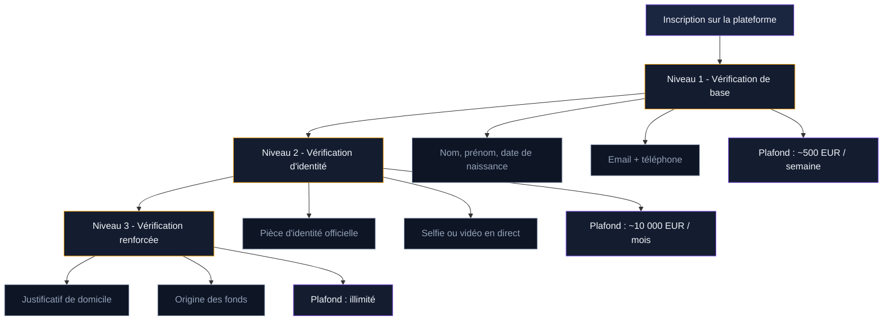
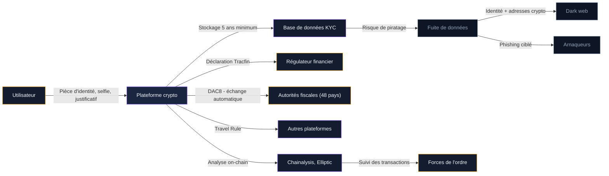

Vous ouvrez un compte sur Binance, Coinbase ou Kraken. En quelques minutes, on vous demande votre carte d'identité, un selfie, un justificatif de domicile, parfois même l'origine de vos fonds. Ce processus s'appelle le KYC - Know Your Customer. Il est devenu obligatoire sur la quasi-totalité des plateformes crypto en France et en Europe. Mais que deviennent vos données ? Quels sont vos droits ? Et existe-t-il des moyens de protéger votre vie privée tout en restant dans la légalité ?

Ce guide fait le point sur le KYC dans l'univers Bitcoin : ce qu'il implique, ce que la loi exige, et les stratégies concrètes pour limiter l'exposition de vos informations personnelles.

## Qu'est-ce que le KYC en crypto ?

KYC est l'acronyme de **Know Your Customer** (connaître son client). C'est un ensemble de procédures de vérification d'identité que les plateformes d'échange doivent appliquer avant de vous laisser acheter, vendre ou retirer des cryptomonnaies.

### Les trois niveaux de vérification

La plupart des plateformes appliquent un KYC progressif, avec des niveaux de vérification qui débloquent des fonctionnalités différentes :

**Niveau 1 - Vérification de base** : nom, prénom, date de naissance, adresse email et numéro de téléphone. Ce niveau donne un accès limité (montants plafonds bas, pas de retrait en fiat).

**Niveau 2 - Vérification d'identité** : envoi d'une pièce d'identité officielle (carte nationale d'identité, passeport ou permis de conduire) et d'un selfie ou vidéo en direct. C'est le niveau standard pour acheter et vendre du Bitcoin.

**Niveau 3 - Vérification renforcée** : justificatif de domicile, attestation de l'origine des fonds, déclaration de patrimoine. Ce niveau est déclenché pour les gros volumes de transaction ou sur demande du service de conformité.

### Ce que les plateformes collectent réellement

Au-delà des documents que vous fournissez volontairement, les plateformes collectent et conservent d'autres données :

- Votre adresse IP et géolocalisation à chaque connexion
- L'historique complet de vos transactions (achats, ventes, dépôts, retraits)
- Les adresses de wallets externes vers lesquels vous envoyez des fonds
- Votre empreinte numérique (navigateur, appareil, système d'exploitation)
- Les résultats de screening contre les listes de sanctions internationales

> [!WARNING]
> Les plateformes conservent vos données pendant 5 ans minimum après la clôture de votre compte, conformément aux obligations anti-blanchiment européennes. Supprimer votre compte ne supprime pas immédiatement vos données.

## Pourquoi le KYC est obligatoire

Le KYC n'est pas un caprice des plateformes. C'est une obligation légale imposée par plusieurs textes réglementaires.

### Le cadre juridique en France et en Europe

**La directive anti-blanchiment (AMLD5/AMLD6)** : depuis 2020, les prestataires de services sur actifs numériques (PSAN, puis CASP sous MiCA) sont soumis aux mêmes obligations de vigilance que les banques. Ils doivent identifier leurs clients, surveiller les transactions suspectes et signaler toute activité douteuse à Tracfin (la cellule de renseignement financier française).

**Le règlement MiCA** : entré en vigueur le 30 décembre 2024, il renforce les exigences de KYC pour tous les prestataires opérant en Europe. Les CASP doivent mettre en place des procédures de vérification robustes, sous peine de perdre leur autorisation.

**La Travel Rule (règle de voyage)** : recommandée par le GAFI (Groupe d'Action Financière) et transposée en droit européen, cette règle oblige les plateformes à transmettre les informations d'identité de l'expéditeur et du destinataire pour tout transfert de crypto-actifs dépassant **1 000 EUR**. Certains pays, comme le Royaume-Uni, appliquent cette règle sans seuil minimum - chaque transfert est concerné, quel que soit le montant.

**La directive DAC8** : depuis le 1er janvier 2026, les plateformes transmettent automatiquement les données de transaction de leurs utilisateurs aux autorités fiscales de 48 pays. Nom, montant des opérations, plus-values : tout est partagé de manière automatique.

### Les sanctions pour les plateformes non conformes

Une plateforme qui ne respecte pas ses obligations de KYC s'expose à des amendes pouvant atteindre **5 millions d'euros** ou **12,5% de son chiffre d'affaires annuel** sous MiCA. En pratique, les régulateurs n'hésitent plus : au 1er novembre 2025, plus de 540 millions d'euros d'amendes avaient été prononcées en Europe dans le secteur crypto.

> [!NOTE]
> Les plateformes ont un intérêt direct à appliquer un KYC strict. Une seule sanction peut détruire leur réputation et entraîner la perte de leur licence. C'est pourquoi certaines demandent parfois plus d'informations que ce que la loi exige strictement.

## Les risques réels pour votre vie privée

Le KYC crée une tension permanente entre conformité réglementaire et protection des données personnelles. Voici les risques concrets.

### Les fuites de données

Les plateformes crypto sont des cibles privilégiées pour les pirates informatiques. Les bases de données KYC contiennent des copies de pièces d'identité, des selfies et des données financières - un trésor pour les cybercriminels.

Quelques exemples marquants :

- **Ledger (2020)** : les données personnelles de 272 000 clients ont fuité, incluant noms, adresses email et adresses postales. Des vagues de phishing ciblé ont suivi pendant des mois
- **KuCoin (2020)** : un piratage de 280 millions de dollars a exposé les données de milliers d'utilisateurs
- **Gemini (2022)** : 5,7 millions d'adresses email et numéros de téléphone partiels ont été compromis

Le problème : même si vous quittez une plateforme, vos données KYC restent stockées pendant 5 ans. Vous ne pouvez pas les récupérer ni les supprimer avant ce délai.

### Le chainlinking : quand votre identité est liée à vos transactions

Le KYC ne se limite pas à vérifier votre identité. Il crée un lien permanent entre votre identité civile et vos adresses Bitcoin. À partir de là, les sociétés d'analyse blockchain (Chainalysis, Elliptic, Crystal) peuvent suivre le parcours de vos fonds en amont et en aval.

Concrètement : si vous achetez du Bitcoin sur Coinbase puis l'envoyez vers un wallet personnel, votre adresse de réception est associée à votre identité. Chaque transaction future depuis cette adresse peut être retracée.

Ce suivi est utilisé par les forces de l'ordre pour lutter contre le blanchiment et le financement du terrorisme. Mais il signifie aussi que votre historique financier Bitcoin n'est jamais vraiment privé dès que vous passez par une plateforme KYC.

### La surveillance de masse via DAC8

Depuis janvier 2026, la directive européenne DAC8 a transformé les plateformes crypto en relais de déclaration fiscale. Chaque année, elles transmettent automatiquement aux autorités fiscales :

- L'identité complète de chaque utilisateur
- Le volume de transactions réalisées
- Les plus-values calculées
- Les soldes de comptes

Ce système s'applique dans 48 pays. Il reprend le modèle CRS (Common Reporting Standard) déjà en place pour les comptes bancaires à l'étranger.

> [!CAUTION]
> DAC8 s'applique rétroactivement aux données de 2026. Même si vous avez ouvert votre compte avant l'entrée en vigueur de la directive, vos transactions de l'année sont transmises. L'époque où il était possible d'ignorer sa déclaration fiscale crypto est terminée.

## Comment protéger votre vie privée dans les limites de la loi

Protéger sa vie privée ne signifie pas échapper à la loi. Voici des stratégies légales et concrètes pour limiter l'exposition de vos données.

### Limiter le nombre de plateformes utilisées

Chaque plateforme où vous faites un KYC est un point de collecte de vos données. Moins vous dispersez vos informations, moins vous augmentez le risque de fuite. Choisissez une ou deux plateformes de confiance et concentrez-y vos opérations.

Critères de sélection :

- Plateforme enregistrée CASP (vérifiable sur regafi.fr)
- Historique de sécurité sans fuite de données
- Politique de confidentialité claire et conforme au RGPD
- Stockage des données KYC en Europe (pas dans des juridictions à faible protection)

### Utiliser un wallet non-custodial pour le stockage

Une fois vos Bitcoin achetés sur une plateforme, transférez-les vers un **wallet non-custodial** (Ledger, Trezor, Sparrow Wallet, Blue Wallet). Sur ce type de wallet, vous détenez vos propres clés privées et aucune vérification d'identité n'est requise.

Le principe : la plateforme KYC sert uniquement de rampe d'accès. Votre stockage long terme se fait en dehors de toute surveillance permanente.

### Connaître et exercer vos droits RGPD

Le Règlement Général sur la Protection des Données (RGPD) vous donne des droits concrets sur vos données personnelles, y compris celles collectées par les plateformes crypto :

- **Droit d'accès** : demandez une copie complète de toutes les données vous concernant
- **Droit de rectification** : faites corriger les informations inexactes
- **Droit à l'effacement** : demandez la suppression de vos données (limité par les obligations légales de conservation)
- **Droit à la portabilité** : obtenez vos données dans un format exploitable
- **Droit d'opposition** : refusez certains traitements, comme le profilage commercial

En pratique, les plateformes ne peuvent pas supprimer vos données KYC avant l'expiration du délai légal de 5 ans. Mais vous pouvez exiger la suppression de données non liées à la conformité (par exemple, les cookies marketing ou les données de profilage).

> [!TIP]
> Envoyez votre demande RGPD par email au DPO (Data Protection Officer) de la plateforme. Ils ont 30 jours pour répondre. Si vous n'obtenez pas de réponse satisfaisante, vous pouvez déposer une plainte auprès de la CNIL.

### Les bonnes pratiques de sécurité opérationnelle

Au-delà du cadre légal, quelques réflexes protègent votre vie privée au quotidien :

- **Utilisez une adresse email dédiée** pour vos comptes crypto, différente de votre email personnel
- **Activez l'authentification à deux facteurs** (2FA) via une application (Google Authenticator, Authy), jamais par SMS
- **Ne réutilisez pas les adresses Bitcoin** : générez une nouvelle adresse de réception pour chaque transaction
- **Évitez de publier vos adresses Bitcoin** sur les réseaux sociaux ou forums publics
- **Utilisez un VPN** pour masquer votre adresse IP lors de vos connexions aux plateformes (légal en France)

## Les alternatives au KYC : ce qui existe et ce qui est légal

### Les exchanges décentralisés (DEX)

Les plateformes décentralisées comme Uniswap, dYdX ou Bisq fonctionnent sans intermédiaire centralisé. Elles n'imposent pas de KYC car il n'y a pas d'entité qui détient vos fonds. Vous connectez votre wallet, vous échangez, et la transaction se fait directement on-chain.

Bisq est un cas particulier pour Bitcoin : c'est un DEX peer-to-peer qui permet d'acheter du BTC par virement bancaire, espèces ou PayPal, sans aucune vérification d'identité. Le logiciel est open source et fonctionne via le réseau Tor.

**Limites des DEX** :

- Liquidité plus faible que les plateformes centralisées
- Pas de recours en cas de problème (pas de service client)
- Frais de gas sur les réseaux Ethereum
- Risques de smart contracts défaillants
- Moins accessibles pour les débutants

### L'achat en pair-à-pair (P2P)

Des plateformes comme Peach Bitcoin, RoboSats ou Hodl Hodl facilitent l'achat de Bitcoin entre particuliers sans KYC. L'échange se fait directement entre deux personnes, avec un système d'escrow (dépôt de garantie) pour sécuriser la transaction.

En France, cette pratique est légale pour un particulier. Vous n'avez pas l'obligation d'effectuer un KYC lorsque vous achetez du Bitcoin à un autre particulier. Vos obligations se limitent à la déclaration fiscale de vos éventuelles plus-values.

### Les guichets Bitcoin (ATM)

La France compte environ 20 guichets automatiques Bitcoin (Bitcoin ATM). Certains permettent d'acheter de petits montants de BTC sans KYC complet, généralement jusqu'à 150-250 EUR par transaction.

Au-delà de ce seuil, une vérification d'identité est requise. Et avec le durcissement réglementaire européen, plusieurs opérateurs d'ATM ont quitté le marché français.

### La ligne rouge légale

L'achat de Bitcoin sans KYC est légal en France. Ce qui est illégal, c'est :

- **L'évasion fiscale** : ne pas déclarer ses plus-values, quel que soit le mode d'acquisition
- **Le blanchiment d'argent** : utiliser des cryptomonnaies pour dissimuler l'origine illicite de fonds
- **Le financement d'activités illégales** : terrorisme, trafic, sanctions internationales

Acheter du Bitcoin en P2P ou via un DEX est parfaitement licite. Mais vous restez soumis aux obligations fiscales françaises : déclaration des plus-values au-delà du seuil de 305 EUR de cessions annuelles et déclaration des comptes détenus à l'étranger via le formulaire 3916-bis.

## Bitcoin et pseudonymat : ce que la blockchain révèle (et ce qu'elle cache)

Bitcoin est souvent perçu comme anonyme. En réalité, il est **pseudonyme**. Chaque transaction est enregistrée publiquement sur la blockchain, visible par tous. Les adresses ne portent pas votre nom, mais elles forment un historique permanent et transparent.

### Ce que la blockchain révèle

- Le montant de chaque transaction
- Les adresses d'envoi et de réception
- L'horodatage de chaque opération
- Le solde de chaque adresse publique

### Ce que la blockchain ne révèle pas (sans KYC)

- L'identité civile derrière une adresse
- La localisation géographique de l'utilisateur
- Le motif de la transaction

C'est le KYC qui crée le pont entre une adresse Bitcoin pseudonyme et une identité réelle. Sans ce lien, une adresse reste un simple identifiant alphanumérique.

### Les outils de privacy Bitcoin

Certains outils permettent d'améliorer la confidentialité des transactions Bitcoin :

**CoinJoin** : technique qui mélange plusieurs transactions en une seule, rendant difficile le suivi des fonds. Wasabi Wallet et JoinMarket implémentent cette technique. Le statut légal du CoinJoin fait débat en Europe - certaines plateformes signalent les fonds qui sont passés par un CoinJoin, mais l'utilisation en soi n'est pas interdite en France.

**PayJoin** : variante du CoinJoin où l'expéditeur et le destinataire participent ensemble à la transaction, la rendant indistinguable d'une transaction classique.

**Réseau Lightning** : les transactions sur le Lightning Network ne sont pas enregistrées sur la blockchain principale. Elles offrent un niveau de confidentialité supérieur pour les petits paiements du quotidien.

> [!IMPORTANT]
> Utiliser des outils de confidentialité n'est pas illégal en France. Mais si vous êtes soumis à un contrôle fiscal, vous devez pouvoir justifier l'origine de vos fonds et le calcul de vos plus-values. Gardez un historique personnel de vos transactions, même si elles sont plus difficiles à tracer.

## L'avenir du KYC crypto : vers plus de surveillance ou plus de privacy ?

### Le durcissement en cours

La tendance réglementaire est clairement au renforcement du KYC. La Travel Rule s'étend progressivement à des montants de plus en plus bas. DAC8 crée un échange automatique de données entre 48 pays. L'Union européenne travaille sur AMLD6 (la sixième directive anti-blanchiment) qui va encore renforcer les obligations.

Le GAFI pousse aussi pour appliquer la Travel Rule aux transactions vers les wallets non-custodial (les "unhosted wallets"). Si cette recommandation est adoptée en Europe, les plateformes devront collecter l'identité du destinataire même pour un transfert vers votre propre Ledger.

### Les initiatives pro-privacy

Face à cette tendance, des projets travaillent sur des alternatives :

- **Les preuves à divulgation nulle de connaissance (ZK-proofs)** : permettent de prouver une information (par exemple, "j'ai plus de 18 ans" ou "mes fonds ne viennent pas de listes sanctionnées") sans révéler les données sous-jacentes
- **L'identité décentralisée (DID)** : des standards comme ceux développés par le W3C permettent de vérifier son identité sans confier ses documents à chaque plateforme
- **Les solutions de KYC réutilisable** : des entreprises comme Fractal ID ou Polygon ID travaillent sur des systèmes où vous faites le KYC une seule fois, puis partagez une attestation cryptographique avec chaque service

Ces technologies existent déjà à l'état de prototype. Leur adoption dépend de la volonté des régulateurs d'accepter des preuves cryptographiques en remplacement des copies de documents traditionnels.

### Ce que vous pouvez faire dès maintenant

La réalité de 2026 est simple : si vous utilisez une plateforme centralisée, le KYC est obligatoire. Mais vous avez des leviers pour protéger votre vie privée :

1. Faites votre KYC sur une plateforme régulée de confiance
2. Transférez vos Bitcoin vers un wallet personnel dès que possible
3. Exercez vos droits RGPD pour contrôler vos données
4. Gardez un historique propre pour votre déclaration fiscale
5. Suivez l'évolution réglementaire - les règles changent vite dans ce secteur

La vie privée financière n'est pas un luxe ni un signe de culpabilité. C'est un droit garanti par la Charte des droits fondamentaux de l'Union européenne (article 8). Le défi, c'est de l'exercer dans un cadre où la conformité réglementaire est aussi une obligation.
