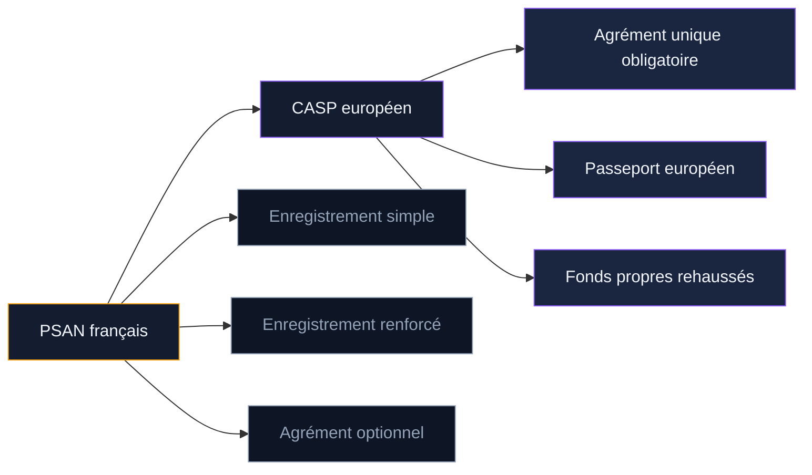
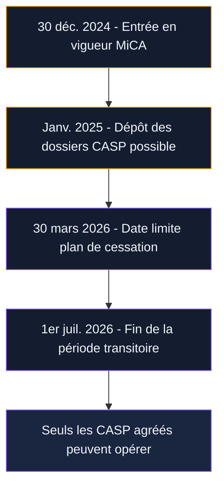

Depuis 2019, les plateformes crypto en France opéraient sous le statut PSAN, créé par la loi PACTE. Ce régime national a fait de la France un pays précurseur en matière de régulation des actifs numériques. Mais le règlement européen MiCA a changé la donne : tous les PSAN doivent obtenir un agrément CASP (Crypto-Asset Service Provider) avant le 1er juillet 2026, sous peine de cesser leur activité.

Cette transition n'est pas un simple changement de nom. Elle implique de nouveaux dossiers, des exigences de fonds propres rehaussées, et une refonte des procédures internes. Pour les utilisateurs, elle modifie aussi les garanties dont ils bénéficient. Ce guide détaille chaque étape de cette bascule, les dates à retenir, et ce que cela change concrètement pour vous.

## Le statut PSAN : ce qu'il était et pourquoi il disparaît

Le statut PSAN (Prestataire de Services sur Actifs Numériques) a été créé par la loi PACTE du 22 mai 2019. Il a imposé pour la première fois en France des obligations aux entreprises proposant des services sur crypto-actifs. L'AMF (Autorité des Marchés Financiers) était chargée de délivrer les enregistrements et agréments.

### Les deux niveaux du PSAN

Le régime PSAN comportait deux niveaux distincts :

**L'enregistrement simple (obligatoire)** couvrait quatre services : la conservation de crypto-actifs, l'achat-vente contre monnaie ayant cours légal, l'échange de crypto-actifs entre eux, et l'exploitation d'une plateforme de négociation. Sans cet enregistrement, impossible d'opérer légalement en France. Les obligations portaient sur la lutte anti-blanchiment (LCB-FT), le gel des avoirs, et les procédures KYC.

**L'agrément optionnel (volontaire)** couvrait des services supplémentaires : conseil en actifs numériques, gestion de portefeuille, prise ferme, placement, réception-transmission d'ordres. Il imposait des exigences plus lourdes sur la gouvernance, les fonds propres et la qualité du service. Seule une poignée d'entreprises l'avait obtenu.

En décembre 2022, un troisième niveau est apparu : **l'enregistrement renforcé**. Il a ajouté des obligations de cybersécurité et de gestion des conflits d'intérêts, anticipant en partie les exigences MiCA.

> [!NOTE]
> Au 31 décembre 2024, plus de 100 entités disposaient d'un enregistrement PSAN en France. Seules quelques-unes avaient obtenu l'agrément optionnel, signe de la lourdeur du dossier.

### Pourquoi le PSAN disparaît

Le PSAN était un régime national. Chaque pays de l'UE avait ses propres règles. Une plateforme enregistrée en France ne pouvait pas opérer en Allemagne ou en Espagne sans obtenir une nouvelle autorisation locale. MiCA met fin à cette fragmentation en créant un cadre unique pour les 27 États membres, avec un passeport européen valable partout.

Le PSAN a servi de modèle à MiCA sur plusieurs points (obligations LCB-FT, ségrégation des actifs, transparence). Mais il est remplacé par un régime plus complet et harmonisé.

## Le CASP : le nouveau statut européen

Le CASP (Crypto-Asset Service Provider), ou PSCA en français (Prestataire de Services sur Crypto-Actifs), est le statut unique créé par MiCA pour tous les prestataires de services crypto en Europe. Il remplace tous les régimes nationaux, PSAN inclus.

### Ce qui change par rapport au PSAN

Les différences principales entre PSAN et CASP :

| Critère | PSAN | CASP (MiCA) |
|---------|------|-------------|
| Périmètre | France uniquement | 27 pays de l'UE |
| Niveaux | 3 (simple, renforcé, agrément) | 1 agrément unique |
| Passeport européen | Non | Oui |
| Fonds propres | Pas de minimum fixe (sauf agrément) | 50 000 à 150 000 EUR selon services |
| Ségrégation des actifs | Obligatoire (agrément) | Obligatoire pour tous |
| Politique de rémunération | Non requise | Obligatoire |
| Plan de continuité | Partiel | Complet et documenté |
| Cybersécurité | Depuis enregistrement renforcé | Normes DORA intégrées |

### Les exigences de fonds propres

MiCA impose des seuils de capital précis selon les services fournis :

- **50 000 EUR** : pour les services de conseil, réception-transmission d'ordres, placement
- **125 000 EUR** : pour les services d'échange (crypto-fiat, crypto-crypto), exécution d'ordres
- **150 000 EUR** : pour la conservation d'actifs et l'exploitation d'une plateforme de négociation

À cela s'ajoute un capital variable basé sur les frais généraux annuels (un quart des frais fixes de l'année précédente). Sous le régime PSAN, seul l'agrément optionnel imposait un niveau de fonds propres - les PSAN enregistrés n'avaient pas de minimum fixe.

> [!WARNING]
> Les petites entreprises crypto qui opéraient avec un enregistrement PSAN simple doivent réunir entre 50 000 et 150 000 EUR de fonds propres pour obtenir leur agrément CASP. C'est un obstacle financier concret qui pourrait éliminer les plus petits acteurs du marché.

## Le calendrier de la transition

La bascule du PSAN vers le CASP suit un calendrier précis, avec des dates butoirs à ne pas manquer.

### Les dates clés

**30 décembre 2024** : MiCA entre en vigueur pour les prestataires de services. Les PSAN existants continuent à opérer sous leur statut actuel pendant la période transitoire.

**Début 2025** : l'AMF ouvre les dépôts de demandes d'agrément CASP. Elle invite les PSAN à utiliser une procédure simplifiée en reprenant les éléments de leur dossier d'enregistrement renforcé ou d'agrément PSAN, complétés par les pièces exigées par MiCA.

**30 mars 2026** : date limite pour les PSAN qui ne souhaitent pas poursuivre leur activité. Ils doivent déposer un plan de cessation ordonnée auprès de l'AMF, garantissant que les clients peuvent récupérer leurs actifs.

**1er juillet 2026** : fin de la période transitoire. Les PSAN qui n'ont pas obtenu leur agrément CASP doivent cesser leurs services. Seuls les prestataires agréés CASP peuvent continuer à opérer en France et en Europe.

### La procédure simplifiée de l'AMF

L'AMF a mis en place une procédure accélérée pour les PSAN déjà enregistrés en mode renforcé ou agréés. Elle leur permet de :

- Déposer un dossier basé sur les éléments déjà fournis lors de l'enregistrement PSAN
- Ajouter uniquement les pièces supplémentaires exigées par le RTS (normes techniques de réglementation) de MiCA
- Mentionner les évolutions intervenues depuis le dernier enregistrement

Cette procédure ne dispense pas du respect de toutes les obligations MiCA. Elle réduit le volume de documents à produire, pas le niveau d'exigence.

> [!IMPORTANT]
> L'AMF a indiqué que le délai d'instruction d'un dossier CASP est de 40 jours ouvrables minimum après réception d'un dossier complet. Avec les allers-retours habituels, comptez 3 à 6 mois. Les PSAN qui n'ont pas encore déposé leur dossier début 2026 prennent un risque réel de ne pas être agréés à temps.

### Le sort des PSAN à enregistrement simple

Les PSAN qui ne disposaient que d'un enregistrement simple (sans enregistrement renforcé ni agrément) sont dans la situation la plus compliquée. Leur dossier initial était moins complet. Ils doivent produire un dossier CASP presque entièrement nouveau, incluant :

- Une politique de gouvernance détaillée
- Des procédures de cybersécurité conformes à DORA
- Un plan de continuité d'activité
- Une politique de rémunération
- Une attestation de fonds propres

Pour ces acteurs, la transition demande un investissement significatif en temps et en argent.

## L'impact pour les plateformes crypto en France

### Les grands acteurs : une formalité relative

Les grandes plateformes (Coinhouse, Société Générale Forge, Bitstamp France) qui disposaient déjà d'un agrément PSAN optionnel ou d'un enregistrement renforcé ont une longueur d'avance. Elles ont déjà mis en place la plupart des procédures exigées par MiCA. La transition se résume à compléter leur dossier et à ajuster certains points (politique de rémunération, plan de continuité mis à jour).

### Les acteurs de taille moyenne : un défi financier

Pour les plateformes qui opéraient avec un enregistrement simple, la marche est plus haute. Elles doivent simultanément :

- Constituer des fonds propres de 50 000 à 150 000 EUR
- Recruter ou former du personnel qualifié en conformité
- Mettre en place des systèmes de surveillance des abus de marché
- Documenter l'ensemble de leurs procédures internes

Le coût total de la mise en conformité est estimé entre 200 000 et 500 000 EUR pour une plateforme de taille moyenne, selon la complexité des services proposés.

### Le risque de consolidation

Cette transition pourrait provoquer une vague de concentration dans le secteur. Les plus petits PSAN, incapables de réunir les fonds propres ou de financer la mise en conformité, risquent de :

- Fusionner avec des acteurs plus gros
- Être rachetés par des groupes financiers traditionnels
- Cesser purement et simplement leur activité

En contrepartie, les acteurs qui obtiennent l'agrément CASP gagnent un accès direct à 450 millions de consommateurs européens via le passeport européen.

## L'impact pour les utilisateurs

### Ce qui s'améliore

**La protection des actifs** : sous MiCA, la ségrégation des actifs clients est obligatoire pour tous les CASP, pas seulement ceux qui avaient l'agrément optionnel. En cas de faillite de la plateforme, vos cryptos ne font pas partie de la masse des créanciers. C'est une garantie que les utilisateurs de plateformes avec un simple enregistrement PSAN n'avaient pas formellement.

**La transparence** : les CASP doivent publier clairement leurs frais, leurs conditions de service, et les risques associés à chaque crypto-actif. Fini les frais cachés dans les conditions générales.

**Le traitement des réclamations** : chaque CASP doit mettre en place un système de plainte gratuit avec un délai de réponse de 15 jours ouvrables maximum.

**La portabilité** : le passeport européen facilite le transfert de vos actifs vers une plateforme dans un autre pays de l'UE si vous n'êtes pas satisfait de votre prestataire actuel.

### Ce qui demande de la vigilance

**Les plateformes non conformes** : entre maintenant et juillet 2026, certains PSAN pourraient décider de ne pas demander l'agrément CASP. Vérifiez régulièrement le statut de votre plateforme sur le registre REGAFI de l'AMF et sur le registre de l'ESMA.

**Le transfert d'actifs** : si votre plateforme ne passe pas la transition, vous devrez transférer vos cryptos vers un autre prestataire. Anticipez en ayant un wallet matériel ou un compte sur une plateforme déjà agréée CASP.

**Les nouveaux services** : certains services couverts par MiCA (comme le conseil en actifs numériques) n'étaient pas toujours réglementés sous le régime PSAN. Des acteurs qui opéraient dans une zone grise devront soit obtenir l'agrément, soit arrêter.

> [!TIP]
> Vérifiez dès maintenant si votre plateforme a déposé une demande d'agrément CASP. La plupart communiquent sur le sujet dans leurs newsletters ou sur leur blog. En cas de doute, contactez leur support et demandez une confirmation écrite.

## Les services concernés par l'agrément CASP

MiCA définit dix catégories de services sur crypto-actifs. Chaque CASP doit être agréé pour les services qu'il propose :

1. **Conservation et administration** de crypto-actifs pour le compte de clients
2. **Exploitation d'une plateforme** de négociation de crypto-actifs
3. **Échange de crypto-actifs** contre une monnaie ayant cours légal
4. **Échange de crypto-actifs** contre d'autres crypto-actifs
5. **Exécution d'ordres** pour le compte de tiers
6. **Placement de crypto-actifs**
7. **Réception et transmission d'ordres**
8. **Conseil en crypto-actifs**
9. **Gestion de portefeuille** de crypto-actifs
10. **Services de transfert** de crypto-actifs

Un PSAN qui ne proposait que l'achat-vente (services 3 et 4) n'a pas besoin d'être agréé pour les dix services. Il demande l'agrément uniquement pour les services qu'il fournit, ce qui allège le dossier.

## Ce qui se passe si un PSAN ne transite pas

### Le plan de cessation ordonnée

Tout PSAN qui décide de ne pas demander l'agrément CASP doit déposer un plan de cessation ordonnée auprès de l'AMF avant le 30 mars 2026. Ce plan doit détailler :

- Le calendrier de cessation des services
- Les modalités de restitution des actifs aux clients
- La communication prévue vers les clients
- Le sort des données personnelles collectées

L'AMF peut imposer des modifications au plan si elle estime que la protection des clients n'est pas suffisante.

### Les sanctions en cas de non-conformité

Un prestataire qui continue à opérer après le 1er juillet 2026 sans agrément CASP s'expose à des sanctions sévères :

- Amendes pouvant atteindre 5 millions d'euros ou 12,5% du chiffre d'affaires annuel
- Interdiction temporaire ou permanente d'exercer
- Sanctions personnelles contre les dirigeants (jusqu'à 700 000 EUR)
- Publication de la sanction sur le site de l'AMF

Au 1er novembre 2025, plus de 540 millions d'euros d'amendes avaient déjà été prononcées en Europe dans le cadre de MiCA, dont 62 millions d'euros en France - le montant le plus élevé de l'UE.

## Comment vérifier qu'une plateforme est en règle

### Les registres officiels

**Le registre REGAFI** (regafi.fr) : tenu par l'ACPR et l'AMF, il liste tous les prestataires financiers autorisés en France, PSAN et CASP inclus.

**Le registre de l'ESMA** : l'Autorité européenne des marchés financiers publie un registre central de tous les CASP agréés dans l'UE.

**La liste noire de l'AMF** : l'AMF publie aussi une liste des sites non autorisés proposés aux investisseurs français. Si une plateforme y figure, fuyez.

### Les réflexes à adopter

- Vérifiez le numéro d'enregistrement ou d'agrément sur REGAFI avant d'ouvrir un compte
- Contrôlez que le statut affiché correspond bien à "PSCA" ou "CASP" (et non plus simplement "PSAN") après juillet 2026
- Méfiez-vous des plateformes qui ne communiquent pas sur leur statut réglementaire
- Privilégiez les plateformes qui affichent clairement leur numéro d'agrément sur leur site

## Ce que cette transition révèle sur le marché crypto français

La France était pionnière avec le statut PSAN en 2019. Cette avance a attiré des entreprises et des talents. Mais elle a aussi créé un faux sentiment de sécurité : un enregistrement simple n'offrait pas les mêmes garanties qu'un agrément complet.

MiCA corrige cette asymétrie. Tous les prestataires passent par le même filtre, avec des obligations uniformes. Les utilisateurs bénéficient d'un niveau de protection identique, quelle que soit la plateforme choisie.

Le revers : certains acteurs innovants mais sous-capitalisés pourraient quitter le marché. Les barrières d'entrée plus élevées favorisent les entreprises établies et les filiales de groupes financiers traditionnels. Le paysage crypto français de 2027 sera probablement moins diversifié mais plus solide.

Pour les utilisateurs, la transition PSAN vers CASP est une bonne nouvelle à condition de rester attentif pendant la phase de transition. Vérifiez le statut de vos plateformes, anticipez le transfert de vos actifs si nécessaire, et profitez des garanties renforcées que MiCA apporte à partir de juillet 2026.
