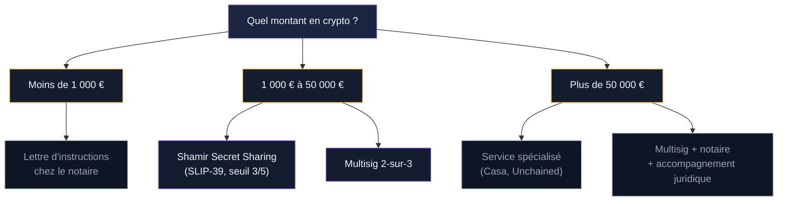
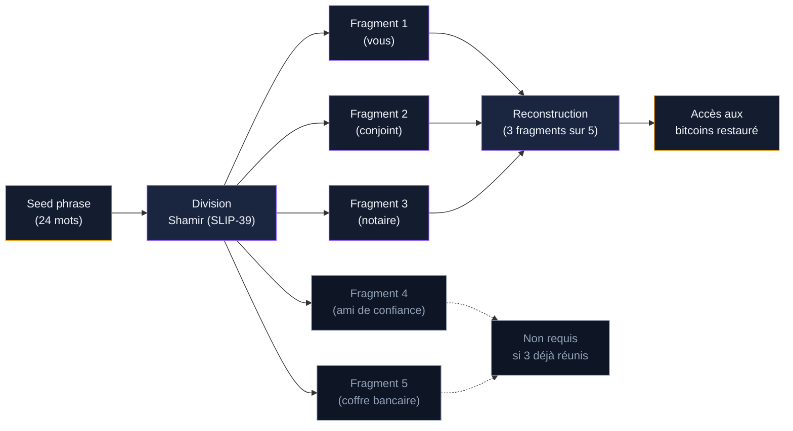

Entre 3 et 4 millions de bitcoins sont perdus à jamais. Pas volés, pas dépensés : perdus parce que personne ne connait les clés privées. Des propriétaires sont morts sans laisser d'instructions. D'autres ont oublié leurs mots de passe. À chaque fois, le résultat est le même : des fonds bloqués pour l'éternité sur la blockchain.

10% des Français détiennent des cryptomonnaies en 2026. Pour beaucoup, ce patrimoine numérique représente une part significative de leurs actifs. Pourtant, la grande majorité n'a rien prévu pour sa transmission. Le jour où un détenteur décède, ses proches découvrent un problème que la banque ne peut pas résoudre : personne ne possède les clés.

## Pourquoi la transmission crypto est différente

Un compte bancaire, une assurance-vie, un bien immobilier - tout ça se transmet via des procédures légales rodées. Le notaire contacte les banques. Les institutions reconnaissent les héritiers. L'argent circule.

Les cryptomonnaies ne fonctionnent pas comme ça. Bitcoin n'a pas de service client. Aucun tiers ne peut "débloquer" un portefeuille. La blockchain ne reconnait pas les décisions de justice, les actes de succession ni les liens familiaux. Elle reconnait une seule chose : la clé privée.

Sans cette clé, les bitcoins restent à leur adresse. Visibles par tous sur la blockchain. Impossibles à récupérer par quiconque. Même un tribunal ne peut pas forcer une transaction Bitcoin.

> [!CAUTION]
> Contrairement à un compte bancaire gelé, des bitcoins sans clé privée sont perdus de façon permanente. Aucune procédure judiciaire, aucun recours légal ne peut inverser cette réalité technique.

### Le cas des plateformes centralisées

Si vos bitcoins sont sur Coinbase, Binance ou Kraken, la situation est un peu différente. Ces plateformes détiennent les clés pour vous. En cas de décès, vos héritiers peuvent contacter le support avec un acte de décès, un acte de notoriété et les documents de succession.

La procédure prend du temps - parfois des mois - mais elle existe. Coinbase a publié un protocole spécifique pour les successions. Binance aussi. Les plateformes enregistrées comme PSAN en France coopèrent avec les notaires.

Le problème : beaucoup d'investisseurs gardent leurs cryptos en self-custody, sur un hardware wallet ou un portefeuille logiciel. Là, aucune plateforme ne peut intervenir.

### Le problème du "bus factor"

En informatique, le "bus factor" désigne le nombre de personnes qui doivent être "frappées par un bus" pour qu'un projet soit bloqué. Pour la plupart des détenteurs de Bitcoin, ce chiffre est 1. Vous.

Si vous êtes la seule personne à connaitre l'emplacement de votre seed phrase, votre passphrase supplémentaire, le type de portefeuille utilisé et la méthode de dérivation, votre décès rend vos fonds inaccessibles. Pas demain, pas dans un an : immédiatement.

## Le cadre légal en France

Les cryptomonnaies font partie de la succession. La loi Pacte de 2019 et les réglementations suivantes ont clarifié ce point : les actifs numériques sont des biens transmissibles, soumis aux mêmes règles fiscales que le reste du patrimoine.

### Fiscalité de la transmission

Les bitcoins hérités sont soumis aux droits de succession classiques. L'abattement dépend du lien de parenté : 100 000 euros pour un enfant, 15 932 euros pour un frère ou une soeur, 1 594 euros pour un neveu ou une nièce. Au-delà, les taux progressifs s'appliquent, de 5% à 45% en ligne directe.

La valeur retenue est celle du jour du décès. Le notaire doit évaluer le patrimoine crypto à cette date précise, ce qui implique de connaitre les montants exacts détenus et les cours du jour.

### Le rôle du notaire

Les notaires se spécialisent de plus en plus dans la gestion des cryptomonnaies en succession. Gwendal Texier, notaire spécialisé cité par BFM en janvier 2026, explique : "Il faut déjà recenser l'état de son patrimoine et pouvoir trouver un moyen, comme un testament qui permet de transmettre qu'au moment où on est décédé."

Le notaire peut recevoir un pli scellé contenant les informations d'accès. Ce pli n'est ouvert qu'au décès. Le notaire ne sait pas ce qu'il contient, ce qui protège la confidentialité des clés de votre vivant.

Certains notaires refusent encore de gérer des actifs crypto par manque de formation. Si le vôtre ne connait pas le sujet, cherchez un professionnel qui s'est formé spécifiquement. Le Conseil supérieur du notariat propose des formations sur les actifs numériques depuis 2024.

> [!TIP]
> Demandez à votre notaire s'il a déjà géré une succession impliquant des cryptomonnaies. Un notaire formé saura poser les bonnes questions sur le type de stockage, les plateformes utilisées et les clés nécessaires.

### Le testament : une pièce centrale

Mentionner vos actifs crypto dans votre testament est la première étape. Pas les clés elles-mêmes - le testament est un document semi-public que plusieurs personnes consultent. Mais une mention claire que vous détenez des actifs numériques, leur localisation générale (plateforme, self-custody) et un renvoi vers les instructions détaillées stockées ailleurs.

Un testament olographe (écrit à la main) fonctionne. Un testament authentique (rédigé par le notaire) offre plus de sécurité juridique. Dans les deux cas, le document doit indiquer où trouver les informations techniques nécessaires à la récupération des fonds.

## Solutions techniques pour la transmission

Plusieurs méthodes existent, de la plus simple à la plus sophistiquée. Le bon choix dépend du montant en jeu, de votre niveau technique et de celui de vos héritiers.

### La lettre d'instructions

La méthode la plus accessible. Vous rédigez un document détaillant :

- L'emplacement de votre seed phrase (coffre, cachette physique)
- Le type de portefeuille utilisé (Ledger, Trezor, Electrum, BlueWallet...)
- La présence ou non d'une passphrase supplémentaire (le "25e mot")
- Les chemins de dérivation si vous utilisez des paramètres non-standard
- La liste des plateformes où vous avez des comptes, avec les identifiants

Ce document est stocké séparément de la seed phrase. En coffre chez le notaire, dans un lieu sûr connu de vos héritiers, ou dans un coffre bancaire.

Le piège : ce document nécessite une mise à jour régulière. Si vous changez de portefeuille, ajoutez une passphrase ou déplacez des fonds, la lettre d'instructions doit refléter ces changements. Une lettre obsolète est presque aussi inutile qu'aucune lettre.

### Le partage de seed phrase avec Shamir's Secret Sharing

Le schéma de partage de secret de Shamir (SLIP-39) divise votre seed phrase en plusieurs fragments. Chaque fragment seul est inutile. Il faut un nombre minimum de fragments pour reconstituer la clé.

Exemple concret : vous créez 5 fragments et définissez un seuil de 3. Vous en gardez un, votre conjoint en reçoit un, votre notaire un, un ami de confiance un, et le dernier va dans un coffre bancaire. Pour accéder aux fonds, il faut réunir 3 fragments sur 5. Un seul vol ou une seule perte ne compromet rien.

Trezor prend en charge SLIP-39 nativement. Pour les autres portefeuilles, des outils open-source permettent de créer ces fragments, mais ils demandent un minimum de compétence technique.

> [!NOTE]
> Shamir's Secret Sharing et le multisig sont deux approches différentes. Shamir divise la seed phrase en fragments. Le multisig crée plusieurs clés indépendantes qui doivent signer ensemble. Les deux protègent contre un point de défaillance unique, mais le multisig est plus robuste techniquement.

### Le multisig (multi-signatures)

Un portefeuille multisig exige plusieurs signatures pour valider une transaction. La configuration classique pour l'héritage est le 2-sur-3 : trois clés existent, deux suffisent pour dépenser.

Vous détenez la clé 1. Votre héritier désigné détient la clé 2. Un tiers de confiance (notaire, avocat, service spécialisé) détient la clé 3.

De votre vivant, vous utilisez votre clé seule pour les transactions courantes... Non. En multisig, il faut toujours 2 clés. Vous utilisez votre clé + celle du tiers de confiance pour les opérations quotidiennes. À votre décès, votre héritier utilise sa clé + celle du tiers pour récupérer les fonds.

L'avantage : aucune partie ne possède un accès complet. Le tiers de confiance ne peut pas voler seul. Votre héritier ne peut pas accéder aux fonds de votre vivant. Et la perte d'une clé ne bloque pas l'accès.

### Services spécialisés : Casa et autres

Casa, entreprise américaine, propose une solution complète d'héritage crypto. Leur système combine multisig et protocole de récupération d'urgence. En cas de décès, un processus de vérification (acte de décès, délai de sécurité, vérifications multiples) permet aux héritiers de récupérer les fonds.

Le service coûte environ 250 dollars par an pour le plan qui inclut l'héritage. C'est un abonnement : si vous arrêtez de payer, le service de récupération d'urgence disparait. Pour des montants importants (plus de 100 000 euros en crypto), le coût est justifié.

D'autres acteurs existent : Unchained Capital, Nunchuk, et des solutions basées sur des timelocks Bitcoin natifs. Ces derniers utilisent des contrats intelligents qui libèrent automatiquement les fonds après une période d'inactivité. Vous "prouvez" que vous êtes vivant en signant une transaction périodique. Si la signature n'arrive pas, les fonds deviennent accessibles à l'adresse de votre héritier.

### Le timelock : l'héritage automatisé

Les timelocks Bitcoin permettent de créer des transactions pré-signées qui ne s'activent qu'après une date précise. Vous signez une transaction qui envoie tout à votre héritier, valable dans un an. Chaque année, vous détruisez l'ancienne et en créez une nouvelle.

Si vous décédez, la transaction s'active automatiquement à la date prévue. Pas besoin de notaire, pas besoin de tiers. C'est du code.

Le risque : si vous oubliez de renouveler la transaction, votre héritier reçoit les fonds alors que vous êtes toujours vivant. Et les timelocks ne gèrent pas les cas complexes (plusieurs héritiers, partage inégal).

Cette méthode convient aux utilisateurs techniques qui comprennent les transactions Bitcoin brutes. Pour les autres, le multisig ou un service comme Casa reste plus adapté.

## Les erreurs qui font perdre un héritage

### Ne rien préparer du tout

L'erreur la plus courante. "J'ai le temps", "je suis jeune", "je verrai plus tard". Les accidents ne préviennent pas. Selon Gwendal Texier, "dans le cas où un investisseur crypto n'a pas prévenu son successeur, il y a une possibilité de perte de ses actifs". Pas une probabilité. Une quasi-certitude si personne ne connait vos clés.

### Donner la seed phrase complète à un proche

Un ami, un conjoint, un parent qui détient votre seed phrase détient vos fonds. Même avec les meilleures intentions, les situations changent. Un divorce, un conflit familial, un moment de faiblesse financière. La tentation existe.

Pire : votre proche peut se faire voler ou pirater. Si sa sécurité informatique est plus faible que la vôtre, vous avez créé une faille en pensant créer une protection.

### Oublier les détails techniques

Vous laissez votre seed phrase à votre notaire. Très bien. Mais vous avez oublié de mentionner que vous utilisez une passphrase supplémentaire (le fameux "25e mot"). Ou que votre portefeuille utilise un chemin de dérivation non-standard. Ou que vos fonds sont répartis sur 3 portefeuilles différents.

Votre héritier entre les 24 mots dans un portefeuille compatible. Le solde affiché : 0. Les fonds existent toujours, mais il ne peut pas y accéder sans les paramètres exacts que vous avez utilisés.

> [!WARNING]
> Une seed phrase sans le contexte technique complet (passphrase, type de portefeuille, chemin de dérivation) peut devenir inutile. Documentez chaque détail, même ceux qui vous semblent évidents.

### Ne jamais tester la procédure

Vous avez tout préparé : lettre d'instructions, seed phrase chez le notaire, testament à jour. Mais personne n'a jamais testé la procédure. Le jour venu, votre héritier découvre que le logiciel mentionné n'existe plus, que le format de la seed phrase n'est plus supporté, ou que les instructions sont ambiguës.

La seule façon de valider votre plan : créez un portefeuille test avec un petit montant. Donnez les instructions à votre héritier (ou à un proche de confiance). Demandez-lui de récupérer les fonds sans votre aide. Les obstacles qu'il rencontre sont exactement ceux qui bloqueront la succession réelle.

## Guide pratique : préparer votre transmission en 5 étapes

### Étape 1 : Inventaire complet

Listez tous vos actifs crypto : plateformes d'échange, portefeuilles logiciels, hardware wallets. Pour chaque élément, notez le type d'actif, le montant approximatif et la méthode de stockage.

N'oubliez pas les petits montants. Un vieux portefeuille Electrum avec 0.1 BTC oublié depuis 2018 vaut aujourd'hui plusieurs milliers d'euros.

### Étape 2 : Choisir une méthode de transmission

Pour moins de 10 000 euros : la lettre d'instructions chez le notaire suffit dans la plupart des cas.

Pour 10 000 à 100 000 euros : envisagez Shamir's Secret Sharing ou un multisig 2-sur-3.

Pour plus de 100 000 euros : un service spécialisé comme Casa ou Unchained, combiné avec un accompagnement juridique, offre la meilleure sécurité.

### Étape 3 : Rédiger les instructions

Écrivez comme si votre héritier ne connaissait rien au Bitcoin. Pas de jargon sans explication. Chaque étape détaillée. Incluez :

- Le nom et la version du logiciel de portefeuille
- Le nombre exact de mots de la seed phrase
- L'existence (ou non) d'une passphrase
- Les identifiants des plateformes centralisées
- Un lien vers un tutoriel de restauration

### Étape 4 : Séparer les éléments

La seed phrase ne doit jamais être au même endroit que les instructions. Si quelqu'un trouve les deux, il accède à vos fonds. La séparation physique protège contre le vol opportuniste.

Exemple de répartition :
- Instructions détaillées : coffre du notaire
- Seed phrase : coffre bancaire personnel
- Passphrase : connue uniquement par votre conjoint
- Mention dans le testament : existence des actifs et renvoi vers le notaire

### Étape 5 : Tester et mettre à jour

Faites le test de récupération au moins une fois. Puis mettez à jour vos documents une fois par an, ou à chaque changement significatif (nouveau portefeuille, nouvelle plateforme, changement de passphrase, variation importante des montants).

Mettez un rappel annuel dans votre calendrier. "Vérifier plan succession crypto." 30 minutes par an pour éviter la perte de milliers ou millions d'euros.

## Ce que l'avenir pourrait changer

La législation évolue. Le règlement européen MiCA, entré en application en 2024, impose des obligations aux prestataires de services crypto. Les plateformes devront peut-être un jour intégrer des mécanismes de succession standardisés.

Des protocoles Bitcoin natifs comme Miniscript permettent de créer des conditions de dépense complexes directement sur la blockchain : timelocks, multisig avancée, conditions multiples. Ces outils deviennent plus accessibles chaque année.

Les notaires se forment. Les outils se simplifient. Mais pour l'instant, la responsabilité repose sur vous. Vos bitcoins ne se transmettront pas par magie. Ils se transmettront parce que vous avez pris le temps de préparer un plan, de le documenter et de le tester.

Chaque jour sans plan de succession est un jour où vos héritiers risquent de tout perdre. La procédure prend une après-midi. Les conséquences de l'inaction durent pour toujours.
