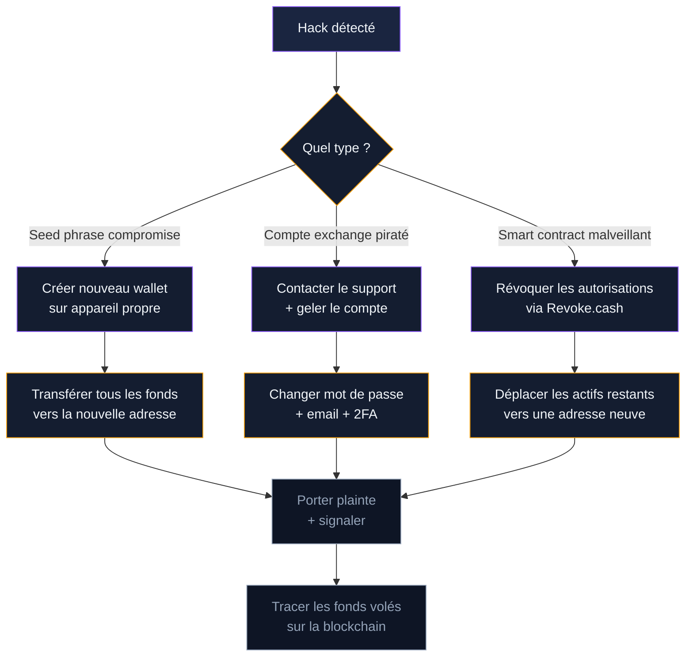

Vous venez de réaliser que vos cryptos ont disparu. Votre portefeuille affiche zéro, votre compte exchange ne répond plus, ou une transaction sortante que vous n'avez pas signée vient de partir. Chaque minute compte. Ce guide vous donne les étapes exactes à suivre, dans l'ordre.

## Les 15 premières minutes : protocole d'urgence

Pas le temps de comprendre comment c'est arrivé. Pas le temps de paniquer. Concentrez-vous sur une chose : sauver ce qui reste.

### Cas 1 : votre seed phrase a été compromise

Quelqu'un connaît vos 12 ou 24 mots. Que vous les ayez saisis sur un faux site, qu'un malware les ait capturés, ou que quelqu'un ait trouvé votre sauvegarde physique - la procédure est la même.

1. **Créez un nouveau portefeuille** sur un appareil propre (téléphone neuf ou hardware wallet vierge). Générez une nouvelle seed phrase.
2. **Transférez tous vos fonds restants** depuis l'ancien portefeuille vers le nouveau. Bitcoin, tokens, tout. Priorisez les montants les plus élevés.
3. **Vérifiez les autres blockchains.** Votre seed phrase donne accès à tous les réseaux dérivés (Ethereum, Litecoin...). Videz chaque compte.
4. **Ne réutilisez jamais l'ancienne seed phrase.** Elle est grillée. Définitivement.

> [!CAUTION]
> Un attaquant qui possède votre seed phrase peut agir à tout instant. Même si vos fonds sont encore là, il peut avoir programmé un bot qui les aspire dès qu'ils arrivent. Transférez tout en une seule opération, pas en plusieurs.

### Cas 2 : votre compte exchange a été piraté

Quelqu'un a pris le contrôle de votre compte Coinbase, Binance, Kraken ou autre plateforme.

1. **Changez votre mot de passe** immédiatement. Si vous n'y arrivez pas, passez à l'étape 2.
2. **Contactez le support d'urgence** de la plateforme. La plupart ont un canal prioritaire pour les comptes compromis. Demandez le gel de votre compte.
3. **Révoquez toutes les sessions actives** et les clés API autorisées.
4. **Changez le mot de passe de votre email** associé au compte. L'attaquant est probablement entré par là.
5. **Désactivez puis réactivez la double authentification** avec un nouveau code. L'ancien peut être compromis.

### Cas 3 : vous avez signé une transaction malveillante (DeFi)

Vous avez approuvé un smart contract qui vide votre portefeuille. Fréquent sur Ethereum, BSC, ou tout réseau avec des contrats intelligents.

1. **Révoquez les autorisations** via [Revoke.cash](https://revoke.cash) ou [Etherscan Token Approval](https://etherscan.io/tokenapprovalchecker). Connectez votre wallet, identifiez les contrats suspects, révoquez.
2. **Transférez vos actifs restants** vers une adresse neuve.
3. **Vérifiez chaque token** individuellement. Certains draineurs ciblent des tokens précis.

## Sécuriser votre environnement avant toute chose

Avant de toucher à quoi que ce soit, posez-vous une question : l'appareil que vous utilisez est-il compromis ?

Si un malware a volé votre seed phrase, il est probablement encore actif sur votre machine. Transférer vos fonds depuis le même ordinateur revient à donner vos nouvelles clés au même voleur.

**Marche à suivre :**

- Utilisez un autre appareil. Un téléphone personnel qui n'a pas été en contact avec le lien/fichier suspect. Un hardware wallet neuf. L'ordinateur d'un proche de confiance.
- Si vous n'avez rien d'autre, démarrez votre PC en mode sans échec avec prise en charge réseau, ou utilisez une clé USB bootable Linux (Tails ou Ubuntu).
- Lancez un scan antivirus complet sur la machine infectée. Malwarebytes, Windows Defender en scan hors-ligne, ou ClamAV sur Linux.

> [!WARNING]
> Ne faites pas confiance à votre navigateur. Les extensions malveillantes peuvent modifier ce que vous voyez à l'écran. L'adresse de destination affichée peut être différente de celle réellement utilisée. Vérifiez toujours sur l'écran de votre hardware wallet.

## Porter plainte et signaler le vol

Le vol de cryptomonnaies est un délit. Même si les chances de récupération restent faibles pour les petits montants, le signalement alimente les bases de données utilisées par les enquêteurs. Et pour les montants conséquents, une plainte déposée vite peut aboutir au gel des fonds sur les plateformes régulées.

### Où déposer plainte en France

- **Cybermalveillance.gouv.fr** : la plateforme officielle d'assistance aux victimes de cybermalveillance. Remplissez le formulaire en ligne pour obtenir un accompagnement personnalisé.
- **Commissariat ou gendarmerie** : déposez une plainte classique pour vol/escroquerie. Apportez les preuves (captures d'écran, adresses blockchain, historique des transactions).
- **THESEE** (Traitement Harmonisé des Enquêtes et Signalements pour les E-escroqueries) : plateforme du Ministère de l'Intérieur pour les plaintes en ligne liées aux escroqueries sur internet.
- **Pharos** : pour signaler un site web frauduleux.

### Quelles preuves rassembler

Documentez tout. Maintenant, avant que les traces ne disparaissent.

- **Adresses blockchain** impliquées (la vôtre et celle(s) du voleur)
- **Hash des transactions** frauduleuses (le TXID sur Bitcoin, le hash sur Ethereum)
- **Captures d'écran** du site ou de l'email de phishing
- **Historique de votre navigateur** montrant les URL visitées
- **Emails ou messages** reçus de l'attaquant
- **Logs de connexion** de votre exchange (IP, dates, appareils)
- **Montant exact** des fonds volés avec le cours au moment du vol

> [!TIP]
> Exportez l'historique de vos transactions depuis votre exchange ou votre portefeuille avant que l'attaquant ne modifie quoi que ce soit. Sur la blockchain, les transactions sont permanentes, mais les logs de votre compte exchange peuvent être effacés si l'attaquant a encore accès.

### Signaler à l'AMF

L'Autorité des marchés financiers tient une liste noire des sites frauduleux. Si vous avez été piégé par une fausse plateforme, signalez-la sur le site de l'AMF. Votre signalement protège les prochaines victimes potentielles.

## Tracer les fonds volés sur la blockchain

Les bitcoins volés ne disparaissent pas. Ils se déplacent d'adresse en adresse, visibles par tous sur la blockchain. Cette transparence est votre meilleur allié.

### Outils gratuits de traçage

- **Mempool.space** : explorateur Bitcoin qui affiche les transactions en temps réel. Entrez l'adresse du voleur et suivez où partent les fonds.
- **Etherscan.io** : l'équivalent pour Ethereum et les tokens ERC-20.
- **Blockchair.com** : explorateur multi-blockchain qui couvre Bitcoin, Ethereum, Litecoin et d'autres.
- **OXT.me** : outil d'analyse avancé pour Bitcoin qui visualise les liens entre adresses.

### Analyse professionnelle

Pour les montants importants (au-dessus de 10 000 euros), les sociétés d'investigation blockchain offrent des capacités bien supérieures aux outils gratuits.

**Chainalysis, Elliptic, Arkane Risk** : ces entreprises tracent les flux de fonds à travers des centaines de services (exchanges, mixers, protocoles DeFi). Elles identifient les points de sortie où le voleur tente de convertir les cryptos en monnaie fiduciaire.

Arkane Risk, basé en France, propose une analyse gratuite de faisabilité avant engagement. Leur méthodologie couvre Bitcoin, Ethereum, BSC, Tron et d'autres blockchains. Ce type de prestation coûte entre 1 000 et 10 000 euros selon la complexité du traçage.

Les résultats de ces analyses servent de pièces à conviction. Ils sont reconnus par les tribunaux français et européens.

> [!IMPORTANT]
> Les fonds volés passent souvent par des mixers ou des bridges cross-chain pour brouiller les pistes. Si vous identifiez l'adresse de destination dans les premières heures, les chances de blocage augmentent fortement. Après 48h, les fonds sont souvent déjà fragmentés et redistribués.

### Demander le gel des fonds aux exchanges

Quand les bitcoins volés arrivent sur une plateforme régulée (Binance, Coinbase, Kraken...), celle-ci peut geler le compte du voleur. Pour cela :

1. Contactez le service conformité (compliance) de la plateforme, pas le support classique.
2. Fournissez la preuve de propriété (votre adresse d'origine, le hash de la transaction frauduleuse).
3. Joignez une copie de votre dépôt de plainte.

Les plateformes enregistrées PSAN en France sont tenues de coopérer avec les autorités. Les délais varient : certaines gèlent en quelques heures, d'autres en plusieurs jours. La rapidité de votre signalement fait la différence.

## Les arnaques à la récupération : le piège après le piège

Vous venez de perdre vos cryptos. Vous êtes en panique. Vous cherchez de l'aide sur Google, Twitter, Telegram. Et là, des "experts en récupération" vous contactent.

**90% sont des escrocs.** Ils ciblent spécifiquement les victimes de hack parce qu'elles sont vulnérables et prêtes à payer pour récupérer leurs fonds.

### Comment les repérer

- Ils vous contactent en premier (message privé, commentaire sous votre post).
- Ils garantissent la récupération de vos fonds. Personne ne peut garantir ça.
- Ils demandent un paiement en crypto à l'avance.
- Ils prétendent avoir un "logiciel spécial" ou des "contacts chez les exchanges".
- Leurs témoignages clients sont fabriqués.
- Ils opèrent depuis Telegram, Discord ou des forums anonymes.

### Les seuls interlocuteurs légitimes

- Les forces de l'ordre (police, gendarmerie, Europol).
- Les sociétés d'investigation blockchain avec pignon sur rue (Chainalysis, Elliptic, Arkane Risk). Vérifiez leur existence légale.
- Les avocats spécialisés en droit du numérique, inscrits au barreau.
- Le support officiel de votre exchange (accédez-y uniquement via le site officiel, jamais via un lien).

> [!CAUTION]
> Un "recovery service" qui demande votre seed phrase pour "récupérer vos fonds" est un voleur. Point final. Aucune procédure de récupération ne nécessite vos clés privées.

## Après la crise : reconstruire votre sécurité

Le vol a eu lieu. Vous avez sécurisé ce qui restait, porté plainte, tracé les fonds. Il faut maintenant reconstruire un environnement sûr.

### Audit complet de vos accès

Faites la liste de tous les comptes liés à vos cryptos. Changez chaque mot de passe. Pas un mot de passe "similaire aux autres" - un mot de passe unique, généré par un gestionnaire (Bitwarden, 1Password, KeePass).

- Vérifiez les règles de transfert et les redirections de votre boîte email. Les attaquants ajoutent souvent une redirection silencieuse pour continuer à intercepter vos communications.
- Révoquez les accès des applications tierces à vos comptes (Google, Apple, Microsoft).
- Vérifiez les extensions de votre navigateur. Supprimez tout ce que vous ne reconnaissez pas.

### Nouvelle architecture de sécurité

Le hack a révélé une faille dans votre setup. Identifiez-la et corrigez-la.

| Faille identifiée | Action corrective |
|---|---|
| Seed phrase stockée numériquement | Sauvegarde papier ou plaque métal uniquement |
| 2FA par SMS | Passer à une app (Google Authenticator, Authy) ou clé physique (YubiKey) |
| Pas de hardware wallet | Acheter un Ledger ou Trezor pour le stockage long terme |
| Email personnel pour les exchanges | Créer un email dédié crypto, jamais utilisé ailleurs |
| Clic sur un lien de phishing | Ajouter les sites crypto en favoris, ne jamais passer par un lien email |
| Clés API exchange trop permissives | Restreindre les permissions : lecture seule par défaut, IP whitelistée |

### Séparation des fonds

Ne gardez pas tout au même endroit. Répartissez selon l'usage :

- **Stockage froid** (hardware wallet) : la majorité de vos fonds. Ce que vous ne touchez pas pendant des mois.
- **Portefeuille chaud** (mobile ou desktop) : petits montants pour les transactions courantes.
- **Exchange** : uniquement ce que vous tradez activement. Retirez le reste.

Cette séparation limite les dégâts en cas de nouvelle compromission. Un attaquant qui accède à votre portefeuille mobile ne touche pas votre stockage froid.

## Vos droits et recours juridiques en France

Le cadre légal français offre plusieurs leviers pour les victimes de vol de crypto.

### Code pénal

Le vol de cryptomonnaies tombe sous les articles 311-1 et suivants du Code pénal (vol) et 313-1 (escroquerie). Les peines vont de 3 à 7 ans de prison et 45 000 à 375 000 euros d'amende selon les circonstances.

### Coopération internationale

Les cryptomonnaies traversent les frontières en quelques secondes. Europol et Interpol disposent d'unités spécialisées dans la cybercriminalité. En 2024, Europol a coordonné la saisie de plus de 46 millions d'euros en cryptomonnaies via l'opération "HAECHI-IV".

Si le voleur opère depuis un autre pays, votre plainte en France peut déclencher une coopération via Eurojust. Les délais sont longs (plusieurs mois à plusieurs années), mais les résultats existent.

### Assurance cyber

Certaines assurances couvrent les pertes liées aux cyber-attaques, y compris le vol de cryptomonnaies. Vérifiez votre contrat d'assurance habitation (volet "cyber") et votre assurance professionnelle si vous détenez des cryptos dans un cadre pro.

Des assureurs spécialisés comme Coincover proposent des polices dédiées aux détenteurs de cryptomonnaies. Les primes dépendent du montant à couvrir et du niveau de sécurité de votre setup.

## Checklist post-hack

Imprimez cette liste. Cochez chaque étape au fur et à mesure.

**Dans les 15 premières minutes :**
- [ ] Identifier le type de compromission (seed, exchange, smart contract)
- [ ] Transférer les fonds restants depuis un appareil propre
- [ ] Geler le compte exchange si concerné
- [ ] Révoquer les autorisations DeFi suspectes

**Dans les premières 24 heures :**
- [ ] Changer tous les mots de passe (email, exchange, services liés)
- [ ] Activer/renouveler la 2FA par application
- [ ] Documenter les preuves (adresses, TX hash, captures d'écran)
- [ ] Porter plainte sur THESEE ou au commissariat
- [ ] Signaler sur Cybermalveillance.gouv.fr

**Dans la première semaine :**
- [ ] Tracer les fonds volés via un explorateur blockchain
- [ ] Contacter le service conformité des exchanges de destination
- [ ] Scanner tous vos appareils avec un antivirus
- [ ] Auditer les extensions de navigateur et les accès tiers
- [ ] Consulter un avocat spécialisé si le montant le justifie

**À long terme :**
- [ ] Reconstruire une architecture de sécurité solide
- [ ] Séparer les fonds (stockage froid / chaud / exchange)
- [ ] Former vos proches aux bonnes pratiques
- [ ] Tester régulièrement votre procédure de récupération
