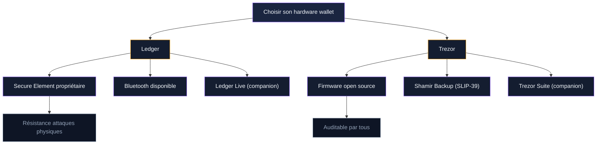
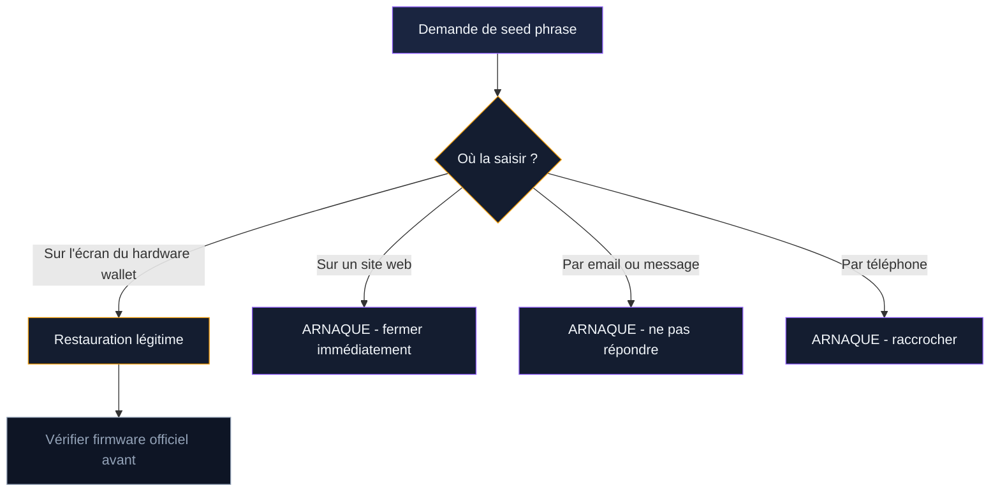

Un hardware wallet garde vos clés privées hors d'Internet. Mais un appareil mal configuré donne un faux sentiment de sécurité. Chaque année, des utilisateurs de Ledger et Trezor perdent leurs fonds - pas à cause d'une faille dans l'appareil, mais à cause d'erreurs de configuration ou d'utilisation.

Ce guide couvre la configuration optimale d'un Ledger ou d'un Trezor, étape par étape, pour que votre portefeuille matériel protège réellement vos bitcoins.

## Pourquoi un hardware wallet ne suffit pas seul

Ledger et Trezor stockent vos clés privées dans une puce isolée. Les transactions se signent à l'intérieur de l'appareil. Votre clé ne quitte jamais la puce, même quand vous branchez l'appareil sur un ordinateur compromis. C'est le principe de base.

Le problème : cette protection technique ne couvre qu'une partie des risques. Les attaques les plus rentables ciblent l'utilisateur, pas l'appareil. Un phishing bien construit qui vous pousse à saisir votre seed phrase sur un faux site contourne toute la sécurité matérielle. Un PIN trop simple permet à un voleur physique d'accéder à vos fonds en quelques tentatives.

Plus de 2 millions de personnes utilisent Trezor dans le monde. Ledger revendique plus de 7 millions d'appareils vendus. Les deux marques offrent une sécurité solide. La différence entre un portefeuille bien protégé et un portefeuille vulnérable tient à la configuration.

> [!IMPORTANT]
> Un hardware wallet protège vos clés privées, pas votre seed phrase. Si vous saisissez vos 24 mots sur un faux site ou les stockez dans un fichier numérique, l'appareil ne peut rien pour vous.

## Ledger vs Trezor : deux philosophies de sécurité

Les deux marques protègent vos bitcoins, mais leurs approches diffèrent sur des points techniques qui comptent.

### L'approche Ledger : puce Secure Element

Ledger utilise une puce Secure Element (SE), la même technologie que les cartes bancaires et les passeports biométriques. Cette puce résiste aux attaques physiques : extraction de données par sonde, analyse de courant, attaques par canal auxiliaire. Le firmware de Ledger est propriétaire et ne peut pas être audité publiquement.

Les modèles actuels : Ledger Nano S Plus (USB-C, écran monochrome, environ 79 euros), Ledger Nano X (Bluetooth, écran monochrome, environ 149 euros), Ledger Stax (écran tactile e-ink, environ 279 euros).

### L'approche Trezor : open source et transparence

Trezor mise sur le code open source. N'importe quel développeur peut auditer le firmware, le logiciel companion (Trezor Suite) et le hardware. Cette transparence permet à la communauté de repérer les vulnérabilités. Le revers : un attaquant motivé peut aussi étudier le code pour chercher des failles.

Les modèles actuels : Trezor Safe 3 (puce Secure Element + open source, environ 79 euros), Trezor Safe 5 (écran tactile couleur, environ 169 euros), Trezor Safe 7 (dernier modèle, écran couleur, environ 149 euros).

### Quel modèle choisir

Pour du Bitcoin uniquement avec un budget serré, le Trezor Safe 3 ou le Ledger Nano S Plus font le travail à environ 79 euros. Pour un usage multicrypto avec plus de confort, le Trezor Safe 5 et le Ledger Nano X se valent. L'écran tactile du Trezor Safe 5 rend la saisie du PIN plus sûre (pas de keylogger possible).

Si la transparence du code compte pour vous, Trezor gagne. Si vous voulez la résistance physique maximale d'une puce certifiée, Ledger gagne. Les deux protègent correctement des attaques distantes, qui représentent 95% des menaces réelles.

## Configuration initiale : les étapes qui comptent

L'initialisation d'un hardware wallet se fait une seule fois. Chaque erreur à cette étape compromet la sécurité pour toute la durée d'utilisation de l'appareil.

### Vérifier l'authenticité de l'appareil

Commandez uniquement sur ledger.com ou trezor.io. Les revendeurs tiers (Amazon, eBay, Leboncoin) représentent un risque réel : des appareils ont été vendus avec une seed phrase prégénérée collée dans la boîte. L'utilisateur pense que c'est normal, configure l'appareil avec cette seed, et le vendeur vide le portefeuille quelques semaines plus tard.

A la réception, vérifiez le sceau de sécurité sur l'emballage. Aucune seed phrase ne doit être fournie avec l'appareil. Vous la générez vous-même.

Ledger Live et Trezor Suite incluent une vérification d'authenticité au premier branchement. Lancez cette vérification avant toute configuration.

### Générer et noter la seed phrase

L'appareil génère 12 ou 24 mots aléatoires lors de l'initialisation. Ces mots contrôlent l'accès à tous vos fonds. La procédure correcte :

1. Préparez du papier et un stylo. Pas de téléphone, pas d'ordinateur, pas d'appareil photo dans la pièce.
2. Notez chaque mot dans l'ordre exact affiché sur l'écran de l'appareil.
3. Vérifiez deux fois chaque mot. L'appareil vous demande de confirmer certains mots - prenez cette étape au sérieux.
4. Rangez le papier dans un endroit sûr immédiatement.

Trezor propose Shamir Backup (SLIP-39) : votre seed est divisée en plusieurs parts (par exemple 3 parts, dont 2 suffisent pour restaurer). Chaque part seule est inutile. Cette méthode est plus résiliente que le stockage classique d'une seule seed complète.

> [!TIP]
> Pour des montants importants (plus de 5 000 euros), gravez votre seed phrase sur une plaque métallique (acier ou titane). Le papier ne résiste ni au feu ni à l'eau. Des plaques compatibles existent chez Cryptosteel, Billfodl ou Trezor Keep Metal (environ 50-90 euros).

### Configurer le code PIN

Le PIN protège l'accès physique à l'appareil. Les règles :

**Ledger** : PIN de 4 à 8 chiffres. Après 3 tentatives erronées, l'appareil se réinitialise. Choisissez au moins 6 chiffres. Evitez les dates de naissance et les suites simples (1234, 0000).

**Trezor** : PIN de longueur variable (jusqu'à 50 chiffres sur les modèles récents). L'écran de l'appareil affiche une grille aléatoire pour la saisie, ce qui empêche un keylogger sur l'ordinateur de capturer le code. Après chaque tentative erronée, le délai d'attente double (1 seconde, 2, 4, 8...). Au bout de 16 erreurs, l'appareil s'efface.

### Activer la passphrase (portefeuille caché)

La passphrase est un 25e mot que vous ajoutez à votre seed phrase. Elle crée un portefeuille totalement différent, invisible sans ce mot supplémentaire. Même si quelqu'un trouve vos 24 mots, il accède uniquement au portefeuille standard (que vous pouvez laisser vide ou avec un petit montant comme leurre).

Sur Ledger : activez la passphrase dans les paramètres de sécurité de l'appareil. Deux options existent - passphrase temporaire (à saisir à chaque connexion) ou rattachée à un second PIN.

Sur Trezor : activez dans Trezor Suite > Paramètres > Sécurité. La passphrase se saisit à chaque connexion sur l'écran de l'appareil (modèles récents) ou sur l'ordinateur (anciens modèles).

> [!WARNING]
> La passphrase n'est pas sauvegardée sur l'appareil. Si vous l'oubliez, vos fonds dans le portefeuille caché sont perdus. Notez-la séparément de votre seed phrase, dans un lieu différent.

## Sécurité au quotidien : les habitudes qui protègent

La configuration initiale pose les bases. L'utilisation quotidienne détermine si ces bases tiennent.

### Mettre à jour le firmware

Ledger et Trezor publient des mises à jour firmware qui corrigent des vulnérabilités et ajoutent des fonctionnalités. Installez ces mises à jour, mais uniquement via l'application officielle (Ledger Live ou Trezor Suite).

Les fausses mises à jour sont un vecteur d'attaque classique. En 2023, des emails imitant Ledger demandaient aux utilisateurs de "mettre à jour leur firmware" via un lien frauduleux. Le faux site collectait les seed phrases.

Règle simple : ne lancez jamais une mise à jour depuis un lien reçu par email. Ouvrez Ledger Live ou Trezor Suite directement, et vérifiez si une mise à jour est disponible depuis l'application.

### Vérifier chaque transaction sur l'écran

L'écran de votre hardware wallet est la dernière ligne de défense. Un malware sur votre ordinateur peut modifier l'adresse de destination affichée à l'écran du PC tout en laissant la vraie adresse sur l'appareil.

Avant de confirmer une transaction, comparez l'adresse affichée sur l'écran de l'appareil avec celle que vous avez copiée. Vérifiez au minimum les 8 premiers et les 8 derniers caractères. Prenez 10 secondes de plus. Ces 10 secondes peuvent sauver des milliers d'euros.

### Ne jamais saisir sa seed sur un ordinateur

Votre seed phrase ne se tape que sur l'écran d'un hardware wallet, lors d'une restauration. Jamais sur un site web, jamais dans un logiciel, jamais dans un email. Aucun service légitime ne demandera vos 24 mots via un formulaire en ligne.

Si un écran vous demande votre seed phrase en dehors de la procédure de restauration sur l'appareil physique : fermez tout. C'est une tentative de vol.

### Gérer le Bluetooth (Ledger Nano X)

Le Nano X se connecte en Bluetooth à votre téléphone. Le Bluetooth est chiffré et la clé privée ne transite jamais via cette connexion. Seules les données de transaction circulent. La signature se fait toujours à l'intérieur de la puce.

Si le Bluetooth vous inquiète : désactivez-le dans les paramètres du Nano X et utilisez uniquement le câble USB-C. Le gain de sécurité est marginal, mais si ça vous rassure, c'est un réglage simple.

## Erreurs fréquentes et comment les éviter

### Acheter un appareil d'occasion

Un appareil d'occasion peut avoir été modifié. Le vendeur a pu extraire la seed phrase, modifier le firmware ou installer une version compromise. Le prix d'un appareil neuf (79 à 279 euros) ne justifie pas le risque de perdre des milliers d'euros.

Achetez neuf, directement chez le fabricant.

### Stocker la seed phrase en numérique

Photo sur le téléphone, fichier texte, email, cloud, gestionnaire de mots de passe en ligne : toutes ces méthodes exposent vos 24 mots à des fuites de données. Les services cloud synchronisent automatiquement les photos. Un malware sur votre téléphone accède à votre galerie. Une fuite de données sur iCloud ou Google Drive rend votre seed accessible.

Papier ou métal. Rien d'autre.

### Ignorer le test de restauration

Après avoir noté votre seed phrase, testez la restauration sur l'appareil. Réinitialisez votre hardware wallet (ou utilisez un second appareil), entrez votre seed, et vérifiez que vous retrouvez les mêmes adresses et les mêmes fonds.

Ce test prend 10 minutes. Il confirme que vous avez bien noté les bons mots dans le bon ordre. Sans ce test, vous ne saurez si votre sauvegarde fonctionne qu'au moment où vous en aurez besoin - et là, il sera trop tard pour corriger une erreur.

> [!CAUTION]
> 20% des bitcoins en circulation (environ 3,7 millions de BTC) sont considérés comme perdus. Une partie vient de seed phrases mal notées ou jamais testées. Un seul mot erroné rend la restauration impossible.

### Utiliser le même PIN partout

Votre code PIN de hardware wallet doit être unique. Ne réutilisez pas le PIN de votre carte bancaire, de votre téléphone ou d'un autre service. Si un de ces codes fuite, votre wallet reste protégé.

## Que faire en cas de problème

### L'appareil est perdu ou volé

Pas de panique immédiate. Sans votre PIN, un voleur ne peut rien faire. Après quelques tentatives erronées, l'appareil s'efface. Vos fonds restent en sécurité sur la blockchain.

Achetez un nouvel appareil, restaurez avec votre seed phrase, et transférez vos fonds vers un nouveau portefeuille avec une nouvelle seed. Par précaution, ne réutilisez pas la même seed sur le nouvel appareil : un attaquant sophistiqué pourrait avoir extrait des informations avant l'effacement.

### La seed phrase est compromise

Si vous soupçonnez que quelqu'un a vu ou copié votre seed phrase, agissez immédiatement. Créez un nouveau portefeuille avec une nouvelle seed sur votre appareil. Transférez tous vos fonds vers les nouvelles adresses. Chaque minute compte.

### L'appareil ne fonctionne plus

Un hardware wallet défaillant ne signifie pas une perte de fonds. Vos bitcoins existent sur la blockchain, pas dans l'appareil. Votre seed phrase permet de restaurer l'accès sur n'importe quel hardware wallet compatible (même d'une autre marque pour les seeds BIP-39 standard).

Commandez un nouvel appareil et restaurez. Trezor et Ledger utilisent le standard BIP-39, compatible entre les deux marques. Une seed générée sur un Trezor fonctionne sur un Ledger, et inversement.

## Checklist de configuration

Imprimez cette liste et cochez chaque point lors de la configuration de votre appareil :

**Achat et initialisation**
- [ ] Appareil acheté sur le site officiel (ledger.com ou trezor.io)
- [ ] Emballage intact, pas de seed phrase fournie
- [ ] Vérification d'authenticité via Ledger Live ou Trezor Suite
- [ ] Seed phrase notée sur papier, vérifiée deux fois
- [ ] Seed phrase stockée dans un lieu sûr (coffre, plaque métallique)

**Configuration de sécurité**
- [ ] Code PIN de 6 chiffres minimum, unique
- [ ] Passphrase activée pour les montants importants
- [ ] Passphrase notée séparément de la seed phrase
- [ ] Test de restauration effectué avec succès

**Usage quotidien**
- [ ] Firmware à jour via l'application officielle
- [ ] Adresse de destination vérifiée sur l'écran de l'appareil
- [ ] Seed phrase jamais saisie sur un site web ou un ordinateur
- [ ] Appareil stocké dans un lieu sûr quand il n'est pas utilisé

Ce processus prend environ 30 minutes pour la configuration initiale. Ces 30 minutes protègent des fonds que vous avez peut-être mis des années à accumuler. Chaque étape existe parce que des utilisateurs ont perdu de l'argent en la sautant.
