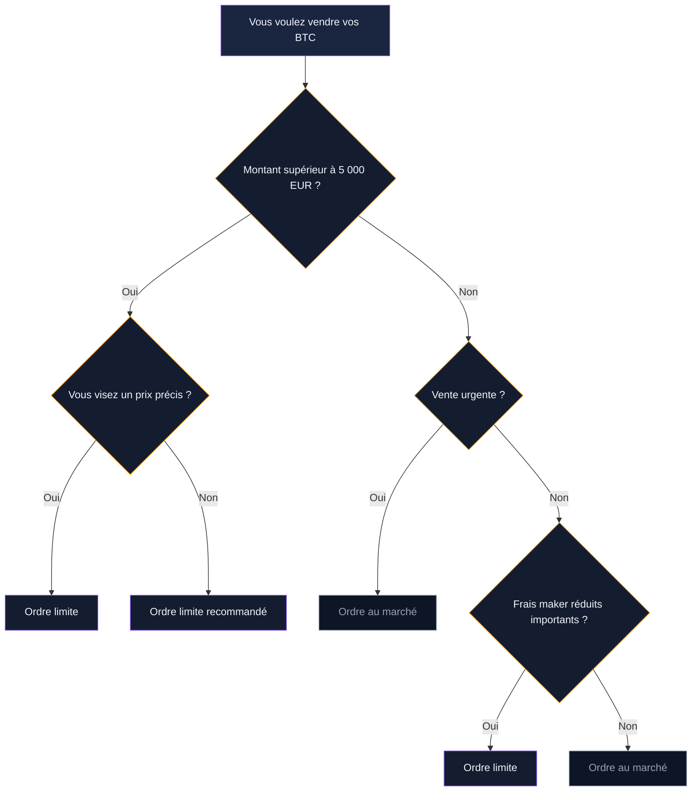

Vous avez du bitcoin sur une plateforme ou un portefeuille, et vous voulez le convertir en euros. La bonne nouvelle : l'opération prend moins de 5 minutes sur la plupart des plateformes. La mauvaise : les frais, le spread et les délais de retrait varient beaucoup d'un service à l'autre, et un mauvais choix peut vous coûter 2 à 3 % de votre montant.

Ce tutoriel détaille chaque étape de la vente sur les plateformes les plus utilisées en France. Pas de théorie sur le timing ou la stratégie - le hub parent couvre déjà ces sujets. Ici, on parle boutons, écrans et virements.

## Avant de vendre : les prérequis

Avant de lancer votre première vente, vérifiez trois choses.

### Un compte vérifié (KYC)

Toutes les plateformes réglementées en Europe exigent une vérification d'identité. Si vous avez déjà acheté du bitcoin sur la plateforme, votre KYC est probablement valide. Sinon, prévoyez 10 à 30 minutes pour soumettre une pièce d'identité et un justificatif de domicile. La validation prend entre quelques minutes et 48 heures selon la plateforme.

### Des bitcoins disponibles sur la plateforme

Vos BTC doivent être sur le solde de la plateforme où vous comptez vendre. Si vos bitcoins sont sur un Ledger, un Trezor ou un portefeuille mobile, vous devrez d'abord les transférer. Connectez-vous à la plateforme, allez dans la section "Dépôt" ou "Recevoir", copiez l'adresse Bitcoin affichée, puis envoyez vos BTC depuis votre portefeuille externe. Le transfert prend 10 à 60 minutes selon la congestion du réseau.

> [!WARNING]
> Vérifiez toujours que l'adresse de dépôt correspond bien au réseau Bitcoin (BTC). Envoyer des BTC sur une adresse Ethereum ou un autre réseau entraîne une perte définitive des fonds.

### Un compte bancaire associé

Pour retirer vos euros, la plateforme doit connaître votre IBAN. Ajoutez votre RIB dans les paramètres de votre compte avant la vente. Sur certaines plateformes (Coinbase, Bitpanda), le premier virement de retrait peut être bloqué 48 à 72 heures pour vérification.

## Vendre sur Binance : étape par étape

Binance est la plateforme la plus utilisée au monde par volume d'échange. Les frais de vente sont parmi les plus bas du marché : 0,1 % par transaction en spot.

### Via l'interface "Convertir"

L'option la plus simple pour un débutant.

1. Connectez-vous à votre compte Binance
2. Cliquez sur **Trade** puis **Convertir** dans le menu principal
3. Dans le champ "De", sélectionnez **BTC** et entrez le montant à vendre
4. Dans le champ "À", sélectionnez **EUR**
5. Binance affiche le taux de conversion et le montant que vous recevrez
6. Cliquez sur **Aperçu de la conversion**, puis **Convertir**

Le montant en euros apparaît immédiatement sur votre solde fiat. Les frais sont intégrés dans le taux de conversion (spread) - comptez environ 0,1 à 0,5 % selon la liquidité du moment.

### Via le marché spot (BTC/EUR)

Pour les utilisateurs qui veulent plus de contrôle.

1. Allez dans **Trade** > **Spot**
2. Recherchez la paire **BTC/EUR**
3. Dans le panneau de vente (à droite), choisissez **Ordre au marché** pour une vente immédiate ou **Ordre limite** pour fixer votre prix
4. Entrez le montant de BTC à vendre
5. Cliquez sur **Vendre BTC**

Les frais spot standard sont de 0,1 %. Si vous détenez du BNB et activez le paiement des frais en BNB, vous obtenez 25 % de réduction (0,075 %).

### Retirer ses euros

Allez dans **Portefeuille** > **Portefeuille Fiat et Spot** > **Retrait**. Sélectionnez EUR, choisissez virement SEPA, entrez le montant et confirmez. Le retrait SEPA est gratuit sur Binance. Délai : 1 à 2 jours ouvrables.

> [!TIP]
> Sur Binance, le virement SEPA est gratuit et traité en 1-2 jours. Pour des retraits rapides, le SEPA instantané coûte 1 EUR mais arrive en quelques minutes.

## Vendre sur Coinbase : étape par étape

Coinbase est l'une des plateformes les plus populaires en France grâce à son interface épurée. Les frais sont plus élevés que Binance, mais l'expérience utilisateur est plus accessible.

### Sur l'application mobile

1. Ouvrez l'app Coinbase
2. Appuyez sur **Achat/Vente** en bas de l'écran
3. Sélectionnez **Vendre**
4. Choisissez **Bitcoin** dans la liste
5. Entrez le montant en euros ou en BTC
6. Vérifiez la destination (solde EUR par défaut)
7. Appuyez sur **Vérifier l'ordre** puis **Vendre**

### Sur le site web

1. Connectez-vous sur coinbase.com
2. Cliquez sur **Acheter/Vendre** en haut à droite
3. Sélectionnez l'onglet **Vendre**
4. Choisissez Bitcoin, entrez le montant
5. Confirmez l'opération

Les frais sur Coinbase varient selon le montant et la méthode de paiement. En achat/vente simple, comptez environ 1,49 % par transaction. Sur Coinbase Advanced (ex-Coinbase Pro), les frais descendent entre 0,05 % et 0,60 % selon votre volume mensuel de trading.

### Retirer ses euros

Allez dans **Paramètres** > **Méthode de paiement**, vérifiez que votre compte bancaire est bien lié. Depuis votre solde EUR, cliquez sur **Retirer** et lancez un virement SEPA. Le retrait est gratuit. Délai standard : 1 à 3 jours ouvrables.

## Vendre sur Kraken : étape par étape

Kraken existe depuis 2011 et jouit d'une bonne réputation en matière de sécurité. Les frais spot sont compétitifs : entre 0,16 % (maker) et 0,26 % (taker) pour les volumes inférieurs à 50 000 dollars par mois.

### Vente rapide

1. Connectez-vous à votre compte Kraken
2. Cliquez sur le bouton **Nouveau Ordre** ou allez dans **Acheter des cryptos**
3. Sélectionnez **Vendre** et choisissez **Bitcoin**
4. Entrez le montant, sélectionnez EUR comme devise de réception
5. Confirmez la transaction

### Vente spot avancée

1. Accédez au **Terminal de trading** (Kraken Pro)
2. Sélectionnez la paire **XBT/EUR** (XBT est le code de Bitcoin sur Kraken)
3. Choisissez un ordre **Market** ou **Limit**
4. Entrez la quantité et validez

### Retirer ses euros

Allez dans **Financement** > **Retirer** > **EUR**. Kraken facture 1 EUR par virement SEPA classique. Le SEPA instantané coûte environ 3,50 EUR. Délai : 1 à 5 jours ouvrables pour le SEPA standard, quelques minutes pour l'instantané.

## Comparatif des frais de vente

Le coût réel d'une vente ne se limite pas aux frais affichés. Le spread - l'écart entre le prix affiché et le prix d'exécution - peut ajouter 0,1 à 0,5 % de frais cachés. Voici un comparatif pour une vente de 1 000 EUR de bitcoin.

| Plateforme | Frais de vente | Spread estimé | Coût total (1 000 EUR) | Retrait SEPA |
|------------|---------------|---------------|----------------------|--------------|
| Binance (spot) | 0,10 % | ~0,1 % | ~2 EUR | Gratuit |
| Coinbase (simple) | 1,49 % | ~0,5 % | ~20 EUR | Gratuit |
| Coinbase Advanced | 0,05-0,60 % | ~0,1 % | ~4 EUR | Gratuit |
| Kraken (spot) | 0,26 % | ~0,2 % | ~4,60 EUR | 1 EUR |
| Bitpanda | 0,99 % | inclus | ~10 EUR | Gratuit |
| Coinhouse | 1,29 % | inclus | ~13 EUR | Gratuit |

> [!IMPORTANT]
> Sur les interfaces "simples" (Coinbase, Bitpanda), le spread est souvent intégré dans le prix affiché. Passez par l'interface avancée ou le mode spot pour réduire vos frais de 50 à 80 %.

## Ordre au marché vs ordre limite : lequel choisir

Deux types d'ordres existent sur toutes les plateformes. Le choix entre les deux dépend du montant et de votre urgence.

### Ordre au marché (market order)

Vous vendez immédiatement au meilleur prix disponible. L'exécution est quasi instantanée. L'inconvénient : sur un montant important (au-delà de 5 000 - 10 000 EUR), le prix réel d'exécution peut être inférieur au prix affiché. C'est le slippage - votre ordre "mange" les offres d'achat dans le carnet d'ordres, et le prix moyen baisse.

Pour une vente de moins de 2 000 EUR, l'ordre au marché est généralement le plus pratique. Le slippage reste négligeable.

### Ordre limite (limit order)

Vous fixez un prix minimum. Votre vente ne s'exécute que si le cours atteint ou dépasse ce prix. Avantage : vous contrôlez le prix exact. Inconvénient : si le cours n'atteint jamais votre limite, la vente ne se fait pas.

L'ordre limite est recommandé pour les gros montants ou si vous visez un prix précis. Sur Binance et Kraken, les ordres limites bénéficient de frais maker réduits (0,02 à 0,16 % au lieu de 0,04 à 0,26 %).

## Vendre depuis un portefeuille externe

Si vos bitcoins sont sur un hardware wallet (Ledger, Trezor) ou un portefeuille mobile (Blue Wallet, Exodus), vous ne pouvez pas les vendre directement. Il faut d'abord les transférer vers une plateforme d'échange.

### Transfert depuis un Ledger

1. Connectez votre Ledger et ouvrez l'app Bitcoin
2. Sur la plateforme d'échange (Binance, Coinbase...), allez dans **Dépôt BTC** et copiez l'adresse
3. Dans Ledger Live, sélectionnez votre compte Bitcoin, cliquez sur **Envoyer**
4. Collez l'adresse de dépôt, entrez le montant
5. Vérifiez l'adresse sur l'écran du Ledger et confirmez
6. Attendez la confirmation (10 à 60 minutes)

Les frais de réseau Bitcoin varient. En période calme, un transfert coûte 1 à 3 EUR. En période de congestion, les frais peuvent grimper à 10-30 EUR. Vérifiez les frais estimés avant de confirmer.

### Transfert depuis un portefeuille mobile

Le processus est similaire. Ouvrez votre portefeuille, sélectionnez "Envoyer", collez l'adresse de dépôt de la plateforme et validez. Certains portefeuilles (Exodus, Trust Wallet) proposent un échange intégré, mais les frais sont souvent plus élevés qu'un transfert vers une plateforme spécialisée.

> [!NOTE]
> Les frais de réseau Bitcoin dépendent de la congestion. Utilisez un estimateur comme mempool.space pour choisir le bon niveau de frais avant d'envoyer vos BTC.

## Les options alternatives pour vendre

Les plateformes centralisées ne sont pas la seule voie. Deux autres options existent.

### Les distributeurs Bitcoin (ATM)

La France compte environ 40 distributeurs Bitcoin, surtout à Paris, Lyon et Marseille. Certains permettent de vendre : vous envoyez vos BTC à l'adresse du distributeur et recevez des espèces. Les frais sont élevés - entre 5 et 10 % en moyenne. C'est une option de dépannage, pas une méthode régulière.

### La vente en P2P

Le hub parent détaille les plateformes Bisq, Peach Bitcoin et Hodl Hodl. En résumé : vous vendez directement à un acheteur, sans intermédiaire custodial. Les frais sont bas, mais les volumes sont limités et les transactions prennent plus de temps. Le P2P convient si la confidentialité est votre priorité.

## Retirer ses euros : SEPA, instantané ou carte

Après la vente, vos euros sont sur le solde fiat de la plateforme. Trois façons de les récupérer.

### Virement SEPA classique

Gratuit ou presque sur toutes les plateformes. Le délai varie de 1 à 3 jours ouvrables. C'est l'option standard et la moins chère.

### Virement SEPA instantané

Disponible sur Binance, Kraken et quelques autres. L'argent arrive en 2 à 10 minutes sur votre compte bancaire. Le coût : 1 à 3,50 EUR selon la plateforme. Pour un retrait supérieur à 500 EUR, le surcoût est négligeable par rapport au confort.

### Carte de débit crypto

Binance Card, Crypto.com ou Gnosis Pay permettent de dépenser vos euros convertis sans retrait bancaire. Pratique pour des achats ponctuels. Attention : chaque paiement effectué via la conversion automatique de crypto vers fiat est un fait générateur d'imposition.

## Les 5 erreurs qui coûtent cher

Certaines erreurs reviennent chez les vendeurs débutants. Voici les plus coûteuses.

**Vendre sur l'interface simple alors que l'interface avancée existe.** Sur Coinbase, la différence entre l'interface standard (1,49 % + spread) et Coinbase Advanced (0,05-0,60 %) représente 10 à 15 EUR pour une vente de 1 000 EUR. L'interface avancée n'est pas plus compliquée - elle affiche juste un carnet d'ordres en plus.

**Ignorer le spread.** Le prix affiché sur l'écran d'achat/vente simple n'est pas le prix du marché. Il inclut une marge de 0,3 à 0,8 % selon la plateforme. Comparez toujours avec le cours réel sur CoinGecko ou CoinMarketCap.

**Transférer ses BTC sur la mauvaise blockchain.** Certaines plateformes proposent des dépôts BTC via le réseau BEP-20 (Binance Smart Chain) ou d'autres réseaux. Si votre portefeuille envoie sur le réseau Bitcoin natif, utilisez l'adresse Bitcoin native (commençant par 1, 3 ou bc1).

**Oublier la fiscalité.** Chaque vente de BTC en euros est un événement imposable. Gardez une trace de chaque transaction - la plupart des plateformes fournissent un export CSV ou PDF. Le hub parent et notre guide fiscalité détaillent le calcul de la plus-value et la déclaration.

**Retirer ses euros un vendredi soir.** Les virements SEPA ne sont traités que les jours ouvrables. Un retrait lancé le vendredi sera traité lundi ou mardi. Si vous avez besoin de vos fonds rapidement, optez pour le SEPA instantané ou planifiez vos retraits en début de semaine.

> [!CAUTION]
> Avant de confirmer un dépôt BTC sur une plateforme, vérifiez que le réseau sélectionné correspond bien à celui de votre portefeuille. Une erreur de réseau est irréversible.

## Récapitulatif : vendre en 4 étapes

1. **Vérifier** que votre compte est validé (KYC, IBAN enregistré)
2. **Déposer** vos BTC sur la plateforme s'ils sont sur un portefeuille externe
3. **Vendre** via l'interface spot ou avancée pour réduire les frais
4. **Retirer** vos euros par virement SEPA vers votre compte bancaire

La vente elle-même prend 2 minutes. C'est la préparation (transfert, vérification) et le retrait (délai SEPA) qui prennent le plus de temps. Sur une plateforme où vos BTC sont déjà disponibles et votre IBAN enregistré, vous passez de Bitcoin à euros sur votre compte bancaire en 1 à 3 jours.
