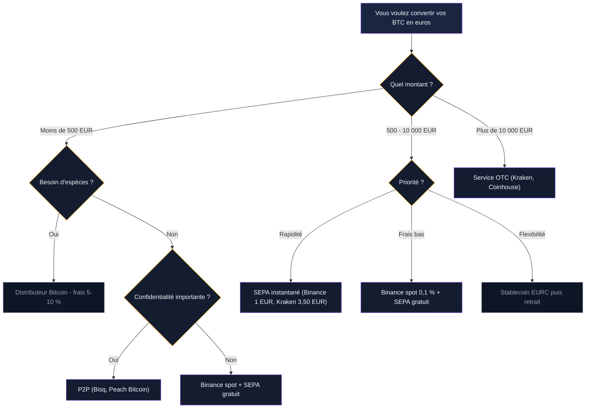

Vous avez vendu vos bitcoins sur une plateforme. Le solde en euros s'affiche sur votre compte. Et maintenant ? Comment récupérer cet argent sur votre compte bancaire, en combien de temps, et à quel prix ?

La conversion BTC vers EUR semble simple - et elle l'est, techniquement. Mais entre le spread caché, les frais de retrait, le délai bancaire et les plafonds, le montant qui arrive sur votre compte peut différer de ce que vous attendiez. Ce guide compare chaque méthode de retrait, plateforme par plateforme, pour que vous sachiez exactement combien vous recevrez et quand.

## Le parcours d'un bitcoin jusqu'à votre compte bancaire

La conversion suit toujours le même schéma en trois temps.

**Temps 1 : la vente.** Vous échangez vos BTC contre des euros sur une plateforme. L'opération prend quelques secondes. Les euros atterrissent sur votre solde fiat interne - le "portefeuille euros" de votre compte.

**Temps 2 : le retrait.** Vous lancez un virement depuis ce solde vers votre compte bancaire. C'est à cette étape que les délais varient.

**Temps 3 : la réception.** L'argent arrive sur votre compte. Selon la méthode choisie, comptez entre 2 minutes et 5 jours.

Le cours du Bitcoin fluctue en permanence. En février 2026, 1 BTC vaut environ 59 000 EUR. Ce prix change toutes les secondes. Le montant que vous recevez dépend du cours exact au moment où votre ordre est exécuté, pas du cours affiché quand vous avez ouvert la page.

> [!TIP]
> Si le montant à retirer dépasse 10 000 EUR, fractionnez la vente en plusieurs ordres limites plutôt qu'un seul ordre au marché. Vous réduisez le slippage et obtenez un prix moyen plus avantageux.

## Virement SEPA classique : l'option standard

Le virement SEPA reste la méthode la plus utilisée pour convertir ses BTC en euros. C'est aussi la moins chère.

### Comment ça marche

Après la vente, vos euros sont sur le solde fiat de la plateforme. Vous allez dans la section "Retrait" ou "Withdraw", sélectionnez EUR, entrez le montant, choisissez votre IBAN et validez. La plateforme initie un virement SEPA vers votre banque.

### Délais réels

Le délai officiel du virement SEPA est de 1 jour ouvrable. En pratique, ajoutez le temps de traitement interne de la plateforme :

| Plateforme | Traitement interne | Délai total réel |
|------------|-------------------|------------------|
| Binance | Quelques heures | 1-2 jours |
| Coinbase | Jusqu'à 24h | 2-3 jours |
| Kraken | 1-2 jours | 2-5 jours |
| Bitpanda | Quelques heures | 1-2 jours |
| Coinhouse | Même jour | 1-2 jours |

Ces délais correspondent aux jours ouvrables. Un retrait lancé le vendredi après-midi n'arrivera pas avant mardi ou mercredi.

### Frais

| Plateforme | Frais retrait SEPA |
|------------|-------------------|
| Binance | Gratuit |
| Coinbase | Gratuit |
| Kraken | 1 EUR |
| Bitpanda | Gratuit |
| Coinhouse | Gratuit |
| Bitstamp | 3 EUR |

Le virement SEPA est gratuit sur la plupart des grandes plateformes. Les frais se jouent sur la vente elle-même, pas sur le retrait.

## Virement SEPA instantané : l'argent en quelques minutes

Le SEPA instantané (SCT Inst) fonctionne 24h/24, 7j/7, week-ends et jours fériés compris. L'argent arrive sur votre compte en 10 à 30 secondes dans la plupart des cas.

### Disponibilité par plateforme

Toutes les plateformes ne le proposent pas, et votre banque doit aussi accepter les virements instantanés entrants.

| Plateforme | SEPA instantané | Frais |
|------------|----------------|-------|
| Binance | Oui | 1 EUR |
| Kraken | Oui | 3,50 EUR |
| Bitstamp | Oui | 3 EUR |
| Coinbase | Non disponible | - |
| Bitpanda | Oui (via partenaire) | Variable |

> [!WARNING]
> Certaines banques françaises rejettent les virements instantanés provenant de plateformes crypto. BNP Paribas, Société Générale et quelques banques régionales bloquent parfois ces transferts. Vérifiez avec votre banque avant de payer les frais de SEPA instantané.

### Plafond

Le plafond du virement SEPA instantané est fixé à 100 000 EUR par transaction dans la zone euro. Au-delà, vous devez passer par le SEPA classique ou fractionner.

## Les frais réels d'une conversion BTC vers EUR

Le coût total ne se résume pas aux frais de retrait. Quatre couches de frais s'empilent.

### 1. Frais de réseau (si transfert depuis un portefeuille externe)

Si vos BTC sont sur un Ledger ou un portefeuille mobile, vous devez d'abord les envoyer sur la plateforme. Les frais de réseau Bitcoin dépendent de la congestion. En période calme : 1 à 5 EUR. En période de forte activité : 15 à 40 EUR.

### 2. Frais de vente (trading)

C'est le pourcentage prélevé par la plateforme sur chaque transaction.

| Plateforme | Interface simple | Interface avancée/spot |
|------------|-----------------|----------------------|
| Binance | 0,1-0,5 % (convert) | 0,1 % (spot) |
| Coinbase | 1,49 % | 0,05-0,60 % |
| Kraken | 0,9 % (achat rapide) | 0,16-0,26 % |
| Bitpanda | 0,99 % | Non dispo |
| Coinhouse | 1,29 % | Non dispo |

### 3. Spread

L'écart entre le prix du marché et le prix auquel la plateforme exécute votre vente. Sur les interfaces "simples", le spread est intégré au prix affiché : 0,3 à 0,8 %. Sur le mode spot, il dépend de la liquidité du carnet d'ordres : 0,05 à 0,2 % en temps normal.

### 4. Frais de retrait

Détaillés dans les sections précédentes. De 0 à 3,50 EUR selon la plateforme et la méthode.

### Simulation : combien reçoit-on réellement ?

Prenons une vente de 0,1 BTC, soit environ 5 900 EUR au cours de février 2026.

| Scénario | Frais vente | Spread | Retrait | Total frais | Montant reçu |
|----------|------------|--------|---------|-------------|---------------|
| Binance spot + SEPA | 5,90 EUR | ~5,90 EUR | 0 EUR | ~11,80 EUR | ~5 888 EUR |
| Coinbase simple + SEPA | 87,90 EUR | ~29,50 EUR | 0 EUR | ~117,40 EUR | ~5 783 EUR |
| Coinbase Advanced + SEPA | 17,70 EUR | ~5,90 EUR | 0 EUR | ~23,60 EUR | ~5 876 EUR |
| Kraken spot + SEPA | 15,34 EUR | ~11,80 EUR | 1 EUR | ~28,14 EUR | ~5 872 EUR |

La différence entre le scénario le moins cher (Binance spot) et le plus cher (Coinbase simple) atteint 105 EUR. Sur 5 900 EUR, cela représente 1,8 % de frais supplémentaires.

> [!IMPORTANT]
> Utilisez toujours l'interface spot ou avancée de votre plateforme. L'interface "simple" ou "Convert" ajoute 0,5 à 1,5 % de frais cachés via le spread. Pour Coinbase, passez par Coinbase Advanced. Pour Kraken, utilisez le terminal de trading.

## Les stablecoins comme étape intermédiaire

Une stratégie courante consiste à convertir ses BTC en stablecoins (USDT, USDC, EURC) avant de passer en euros. Pourquoi ?

### Verrouiller un prix sans vendre en euros

Quand vous convertissez vos BTC en USDC ou EURC, vous figez la valeur de votre position sans déclencher un retrait bancaire. Les échanges crypto-crypto ne sont pas un fait générateur d'imposition en France - mais attention, la conversion en stablecoin adossé à l'euro (comme EURC) peut être requalifiée par le fisc si elle s'apparente à une cession.

### Transfert entre plateformes

Si les frais de retrait sont plus avantageux sur une autre plateforme, vous pouvez envoyer vos stablecoins via un réseau peu coûteux (Polygon, Arbitrum, Base) pour quelques centimes, puis les convertir en euros sur la plateforme cible.

### Les risques

Les stablecoins ne sont pas des euros. L'USDT a brièvement perdu son ancrage en 2022. L'USDC a décroché à 0,87 USD en mars 2023 après la faillite de Silicon Valley Bank. Garder des stablecoins sur le long terme ajoute un risque de contrepartie que le virement SEPA direct élimine.

> [!CAUTION]
> L'utilisation de stablecoins comme étape intermédiaire complique votre suivi fiscal. Chaque conversion supplémentaire crée une ligne de plus dans votre déclaration. Pour un retrait simple, le chemin direct BTC -> EUR -> virement reste le plus propre.

## Les distributeurs Bitcoin (ATM)

La France compte une quarantaine de distributeurs Bitcoin, concentrés à Paris, Lyon, Marseille et Bordeaux. Certains permettent la vente : vous envoyez vos BTC à l'adresse affichée par la machine et recevez des espèces en billets.

### Frais

C'est la méthode la plus chère. Les commissions des ATM Bitcoin oscillent entre 5 et 10 % du montant. Sur une vente de 500 EUR, vous perdez 25 à 50 EUR en frais. C'est 10 à 20 fois plus cher qu'un retrait SEPA depuis Binance.

### Plafonds

La plupart des ATM imposent un plafond de 250 à 1 000 EUR par transaction sans vérification d'identité. Au-delà, un KYC sur place (scan de pièce d'identité) est requis. Le plafond maximal tourne autour de 5 000 à 10 000 EUR par jour.

### Quand c'est utile

Les ATM servent dans deux cas précis : besoin d'espèces immédiates (pas d'attente de virement) ou absence de compte vérifié sur une plateforme. En dehors de ces situations, les frais ne se justifient pas.

## Vendre en P2P et recevoir des euros

La vente directe entre particuliers offre une alternative aux plateformes centralisées. Bisq, Peach Bitcoin et Hodl Hodl permettent de trouver un acheteur, de lui envoyer vos BTC via un système d'escrow, et de recevoir des euros par virement, PayPal, Revolut ou même en espèces.

### Avantages

- Pas de KYC sur certaines plateformes (Bisq, Peach pour les petits montants)
- Choix du mode de paiement (virement, Revolut, PayPal, espèces)
- Prix parfois supérieur au cours du marché (les acheteurs P2P paient une prime de 2 à 5 % pour la confidentialité)

### Inconvénients

- Volumes limités : trouver un acheteur pour 10 000 EUR prend du temps
- Transactions plus lentes (30 minutes à plusieurs heures)
- Risque de contrepartie malgré l'escrow
- Pas d'interface de retrait automatisée - le paiement dépend de l'acheteur

Le P2P convient pour des montants modérés (moins de 2 000 EUR) et quand la confidentialité compte plus que la rapidité.

## Quelle banque accepte les virements crypto ?

Toutes les banques françaises ne traitent pas les virements provenant de plateformes crypto de la même façon. Certaines bloquent, d'autres ralentissent, quelques-unes accueillent ces fonds sans problème.

### Banques compatibles

Les banques en ligne et néobanques sont généralement les plus souples : Boursorama, Fortuneo, Hello Bank, N26, Revolut. Elles traitent les virements SEPA provenant de Binance, Coinbase ou Kraken sans friction particulière.

### Banques problématiques

La Banque Postale, le Crédit Mutuel et certaines caisses régionales du Crédit Agricole bloquent parfois les virements entrants identifiés comme provenant de plateformes crypto. Le blocage n'est pas systématique - il dépend de la caisse locale et du montant.

### Que faire en cas de blocage

Si votre banque rejette un virement entrant :

1. Contactez votre conseiller pour débloquer la situation - dans la plupart des cas, un appel suffit
2. Fournissez un justificatif de l'origine des fonds (relevé de la plateforme, historique de transactions)
3. Si le blocage persiste, ouvrez un compte dans une banque en ligne compatible et redirigez vos retraits

> [!NOTE]
> Garder un relevé de vos transactions crypto téléchargé en PDF est une bonne habitude. En cas de question de votre banque ou du fisc, vous pouvez prouver l'origine des fonds en quelques minutes.

## Optimiser le timing de sa conversion

Le taux de change BTC/EUR bouge en permanence. Quelques principes aident à maximiser le montant reçu.

### Éviter les week-ends pour le retrait

Le cours du Bitcoin est actif 24h/24, mais les virements SEPA ne sont traités que les jours ouvrables. Un retrait lancé samedi sera initié lundi. Si le cours baisse entre-temps, vos euros sont déjà figés - mais l'argent met plus longtemps à arriver. Vendez et lancez le retrait en début de semaine pour réduire le temps où vos fonds sont "en transit".

### Les heures creuses du réseau Bitcoin

Si vous devez transférer vos BTC depuis un portefeuille externe, les frais de réseau sont plus bas entre 2h et 8h du matin (heure de Paris) et le week-end. Le site mempool.space affiche la congestion en temps réel et les frais recommandés.

### Ordres limites pour les gros montants

Pour une conversion supérieure à 5 000 EUR, placez un ordre limite légèrement au-dessus du cours actuel. Vous attendez que le prix monte de 0,5 à 1 % et gagnez plus que ce que vous économisez en frais. Si le cours ne monte pas, vous pouvez toujours annuler et passer un ordre au marché.

## Les plafonds de retrait par plateforme

Chaque plateforme impose des limites sur les montants que vous pouvez retirer par jour, par semaine ou par mois.

| Plateforme | Plafond quotidien | Plafond mensuel |
|------------|------------------|-----------------|
| Binance | 50 000 EUR (vérifié) | 500 000 EUR |
| Coinbase | 25 000 EUR | Variable |
| Kraken | 100 000 EUR (intermédiaire) | 500 000 EUR |
| Bitpanda | 100 000 EUR | Variable |
| Coinhouse | 100 000 EUR | Variable |

Pour les montants dépassant ces plafonds, contactez le support de la plateforme. La plupart proposent un service OTC (over-the-counter) pour les conversions supérieures à 50 000 - 100 000 EUR, avec des frais négociés et un accompagnement dédié.

## Ce que le fisc voit quand vous convertissez

La conversion de BTC en euros est le fait générateur de l'imposition. Pas la vente en stablecoin, pas le transfert entre portefeuilles - le passage en monnaie fiat.

Depuis le 1er janvier 2026, la flat tax sur les plus-values crypto est passée à 33,3 % (contre 30 % les années précédentes). Sur une plus-value de 5 000 EUR, l'impôt s'élève à 1 665 EUR.

Les plateformes enregistrées PSAN partagent vos données avec l'administration fiscale. Binance, Coinbase, Kraken et Coinhouse transmettent les informations sur les cessions réalisées par les résidents français. Le fisc sait quand vous avez vendu, combien, et sur quelle plateforme.

Le hub parent détaille le calcul de la plus-value (méthode PAMP), la déclaration via le formulaire 2086 et l'option du barème progressif. Consultez-le pour la partie fiscale complète.

## Récapitulatif : quelle méthode choisir

| Critère | Meilleure option |
|---------|-----------------|
| Frais les plus bas | Binance spot + SEPA gratuit |
| Rapidité | SEPA instantané (Binance, Kraken) |
| Gros montant (> 50 000 EUR) | Service OTC (Kraken, Coinhouse) |
| Confidentialité | P2P (Bisq, Peach Bitcoin) |
| Espèces | Distributeur Bitcoin (frais élevés) |
| Simplicité pour débutant | Coinbase simple (frais élevés) |

Le chemin le plus efficace pour la majorité des utilisateurs : vendre sur Binance en mode spot (0,1 % de frais), puis retirer en SEPA gratuit. L'argent arrive en 1 à 2 jours sur votre compte bancaire, avec un coût total inférieur à 0,3 % du montant converti.

Pour les montants supérieurs à 10 000 EUR, Kraken offre un bon équilibre entre frais compétitifs (0,16-0,26 %), plafonds élevés et SEPA instantané. Le surcoût de 3,50 EUR pour un retrait immédiat est négligeable sur ces montants.
