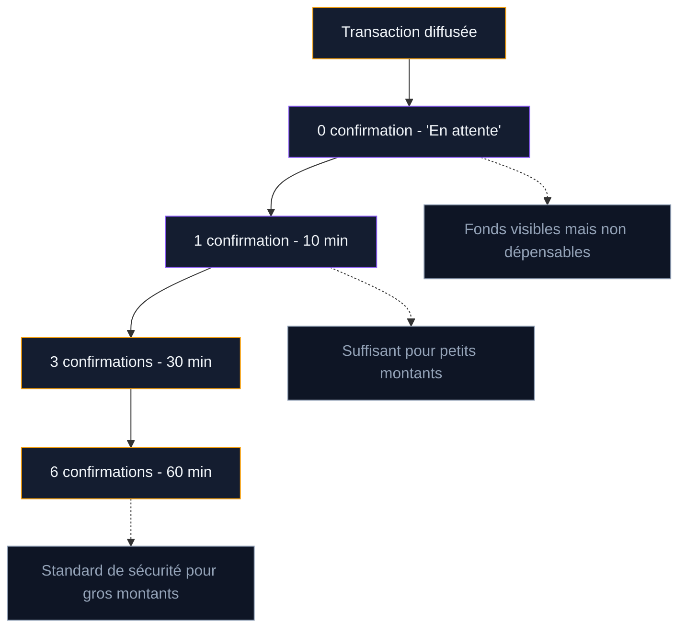

Envoyer du bitcoin a un proche, recevoir un paiement en BTC, transférer ses fonds vers un autre portefeuille : ces opérations sont simples une fois le mécanisme compris. Mais une erreur d'adresse ou un mauvais choix de frais peut bloquer vos fonds pendant des heures - ou les perdre définitivement.

Ce guide couvre chaque étape d'un transfert Bitcoin : la construction de l'adresse, l'envoi, la réception, le choix des frais, le suivi des confirmations et les erreurs à éviter.

## Comment fonctionne un transfert Bitcoin

Un transfert Bitcoin ne déplace pas des "pièces" d'un compte à un autre. Le réseau enregistre des transactions dans une chaîne de blocs publique. Quand vous envoyez 0,01 BTC à quelqu'un, votre portefeuille crée un message signé qui dit : "je transfère 0,01 BTC depuis cette adresse vers cette autre adresse". Les mineurs vérifient la signature, incluent la transaction dans un bloc, et le destinataire peut dépenser les fonds reçus.

Trois éléments sont nécessaires pour envoyer du bitcoin :

1. **Un portefeuille** avec un solde suffisant (application mobile, logiciel desktop, hardware wallet)
2. **L'adresse Bitcoin du destinataire** (chaîne de caractères ou QR code)
3. **Des frais de réseau** pour rémunérer les mineurs qui traitent la transaction

La réception ne demande rien de plus qu'une adresse Bitcoin valide et un portefeuille pour la générer.

## Les adresses Bitcoin : formats et différences

Une adresse Bitcoin est l'équivalent d'un RIB pour le réseau Bitcoin. C'est une chaîne de caractères que vous partagez pour recevoir des fonds. Trois formats coexistent aujourd'hui.

### Legacy (P2PKH) - commence par "1"

Le format original, utilisé depuis le lancement de Bitcoin en 2009. Exemple : `1A1zP1eP5QGefi2DMPTfTL5SLmv7DivfNa`. Ces adresses fonctionnent partout, mais les transactions coûtent plus cher en frais car elles occupent plus d'espace dans un bloc.

### SegWit compatible (P2SH) - commence par "3"

Format intermédiaire introduit avec la mise à jour SegWit en 2017. Exemple : `3J98t1WpEZ73CNmQviecrnyiWrnqRhWNLy`. Les frais sont réduits d'environ 25 % par rapport aux adresses Legacy. Ce format est accepté par toutes les plateformes.

### Native SegWit (Bech32) - commence par "bc1q"

Le format le plus récent et le plus économique. Exemple : `bc1qar0srrr7xfkvy5l643lydnw9re59gtzzwf5mdq`. Les frais baissent de 40 à 50 % par rapport au format Legacy. Certains anciens services ne supportent pas encore ce format, mais c'est de plus en plus rare en 2026.

| Format | Préfixe | Réduction des frais | Compatibilité |
|--------|---------|---------------------|---------------|
| Legacy (P2PKH) | 1... | Référence | Universelle |
| SegWit (P2SH) | 3... | -25 % | Très large |
| Native SegWit (Bech32) | bc1q... | -40 à 50 % | Large |
| Taproot (Bech32m) | bc1p... | -50 % + confidentialité | En croissance |

> [!TIP]
> Utilisez une adresse Native SegWit (bc1q...) pour payer les frais les plus bas. Si le service de réception ne la supporte pas, repliez-vous sur une adresse en "3".

### Taproot (Bech32m) - commence par "bc1p"

Arrivé avec la mise à jour Taproot de novembre 2021, ce format ajoute des gains de confidentialité et réduit encore les frais pour les transactions complexes (multisig, scripts). L'adoption progresse, mais reste minoritaire pour les transferts simples entre particuliers.

## Envoyer du bitcoin : étape par étape

La procédure est identique quel que soit le portefeuille utilisé - seule l'interface change.

### 1. Ouvrir la fonction "Envoyer"

Dans votre application (Ledger Live, Electrum, BlueWallet, Exodus, l'app d'une plateforme comme Coinbase ou Binance), appuyez sur "Envoyer" ou "Send".

### 2. Saisir l'adresse du destinataire

Collez l'adresse Bitcoin que le destinataire vous a communiquée. Trois méthodes pour la récupérer :

- **Copier-coller** depuis un message ou un email. Vérifiez les premiers et derniers caractères après le collage.
- **Scanner un QR code** avec la caméra de votre téléphone. C'est la méthode la plus sûre car elle élimine le risque de faute de frappe.
- **Saisie manuelle** : à éviter autant que possible. Une seule lettre erronée rend l'adresse invalide ou envoie les fonds à quelqu'un d'autre.

> [!CAUTION]
> Un malware courant, le "clipboard hijacker", remplace l'adresse Bitcoin copiée dans votre presse-papiers par celle de l'attaquant. Vérifiez toujours les 5 premiers et 5 derniers caractères de l'adresse après le collage.

### 3. Indiquer le montant

Saisissez le montant en BTC ou en euros (le wallet convertit automatiquement). Certains wallets proposent un bouton "Envoyer tout" qui vide le portefeuille en tenant compte des frais.

### 4. Choisir les frais de réseau

Les frais déterminent la vitesse de confirmation. Trois niveaux courants :

- **Priorité haute** : confirmation dans le prochain bloc (10-20 minutes). Frais les plus élevés.
- **Priorité moyenne** : confirmation dans les 3-6 blocs suivants (30-60 minutes).
- **Priorité basse** : confirmation dans les 12-24 blocs (2-4 heures). Frais les plus bas.

La section "Frais de réseau" plus bas dans cet article détaille le fonctionnement et les montants actuels.

### 5. Vérifier et confirmer

Le wallet affiche un récapitulatif : adresse de destination, montant envoyé, frais et montant total débité. Relisez chaque ligne. Une fois le bouton "Confirmer" pressé, la transaction est irréversible.

Sur un hardware wallet (Ledger, Trezor), cette étape nécessite une validation physique sur l'appareil. L'écran du hardware wallet affiche l'adresse et le montant - vérifiez que ces informations correspondent à ce que vous avez saisi sur l'ordinateur ou le téléphone.

## Recevoir du bitcoin : étape par étape

Recevoir du bitcoin est plus simple qu'en envoyer. Vous n'avez rien à payer : les frais de réseau sont à la charge de l'expéditeur.

### 1. Ouvrir la fonction "Recevoir"

Dans votre portefeuille, appuyez sur "Recevoir" ou "Receive". Le wallet génère une adresse Bitcoin et l'affiche sous forme de texte et de QR code.

### 2. Partager votre adresse

Envoyez l'adresse ou le QR code à la personne qui doit vous payer. Les moyens les plus courants :

- QR code affiché sur votre écran, que l'autre personne scanne
- Adresse copiée et envoyée par messagerie sécurisée
- QR code généré et partagé en image

### 3. Attendre les confirmations

Les fonds apparaissent dans votre portefeuille dès que la transaction est diffusée sur le réseau (quelques secondes), mais ils ne sont pas dépensables avant au moins une confirmation (un bloc miné qui inclut la transaction).

### Faut-il réutiliser la même adresse ?

Non. Les bons wallets génèrent une nouvelle adresse à chaque réception. Réutiliser une adresse réduit votre confidentialité : n'importe qui peut consulter la blockchain et voir toutes les transactions associées à une adresse donnée. Les wallets HD (Hierarchical Deterministic) créent automatiquement de nouvelles adresses à chaque demande de réception, tout en gardant un accès à toutes les adresses précédentes.

> [!NOTE]
> Vos anciennes adresses restent valides à vie. Si quelqu'un envoie du bitcoin à une adresse que vous avez déjà utilisée, vous recevrez les fonds sans problème.

## Frais de réseau : comment ils fonctionnent

Les frais Bitcoin ne sont pas fixes. Ils dépendent de deux facteurs : la taille de votre transaction en octets et la congestion du réseau au moment de l'envoi.

### Le marché des frais

Chaque bloc Bitcoin peut contenir environ 1 Mo de transactions (jusqu'à 4 Mo avec SegWit). Les mineurs sélectionnent les transactions qui offrent les frais les plus élevés par octet. Quand le réseau est calme, quelques satoshis par octet suffisent. En période de forte demande, le prix monte.

Les frais sont exprimés en sat/vB (satoshis par octet virtuel). En février 2026, les frais typiques oscillent entre :

| Priorité | Frais estimés (sat/vB) | Coût pour un transfert classique | Délai |
|----------|------------------------|----------------------------------|-------|
| Haute | 30-80 sat/vB | 3 a 8 EUR | 10-20 min |
| Moyenne | 10-30 sat/vB | 1 a 3 EUR | 30-60 min |
| Basse | 1-10 sat/vB | 0,10 a 1 EUR | 2-24 h |

Ces chiffres varient en permanence. Des sites comme [mempool.space](https://mempool.space) affichent les frais recommandés en temps réel.

### Comment réduire les frais

Plusieurs techniques permettent de payer moins :

- **Utiliser une adresse Native SegWit** (bc1q...) : réduit la taille de la transaction de 40 %.
- **Envoyer en période creuse** : le week-end et la nuit (UTC), la mempool est souvent moins chargée.
- **Regrouper les envois** : au lieu de 5 transactions de 0,01 BTC, faites un seul envoi de 0,05 BTC. Chaque transaction a un coût fixe incompressible.
- **Passer par le Lightning Network** : pour les petits montants (moins de 0,01 BTC), les frais tombent à quelques centimes.

### Replace-By-Fee (RBF) : accélérer une transaction bloquée

Si votre transaction reste coincée dans la mempool parce que les frais choisis étaient trop bas, la fonction RBF permet de la remplacer par une version identique avec des frais plus élevés. La plupart des wallets modernes (Electrum, Sparrow, BlueWallet) supportent cette option. Activez-la avant l'envoi - tous les wallets ne la proposent pas par défaut.

## Le QR code : le moyen le plus sûr d'échanger des adresses

Les adresses Bitcoin sont longues et impossibles à mémoriser. Le QR code résout ce problème : il encode l'adresse (et parfois le montant demandé) dans une image scannable en une seconde.

### Format du QR code Bitcoin

Le QR code suit le standard BIP-21. Il peut contenir :

- L'adresse seule : `bitcoin:bc1qar0srrr7xfkvy5l643lydnw9re59gtzzwf5mdq`
- L'adresse + un montant : `bitcoin:bc1q...?amount=0.01`
- L'adresse + un label : `bitcoin:bc1q...?label=Paiement%20facture`

Quand vous scannez un QR code avec votre wallet, l'application remplit automatiquement l'adresse et le montant. Pas de copier-coller, pas de risque de faute.

### Générer un QR code pour recevoir

Tous les wallets modernes génèrent un QR code quand vous appuyez sur "Recevoir". Préférez toujours celui intégré à votre portefeuille - un site tiers pourrait substituer votre adresse par la sienne.

## Suivre une transaction : les confirmations

Après l'envoi, vous pouvez suivre l'état de votre transaction en temps réel sur un explorateur de blocs.

### Les explorateurs de blocs

Un explorateur de blocs est un moteur de recherche pour la blockchain Bitcoin. Entrez un identifiant de transaction (txid), une adresse ou un numéro de bloc, et vous voyez toutes les informations associées.

Les explorateurs les plus utilisés :

- **mempool.space** : open source, interface claire, estimation des frais en temps réel
- **blockstream.info** : rapide, minimaliste, sans publicité
- **blockchain.com/explorer** : le plus ancien, très connu mais plus chargé en pubs

### Combien de confirmations attendre ?

Chaque nouveau bloc ajouté après celui qui contient votre transaction ajoute une confirmation. Plus le nombre de confirmations augmente, plus la transaction est sécurisée contre une annulation.

- **1 confirmation** : suffisant pour un café ou un petit achat (moins de 100 EUR)
- **3 confirmations** : standard pour la plupart des transactions courantes
- **6 confirmations** : standard historique, recommandé pour les montants importants (plus de 10 000 EUR)
- **Les plateformes d'échange** exigent généralement 2 à 3 confirmations avant de créditer un dépôt BTC

Un bloc est miné toutes les 10 minutes en moyenne. Six confirmations prennent donc environ une heure.

## Les erreurs courantes et comment les éviter

Les transferts Bitcoin pardonnent peu. Voici les problèmes qui reviennent le plus souvent et les solutions pour les prévenir.

### Envoyer à la mauvaise adresse

C'est l'erreur la plus redoutée. Une transaction confirmée est irréversible. Si vous envoyez vos BTC à une adresse incorrecte, il n'existe aucun recours technique pour récupérer les fonds.

**Prévention** : vérifiez les 5 premiers et 5 derniers caractères de l'adresse. Utilisez le QR code quand c'est possible. Faites un micro-envoi test (quelques centaines de satoshis) avant un gros transfert.

### Confondre les réseaux

Bitcoin (BTC) et Bitcoin Cash (BCH) utilisent des formats d'adresses proches. Envoyer du BTC à une adresse BCH, ou vers un réseau ERC-20 (Ethereum), revient à perdre les fonds. Les plateformes comme Coinbase affichent un avertissement, mais tous les wallets ne le font pas.

**Prévention** : vérifiez que le réseau sélectionné correspond bien à "Bitcoin" ou "BTC". Sur les plateformes multi-actifs, le menu déroulant de sélection du réseau est l'étape où la majorité des erreurs se produisent.

### Frais trop bas et transaction bloquée

Si vous choisissez des frais inférieurs au minimum que les mineurs acceptent, votre transaction reste dans la mempool sans être traitée. Elle finit par expirer au bout de 14 jours environ (selon la configuration des noeuds), et les fonds reviennent à votre adresse d'origine.

**Solutions** :

- Utilisez la fonction RBF pour remplacer la transaction avec des frais plus élevés
- Si le wallet ne supporte pas RBF, la méthode CPFP (Child Pays for Parent) permet de créer une seconde transaction liée avec des frais suffisants pour débloquer les deux
- Attendez l'expiration naturelle (14 jours maximum)

> [!WARNING]
> Ne paniquez pas si une transaction met plus d'une heure. En période de congestion (gros mouvement de prix, lancement de NFT populaire), les délais peuvent atteindre 24 a 48 heures pour les transactions à frais bas.

### Oublier de sauvegarder sa phrase de récupération

Si vous perdez l'accès à votre wallet sans avoir noté la phrase de 12 ou 24 mots (seed phrase), vous perdez l'accès à tous les bitcoins qu'il contient. Cette phrase est la seule sauvegarde de vos clés privées.

**Prévention** : notez la phrase sur papier (pas dans un fichier numérique). Conservez-la dans un endroit sûr, séparé de votre wallet. Des supports en acier (Cryptosteel, Billfodl) résistent au feu et à l'eau.

## Envoyer du bitcoin depuis une plateforme vs un wallet personnel

Les deux méthodes fonctionnent, mais les implications diffèrent.

### Depuis une plateforme (Binance, Coinbase, Kraken)

- Vous n'avez pas besoin de gérer les frais manuellement : la plateforme les fixe pour vous
- Les frais de retrait sont souvent forfaitaires (0,0001 à 0,0005 BTC selon la plateforme)
- La plateforme contrôle vos clés privées - les fonds ne sont pas vraiment "les vôtres" tant qu'ils y restent
- Le retrait peut nécessiter une validation par email, SMS ou application 2FA

### Depuis un wallet personnel (Ledger, Electrum, BlueWallet)

- Vous contrôlez vos clés privées et signez chaque transaction
- Vous choisissez librement le niveau de frais
- Aucun plafond de retrait ni vérification d'identité pour envoyer
- La responsabilité de la sécurité repose entièrement sur vous

Pour des transferts fréquents de petits montants, un wallet mobile comme BlueWallet ou Phoenix (Lightning) offre un bon compromis entre simplicité et contrôle. Pour stocker des montants importants, un hardware wallet (Ledger Nano S Plus, Trezor Model T) reste la référence.

## Bitcoin on-chain vs Lightning Network

Pour les transferts de petits montants, le Lightning Network est souvent préférable au réseau principal (on-chain). Les frais tombent à quelques satoshis (fraction de centime), et le paiement se confirme en moins de 2 secondes.

| Critère | On-chain (L1) | Lightning (L2) |
|---------|---------------|----------------|
| Frais | 0,10 a 8 EUR | < 0,01 EUR |
| Délai | 10-60 min | < 3 secondes |
| Montant idéal | > 50 EUR | < 50 EUR |
| Confidentialité | Publique (blockchain) | Privée (hors chaîne) |
| Nécessite | Adresse BTC | Invoice Lightning ou adresse LNURL |

Le Lightning Network utilise des "invoices" (demandes de paiement) plutôt que des adresses fixes. L'expéditeur scanne un QR code qui contient le montant exact et expire après un délai défini (souvent 1 heure). Des wallets comme Phoenix, Breez ou Wallet of Satoshi rendent l'expérience aussi simple qu'un paiement classique.

## Checklist avant chaque envoi

Avant de presser "Confirmer", passez en revue ces points :

1. L'adresse de destination est correcte (vérifier les 5 premiers et 5 derniers caractères)
2. Le réseau sélectionné est bien "Bitcoin" (pas Ethereum, pas Tron, pas BSC)
3. Le montant correspond à ce que vous voulez envoyer
4. Les frais sont adaptés à l'urgence du transfert
5. Sur un hardware wallet : l'adresse affichée sur l'appareil correspond à celle sur l'écran de votre ordinateur
6. Pour un premier envoi vers une nouvelle adresse : un test avec un petit montant d'abord

Un transfert Bitcoin bien préparé prend 2 minutes. Un transfert raté peut coûter la totalité des fonds envoyés.
