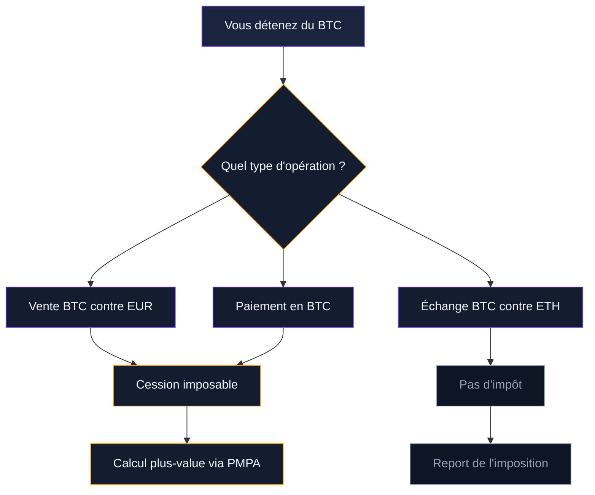
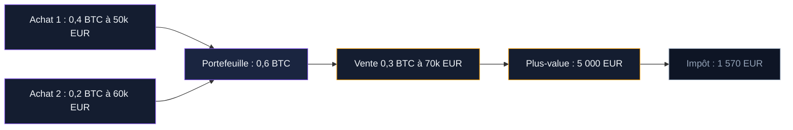
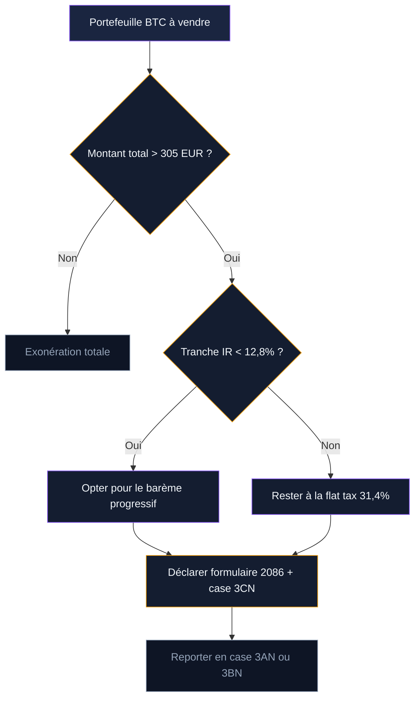

Vous venez de vendre du bitcoin. Les euros arrivent sur votre compte bancaire. Mais avant de les dépenser, une question se pose : combien devez-vous au fisc, et comment le déclarer ? Ce guide vous accompagne dans le calcul concret de votre plus-value, le remplissage des formulaires et les leviers d'optimisation légale à votre disposition.

L'angle ici est pratique. Pas de cadre juridique général ni de comparaison européenne - notre [guide sur la fiscalité Bitcoin en France](/bitcoin/reglementation-bitcoin/fiscalite-bitcoin-france) couvre ces sujets. Ici, on part de votre vente et on remonte jusqu'à la case impôts.

## Ce qui déclenche l'impôt quand vous vendez

Toute conversion de cryptomonnaie en monnaie ayant cours légal (euros, dollars) est une **cession imposable**. Que vous vendiez sur Binance, Coinbase, Kraken ou via une carte crypto, le mécanisme fiscal est le même.

Trois situations déclenchent l'impôt :

- **Vente contre euros** : vous vendez 0,5 BTC pour 15 000 EUR sur une plateforme
- **Achat de bien ou service** : vous payez un vol à 800 EUR en bitcoin
- **Paiement par carte crypto** : chaque transaction avec une Binance Card ou Crypto.com est une cession

Les échanges crypto-crypto (BTC vers ETH, BTC vers USDT) ne sont pas imposables. Vous pouvez restructurer votre portefeuille entre cryptomonnaies sans conséquence fiscale. L'impôt ne tombe qu'au moment où vous revenez vers une monnaie fiat.

> [!IMPORTANT]
> Chaque paiement par carte crypto est une cession. Si vous utilisez votre Binance Card 30 fois dans le mois, ce sont 30 opérations à déclarer. Gardez un suivi rigoureux ou passez par un logiciel fiscal.

## La flat tax : 30% en 2025, 31,4% dès 2026

Les plus-values de cession d'actifs numériques sont soumises au Prélèvement Forfaitaire Unique (PFU). Le taux dépend de l'année de la cession :

| Année de cession | Taux global | Impôt sur le revenu | Prélèvements sociaux |
|------------------|-------------|---------------------|----------------------|
| 2025 | 30% | 12,8% | 17,2% |
| 2026 et après | 31,4% | 12,8% | 18,6% |

La hausse de 1,4 point en 2026 vient de l'augmentation de la CSG, passée de 9,2% à 10,6%. Cette mesure touche tous les revenus du capital, pas seulement les cryptos.

Si vous avez vendu en 2025 et que vous déclarez en mai 2026, c'est le taux de 30% qui s'applique. Le taux de 31,4% concerne les cessions réalisées à partir du 1er janvier 2026.

### Le seuil de 305 EUR

Si le total de vos cessions sur l'année (le montant brut, pas la plus-value) reste inférieur ou égal à **305 EUR**, vous êtes exonéré d'impôt. Vous n'avez pas besoin de remplir le formulaire 2086.

Attention au piège : ce seuil porte sur le montant total des ventes, pas sur le gain. Trois petites ventes de 120 EUR = 360 EUR = vous dépassez le seuil. Et dans ce cas, la totalité de la plus-value est imposable, pas seulement la part au-dessus de 305 EUR.

> [!WARNING]
> Le seuil de 305 EUR concerne le montant brut de toutes vos cessions de l'année, pas vos gains. Vendez pour 310 EUR avec 5 EUR de plus-value, et ces 5 EUR sont imposables.

## Calculer votre plus-value : la méthode PMPA en pratique

Le fisc impose une méthode de calcul unique : le **Prix Moyen Pondéré d'Acquisition** (PMPA, aussi appelé PAMP). Vous ne pouvez pas choisir de vendre "les bitcoins achetés en 2021" ou "ceux achetés le mois dernier". Le prix d'acquisition utilisé est toujours la moyenne pondérée de tous vos achats.

### La formule officielle

La plus-value sur chaque cession se calcule comme suit :

**Plus-value = Prix de cession - (Prix total d'acquisition x Prix de cession / Valeur globale du portefeuille)**

Décomposons chaque élément :

- **Prix de cession** : le montant en euros que vous recevez pour cette vente
- **Prix total d'acquisition** : la somme de tous vos achats depuis le début, diminuée des fractions déjà cédées
- **Valeur globale du portefeuille** : la valeur marché de tous vos actifs numériques au moment de la vente (pas seulement le bitcoin - tout : ETH, SOL, stablecoins, tokens)

### Un exemple concret sur 3 opérations

**Janvier 2026** - Achat de 0,4 BTC à 50 000 EUR/BTC
- Coût : 20 000 EUR
- Portefeuille total : 20 000 EUR

**Mars 2026** - Achat de 0,2 BTC à 60 000 EUR/BTC
- Coût : 12 000 EUR
- Prix total d'acquisition : 32 000 EUR
- Portefeuille : 0,6 BTC

**Juin 2026** - Vente de 0,3 BTC quand le cours est à 70 000 EUR/BTC

Au moment de la vente :
- Prix de cession : 0,3 x 70 000 = **21 000 EUR**
- Valeur globale du portefeuille : 0,6 x 70 000 = **42 000 EUR**
- Prix total d'acquisition : **32 000 EUR**

**Plus-value = 21 000 - (32 000 x 21 000 / 42 000) = 21 000 - 16 000 = 5 000 EUR**

Impôt dû : 5 000 x 31,4% = **1 570 EUR**

Après la vente, votre prix total d'acquisition restant baisse aussi : 32 000 - 16 000 = 16 000 EUR pour 0,3 BTC.

### Les frais déductibles

Vos frais d'achat et de vente viennent augmenter le prix d'acquisition ou diminuer le prix de cession, ce qui réduit la plus-value imposable. Sont déductibles :

- Les frais de trading (0,1% sur Binance, 1,49% sur Coinbase...)
- Les frais de dépôt et de retrait de la plateforme
- Les frais de conversion entre cryptomonnaies

Si vous achetez 0,5 BTC pour 25 000 EUR avec 250 EUR de frais, votre prix d'acquisition est de 25 250 EUR. Gardez tous les justificatifs - l'export CSV de la plateforme suffit.

## Les cas qui compliquent le calcul

### Le paiement en bitcoin chez un commerçant

Vous payez un ordinateur à 1 500 EUR avec du BTC. Le fisc traite cette opération comme une vente de crypto d'une valeur de 1 500 EUR. Le calcul PMPA s'applique normalement.

Le problème : avec une carte crypto, chaque café à 3 EUR, chaque plein d'essence à 80 EUR génère une micro-cession. Sur un mois actif, ça fait des dizaines d'opérations à tracer. Les logiciels fiscaux comme Waltio ou Koinly gèrent ces micro-transactions automatiquement via la connexion API à votre compte.

### Le staking et le lending

Les récompenses de staking (validation de blocs) et les intérêts de lending (prêt de cryptos) sont imposables au moment de leur réception. Pas au titre des plus-values, mais en tant que **Bénéfices Non Commerciaux (BNC)** pour le staking et **revenus mobiliers** pour le lending.

Le taux d'imposition des BNC : barème progressif de l'impôt sur le revenu (0% à 45%) + prélèvements sociaux (18,6%). Pour quelqu'un dans la tranche à 30%, ça donne 48,6% sur les rewards de staking. C'est plus lourd que la flat tax.

Quand vous vendez ensuite les tokens reçus en staking, c'est une cession classique soumise à la flat tax. Le prix d'acquisition retenu est la valeur des tokens au moment où vous les avez reçus.

> [!TIP]
> Pour le staking, photographiez la valeur de vos rewards au moment de leur réception. Cette valeur servira de prix d'acquisition quand vous les vendrez. Les plateformes n'enregistrent pas toujours ce détail.

### Les moins-values : récupérer les pertes

Si vous vendez à perte, la moins-value se déduit de vos plus-values de la même année. Si vos pertes dépassent vos gains sur l'année, l'excédent est reportable sur les **10 années suivantes**.

Exemple : en 2026, vous réalisez 3 000 EUR de plus-values sur bitcoin et 4 500 EUR de moins-values sur un altcoin. Votre solde est de -1 500 EUR. Vous ne payez rien en 2026, et vous pouvez imputer ces 1 500 EUR sur vos plus-values de 2027 à 2036.

## Flat tax ou barème progressif : quel choix pour votre situation

Vous avez le droit d'opter pour l'imposition au barème progressif de l'impôt sur le revenu au lieu de la flat tax. C'est un levier d'optimisation réel, mais il faut comprendre quand il est avantageux.

### Comparaison chiffrée

| Votre tranche marginale | Flat tax (IR) | Barème progressif (IR) | Prélèvements sociaux | Total flat tax | Total barème |
|--------------------------|---------------|------------------------|----------------------|----------------|--------------|
| 0% (revenus < 11 294 EUR) | 12,8% | 0% | 18,6% | 31,4% | 18,6% |
| 11% | 12,8% | 11% | 18,6% | 31,4% | 29,6% |
| 30% | 12,8% | 30% | 18,6% | 31,4% | 48,6% |
| 41% | 12,8% | 41% | 18,6% | 31,4% | 59,6% |

Le barème progressif n'est avantageux que si votre tranche marginale est inférieure à 12,8%. En pratique, ça concerne :

- Les étudiants sans revenus
- Les personnes au chômage ou en année sabbatique
- Les retraités avec de faibles pensions

Pour une tranche à 11%, le gain est modeste : 31,4% vs 29,6%, soit 1,8 point d'écart. Au-delà de 11%, la flat tax est toujours meilleure.

> [!CAUTION]
> L'option pour le barème progressif s'applique à tous vos revenus du capital (dividendes, intérêts, assurance-vie). Vous ne pouvez pas choisir le barème pour la crypto et la flat tax pour vos dividendes. Vérifiez l'impact global avant de cocher la case 3CN.

### Comment exercer l'option

Lors de votre déclaration de revenus (formulaire 2042 C), cochez la case **3CN**. L'option est annuelle : vous la prenez ou non chaque année. Aucune obligation de s'y tenir d'une année sur l'autre.

## Remplir le formulaire 2086 : mode d'emploi

Le formulaire 2086 (Cerfa n'15269*02) est le document où vous déclarez chaque cession d'actifs numériques de l'année. Il accompagne votre déclaration de revenus annuelle.

### Ce que le formulaire demande

Pour chaque cession, renseignez :

1. **Date de la cession**
2. **Nature de l'actif cédé** (Bitcoin, Ethereum...)
3. **Prix de cession** (montant reçu en euros)
4. **Valeur globale du portefeuille** au moment de la cession
5. **Prix total d'acquisition** de votre portefeuille
6. **Plus-value ou moins-value** calculée selon la formule PMPA

Le total de vos plus-values (ou moins-values) est reporté en case **3AN** (plus-value) ou **3BN** (moins-value) de votre déclaration 2042 C.

### Le calendrier

| Étape | Date |
|-------|------|
| Cessions réalisées | Année N (ex : 2026) |
| Déclaration en ligne | Avril-mai N+1 (ex : 2027) |
| Avis d'imposition | Juillet-août N+1 |
| Paiement de l'impôt | Septembre N+1 |

Vous avez donc plusieurs mois entre vos ventes et le paiement de l'impôt. Mettez de côté environ un tiers de vos gains pour ne pas être pris au dépourvu.

### Simplifier avec un logiciel fiscal

Le calcul manuel du PMPA sur des dizaines de transactions est pénible et source d'erreurs. Trois outils automatisent le travail :

- **Waltio** : solution française, génère directement le formulaire 2086 prêt à déposer. À partir de 49 EUR/an.
- **Koinly** : support international, connexion API avec toutes les plateformes. À partir de 49 EUR/an.
- **Divly** : interface épurée, rapport fiscal adapté à la France. À partir de 49 EUR/an.

Ces outils se connectent à vos comptes via API, importent vos transactions, calculent le PMPA et produisent le formulaire. Pour quelqu'un avec plus de 10 transactions dans l'année, l'investissement est rentable par le temps gagné et les erreurs évitées.

## Déclarer vos comptes à l'étranger : formulaire 3916-bis

Si vous détenez un compte sur une plateforme basée hors de France (Binance à Malte, Coinbase aux États-Unis, Kraken aux États-Unis), vous devez le déclarer via le **formulaire 3916-bis** (Cerfa n'16010*03). Un formulaire par plateforme.

### Ce qui doit être déclaré

- Tout compte ouvert, utilisé ou clos pendant l'année
- Même si le solde est nul
- Même si vous n'avez fait aucune transaction

### Ce qui n'est pas concerné

- Les portefeuilles dont vous détenez les clés privées (Ledger, Trezor, MetaMask, Electrum)
- Les plateformes basées en France (Coinhouse, Paymium)

### Les sanctions

| Situation | Amende par compte et par an |
|-----------|----------------------------|
| Compte non déclaré | 1 500 EUR |
| Compte dans un pays non coopératif | 3 000 EUR |
| Compte ayant dépassé 50 000 EUR | 10 000 EUR |

Avec la directive DAC8 entrée en vigueur en 2026, les plateformes transmettent automatiquement vos données aux administrations fiscales européennes. L'oubli de déclaration est désormais facilement détectable.

## Stratégies d'optimisation légales

Quelques leviers existent pour réduire la facture fiscale sans enfreindre la loi.

### Rester sous le seuil de 305 EUR

Si vos besoins de liquidité sont faibles, limitez vos cessions annuelles à 305 EUR. Vous ne paierez rien. C'est adapté à une stratégie de conservation à long terme avec des retraits ponctuels très limités.

### Profiter des années à faibles revenus

Si vous prévoyez une année avec peu de revenus (congé sabbatique, entre deux emplois, début de retraite), c'est le moment de vendre et d'opter pour le barème progressif. Avec un revenu imposable sous 11 294 EUR, votre taux d'impôt sur le revenu tombe à 0% - il reste les prélèvements sociaux de 18,6%.

### Réaliser ses moins-values avant le 31 décembre

Si vous détenez des tokens en perte et des plus-values latentes, vendez les positions perdantes avant la fin de l'année pour compenser vos gains. Vous pouvez racheter immédiatement après : le fisc n'interdit pas le "wash trading" sur les cryptos en France (contrairement aux États-Unis pour les valeurs mobilières).

### Étaler ses cessions sur plusieurs années

Plutôt que de vendre un gros montant en une fois, répartissez vos ventes sur deux ou trois années fiscales. Chaque année, vous bénéficiez du seuil de 305 EUR et vous lissez l'impact fiscal.

## Les erreurs fiscales qui coûtent cher aux vendeurs

### Oublier les paiements par carte crypto

Chaque achat avec une Binance Card, une Crypto.com Card ou toute carte convertissant automatiquement vos cryptos en euros est une cession. Si vous utilisez cette carte au quotidien, vous cumulez potentiellement des centaines de micro-cessions par an. L'addition dépasse vite les 305 EUR, et chaque micro-cession génère une plus-value (ou une moins-value) à déclarer.

### Confondre échange crypto-crypto et cession

Échanger du BTC contre de l'ETH n'est pas imposable. Mais échanger du BTC contre de l'EURC (stablecoin adossé à l'euro) reste techniquement un échange crypto-crypto non imposable - même si la valeur est indexée sur l'euro. La distinction tient à la nature juridique du token : s'il s'agit d'un actif numérique et non d'une monnaie fiat, pas d'impôt au moment du swap.

### Ne pas conserver ses justificatifs

En cas de contrôle, l'administration demande vos historiques de transactions, vos calculs PMPA et vos relevés de plateformes. Sans ces documents, le fisc peut reconstituer vos revenus de manière forfaitaire - et le résultat est rarement en votre faveur. Conservez tout pendant au moins 3 ans après la déclaration, idéalement 6 ans (délai de reprise de l'administration en cas de fraude).

### Ignorer le recalcul du PMPA après chaque opération

Le prix moyen d'acquisition change à chaque achat et à chaque vente. Si vous calculez votre plus-value en prenant votre prix d'achat initial sans recalcul intermédiaire, le montant sera faux. Utilisez un tableur ou un logiciel fiscal qui recalcule automatiquement.

## Checklist du vendeur : les étapes après chaque vente

1. **Noter la date, le montant en euros et la valeur totale de votre portefeuille** au moment de la cession
2. **Exporter l'historique de la transaction** depuis la plateforme (CSV ou PDF)
3. **Calculer la plus-value** avec la formule PMPA (ou laisser un logiciel le faire)
4. **Mettre de côté 31,4%** du gain pour le paiement de l'impôt
5. **En fin d'année** : vérifier si vos cessions totales dépassent 305 EUR
6. **En avril-mai** : remplir le formulaire 2086 et reporter le total en case 3AN/3BN du 2042 C
7. **En parallèle** : remplir un formulaire 3916-bis par compte étranger

Le suivi au fil de l'eau est la clé. Attendre décembre pour reconstituer toutes vos opérations de l'année est un cauchemar - surtout si vous avez utilisé plusieurs plateformes et une carte crypto. Un screenshot de votre portefeuille avant chaque vente simplifie le calcul de la valeur globale.

La fiscalité de la vente de crypto n'est pas compliquée, mais elle demande de la rigueur. Chaque vente produit un fait générateur, chaque fait générateur demande un calcul, et chaque calcul finit dans un formulaire. En mettant en place un suivi dès la première cession, vous évitez les mauvaises surprises au moment de la déclaration.
