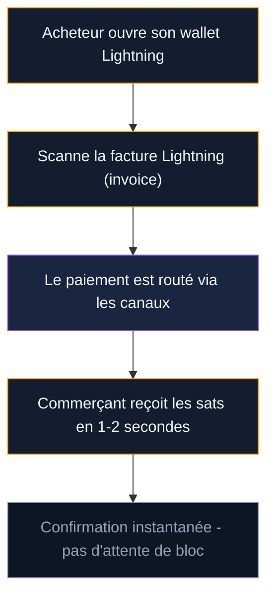
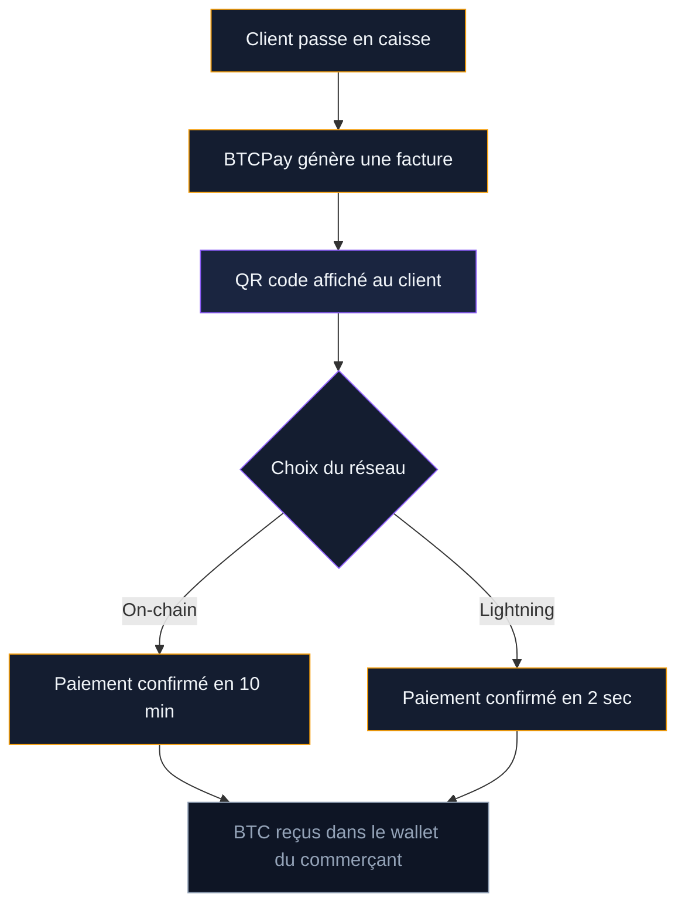

Le bitcoin a été conçu comme un système de paiement électronique entre pairs. En France, plus de 300 commerçants acceptent les paiements en crypto. Dans le monde, Microsoft, Shopify ou AT&T intègrent le bitcoin dans leurs options de paiement. Et le Lightning Network, avec plus de 5 600 BTC de capacité, rend les transactions quasi instantanées pour moins d'un centime.

Ce guide couvre les quatre manières de dépenser vos BTC : paiement on-chain, Lightning Network, cartes crypto et solutions pour commerçants. Avec les frais réels, les délais et les implications fiscales.

## Paiement on-chain : le transfert Bitcoin classique

Le paiement on-chain est la méthode originale. Vous envoyez des BTC directement sur l'adresse du commerçant via la blockchain Bitcoin. Chaque transaction est enregistrée dans un bloc, vérifiée par les mineurs et confirmée de façon définitive.

```mermaid
graph LR
    A["Acheteur scanne le QR code"] --> B["Wallet crée la transaction"]
    B --> C["Diffusion au réseau"]
    C --> D["Mempool + validation mineurs"]
    D --> E["Confirmation dans un bloc"]
    E --> F["Commerçant reçoit les BTC"]

    style A fill:#141D30,stroke:#F59E0B,color:#F1F5F9
    style B fill:#141D30,stroke:#F59E0B,color:#F1F5F9
    style C fill:#1A2540,stroke:#8B5CF6,color:#F1F5F9
    style D fill:#141D30,stroke:#8B5CF6,color:#F1F5F9
    style E fill:#141D30,stroke:#F59E0B,color:#F1F5F9
    style F fill:#0E1525,stroke:#94A3B8,color:#94A3B8
```

### Comment ça se passe en pratique

Le commerçant génère une facture avec un montant en BTC (ou son équivalent en euros) et affiche un QR code. Vous scannez ce code avec votre portefeuille Bitcoin, vérifiez le montant et confirmez. La transaction est diffusée au réseau en quelques secondes.

Le temps de confirmation dépend des frais que vous choisissez. En février 2026, les frais moyens d'une transaction on-chain se situent entre 1 et 5 EUR selon la congestion du réseau. Pour une confirmation dans le prochain bloc (environ 10 minutes), comptez 2 a 4 EUR. Pour une confirmation en une heure, 0,50 a 1 EUR suffit souvent.

### Limites du paiement on-chain

Le paiement on-chain pose deux problèmes pour les achats du quotidien. Le premier : le délai. Attendre 10 minutes pour payer un café, personne n'en veut. Le second : les frais. Payer 3 EUR de frais pour un achat de 5 EUR n'a aucun sens. C'est pour ça que le Lightning Network existe.

> [!NOTE]
> Le paiement on-chain reste adapté aux achats de montants élevés (meubles, électronique, véhicules) ou aux envois internationaux sans intermédiaire bancaire. Pour les petits montants, le Lightning Network est la solution.

## Lightning Network : le paiement instantané en bitcoin

Le Lightning Network est une couche de paiement construite au-dessus de la blockchain Bitcoin. Il permet des transactions en moins de 2 secondes, pour des frais inférieurs a 0,01 EUR. C'est la technologie qui rend le bitcoin utilisable comme moyen de paiement quotidien.

### Fonctionnement simplifié

Le principe repose sur des canaux de paiement. Deux parties déposent des BTC dans un portefeuille multi-signature pour créer un canal. Elles peuvent ensuite échanger des BTC instantanément entre elles, sans écrire chaque transaction sur la blockchain. Seuls l'ouverture et la fermeture du canal sont enregistrées on-chain.

Le réseau interconnecte ces canaux. Si Alice a un canal avec Bob, et Bob a un canal avec Charlie, Alice peut payer Charlie en passant par Bob. Le routage est automatique - votre portefeuille trouve le chemin le plus court et le moins cher.

### Chiffres clés du Lightning Network en 2026

- **Capacité du réseau** : plus de 5 600 BTC (environ 330 millions EUR)
- **Nombre de noeuds** : environ 16 000 noeuds actifs
- **Frais moyens** : 0,001 a 0,01 EUR par transaction
- **Temps de confirmation** : 1 a 3 secondes
- **Montant maximum par paiement** : variable selon les canaux, mais les paiements de plusieurs centaines d'euros passent sans difficulté

### Quels portefeuilles Lightning utiliser ?

Pour payer via Lightning, il faut un portefeuille compatible. Trois options se distinguent pour les débutants :

- **Phoenix** (Acinq) : portefeuille mobile (iOS et Android) qui gère automatiquement les canaux. Pas de configuration technique. Frais d'ouverture de canal : 1 % du premier dépôt. Ensuite, les frais Lightning sont quasi nuls.
- **Wallet of Satoshi** : le plus simple a utiliser. Portefeuille custodial (la société garde vos clés), donc moins sécurisé, mais parfait pour de petits montants au quotidien. Gratuit.
- **Breez** : portefeuille non-custodial avec interface point de vente intégrée. Adapté aux utilisateurs qui veulent garder le contrôle de leurs clés tout en payant facilement en Lightning.

> [!TIP]
> Pour tester le Lightning Network sans risque, envoyez d'abord un petit montant (1 000 a 5 000 sats, soit 0,50 a 3 EUR) entre deux portefeuilles. Vous verrez la vitesse du règlement en temps réel.

### Où payer en Lightning en France ?

BTC Map (btcmap.org) recense les commerçants qui acceptent le bitcoin dans le monde. En France, une vingtaine de commerçants acceptent le BTC a Paris, et le réseau s'étend dans les grandes villes : Lyon, Marseille, Bordeaux, Toulouse.

Quelques exemples concrets en 2026 :

- **Printemps** : premier grand magasin européen a accepter les paiements en crypto, via le partenaire Binance Pay
- **Carrefour City** (6 magasins en Seine-Maritime) : paiement en BTC via Lightning
- **Tisseo a Toulouse** : réseau de transport public acceptant le bitcoin pour les titres de transport
- **Carrefour Express a Arcachon** : 20 % de remise sur tous les achats payés en bitcoin via Lightning

L'adoption reste modeste comparée au nombre total de commerçants, mais elle progresse. En 2023, la France comptait moins de 100 commerçants acceptant le bitcoin. En 2026, ce chiffre dépasse les 300.

## Cartes crypto : dépenser ses BTC partout où Visa est accepté

Les cartes crypto sont la passerelle entre le monde bitcoin et le monde fiat. Le principe : vous chargez votre carte avec des BTC (ou d'autres cryptos), et la carte convertit automatiquement en euros au moment du paiement. Le commerçant reçoit des euros via le réseau Visa ou Mastercard. Il ne sait même pas que vous avez payé en bitcoin.

### Comparatif des cartes crypto en 2026

| Carte | Réseau | Frais de conversion | Cashback | Condition cashback | Retrait DAB gratuit |
|-------|--------|--------------------|---------|--------------------|---------------------|
| Binance Card | Visa | Jusqu'a 0,9 % | Jusqu'a 8 % en BNB | Solde BNB élevé | 290 EUR/mois |
| Crypto.com (Ruby) | Visa | Variable | 1 % en CRO | Staking 350 EUR en CRO | 400 EUR/mois |
| Crypto.com (Jade) | Visa | Variable | 2 % en CRO | Staking 3 500 EUR en CRO | 800 EUR/mois |
| Gnosis Pay | Visa | 0 % (lancement) | 1-4 % en GNO | Solde GNO | Non précisé |

### Binance Card en détail

Carte Visa gratuite a l'émission, liée a votre compte Binance. Vous choisissez quelle crypto utiliser pour chaque paiement (BTC, ETH, BNB, stablecoins). La conversion se fait au taux Binance au moment de l'achat, avec un frais maximum de 0,9 %.

Le programme de cashback dépend de votre solde moyen en BNB sur 30 jours. Le niveau de base offre 0,1 % de cashback. Avec un solde conséquent en BNB, ça peut monter jusqu'a 8 %. En pratique, la plupart des utilisateurs se situent entre 0,1 % et 2 %.

### Crypto.com : le système par paliers

Crypto.com propose cinq niveaux de carte. La plus populaire est la Ruby Steel : 350 EUR de staking en CRO pour 1 % de cashback et le remboursement Spotify. La carte Obsidian, au sommet, demande 400 000 EUR de staking pour 8 % de cashback. Au-delà de l'allocation gratuite mensuelle, des frais de 0,5 % s'appliquent sur les conversions. Retraits DAB gratuits jusqu'a 400 EUR/mois (Ruby), puis 2 % au-delà.

### Gnosis Pay : l'option auto-custodiale

Différence importante : vos fonds restent sur votre adresse blockchain jusqu'au moment du paiement. Avec Binance ou Crypto.com, la plateforme garde vos cryptos. Gnosis Pay vous laisse le contrôle total. Cashback en GNO de 1 % a 4 % selon le montant de tokens détenus.

> [!WARNING]
> Chaque paiement par carte crypto est une cession imposable en France. Vous payez un café a 3 EUR avec votre Binance Card ? Le fisc considère que vous avez vendu 3 EUR de BTC. Si votre prix d'achat était inférieur au cours actuel, vous avez réalisé une plus-value. Cette micro-cession doit être déclarée.

## BTCPay Server : accepter le bitcoin en tant que commerçant

BTCPay Server est un logiciel open source qui permet a un commerçant d'accepter le bitcoin sans intermédiaire. Pas de frais de plateforme, pas de tiers de confiance, pas de commission sur les ventes. Le commerçant reçoit les BTC directement dans son portefeuille.

### Pourquoi un commerçant choisirait le bitcoin ?

Les frais de paiement par carte bancaire en France se situent entre 0,5 % et 2,5 % du montant, selon le type de carte et le volume du commerçant. Pour un restaurant qui fait 500 000 EUR de chiffre d'affaires annuel, ça représente entre 2 500 et 12 500 EUR de frais de paiement par an.

Avec BTCPay Server et le Lightning Network, les frais tombent a quasi zéro. Le consommateur paye les frais de routage Lightning (quelques centimes au maximum), et le commerçant ne paye rien. La différence est importante pour les petits commerçants a faible marge.

### Comment ça fonctionne

BTCPay Server s'installe sur un serveur (cloud ou physique). Le logiciel génère des factures Bitcoin pour chaque paiement, affiche un QR code au client, et détecte automatiquement quand le paiement est reçu. Il supporte les paiements on-chain et Lightning.

### Intégration avec les systèmes existants

BTCPay Server propose des plugins pour les principales plateformes e-commerce :

- **WooCommerce** (WordPress) : plugin officiel, installation en un clic
- **Shopify** : intégration via l'application BTCPay Server
- **PrestaShop** : plugin communautaire disponible
- **Point de vente physique** : application POS intégrée dans BTCPay, utilisable sur tablette ou téléphone

Le commerçant peut choisir de garder les BTC reçus ou de les convertir automatiquement en euros via un partenaire de change. Certains font un mix : ils gardent une partie en BTC et convertissent le reste pour couvrir leurs charges en euros.

### Alternatives a BTCPay Server

Pour les commerçants qui ne veulent pas gérer leur propre serveur, des services cloud existent : Swiss Bitcoin Pay (conversion auto en EUR/CHF, 1 % de frais), CoinGate (multi-crypto, 1 % de frais) et OpenNode (spécialisé Lightning, 1 % de frais). Tous gèrent la facturation et la réception des paiements côté commerçant.

> [!IMPORTANT]
> Si vous êtes commerçant, n'oubliez pas que les paiements reçus en bitcoin sont du chiffre d'affaires imposable. La valeur en euros au moment de la réception détermine le montant a déclarer. Si vous gardez les BTC et que leur valeur augmente, la plus-value sera aussi imposable au moment de la revente.

## Fiscalité des paiements en bitcoin

C'est le point que beaucoup de gens oublient : en France, chaque paiement en bitcoin est une cession imposable. Payer un repas, acheter un objet en ligne, régler une facture - du moment que vous échangez des BTC contre un bien ou un service, le fisc considère que vous avez vendu des crypto-actifs.

### Le mécanisme fiscal

Le régime est le même que pour une vente classique de BTC contre des euros :

- **Flat tax de 30 %** sur la plus-value réalisée (12,8 % d'impôt sur le revenu + 17,2 % de prélèvements sociaux). Depuis le 1er janvier 2026, ce taux passe a 33,3 % (hausse de la CSG de 9,2 % a 10,6 %).
- **Calcul via le PAMP** (Prix d'Acquisition Moyen Pondéré) : la plus-value dépend de la différence entre le prix de cession (valeur en euros du bien ou service acheté) et le coût d'acquisition proportionnel de vos BTC.
- **Seuil de 305 EUR** : si le total de vos cessions annuelles (ventes + paiements + cartes crypto) reste sous 305 EUR, pas d'imposition.

### Exemple concret

Vous avez acheté 0,1 BTC a 30 000 EUR le BTC (coût : 3 000 EUR). Le cours est maintenant a 60 000 EUR. Vous payez un meuble a 600 EUR en bitcoin (soit 0,01 BTC).

- Prix de cession : 600 EUR
- Valeur totale du portefeuille : 0,1 x 60 000 = 6 000 EUR
- Prix d'acquisition proportionnel : 3 000 x (600 / 6 000) = 300 EUR
- Plus-value : 600 - 300 = 300 EUR
- Impôt (flat tax 33,3 %) : 99,90 EUR

Pour un meuble a 600 EUR, vous devez 99,90 EUR au fisc. Ce calcul s'applique a chaque paiement, chaque utilisation de carte crypto, chaque achat en BTC.

### Le cauchemar administratif

Si vous utilisez votre carte crypto pour 50 achats dans l'année, vous devez déclarer 50 cessions sur le formulaire 2086. Chaque cession nécessite : la date, le montant, la valeur globale du portefeuille au moment de l'achat, et le prix d'acquisition moyen pondéré.

Des outils comme Waltio, Koinly ou CoinTracking automatisent ce suivi. Ils se connectent a vos portefeuilles et plateformes, tracent chaque transaction et génèrent le formulaire 2086 pré-rempli. Comptez entre 50 et 200 EUR par an selon le nombre de transactions.

> [!CAUTION]
> Ne pas déclarer ses cessions en crypto expose a une amende de 750 EUR par cession non déclarée (plafonnée a 25 % des montants concernés). Le fisc a accès aux données des plateformes enregistrées PSAN en France.

### Stratégie pour limiter la charge fiscale

Quelques approches légales pour réduire l'impact fiscal des paiements en bitcoin :

- **Rester sous le seuil de 305 EUR** : si vos paiements en BTC restent modestes, vous n'avez rien a payer
- **Convertir en stablecoins d'abord** : un échange BTC vers USDT n'est pas un fait générateur (crypto-crypto). Mais l'achat d'un bien avec des stablecoins reste une cession imposable
- **Utiliser le barème progressif** : si votre taux marginal d'imposition est a 0 % ou 11 %, le barème est plus avantageux que la flat tax. Il faut cocher la case 3CN de la déclaration 2042 C
- **Tenir un registre précis** : un suivi rigoureux vous évite de surpayer par manque de données sur votre prix d'acquisition réel

## Où le paiement en bitcoin a du sens - et où il bloque

Le bitcoin ne remplacera pas la carte bancaire pour les courses du samedi. Mais dans certaines niches, il a un vrai avantage : le commerce international (pas de frais de change, pas de délai SWIFT - un paiement Lightning Paris-Tokyo arrive en 2 secondes), les freelances (éviter les 2,9 % de PayPal), les micropaiements (impossible avec les réseaux carte) et les dons en ligne via QR code Lightning.

Les freins restent réels : la volatilité (le BTC peut perdre 10 % en un jour), la complexité fiscale (chaque paiement = une cession a déclarer), la faible acceptation (300 commerçants sur 3 millions d'entreprises en France) et une expérience utilisateur encore en retrait par rapport au paiement par carte sans contact.

## Guide pratique : votre premier paiement en bitcoin

**1. Installez un portefeuille Lightning.** Phoenix (non-custodial) ou Wallet of Satoshi (custodial, plus simple). Gratuit sur iOS et Android.

**2. Déposez des sats.** Envoyez un petit montant depuis votre plateforme d'échange vers votre portefeuille Lightning. 10 000 sats (environ 6 EUR) suffisent pour un test.

**3. Trouvez un commerçant.** Rendez-vous sur btcmap.org et filtrez par "Lightning" pour trouver un commerce près de chez vous.

**4. Scannez et payez.** Le commerçant affiche un QR code. Ouvrez votre portefeuille, scannez, vérifiez le montant et confirmez. Règlement en 2 secondes.

**5. Gardez la trace.** Notez la date, le montant en euros et en BTC. Vous en aurez besoin pour votre déclaration fiscale si vos cessions annuelles dépassent 305 EUR.

Le paiement en bitcoin n'est pas la norme. Mais les outils existent, les frais sont bas et le réseau se développe. Pour ceux qui veulent utiliser leurs BTC au-delà du simple investissement, les options sont la - a condition de garder un oeil sur le compteur fiscal.
